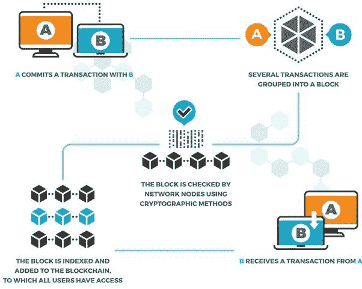

# 区块链基础知识:区块链的结构—第 1 部分

> 原文：<https://medium.com/coinmonks/blockchain-basics-structure-of-a-blockchain-part-1-86cb87559440?source=collection_archive---------6----------------------->

我回到区块链的基础。当你重新审视整个行业的基础时，感觉总是很好。我记得我努力想从视觉上抓住什么是区块链，以及它在物理上看起来会是什么样子。是什么让链条几乎活了！我发现，随着时间的推移，市场上已经出现了很多好的内容。我将利用他们中的一些人的帮助(当然，我会在需要的地方承认他们)，并尝试对什么是区块链提出一个非常简洁但全面的观点。

## **区块链的组成**

简而言之，区块链是一种算法，以分散的方式充当全球总账的存储。这种全球分类账也可以被称为记录保存机制，它存储全球交易网络的不可变数据。

在一个非常基本的水平，你需要下载区块链软件，并在你的硬件系统中运行它。然后，您的系统充当一个节点，成为运行区块链的硬件的一部分。由于有多个相似的节点运行区块链，因此不存在单点故障。

那么区块链的重要组成部分是什么:

**节点:**运行区块链的硬件

**钱包:**发起交易的用户界面。

**交易:**价值的转移，做某项活动的调用。

**Block:** 区块链的一种架构，是管理分散式分类账的核心。

**共识:**节点运营商之间的协议，确保交易的有效性，遵守一套规则和安排。

## **标准区块链流量**

区块链是一种在后端工作的创新。前端运营保持相似，但是价值主张和优势发生了变化。假设 A 人可以使用 Google Pay 向 B 人转账。他也可以使用基于区块链的应用程序来做同样的事情。活动保持不变，但是收益却发生了巨大的变化。区块链的一些主要优势包括:

1.**可追溯性:**交易可以追溯到任何级别，包括向前和向后

2.**不变性:**在一个分散的区块链，调整分类账几乎是不可能的

3.**自动化:**随着智能合约的引入，区块链规则实现了自动化，因此失败的几率非常低。

值得注意的是，根据著名的区块链三难问题，“在可扩展性(快速)、安全性和去中心化这三个主要参数中，你只能有两个，因此大多数区块链在其架构中做出了某些权衡。”

## **标准的区块链工作流程**

1.人 A 登录他的区块链钱包，并发起与人 b 的交易。(钱包基本上是简化用户与区块链交互的 UI。

2.每个块都有大小和容量，几个类似的事务将被分组到一个块中，直到该块满为止

3.使用一致算法对块中的数据进行验证，以确保信息的真实性。验证真实性的节点获得加密货币奖励。

4.一旦某个数据块通过验证，它就会被放入区块链，并且分类帐的所有副本都会得到更新。现在每个人都有最新的账本，描述一个真实的故事。

5.B 人现在从 a 人那里收到交易。

图片:Shutterstock

## **创世纪区块**

创世纪板块是第一块在区块链建造的板块。由于这是第一个数据块，区块链相对较新，没有太多节点运行，而且大部分是集中式的。比特币起源区块包括一条描述区块链代表什么的消息,“泰晤士报 03/1/2009 财政大臣处于对银行的第二次救助的边缘。”虽然比特币起源块本身有一个日期和时间标签，但该消息提供了第一块创建日期和环境的象征性表示。

在下一篇文章中，我们将看到这些块的实际含义。一个块如何存储多个事务？区块链中的链条代表什么。我们还将讨论共识机制。

**阅读上一篇文章:** [以太卡——类固醇上的 NFTs 第 1 部分](https://tulip311bit.medium.com/ethercards-nfts-on-steroids-part-1-ad94c8d14f5d)

***注:*** *本帖最初发表于* [*此处*](https://www.voice.com/post/@tulip/blockchain-basics-structure-of-a-blockchain-part-1-1616135761-616297869) *为与 voice.com 联合的密码作者。*

**通过我的推荐加入**

[Crypto.com](https://binance.com/en/register?ref=E8PCD3AF)——[币安](https://platinum.crypto.com/r/sut3pd9bzn)

跟我来

**👉** [推特](https://twitter.com/rumadas123)

**👉**[**Linkedin**](https://www.linkedin.com/in/ruma-das-a1439320/)

> **加入 coin monks[Telegram group](https://t.me/joinchat/EPmjKpNYwRMsBI4p)学习加密交易和投资**

## **另外，阅读**

*   **[什么是融资融券交易](https://blog.coincodecap.com/margin-trading)**
*   **最好的[密码交易机器人](/coinmonks/crypto-trading-bot-c2ffce8acb2a) | [网格交易](https://blog.coincodecap.com/grid-trading)**
*   **[3 商业评论](/coinmonks/3commas-review-an-excellent-crypto-trading-bot-2020-1313a58bec92) | [Pionex 评论](/coinmonks/pionex-review-exchange-with-crypto-trading-bot-1e459d0191ea) | [Coinrule 评论](/coinmonks/coinrule-review-2021-a-beginner-friendly-crypto-trading-bot-daf0504848ba)**
*   **[AAX 交易所评论](/coinmonks/aax-exchange-review-2021-67c5ea09330c) | [德里比特评论](/coinmonks/deribit-review-options-fees-apis-and-testnet-2ca16c4bbdb2) | [FTX 交易所评论](/coinmonks/ftx-crypto-exchange-review-53664ac1198f)**
*   **[n ave 零点回顾](/coinmonks/ngrave-zero-review-c465cf8307fc) | [Phemex 回顾](/coinmonks/phemex-review-4cfba0b49e28) | [PrimeXBT 回顾](/coinmonks/primexbt-review-88e0815be858)**
*   **[Bybit Exchange 审查](/coinmonks/bybit-exchange-review-dbd570019b71) | [Bityard 审查](/coinmonks/bityard-review-7d104239be35) | [CoinSpot 审查](https://blog.coincodecap.com/coinspot-review)**
*   **[3 commas vs crypto hopper](/coinmonks/3commas-vs-pionex-vs-cryptohopper-best-crypto-bot-6a98d2baa203)|[赚取加密利息](/coinmonks/earn-crypto-interest-b10b810fdda3)**
*   **最好的比特币[硬件钱包](/coinmonks/the-best-cryptocurrency-hardware-wallets-of-2020-e28b1c124069?source=friends_link&sk=324dd9ff8556ab578d71e7ad7658ad7c) | [BitBox02 回顾](/coinmonks/bitbox02-review-your-swiss-bitcoin-hardware-wallet-c36c88fff29)**
*   **[总帐 vs n 平均](/coinmonks/ledger-vs-ngrave-zero-7e40f0c1d694) | [总帐 nano s vs x](/coinmonks/ledger-nano-s-vs-x-battery-hardware-price-storage-59a6663fe3b0)**
*   **[密码本交易平台](/coinmonks/top-10-crypto-copy-trading-platforms-for-beginners-d0c37c7d698c)**
*   **[CoinLoan 评论](/coinmonks/coinloan-review-18128b9badc4) | [YouHodler 评论](/coinmonks/youhodler-4-easy-ways-to-make-money-98969b9689f2) | [BlockFi 评论](/coinmonks/blockfi-review-53096053c097)**
*   **最好的[加密税务软件](/coinmonks/best-crypto-tax-tool-for-my-money-72d4b430816b) | [硬币追踪评论](/coinmonks/cointracking-review-a-reliable-cryptocurrency-tax-software-5114e3eb5737)**
*   **最佳[加密借贷平台](/coinmonks/top-5-crypto-lending-platforms-in-2020-that-you-need-to-know-a1b675cec3fa) | [杠杆令牌](/coinmonks/leveraged-token-3f5257808b22)**
*   **[block fi vs Celsius](/coinmonks/blockfi-vs-celsius-vs-hodlnaut-8a1cc8c26630)|[Hodlnaut 审查](/coinmonks/hodlnaut-review-best-way-to-hodl-is-to-earn-interest-on-your-bitcoin-6658a8c19edf)**
*   **[Bitsgap 审查](/coinmonks/bitsgap-review-a-crypto-trading-bot-that-makes-easy-money-a5d88a336df2) | [Quadency 审查](/coinmonks/quadency-review-a-crypto-trading-automation-platform-3068eaa374e1) | [Bitbns 审查](/coinmonks/bitbns-review-38256a07e161)**
*   **[埃利帕尔泰坦评论](/coinmonks/ellipal-titan-review-85e9071dd029) | [赛克斯斯通评论](/coinmonks/secux-stone-hardware-wallet-review-15-discount-coupon-2020-7577032faa6e)**
*   **[本地比特币评论](/coinmonks/localbitcoins-review-6cc001c6ed56) | [加密货币储蓄账户](https://blog.coincodecap.com/cryptocurrency-savings-accounts)**
*   **最佳[区块链分析](https://bitquery.io/blog/best-blockchain-analysis-tools-and-software)工具| [赚比特币](/coinmonks/earn-bitcoin-6e8bd3c592d9)**
*   **[加密套利](/coinmonks/crypto-arbitrage-guide-how-to-make-money-as-a-beginner-62bfe5c868f6)指南| [如何做空比特币](/coinmonks/how-to-short-bitcoin-568a2d0b4ae5)**
*   **最佳[加密制图工具](/coinmonks/what-are-the-best-charting-platforms-for-cryptocurrency-trading-85aade584d80) | [最佳加密交易所](/coinmonks/crypto-exchange-dd2f9d6f3769)**
*   **[如何在印度购买比特币？](/coinmonks/buy-bitcoin-in-india-feb50ddfef94) | [瓦济克斯评论](/coinmonks/wazirx-review-5c811b074f5b)**
*   **[印度比特币交易所](/coinmonks/bitcoin-exchange-in-india-7f1fe79715c9) | [比特币储蓄账户](/coinmonks/bitcoin-savings-account-e65b13f92451)**
*   **[CoinDCX 评论](/coinmonks/coindcx-review-8444db3621a2) | [加密保证金交易交易所](https://blog.coincodecap.com/crypto-margin-trading-exchanges)**

**包括附属链接**

> **[直接在您的收件箱中获得最佳软件交易](/coinmonks/newsletters/coinmonks)**

****