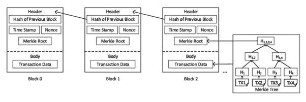
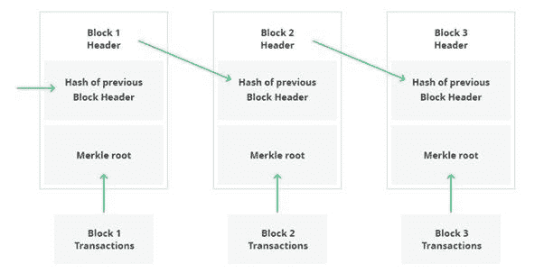

# 区块链基础知识:区块链的结构—第 2 部分

> 原文：<https://medium.com/coinmonks/blockchain-basics-structure-of-a-blockchain-part-2-6726ba311e40?source=collection_archive---------9----------------------->

基础系列的目的是用简单的术语讲述区块链的一些基本概念，并尝试为新人加入生态系统创建一个简单的桥梁。在区块链结构的第一部分中，我们了解了区块链的组成部分，以及交易如何流经区块链。我们也开始在一个街区内深潜。我们讨论了创世区块。在第 2 部分中，我们将进一步深入，看看什么是块。

## **街区**

供图:[研究之门](https://researchgate.net/figure/The-structure-of-a-Blockchain-A-block-is-composed-of-a-header-and-a-body-where-a-header_fig1_337306138)

街区是区块链的核心。它们存储事务详细信息，还维护前一个和下一个块之间的链。上图给出了一个区块的精确表示。一个区块可以分为两部分。 ***表头*** 和 ***正文*** 。

## ***表头***

块标题具有以下一般组件:

**软件版本号**:矿工使用软件版本检查是否需要升级自己的节点。

**前一个块的散列**:为了确保块的顺序和连续性，每个块都保持前一个块的散列。进入块的任何交易细节都被加密地转换成固定数字的散列数。这个散列只能由拥有解密消息的密钥的人打开，以恢复原始内容。由于块中有大量数据，每个数据都有自己的哈希，并且所有这些哈希最终都被转换为一个哈希。该块的最终散列存储在下一个块中。这保持了街区的年表，这是区块链的链条。

**Merkle 树的根哈希(Merkle root)** :如上所述，就像前一个块一样，当前块将有许多事务，因此，许多哈希将被转换为最终的哈希数，即 Merkle 根。这些多个散列在相互转换时形成的树结构被称为 Merkle 树。

**时间戳:**创建块的确切日期和时间。

**当前难度的目标:**目标给出了声明有效性的最佳散列大小的目标。有零的哈希小于没有零的哈希。这尤其适用于工作证明。

**随机数:**随机数是一种额外的安全措施。它是由工作证明创建的变量，用于验证链的完整性。

## ***正文***

块主体是存储实际事务数据的地方。作为其角色的一部分，矿工(工作证明)验证交易。例如，矿工所做的检查是汇款人的账户中是否有足够的余额来支付转账和交易成本。如前所述，所有这些事务最终都将转换为 Merkle 根。

## **共识方法**

区块链的核心原则之一是消除可信第三方。当所有节点验证块时，它们以分散的方式达成共识。该算法确保网络中没有恶意活动。如果有人更改了分类帐中的数据，其他节点(也保留了一份副本)将会理解，攻击者将会受到惩罚。比特币的共识机制被称为工作证明。它基本上要求节点运行一个程序，并猜测一个唯一的数字来验证该块。节点的力量越大，你破解代码的概率就越大。

现代共识算法现在正在远离工作证明，因为它是耗能的。如今，股权证明已经变得非常流行。

来源: [MSLDEV](https://mlsdev.com/blog/156-how-to-build-your-own-blockchain-architecture)

希望你喜欢这篇文章。

**阅读上一篇:** [区块链基础知识:区块链的结构第一部分](https://tulip311bit.medium.com/blockchain-basics-structure-of-a-blockchain-part-1-86cb87559440)

***注:*** *本帖最初发表于* [*此处*](https://www.voice.com/post/@tulip/blockchain-basics-structure-of-a-blockchain-part-2-1616259242-504284977) *为与 voice.com 有关联的密码作者。*

**通过我的推荐加入**

[Crypto.com](https://binance.com/en/register?ref=E8PCD3AF)——[币安](https://platinum.crypto.com/r/sut3pd9bzn)

**跟着我**

**👉** [推特](https://twitter.com/rumadas123)

**👉** [领英](https://www.linkedin.com/in/ruma-das-a1439320/)

> 加入 Coinmonks [Telegram group](https://t.me/joinchat/EPmjKpNYwRMsBI4p) 并了解加密交易和投资

## 另外，阅读

*   [什么是融资融券交易](https://blog.coincodecap.com/margin-trading)
*   最好的[密码交易机器人](/coinmonks/crypto-trading-bot-c2ffce8acb2a) | [网格交易](https://blog.coincodecap.com/grid-trading)
*   [3 商业评论](/coinmonks/3commas-review-an-excellent-crypto-trading-bot-2020-1313a58bec92) | [Pionex 评论](/coinmonks/pionex-review-exchange-with-crypto-trading-bot-1e459d0191ea) | [Coinrule 评论](/coinmonks/coinrule-review-2021-a-beginner-friendly-crypto-trading-bot-daf0504848ba)
*   [AAX 交易所评论](/coinmonks/aax-exchange-review-2021-67c5ea09330c) | [德里比特评论](/coinmonks/deribit-review-options-fees-apis-and-testnet-2ca16c4bbdb2) | [FTX 交易所评论](/coinmonks/ftx-crypto-exchange-review-53664ac1198f)
*   [n 零审核](/coinmonks/ngrave-zero-review-c465cf8307fc) | [Phemex 审核](/coinmonks/phemex-review-4cfba0b49e28) | [PrimeXBT 审核](/coinmonks/primexbt-review-88e0815be858)
*   [Bybit Exchange 审查](/coinmonks/bybit-exchange-review-dbd570019b71) | [Bityard 审查](/coinmonks/bityard-review-7d104239be35) | [CoinSpot 审查](https://blog.coincodecap.com/coinspot-review)
*   [3 commas vs crypto hopper](/coinmonks/3commas-vs-pionex-vs-cryptohopper-best-crypto-bot-6a98d2baa203)|[赚取加密利息](/coinmonks/earn-crypto-interest-b10b810fdda3)
*   最好的比特币[硬件钱包](/coinmonks/the-best-cryptocurrency-hardware-wallets-of-2020-e28b1c124069?source=friends_link&sk=324dd9ff8556ab578d71e7ad7658ad7c) | [BitBox02 回顾](/coinmonks/bitbox02-review-your-swiss-bitcoin-hardware-wallet-c36c88fff29)
*   [莱杰 vs n rave](/coinmonks/ledger-vs-ngrave-zero-7e40f0c1d694)|[莱杰 nano s vs x](/coinmonks/ledger-nano-s-vs-x-battery-hardware-price-storage-59a6663fe3b0)
*   [密码本交易平台](/coinmonks/top-10-crypto-copy-trading-platforms-for-beginners-d0c37c7d698c)
*   [CoinLoan 评论](/coinmonks/coinloan-review-18128b9badc4) | [YouHodler 评论](/coinmonks/youhodler-4-easy-ways-to-make-money-98969b9689f2) | [BlockFi 评论](/coinmonks/blockfi-review-53096053c097)
*   最好的[加密税务软件](/coinmonks/best-crypto-tax-tool-for-my-money-72d4b430816b) | [硬币追踪评论](/coinmonks/cointracking-review-a-reliable-cryptocurrency-tax-software-5114e3eb5737)
*   最佳[加密借贷平台](/coinmonks/top-5-crypto-lending-platforms-in-2020-that-you-need-to-know-a1b675cec3fa) | [杠杆令牌](/coinmonks/leveraged-token-3f5257808b22)
*   [block fi vs Celsius](/coinmonks/blockfi-vs-celsius-vs-hodlnaut-8a1cc8c26630)|[Hodlnaut 审查](/coinmonks/hodlnaut-review-best-way-to-hodl-is-to-earn-interest-on-your-bitcoin-6658a8c19edf)
*   [Bitsgap 审查](/coinmonks/bitsgap-review-a-crypto-trading-bot-that-makes-easy-money-a5d88a336df2) | [Quadency 审查](/coinmonks/quadency-review-a-crypto-trading-automation-platform-3068eaa374e1) | [Bitbns 审查](/coinmonks/bitbns-review-38256a07e161)
*   [埃利帕尔泰坦评论](/coinmonks/ellipal-titan-review-85e9071dd029) | [赛克斯斯通评论](/coinmonks/secux-stone-hardware-wallet-review-15-discount-coupon-2020-7577032faa6e)
*   [本地比特币评论](/coinmonks/localbitcoins-review-6cc001c6ed56) | [加密货币储蓄账户](https://blog.coincodecap.com/cryptocurrency-savings-accounts)
*   最佳[区块链分析](https://bitquery.io/blog/best-blockchain-analysis-tools-and-software)工具| [赚比特币](/coinmonks/earn-bitcoin-6e8bd3c592d9)
*   [加密套利](/coinmonks/crypto-arbitrage-guide-how-to-make-money-as-a-beginner-62bfe5c868f6)指南| [如何做空比特币](/coinmonks/how-to-short-bitcoin-568a2d0b4ae5)
*   最佳[加密制图工具](/coinmonks/what-are-the-best-charting-platforms-for-cryptocurrency-trading-85aade584d80) | [最佳加密交易所](/coinmonks/crypto-exchange-dd2f9d6f3769)
*   [如何在印度购买比特币？](/coinmonks/buy-bitcoin-in-india-feb50ddfef94) | [瓦济克斯评论](/coinmonks/wazirx-review-5c811b074f5b)
*   [印度比特币交易所](/coinmonks/bitcoin-exchange-in-india-7f1fe79715c9) | [比特币储蓄账户](/coinmonks/bitcoin-savings-account-e65b13f92451)
*   [CoinDCX 评论](/coinmonks/coindcx-review-8444db3621a2) | [加密保证金交易交易所](https://blog.coincodecap.com/crypto-margin-trading-exchanges)

*包含附属链接*

> [直接在您的收件箱中获得最佳软件交易](/coinmonks/newsletters/coinmonks)

