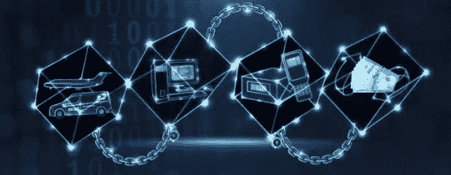
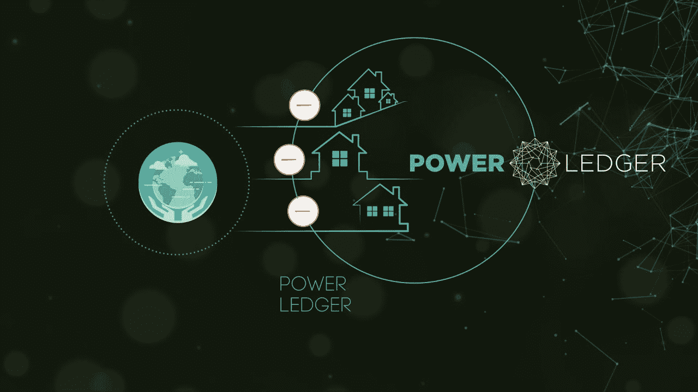

# 超越加密的区块链

> 原文：<https://medium.com/coinmonks/blockchain-beyond-crypto-d78d017523d?source=collection_archive---------5----------------------->

**区块#1:商业及其他领域的区块链**

每当人们听到“区块链”这个词时，它都与比特币等加密货币直接相关。区块链是实现比特币、莱特币、以太等加密货币的底层技术。但区块链的潜力不仅限于数字货币。分布式账本技术可以应用于许多用例来改进业务流程。

简单地说，区块链是一个共享的、不可变的分类账，用于记录交易的历史。它培育了新一代的交易应用程序，从合同到契约再到支付，这些应用程序建立了信任、责任和透明度。

金融通常被认为是区块链将彻底颠覆的第一个行业。然而，对于任何新兴技术，由于组织寻求正确理解和实施，普遍采用可能会很慢。由摩根大通(J.P. Morgan)开发的 [Quorum](https://www.jpmorgan.com/global/Quorum) 是金融行业普遍采用区块链的第一个重要步骤。 [Quorum](https://www.jpmorgan.com/global/Quorum) 是一个以企业为中心、经过许可的区块链基础设施，专门为金融用例而设计。

分类账技术的另一个应用可能是改善食品安全。困扰该行业的第二个问题是食品欺诈。常见的假冒、稀释或掺假食品包括橄榄油、鱼、牛奶、谷物、蜂蜜、咖啡和茶、香料、果汁和有机农产品。有了这样一个列表，几乎很难说出不是经常被欺骗的项目。如果消费者知道他们可能会为一些不真实的东西付费，他们可能不再愿意为优质产品支付高价。另一方面，如果公司让供应链变得更加透明，让消费者更容易接触到，向他们展示他们的食物来自哪里，在哪里，消费者的信任也许会得到恢复。

沃尔玛和 IBM 一直致力于让这种透明的供应链成为现实。一种软件，使用区块链跟踪从农场到消费者的供应链中的产品，希望解决这些问题。

一个非常有趣的用例是将其应用于能源行业。 [Powerledger](https://powerledger.io/) 是一个基于以太坊的区块链，致力于为用户提供买卖清洁能源的交易方式。它使用户能够将其多余的能源出售给其他愿意购买的用户。这个区块链已经在澳大利亚的珀斯运营了一年，他们计划在印度开始运营。基于可再生能源的系统的最大优势是你不需要非常大的基础设施来启动。所有这些电线和电塔都不是必需的。远离电网的村庄或偏远城镇可以启动自己的微电网，利用太阳能、风能等可再生能源发电。这在澳大利亚、印度和几乎整个印度次大陆等国家有着巨大的潜力，那里一年中大部分时间都是阳光明媚，还有大量地区仍未接入电网。

区块链技术的另一个有趣的应用是碳信用交易系统。碳抵消意味着通过防止同样数量的污染在其他地方发生来补偿你正在制造的二氧化碳污染(你的碳足迹)。植树造林、碳封存、碳捕获是一些可以从环境中吸收碳的过程。但是完成这些任务的实体并没有得到显著的回报，因为没有计算碳封存量的系统。此外，这些碳可以用来抵消向大气中排放碳的公司的排放量。一个基于区块链的系统可以被用来跟踪公司的排放，如果他们超过一定的限度，就提示他们购买补偿。一个分布式的、不可变的系统将确保该系统不会被游戏化。这是我过去几个月以来一直在研究的一个用例。

大多数企业对分享他们的数据持谨慎态度。对此的解决方案是使用许可的区块链系统，该系统允许分层访问系统，其中可以决定用户如何查看和编辑数据的规则。 [Hyperledger Fabric](https://www.hyperledger.org/projects/fabric) 就是这样一个支持这一点的区块链。

那么，如何开始区块链开发呢？嗯，不是很复杂。几乎所有的技术都是开源的，并且提供了非常好的文档来帮助任何人入门。此外，项目在线社区非常活跃，随时准备提供帮助。

如果你想在公共区块链上开始构建分布式应用程序(Dapps)，那么[以太坊文档](http://www.ethdocs.org/en/latest/)是最好的起点。

对于一个许可的区块链， [hyperledger 项目](https://wiki.hyperledger.org/)有许多不同的产品。最受欢迎的是 [Hyperledger 面料](http://hyperledger-fabric.readthedocs.io/en/release-1.1/)。主要使用的语言是 Go，但是现在也支持 Java 和 Node JS。 [Hyperledger Composer](https://hyperledger.github.io/composer/latest/) 是一个工具，可以用来使用 Node JS(比 Go 简单一点)构建智能合约、业务逻辑和业务网络。

只是提醒你区块链不是万能的。但在不久的将来，有许多场景可以从这项技术中受益，而且它的效用不仅限于创造加密货币。

从更轻松的角度来说…

