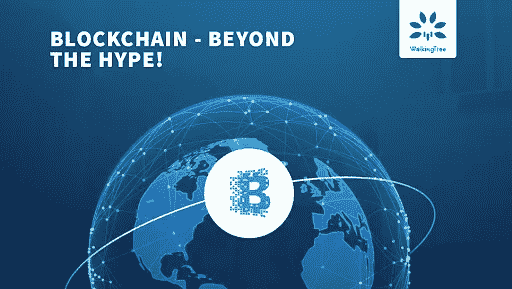

# 区块链——超越宣传！

> 原文：<https://medium.com/coinmonks/blockchain-beyond-the-hype-ab796a3a59b9?source=collection_archive---------7----------------------->

对区块链技术的兴趣在过去几年里达到了顶峰。曾经被认为是比特币(和加密货币)的同义词，现在很明显，加密货币只是整个领域中的一个用例。

作为本文的一部分，我将谈谈区块链技术的各种优势。

# 我为什么要关心这个？

最简单的答案是比较 Gartner 对 2016 年和 2017 年新兴技术的宣传周期:

# 2016 年的炒作周期

# 2017 年的炒作周期

现在只做一个观察，2016 年的区块链在哪里，2017 年在哪里？

你会注意到，在 2016 年，它有点像刚刚进入膨胀预期的顶峰，而在 2017 年，它几乎正在走出这一阶段，即将进入幻灭的低谷。

# 这是什么意思？

让我们看看下面的图表，通过这个镜头，让我们理解上面显示的两个图表:

这意味着

*   人们已经开始投资试点项目
*   一些试点项目已经准备好推出，其他持有预算的人可能很快就会松开钱包
*   接下来的旅程将会经历很多人的自我空虚和一些人更紧密的合作
*   目前，采用率不到 5%，事实上，最近关于比特币的新闻表明，不到 5%的美国人正在使用比特币等数字资产，采用率正在上升。

# 这在哪里会有帮助？

区块链在超过 35 个行业都很有用，它正在解决一些人们难以忍受的关键问题。具体来说，通过使用智能合约、数字货币、强大的安全性和改进的记录保存，区块链正在彻底改变基于交易的行业。

在高层次上，每当你看到以下症状时，想到区块链不会伤害你:

*   **中介**正在蚕食交易价值的一定价值。一个明显的例子是基于信用卡的支付，在这种支付中，由于需要验证和批准，多个参与者获得他们的份额并延迟交易
*   **双重消费**正在发生(例如，相同的门票/土地所有权等。卖给多人，提交重复的账单进行索赔，等等)
*   **看到价值的虚假声明**(例如教育证书、工作经历、保单等)
*   很难对系统进行审计，因此人们在编造故事(例如财务和税收)。
*   相关人员的直接参与和执行将有助于更好地管理事情(如授予合同和向承包商发放付款)
*   **合同被曲解**(例如，在 B2B 交易中，双方可能根据他们的事实和故事解释同一件事)，这可以被简化并可能与执行相关联

来源:https://walkingtree.tech/blockchain-beyond-hype/

> [在您的收件箱中直接获得最佳软件交易](https://coincodecap.com/?utm_source=coinmonks)

