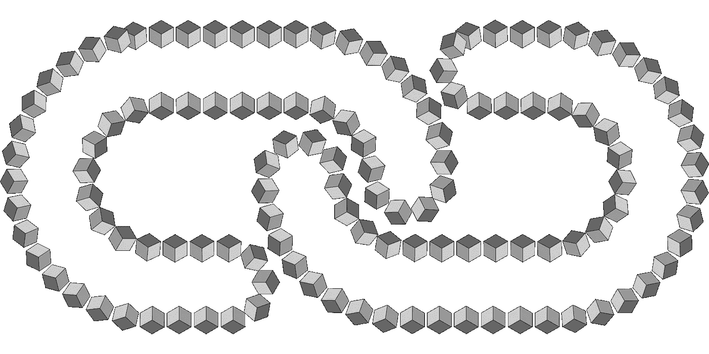
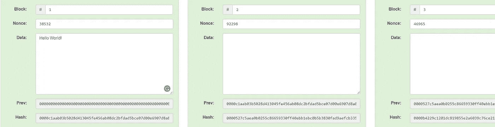
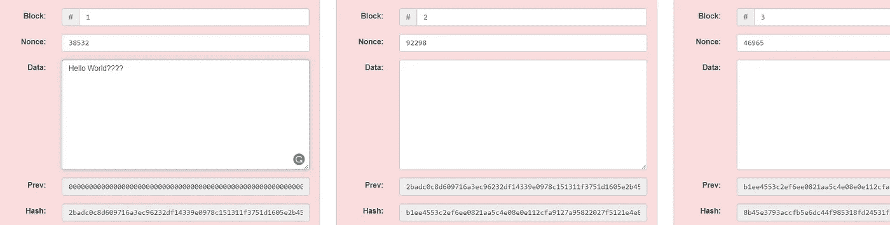
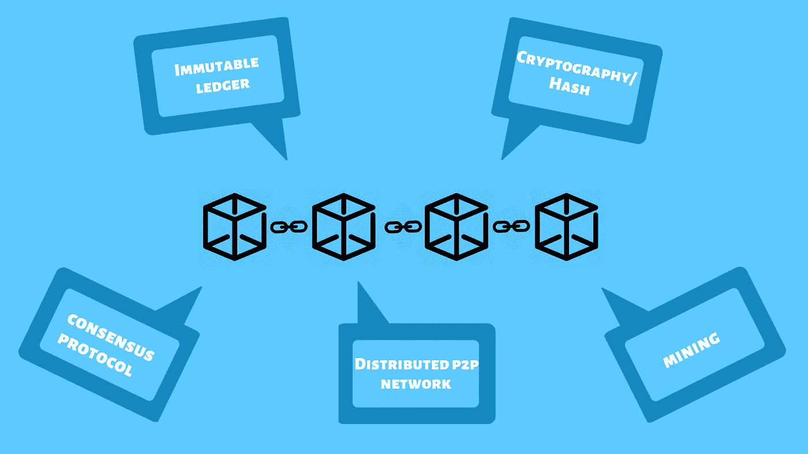

# 区块链:建立信任

> 原文：<https://medium.com/coinmonks/blockchain-building-the-trust-294c751c6def?source=collection_archive---------1----------------------->

锁链的概念最初来自这两个人 [Stuart Haber](https://www.worldcryptoindex.com/creators/stuart-haber/) 和 [W.Scott Stornetta](https://www.worldcryptoindex.com/creators/w-scott-stornetta/) 。他们没有引入术语区块链，这个术语是在中本聪的原始论文之后很久才出现的，但是这两位先生想要实现一个文档时间戳不能被篡改的系统。1991 年，他们发表了一篇名为 [*如何给数字文档*](https://www.anf.es/pdf/Haber_Stornetta.pdf) 加时间戳的论文，该论文包括了我们现在称之为区块链的概念，该概念背后的所有或大部分功能和想法实际上都在该论文中提出。

区块链是一种分布式账本，用于维护交易数据的永久和防篡改记录，称为*块*，使用加密技术链接。区块链上的“块”是由数字信息组成的，因为它是一种记录！很明显，它里面有一些数据。例如，它可能只有一串单词“hello world”。那么它将有一个称为先前散列的字段，该字段类似于该块的一些数据量的指纹。

基本上，散列是一种将字母或数字的输入转换成固定长度的加密输出的函数。区块链仅包含经过验证的交易，可防止欺诈性交易。验证过程依赖于使用算法哈希加密的数据。用于生成哈希的函数是确定性的，这意味着每次使用相同的输入时，它都会产生相同的结果；可以有效地生成散列输入；使得确定输入变得困难(导致挖掘)，并且在非常不同的散列中对输入结果进行小的改变。

链上创建的第一块被称为创世纪块。正如人们所猜测的，起源块中没有先前的散列值。如果在链上创建下一个块，它将具有一些数据和与前一个块的散列相同的前一个散列字段。

Credit: [https://anders.com/blockchain/blockchain.html](https://anders.com/blockchain/blockchain.html)

我们将在接下来的主题中讨论什么是 nonce。

现在，让我们把散列看作指纹。正如您在上面看到的，第 2 块的先前散列与第 1 块的散列相同，这就是链接的来源。这就是这个术语被称为链或区块链的原因，因为这些块通过这些哈希以加密方式相互链接。同样，创建了越来越多的块，这些块将拥有自己的指纹(哈希)和对前一个块的引用。因此，如果第一个块的散列值发生变化，那么第二个块中的引用也会发生变化，这将导致散列值不匹配。该系统将知道已经发生了试图改变该块的事情。

> 让我们假设第一块中的数据字段已经试图以某种方式被篡改。现在怎么办？

现在字段 [*Nonce*](https://en.wikipedia.org/wiki/Cryptographic_nonce) 进入画面。由于 nonce 的引入，块内容的散列输出将会改变。[挖掘者](https://en.bitcoin.it/wiki/Mining)解决的难题是识别 nonce 的值，以便被挖掘的块的散列输出以特定数量的前导零开始。注意，被挖掘的块的内容的散列应该以特定数量的前导零开始。实现这一点的随机数的价值基本上是矿工试图解决的问题。

解决散列问题需要挖掘器确定使用哪个数字作为随机数，这本身就需要大量的反复试验。这是因为随机数是一个随机数。挖掘器在第一次尝试中成功地得出正确的随机数的可能性极小，这意味着挖掘器可能会在得到正确的随机数之前测试大量的随机数选项。难度越大——衡量创建一个满足目标散列要求的散列的难度——生成一个解决方案可能需要的时间就越长。

现在，我们将具体讨论一些在区块链世界流行的重要且必须知道的概念。

Terminologies around the Blockchain

# 1.密码术/散列法:

我们将了解 SHA256 哈希算法在区块链中的作用。

在深入 SHA256 的世界之前，让我们先举一个例子，然后将它与算法联系起来。让我们看一个人，可能是我，也可能是你，我们有一个指纹，不同的人有不同的指纹。有可能会有人有相同的指纹。但是这种情况发生的可能性非常小，大约是 6000 万分之一。

现在，如果我们能把同样的原理应用到数字文档中会怎么样呢？如果我们能找到一种指纹来识别这些文件呢？这样的指纹存在，它被称为 SHA256 哈希。SHA256 是由 NSA(美国国家安全局)设计的加密散列函数。SHA 代表安全哈希算法，256 是它在内存中占用的位数。这个十六进制哈希总是 64 个字符。

这里需要注意的重要一点是，这个算法不仅适用于数字，也适用于文本。它适用于任何数字文档，如 word 文档，音频，视频，照片，你可以把一个完整的操作系统放在那里！。

## **sha 256 算法的品质**:

1.**它必须是一种方式:**你不能从散列来确定文档包含什么。因此，您不能恢复或反向工程哈希。

2.**它必须是确定性的:**这意味着，如果我拿同一个文档，再次运行 SHA256 算法，该算法应该会生成相同的结果。

3.**雪崩效应:**这意味着如果您获取文档并对其进行更改，输出(哈希)将会发生巨大变化。这非常类似于雪崩，一个微小的失误会导致雪开始移动，然后更多的雪移动。

4.**避免冲突:**这意味着任何两个输入都不应该有相同的散列。必须避免冲突以保持数据的完整性，这是有原因的。比方说，一个盗版者/黑客试图复制你提供的同一份文件，然后呢？连锁店会认为那个文件的主人就是那个盗版者？所以，碰撞应该不会发生。

# 2.不可变分类帐:

那么，区块链是如何成为不可改变的账本的呢？让我们举一个例子。

假设你想买房子。你拿着你的钱去买你的梦想之屋。那么，你得到了什么？你真的得到了家。但是你怎么知道你拥有这个家呢？因为作为这笔钱的交换，你得到的是一份契约，一份房屋的产权契约，谁拥有这份契约，谁就是房屋的主人。为了证明这是你的房子，你需要拿着房契去政府部门登记你的所有权，之后，你就可以说这是我的房子了。当局把你的记录记在账本上。

有趣的是，大多数国家仍然使用书面文件作为分类账。好吧，这就是你所有的证据！你有你的房契，这是一个小小的条目，在一栋属于政府的建筑的某个地方的一本书里，上面写着你拥有这所房子。如果那栋建筑被烧毁了，或者如果有人偷了那本书并修改了那一页，除了你的条目之外，所有的内容都是一样的，那该怎么办呢？你现在还没有你梦想中的家！

> 那么如何利用区块链技术解决这个问题呢？

比方说，每一份地契，每一次有人买了东西或卖了房子，都是政府当局创造的链条上新添的一环。现在你买了一栋房子，把每笔交易都加到这个街区。几个月或几年后，有人来了，并决定通过篡改块中的数据来夺走你的家。现在怎么办？这里事情变得有趣了。

在过去的几个月或几年里，发生了更多的房地产交易。人们购买或出售房屋，一切都记录在账本中(又名区块链)。

如果此人试图篡改特定数据块中的数据，那么会发生的情况是，它会更改该数据块的哈希。这意味着加密链接将不再有效，因为现在的哈希不同了。因此，此人还必须更改下一个块哈希，这将导致链中的雪崩效应。任何人都很难篡改链中不断增长的记录，这就是我们所说的区块链是一个不可变的账本。因为您不能更改数据。所以，时间过得越久，就越难改变，最终变得几乎不可能。

> 我的文章是免费的，但你知道你可以按下按钮👏按钮 50 次？你走得越高，我就越有动力为你们写更多的东西。
> 
> 感觉超级兴奋？😎[给我买杯咖啡](https://www.paypal.me/karthikganiga)。☕️ 😃

# 3.分布式对等网络

正如我们看到的一个关于房产的例子，区块链可以增加更多的保护，使整个账本不可改变，使一些人很难改变记录。然而，这里的问题是，如果我试图攻击这个由政府机构维护的区块链会怎么样？那是什么阻止我进去呢？如果我有足够的时间改变区块链的街区呢？毕竟，我们谈论的是一处可能价值几十万美元的房产。对于某些人来说，努力改变这里的块可能是值得的，用他们的名字替换你的名字，然后散列将被更新，然后他们将改变所有下一个块的散列！

那么是什么阻止他们这样做呢？如果出现系统错误怎么办！？。因此，这是一个问题，分布式对等网络在区块链中发挥了作用。

在一个分布式 P2P 系统中，许多计算机是互连的，它们连接得越多，信任就越好。但是当然，我们不可能同时和每个人联系，对吗？有些电脑离你很远，有些很近。但最终，每个人都通过网络联系在一起。

这在区块链中是怎么用的？这个区块链实际上是在所有这些电脑上复制的。

让我们想想我们的房产例子。我们不是把它保存在政府计算机的一个系统中，而是把它拷贝到成千上万的计算机上。现在一切都将通过密钥连接起来。

让我们看看这个例子。

因此，一旦您的块被添加到链中，所发生的是信息在整个网络中传递，并且该块在整个网络中被越来越多地添加，直到所有的计算机都具有该块。因此，在这种情况下，我们购买的房子的交易现在被复制到所有的网络上。那么，如果有人试图入侵你的条目或者条目出现了错误，该怎么办呢？一旦发生这种情况，我们就知道块之间的加密链接会给它们带来问题，因为现在被篡改的块之后的所有块都突然无效了。他们可能会继续下去，找到所有下一个块的哈希值，在分布式对等网络之前，这将是你的梦想之家十万美元的终结。但是在分布式 P2P 网络中，所发生的是，所有的块都被不断地同步，并且网络不断地检查。区块链系统就是这么设计的。

黑客不可能只攻击一台电脑。现在他将不得不同时攻击所有的区块链副本。但现在要成功攻击，他们实际上不得不攻击不是所有的码头，但他们必须攻击链中超过 50%的计算机，这称为 51%攻击，将在后续主题中讨论。这是攻击者闯入区块链的唯一方法。电脑越多，同行越多，就越难打破这个链条。

> 让我们让事情保持有趣。我们将在本文的第二部分 **的** [**中讨论挖掘和共识协议。**](/@karthikganiga007/blockchain-building-the-trust-part2-3e267333a89e)

感谢大家阅读这篇文章。希望你们会喜欢第二部。

> [直接在您的收件箱中获得最佳软件交易](https://coincodecap.com/?utm_source=coinmonks)

