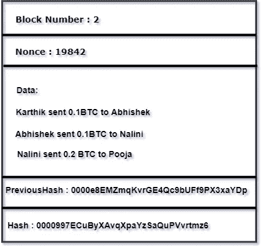
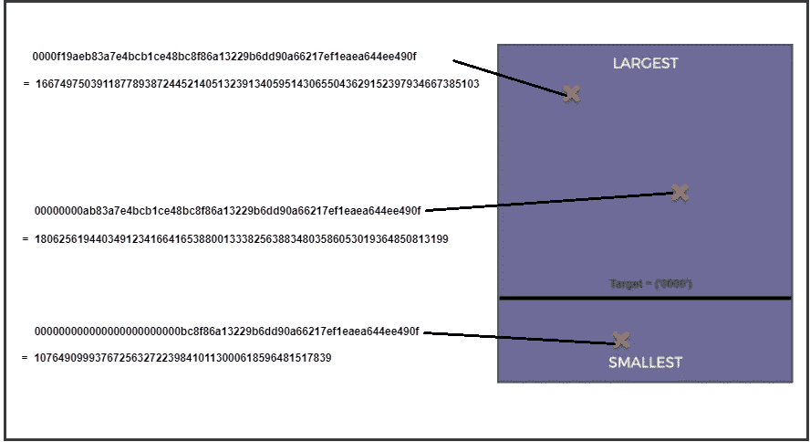

# 区块链:建立信任——第二部分

> 原文：<https://medium.com/coinmonks/blockchain-building-the-trust-part2-3e267333a89e?source=collection_archive---------2----------------------->

> *这是“*区块链:建立信任*”的第二部分。我推荐你阅读* [*第一部分*](/@karthikganiga007/blockchain-building-the-trust-294c751c6def) *关于区块链如何进化和构建以获得信任。*

在这篇文章中，我们将更多地讨论挖掘和共识协议。

让我们从采矿开始。

# 4.采矿

这里我们将讨论什么是采矿。大家都在参与的矿业竞争是什么？为什么有这么多资源分配给采矿。

让我们考虑这个街区。

这个块有块号，一些数据然后我们得到以前的散列和当前块的散列。我们如何获得当前块的散列值？嗯，我们只需获取块号、数据和以前的哈希，然后在哈希算法中运行它，听起来很简单，对吧？如果这么简单，采矿有什么好大惊小怪的？为什么会有成千上万的采矿钻机在运行，能源和如此多的计算能力都专用于它们？

实际上，块中还有另一个字段叫做“ *Nonce* ”，它代表只使用一次的*号。矿工试图改变这个 nonce 字段，它实际上控制着散列。这个 nonce 为散列提供了额外的控制和额外的灵活性。对于 nonce 中的每一个变化，哈希都会发生剧烈的变化。这就是我们可以观察雪崩效应的地方。随机数是一个可以持续到第十亿个数字的数字。*

> 那么这和钱有什么关系呢？这是一个散列池的例子。

上面是正确的 64 位 SHA256 哈希，这是一个十六进制数，下面是它们各自的十进制表示。让我们画一个假设的散列池。我们将所有最小的哈希放在底部，最大的哈希放在顶部。让我们将这三个散列映射到池中。说底部小，顶部大。那么，这里有什么大惊小怪的？我们很快就会谈到这一点。

因此，在区块链体系中，采矿工作是如何进行的，区块链体系为矿工设定了一个完成某个目标的目标。让我们考虑如上图所示的目标位置。

它的工作方式是，任何高于目标的散列都不算。重要的是目标完全是任意的。这没有逻辑或数学上的原因。只是给未成年人设置障碍，给他们制造挑战。思考目标的一个好方法实际上是用前导零来表示。因此，在块中，挖掘器不能改变块中的任何东西，这使得区块链成为不可变的分类帐，但是有一个字段“nonce ”,它可以被改变以获得低于目标的散列。矿工只是坐在那里，他们改变 nonce 字段，以便尝试猜测一个称为“黄金 Nonce”的值。重要的是雪崩效应。只要稍微改变一下随机数，散列就会发生巨大的变化。通过查看上面的图片，可以认为您只需要降低 nonce 值，就可以找到低于目标值的散列。这里不是这种情况，这是因为雪崩效应的重要特征，很难找到那个数字。我们使用哈希算法，这样它就不会被逆转来获得矿工想要的值。否则，区块链就不会存在。这就是为什么矿工们投入大量的机器工作来获得低于目标值的正确随机数或散列值。

# 5.共识协议

现在，让我们讨论一下我们在区块链世界听到的另一个热门话题，即共识协议。但在深入讨论之前，让我带您了解另一个有趣的概念，即“拜占庭容错网络”,这是一种计算机系统，尤其是分布式计算系统的状况，其中组件可能会出现故障，并且关于组件是否出现故障的信息不完整。该术语的名称来自一个寓言，即“拜占庭将军的问题”，用来描述这种情况，即参与者必须达成一致的策略以避免灾难性的系统故障，但有些参与者是不可靠的。

这位热心者首先指出，将军们的问题可以归结为解决一个“指挥官和中尉”的问题，在这个问题上，忠诚的中尉们必须一致行动，并且在指挥官忠诚的情况下，他们的行动必须符合指挥官的命令

一种解决方案考虑了消息可能被伪造的情况，但是只要背叛将军的数量不等于或超过将军的三分之一，这将是拜占庭容错的。不可能处理三分之一或更多的叛徒最终归结为证明一个指挥官和两个中尉的问题无法解决，如果指挥官是叛徒。为了理解这一点，假设我们有一个叛变的指挥官 A，以及两个中尉 B 和 C:当 A 让 B 进攻，C 撤退，B 和 C 互相发送消息，转发 A 的消息时，B 和 C 都不知道谁是叛徒，因为不一定是 A——另一个上尉可能伪造了据称来自 A 的消息

当我们谈到区块链网络时，我们会考虑同样的情况。

因此，我们熟悉了拜占庭容错，我们理解了整个概念，或者将军之间的网络如何达成共识。

## 区块链的共识协议必须解决两个主要挑战

1.  **保护网络免受攻击者的攻击:**我们讨论了攻击者试图在链的中间添加块的情况，我们在讨论分布式 P2P 时得到了答案。现在的情况是，如果攻击者试图将恶意数据块添加到数据块的末尾，该怎么办？这是一个严重的问题！我们现在如何解决这个问题？
2.  **协议应该解决竞争链:**我们的区块链网络是一个存在于全球各地的大型分布式 P2P 网络。假设有两个开采池，比如池 A 有 4 台彼此靠近的计算机，池 B 有 2 台彼此靠近但远离池 A 的计算机。假设两者都成功开采了一个区块。现在这是一个问题，因为它需要在哪里保持增长的共识，与池 A 的开采区块或池 B 的开采区块！它必须选择两个块中的一个。为了解决这些类型的问题，被称为*工作证明*的主要类型的共识协议发挥了它的作用。

> 那么工作证明这个名词从何而来？

好了，我们现在知道了散列、挖掘、分布式 P2P 和共识是如何相互作用的，我们可以将所有这些联系起来，讨论 POW 是如何工作的！

我们将从采矿开始。

矿工需要带一个随机数，一个黄金随机数，它将创建一个在目标下的散列，然后他们将被允许创建块。这是他们解决的加密难题。他们必须经历数百万、数十亿次迭代，直到找到那个随机数。这意味着需要大量的时间、大量的硬件投资和大量的电力消耗。对于这一数字，他们必须投入大量的工作，这很重要，因为要获得开采有效区块的巨大回报。在比特币中，挖掘一个区块可以获得 12.5 BTC 的奖励，而莱特币是 25 个硬币，等等。在这里玩一个公平有效的游戏是必要的，因为如果他们添加的块被拒绝了怎么办？所有的努力都白费了，这是一个巨大的损失！

网络如何知道正在添加恶意块？其实很简单。在添加任何块之前，每个节点都会进行一系列检查，这些检查非常严格。[这里的](https://en.bitcoin.it/wiki/Protocol_rules)是区块链协议规则的链接之一。如果一些检查没有通过，那么区块链系统会拒绝该块。

现在让我们进入问题的第二部分，竞争链中的冲突。

让我们假设相同的挖掘池和它们的计算源。在挖掘过程的中间，节点再次同时挖掘了块，现在冲突再次上升到将下一个块添加到哪里？现在我们这里有两个版本的链。现在该怎么办？答案很简单。其实我们等！开采紧接的下一个区块的池将首先添加，并且该链获胜。

我们等待，直到哪个池将挖掘下一个块，并从我们的共识协议和拜占庭协议考虑，具有最高块的节点赢得挑战，并继续添加下一个块。这里的关键特征是具有最高散列能力的网络将最终生成最长的链。从池 B 中被拒绝的块现在被称为[孤立块](https://www.blockchain.com/btc/orphaned-blocks)。

因此，考虑到拜占庭将军的问题，网络不能达成共识，多数比例数字是 70%的赞同。不像在区块链，是 50 %以上的赞同。只要您在网络中拥有 50%以上的哈希能力，您的节点就会赢得一致同意添加数据块。这有点成问题了，对吧？这就是我之前提到 51%攻击的原因。这是一个很好的、有趣的概念，我将在下一篇文章中讨论。

> 在下一篇文章中，我们将使用 Solidity 和 Javascript 实现一个以太坊应用程序，在其中我们可以实时观察交易的发生。

谢谢大家弥补到这一点。希望这篇文章能帮助你理解区块链是如何工作的。

> [在您的收件箱中直接获得最佳软件交易](https://coincodecap.com/?utm_source=coinmonks)

