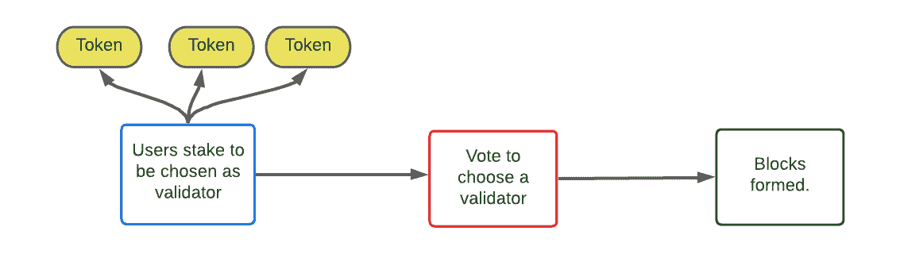

# 区块链共识算法

> 原文：<https://medium.com/coinmonks/blockchain-consensus-algorithms-6c2459737a61?source=collection_archive---------2----------------------->

## 工作证明(POW)
利益证明(POS)
委托利益证明(DPOS)
最长链规则
拜占庭容错(BFT)
POW 攻击
重要性证明(POI)
Burn 证明(POB)

工作证明、股权证明和委托工作证明是区块链中主要使用的证明，此外还有其他一些证明。共识算法是区块链中的矿工在向区块链提交经验证的区块之前达成一致的协议。在像区块链这样的分散设置中，共识算法允许网络中的所有各方在向区块链提交有效区块之前就特定区块达成一致。本文将探讨不同的一致性算法。

共识算法为网络中的节点以无信任的方式加入区块链提供了标准。无信任意味着节点在加入公共区块链之前不必验证其身份。

一致性算法检查新块和过去块的完整性。

它是一组使用计算机代码编写的规则，遵循特定的治理标准。让我们继续了解几个共识算法。

> 订阅 [**Coinmonks Youtube 频道**](https://www.youtube.com/c/coinmonks/videos) 获取每日加密新闻。

## 工作证明

工作证明是区块链少校使用的共识算法。比特币区块链使用 POW 算法。在 POW 中，矿工们计算一个复杂的数学难题，称为 NONCE。计算出的现时值应该小于区块链中存在的先前的现时值。POW 需要大量计算资源。比特币区块链网络中 POW 的计算资源相当于瑞士的电力需求。

在计算成功区块时，矿工同意最长链规则。任何在 POW 共识中拥有 51 %散列能力的实体都可以维持最长的链，并控制或破坏区块链。他们可以引入虚假交易，通过重复支出消除或利用区块链，并窃取其他矿商的资产。GHash.io 一度拥有 BTC 区块链 54%的股份。

# 最长链规则

*“多数决策由最长的链表示，该链投入了最大的工作证明努力。——*[*中本聪*](https://nakamotoinstitute.org/bitcoin/)

*   *所有节点信任区块链中最长的链，而不直接信任彼此。*
*   *建造任何积木都需要能量。矿工们在形成最长链条的区块上工作，付出的努力最多。具有最长块的链需要最大的功率来创建。该算法丢弃较短的链，而采用最长的链。*
*   *根据难度，块将花费更多的努力来达到小于目标的 nonce 值。因为难度是变化的，难度越大付出的努力/资源越多。*

**

*   *链网是计算最长链的度量标准。它是产生当前链所需的哈希总数。要获得完整的散列，您需要合计每个块所需的散列。*
*   *当存在相同的块时，节点在哪些节点达成共识上不一致。节点选择在最后一个块之上构建的较新的块，形成最长的链。*
*   *对于单个矿工来说，用最长链条原理替换链条是很困难的，因为所需的资源太高而无法替换。这一规则保护已经开采的区块。开采一个区块需要合作。*
*   *奖励激励矿工计算和开采最长的区块。100 个街区深的最长链在比特币区块链中获奖。*
*   *比特币和以太坊是使用 POW 共识算法的不同区块链。*

# *各种功率攻击*

## *双重支出*

*在重复消费中，矿工可以使用相同的硬币进行多次交易。双倍支出导致支出超过预期。至关重要的是，批准区块链所有可能阻止此类重复支出攻击的交易。*

## *自私采矿*

*在自私的采矿中，采矿者扣留开采的矿块，并有选择地将它们释放到区块链。拥有 33%股份的矿商可以通过逐步提交区块获得 50%的开采权。*

## *股权证明*

*与 power 相比，POS 使用不同的方法。矿工将他拥有的货币(股份)提交给区块链网络，以获得开采机会。一个被选中的有股份的随机矿工验证大宗交易。如果一个矿工不能承诺的股份，矿工可以加入一个股份池参与开采。在 POS 中，矿工也被称为伪造者。矿工因成功验证 POS 系统中的区块而获得交易费。*

*POS 系统引入了基于以太坊 2.0 标准的 POS 算法(Casper)来解决拜占庭通用问题(BGP)。在这种情况下，节点之间需要三分之二的多数才能达成共识。*

**

*在 POS 中，安全性更容易实现，因为如果恶意活动矿工在区块链被捕，51%的股份对于单个实体来说是一笔巨大的损失。在拥有 51%股份的人可以恶意消费的情况下，重复消费仍然是可能的。在提交到区块链之前批准和验证交易的相同技术将有助于减轻这种攻击。*

*ADA/ Cardano 目前使用股份证明(POS)。以太坊计划很快转向 POS。*

## *委托股权证明(DPOS)*

*在委托 DPOS 中，选择一个见证人来保护网络。投票者是持有令牌的人，持有最多令牌的投票者决定谁能保护网络或开采区块。*

*被选中的人/见证矿工应该做一个高质量的工作，不应该做任何恶意的活动。如果演员的表演不符合标准，或者他被认定为糟糕的演员，选民有权撤回投票。委托证明利害关系的方法节省了大量的计算能力，并以民主的方式达成共识。*

## *授权证明(POA)*

*POA 在 **Ripple** 和 **Hyperledger 区块链中使用。** POA 基于共识算法，可提供高容错性和高性能。节点必须通过认证来证明自己是有价值的，或者具有创建块的权限。*

*它不需要高功率的计算硬件，具有可预测的阻塞时间，支付较高的交易费用，并对恶意节点有容忍度。*

*POA 在接受节点之前验证节点的身份。这种一致性算法用于专用区块链设置。因为块的身份被验证，所以允许节点提交块，并且它被认为是有效的。在 POA 一致性算法中，块创建是动态的，并且验证时间更快。*

## *拜占庭容错(BFT)*

*在某些节点由于技术或硬件故障而无法响应，或者以格式错误的消息响应的情况下，可以使用 BFT 来缓解这种情况。使用 BFT，健康节点或提供正确响应的节点可以达成共识，以克服这种节点故障，并做出继续或停止节点的决定。*

*类似于拜占庭将军问题(BGP ),当相距较远的将军们不得不决定是继续进攻还是从进攻中撤退时。在这种情况下，将军们必须取得多数同意。如果其中一个将军扮演了投票决定进攻和投票决定撤退的双重角色，而没有加入进攻将军的队伍，那么结果可能是灾难性的。BGP 还因为信使必须长途跋涉去传递信息而丢失信息的可能性而变得更糟。BFT 共识算法旨在解决加密货币世界的 BGP 方案。*

****

## ***重要性证明(POI)***

*类似于 POS 的 POI 共识使用某些标准来评估节点的有效性。在这种情况下，用于评估节点的其他指标是既得货币的数量、净转移和集群的活动。虽然它类似于 POS，但是使用除了股份金额之外的度量来验证节点有助于克服 POS 共识算法中的漏洞。*

## ***燃烧证明(POB)***

*在烧录一致性证明中，令牌被发送到不可用的地址。这是一个没有私钥来解密和使用令牌的地址。矿工实际上可以开采相当于被烧毁的硬币。其目的是减少货币的流通，有时是制造一种类似 XCP 的反本国货币。使用 POB，您可以发送将烧毁您自己的硬币的交易。*

*硬币的定期燃烧不允许最初过度投资的不公平优势，而是促进硬币的定期燃烧并保持系统活跃。例如，使用 POB 的虚拟货币网络 Slimcoin 允许矿工燃烧硬币，这使他们有权竞争下一个区块，并使他们有机会在更长的一年时间内获得区块。*

## *逝去时间的证明(诗人)*

*POET 是 POW 的一个改进，它为网络参与者使用了一个随机定时器系统。使用 POET，它们分为两个阶段，一个是验证和加入网络，另一个是基于经过时间的随机选择过程。*

*POET 由英特尔公司开发。该算法使用抽签系统，以定时方式选择矿工，所有矿工都有平等的机会采矿。POET 系统的每个参与节点在分配的随机等待时间内进入被动模式。*

*等待时间最短的矿工节点醒来并开始挖掘。这类似于 POW，但是并不是所有的节点都争着为块提供有效性证明。由于停机而处于休眠状态的节点可以节省资源并执行一些其他非主要任务。*

*本文介绍了区块链技术中一些主要使用的共识算法。阅读更多关于 IAM & Security @[https://iamblockc.medium.com/](https://iamblockc.medium.com/)的文章*

> *加入 Coinmonks [电报频道](https://t.me/coincodecap)和 [Youtube 频道](https://www.youtube.com/c/coinmonks/videos)了解加密交易和投资*

## *另外，阅读*

*   *[如何匿名购买比特币](https://blog.coincodecap.com/buy-bitcoin-anonymously) | [比特币现金钱包](https://blog.coincodecap.com/bitcoin-cash-wallets)*
*   *[币安 vs FTX](https://blog.coincodecap.com/binance-vs-ftx) | [最佳(SOL)索拉纳钱包](https://blog.coincodecap.com/solana-wallets)*
*   *[如何在 Uniswap 上交换加密？](https://blog.coincodecap.com/swap-crypto-on-uniswap)*
*   *[WazirX vs coin dcx vs bit bns](/coinmonks/wazirx-vs-coindcx-vs-bitbns-149f4f19a2f1)|[block fi vs coin loan vs Nexo](/coinmonks/blockfi-vs-coinloan-vs-nexo-cb624635230d)*
*   *[本地比特币审核](/coinmonks/localbitcoins-review-6cc001c6ed56) | [加密货币储蓄账户](https://blog.coincodecap.com/cryptocurrency-savings-accounts)*
*   *[比特币基地评论](/coinmonks/coinbase-review-6ef4e0f56064) | [德里比特评论](/coinmonks/deribit-review-options-fees-apis-and-testnet-2ca16c4bbdb2) | [FTX 评论](/coinmonks/ftx-crypto-exchange-review-53664ac1198f)*
*   *[n rave ZERO Review](/coinmonks/ngrave-zero-review-c465cf8307fc)|[phe MEX Review](/coinmonks/phemex-review-4cfba0b49e28)|[PrimeXBT Review](/coinmonks/primexbt-review-88e0815be858)*
*   *最佳[区块链分析](https://bitquery.io/blog/best-blockchain-analysis-tools-and-software)工具| [赚比特币](/coinmonks/earn-bitcoin-6e8bd3c592d9)*
*   *[加密套利](/coinmonks/crypto-arbitrage-guide-how-to-make-money-as-a-beginner-62bfe5c868f6)指南| [如何做空比特币](/coinmonks/how-to-short-bitcoin-568a2d0b4ae5)*
*   *[德国最佳加密交易所](https://blog.coincodecap.com/crypto-exchanges-in-germany) | [Arbitrum:第二层解决方案](https://blog.coincodecap.com/arbitrum)*
*   *[币安交易机器人](/coinmonks/binance-trading-bots-d0d57bb62c4c) | [OKEx 审查](/coinmonks/okex-review-6b369304110f) | [Atani 审查](https://blog.coincodecap.com/atani-review)*
*   *[最佳加密交易信号电报](/coinmonks/best-crypto-signals-telegram-5785cdbc4b2b) | [MoonXBT 评论](/coinmonks/moonxbt-review-6e4ab26d037)*
*   *[Godex.io 审核](/coinmonks/godex-io-review-7366086519fb) | [邀请审核](/coinmonks/invity-review-70f3030c0502) | [BitForex 审核](https://blog.coincodecap.com/bitforex-review)*
*   *[MoonXBT vs Bybit vs 币安](https://blog.coincodecap.com/bybit-binance-moonxbt) | [硬件钱包](/coinmonks/hardware-wallets-dfa1211730c6)*
*   *[火币交易机器人](https://blog.coincodecap.com/huobi-trading-bot) | [如何购买 ADA](https://blog.coincodecap.com/buy-ada-cardano) | [Geco？一次回顾](https://blog.coincodecap.com/geco-one-review)*
*   *[币安 vs Bitstamp](https://blog.coincodecap.com/binance-vs-bitstamp) | [比特熊猫 vs 比特币基地 vs Coinsbit](https://blog.coincodecap.com/bitpanda-coinbase-coinsbit)*
*   *[如何购买 Ripple (XRP)](https://blog.coincodecap.com/buy-ripple-india) | [非洲最好的加密交易所](https://blog.coincodecap.com/crypto-exchange-africa)*
*   *[非洲最佳加密交易所](https://blog.coincodecap.com/crypto-exchange-africa) | [胡交易所评论](https://blog.coincodecap.com/hoo-exchange-review)*
*   *[eToro vs robin hood](https://blog.coincodecap.com/etoro-robinhood)|[MoonXBT vs by bit vs Bityard](https://blog.coincodecap.com/bybit-bityard-moonxbt)*
*   *[有哪些交易信号？](https://blog.coincodecap.com/trading-signal) | [比特斯坦普 vs 比特币基地](https://blog.coincodecap.com/bitstamp-coinbase)*
*   *[ProfitFarmers 回顾](https://blog.coincodecap.com/profitfarmers-review) | [如何使用 Cornix Trading Bot](https://blog.coincodecap.com/cornix-trading-bot)*
*   *[如何在势不可挡的域名上购买域名？](https://blog.coincodecap.com/buy-domain-on-unstoppable-domains)*
*   *[印度的加密税](https://blog.coincodecap.com/crypto-tax-india) | [altFINS 审查](https://blog.coincodecap.com/altfins-review) | [Prokey 审查](/coinmonks/prokey-review-26611173c13c)*
*   *[Blockfi vs 比特币基地](https://blog.coincodecap.com/blockfi-vs-coinbase) | [BitKan 点评](https://blog.coincodecap.com/bitkan-review) | [Bexplus 点评](https://blog.coincodecap.com/bexplus-review)*
*   *[南非的加密交易所](https://blog.coincodecap.com/crypto-exchanges-in-south-africa) | [BitMEX 加密信号](https://blog.coincodecap.com/bitmex-crypto-signals)*
*   *[MoonXBT 副本交易](https://blog.coincodecap.com/moonxbt-copy-trading) | [阿联酋的加密钱包](https://blog.coincodecap.com/crypto-wallets-in-uae)*
*   *[雷米塔诺审查](https://blog.coincodecap.com/remitano-review)|[1 英寸协议指南](https://blog.coincodecap.com/1inch)*
*   *[折叠 App 审核](https://blog.coincodecap.com/fold-app-review) | [StealthEX 审核](/coinmonks/stealthex-review-396c67309988) | [Stormgain 审核](https://blog.coincodecap.com/stormgain-review)*
*   *[购买 PancakeSwap(蛋糕)](https://blog.coincodecap.com/buy-pancakeswap) | [俱吠罗评论](/coinmonks/coinswitch-kuber-review-1a8dc5c7a739)*