# 区块链共识协议和博弈论

> 原文：<https://medium.com/coinmonks/blockchain-consensus-protocols-game-theory-fc3504e4da99?source=collection_archive---------1----------------------->

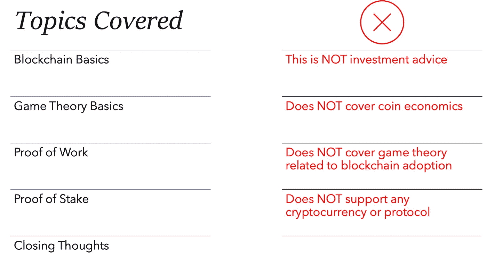

本文的目的是分析区块链两个最重要的共识协议——工作证明和利益证明背后的博弈理论。第一部分旨在让初学者在研究每个协议的博弈理论以及它们对攻击的防御之前，更好地理解区块链技术和博弈理论。对于不熟悉区块链技术的人来说，解开所有这些分析可能需要时间。对于那些希望了解更多和深入挖掘细节的人来说，在文章的末尾有推荐的阅读材料和媒体。

此外，这项研究没有涵盖共识协议之外的区块链博弈理论，如私人和公共实体的采用。目标不是评估不同区块链超越共识协议的有效性，也不是提供与区块链相关的各种经济因素的分析，如供应流量、供应上限、效用等。最重要的是，本文中没有任何内容是投资建议。

通过仔细观察参与区块链共识的参与者的观点、每个参与者的收益以及不同策略的博弈论方法，人们能够更好地理解为什么区块链尽管是分散的和不可信的，但仍被认为是安全的。

**区块链基础知识**

“在高水平上，区块链技术允许计算机网络定期就分布式账本的真实状态达成一致，”麻省理工学院斯隆管理学院助理教授克里斯蒂安·卡塔利尼说，他是区块链技术和加密货币的专家( *Church 2017* )。区块链正在解决一个难题，它将网络与一个账本对齐，无需任何信任，并允许每台计算机存储真实的账本。分发分类账是关键的一步，它打开了分散财务、投票、供应链和许多其他系统的大门，这些系统目前都是由中央实体控制的。

更好地理解区块链和分布式分类账的一个方法是看它们的对立面——集中式分类账。集中分类账的一个好例子是银行。银行持有所有的余额，并在一个集中的分类账上跟踪其账户的交易。就像个人跟踪他们的总财富和进出他们个人支票账户的资金流量一样，银行对他们所有客户的账户也是这样做的。通过依靠银行来控制他们生活的这一方面，人们相信银行会妥善储存他们的财富，并管理他们的资金在更广泛的金融体系中的流动。

去中心化去掉了中央权威，把权力放在网络成员身上。从金融角度来看，这相当于取消了银行，允许人们持有和跟踪他们的个人财富，并在网络中与他人公开交易，而不受外部权威机构的任何审查。在探究如何通过区块链实现权力下放之前，权衡权力下放的利弊很重要。

有三个方面需要权衡:安全、经济和审查。从安全角度来看，分散消除了单点攻击。对于存储财富或重要信息来说，这是一个很好的特性，但它确实需要能量或复杂的算法(或两者兼有)来维护。如果人们更愿意将财富托付给银行或其他在安全方面投资巨大的实体，那么分权对这些人来说就没那么必要了。

就经济而言，当中央政府收取高额费用或被认为腐败或目光短浅时，权力下放会有所帮助。举个例子，一家公司控制着财富的跨境转移——可能是汇款。如果这一部门的竞争较弱，费用可能会很高，在中央当局周围开辟一条道路可能会降低费用。

另一个例子是，一个政府在历史上违背其选民的意愿行事，并且/或者在货币供应方面不值得信任，导致过度通货膨胀。一个人可以将他们的财富储存在分散的区块链上，而不是继续以政府的货币储存资金，这样更不容易被单一政党操纵。另一方面，如果竞争激烈，而政府在历史上一直诚实有效地行事，又会怎样呢？也许权力下放只是让经济分心。在一个去中心化的世界里，人们有更多的个人责任，不得不花更多的时间专注于储存他们的财富，而不是花时间为经济做贡献。诚然，恶性通货膨胀会导致同样的结果，因为随着通货膨胀摧毁他们现金的价值，人们不断寻找新的方式来储存他们的财富。

有待讨论的权力下放的最后一个特征是对审查制度的抵制。通过移除一个中央机构，交易或存储在区块链上的信息就不能被审查。总体目标是允许点对点交易不受政府或企业的影响。这似乎是对权力下放的有力支持，但是当人们犯了错误需要第三方的帮助时呢？如果一个人丢失了信用卡，另一个人可能会用这张卡在几个加油站买糖果。银行会想办法偿还信用卡主人损失的钱。在一个去中心化的世界里，这些钱都没了。

在区块链分散和分配总账有几个利弊，但原则和技术很可能是未来的重要组成部分。那么，权力下放实际上如何实现呢？在不要求参与者之间信任的情况下，使参与者与分类帐的真实状态一致的问题是极其困难的。数学家、计算机科学家和博弈论专家已经研究这个问题超过 50 年了。

多年来密码学和数字货币的发展最终导致了共识协议的产生，这些协议有助于保护和维护今天流行的区块链。正如下面的时间线所描绘的，第一个共识协议之一被称为工作证明，是由 Adam 早在 2002 年创建的。后来，Peercoin 赋予了赌注的证明以生命，并像 Cardano 和其他几个人一样在区块链变得更受欢迎。共识协议领域最重要的变化之一是以太坊从工作证明转移到利害关系证明，目前正在进行中，截至 2021 年 9 月。

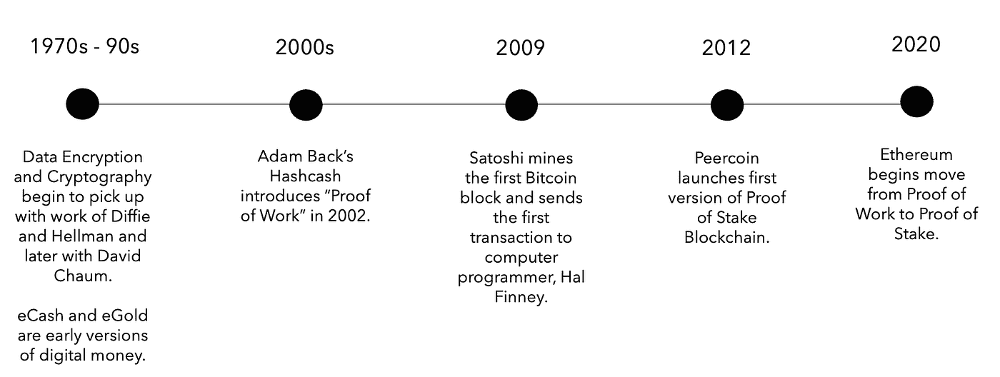

尽管这一分析没有深入挖掘这一领域领导者的工作历史，但网上有几个资源显示了 2009 年最终创造区块链所涉及的研究和实验的深度。此外，一个用于理解分权斗争和解决方案的常见理论问题被称为拜占庭将军问题。在*附录 A 项*中，解释了拜占庭将军问题，并应用了博弈论分析。

**博弈论基础知识**

为后面的分析做准备，下一步是描述博弈论的基础。博弈论是对玩家之间战略互动的研究。每个游戏都包含三个要素——玩家、策略和收益。回报的例子可以是赢或输，赚更多或更少的钱，或者坐牢。

可以说这个游戏最关键的方面是收益依赖于其他玩家的行动。分析博弈收益最常见的方法是使用收益矩阵，它显示了每个玩家选择不同策略时的收益。玩家能够根据对手的行动来决定他们的最优策略。当两个参与者的最优策略一致时，就存在一个纳什均衡——每个参与者都不会从改变他们的策略中获益。

有趣的是，纳什均衡不一定是每个玩家的最佳结果，而是基于对手最优策略的最佳结果。囚徒困境解释了这种情况的一个很好的例子。哈里和莎莉因犯罪被关了起来。如果他们供认并指证他们的犯罪伙伴，他们将得到一笔交易。如果哈利和莎莉都保持沉默，他们会被判入狱一年。如果一个人坦白而另一个人不坦白，坦白的玩家可以获得自由，而另一个人则被判五年。如果他们两人互相指证，每人将被判三年徒刑。

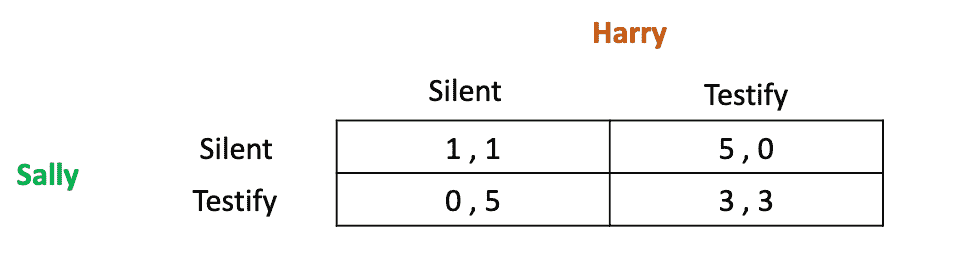

上表是哈利和莎莉之间博弈的“收益矩阵”。每个玩家不能互相协调或交谈，所以他们必须根据自己和对手的收益来分析。

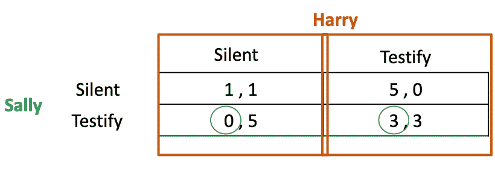

Sally deciding based on Harry’s two options.

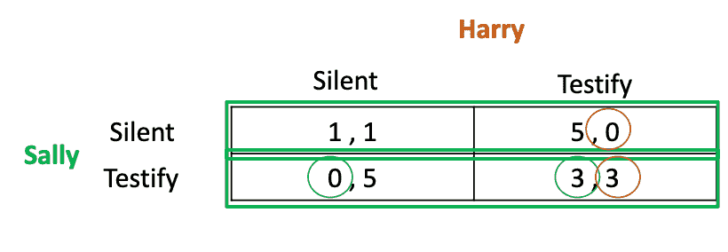

Harry deciding based on Sally’s two options.

在左边，莎莉正在看哈利保持沉默或作证的策略。如果哈利保持沉默，她的最佳策略是出庭作证，这样她就不会在监狱里呆太久。如果哈里指证她，最佳策略是再次指证哈里，以获得三年而不是五年。在右边，根据莎莉在沉默和作证之间的选择，哈利得出了同样的结论。

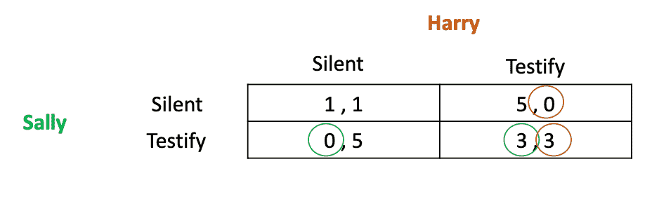

现在纳什均衡很明显了。哈里和莎莉都将作证，每人被判三年徒刑。这不是他们的最佳结果，但这是基于另一方行动的最优策略。通常，有外部力量试图将每个玩家带到他们的最佳结果。对哈利和莎莉来说，这可能意味着像一群其他罪犯一样的外部力量，将惩罚哈利和莎莉作证指控一名同案犯。对于公司之间的竞争，这可能看起来像是串通或价格操纵。

另一种博弈论方法被称为马希民策略，当玩家试图选择优化最坏情况的策略时。如果他们不想最大化最大收益，而是想最大化最低收益，他们可以采取这种策略。对哈利和莎莉来说，马希民也是来作证的，因为他们想消除坐牢五年的风险。

当这两种博弈理论方法都不足以解决问题时，可以使用混合策略来分析博弈，并更深入地了解每个玩家对另一个玩家采取某种行动的看法。当研究区块链国内的玩家时，本文将对此进行更深入的探讨。还有其他几种博弈论方法，但本文将集中讨论这三种:纳什均衡、马希民策略和混合策略。

**博弈论&区块链共识**

博弈论如何适用于区块链？对于这一分析，重点将放在不同参与者对账本真实状态达成共识背后的博弈理论上。本文将分析的参与者是工作证明中的挖掘者和利益证明中的验证者，它们保护区块链并提供共识。

为了降低分析的复杂性，收益将被简化为-1 到 2。-1 代表最坏的结果，0 代表盈亏平衡，1 代表正收益但不是最优收益，2 代表最优收益。游戏将权衡当玩家诚实并继续保护网络时的收益与当玩家不诚实并攻击网络时的收益。每个区块链都有诚实的激励或奖励，例如新创造的硬币和/或提供给诚实玩家的交易费。当参与者能够控制网络的大部分并操纵事件的顺序时，区块链共识的风险就变得非常严重。当这种情况发生时，它被称为 51%攻击。

在 51%的攻击中，攻击玩家能够改变他们发起的交易的顺序。攻击过程中最常见的操纵类型被称为双重花费。如果攻击者能够改变事件的顺序，他们就可以改变汇款人或汇款地点。他们可以把相当于 5 美元的钱寄给一个人，然后把同样的 5 美元寄给另一个人。当然这是一个只存在于数字世界的问题——人们不可能把同样的 5 美元钞票(现金)给两个人。在数字世界中，这种行为是由银行等第三方阻止的。在区块链，没有第三方来阻止这种情况发生，因为这是共识协议的工作。

出于几个原因，攻击网络对玩家来说可能是一个积极的结果。首先，他们可以花双倍的钱。其次，他们可以利用网络安全漏洞造成的混乱，做空区块链货币。第三，他们可能会因为其他原因，如区块链之间的竞争，或把更多的权力带回像政府这样的中央机构，而搞垮一个网络。

在以下关于工作证明和利益证明的研究中，玩家将权衡诚实的回报与不诚实和攻击网络的回报。

**工作证明**

创建的第一个共识协议称为工作证明。工作证明最初是由亚当为 Hashcash 创建的，后来被用于第一个区块链比特币。Satoshi Nakomoto 是比特币创造者的笔名。Satoshi 在 2008 年撰写了白皮书，并在 2009 年创建了第一个比特币区块。由于比特币是第一个也是最广泛使用的工作证明区块链，并且具有最大的市值，在下面的分析中，我将互换使用比特币和工作证明。

简而言之，工作的证明包括信任耗费了最多能量的区块链。用 Satoshi 的话来说，“最长的链不仅证明了目睹的事件序列，还证明了它来自最大的 CPU 资源”( *Nakamoto 2008* )。消耗能量的石块的创造者被称为矿工。矿工使用计算能力来解决一个类似于复杂的猜谜游戏的密码难题。

矿工消耗的计算能力的数量与解决难题和“赢得区块”的可能性成正比。当矿工赢得区块，只有当他们将区块添加到最长的链，他们会收到奖励。奖励是新创造的比特币以及与该区块内交易相关的所有交易费用。下面是比特币网络交易路径的简化图。对于下一步的进一步理解，文末有两个推荐视频。

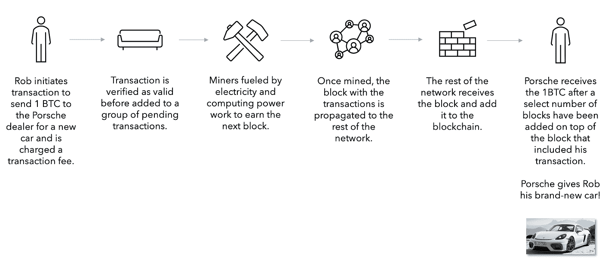

提醒一下，矿工消耗的计算能力与赢得下一个区块的概率成正比。如果一个矿工或一群矿工控制了 51%的计算能力，他们可能会试图攻击。在研究攻击的博弈理论之前，有许多关于 51%攻击的误解需要消除。最重要的误解是，一个矿工或一群矿工试图 51%的攻击可以改变区块链的所有交易。实际上，矿工们只能通过他们的个人密钥来改变他们直接绑定的交易的顺序。如果发生攻击，与攻击者断开连接的旁观者不会失去他们的比特币。下一个误解是，攻击将立即允许攻击者双倍消费并改变区块链的排序。为了理解为什么这是一个误解，下面的场景展示了为什么它不那么简单。

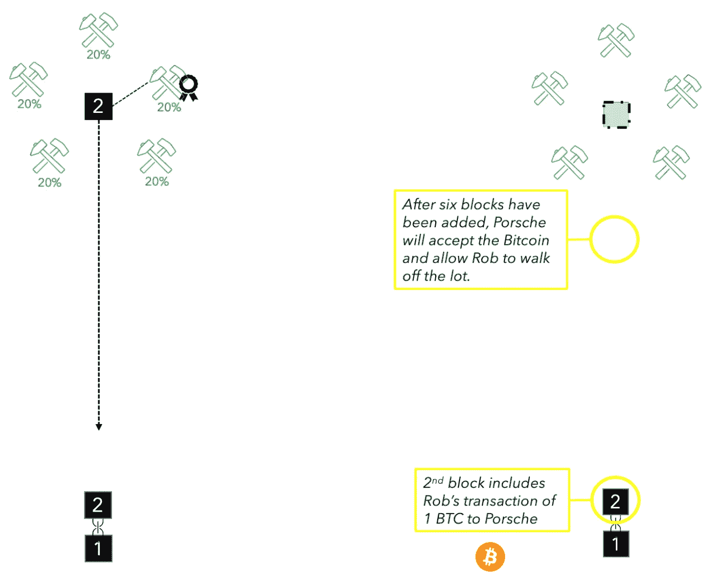

左侧描绘了五个矿工或矿工组，每个都拥有比特币挖掘 20%的计算能力。其中一名矿工赢得方块，然后将其添加到方块链中。在右侧，Rob 在第二个块中包含了一个发送给 Porsche 的比特币交易，这样他就可以购买他的新车。**51%攻击最重要的学习点是，参与者在认为交易安全之前，会等待交易块堆叠在交易块的顶部。**对于大多数参与者来说，等待六个街区或大约一个小时足以确保交易最终完成。**对于较大的交易，收款实体可能需要更长的等待时间，而对于较小的交易则相反。**

在这个例子中，保时捷正在等待六个街区，所以在第八个街区添加到区块链后，他们将把他的保时捷给 Rob。许多人对攻击的看法是，如果 Rob 控制了 51%的网络，他将能够分叉或创建一个新的链来欺骗保时捷。见下文对这一概念的描述。

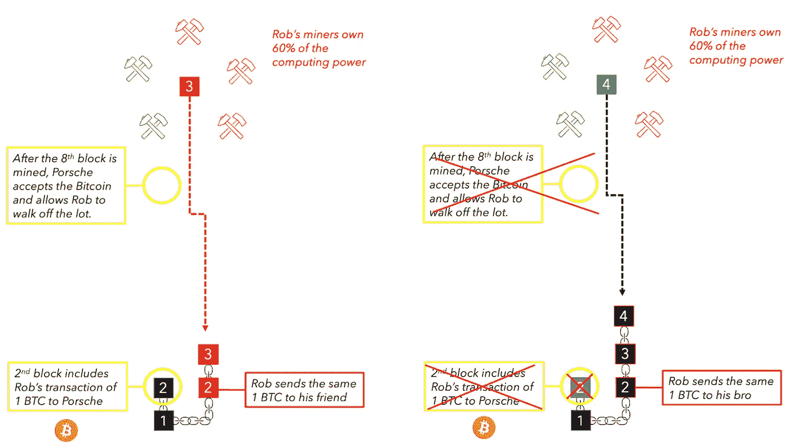

左边的图表显示，Rob 已经接管了三个矿工，现在拥有 60%的网络。他开始了一个新的链，他把发给保时捷的比特币发给了他的朋友。他正试图加倍花费。由于他拥有网络的大部分，他的攻击链开始超过原来的链。

在右边，很明显为什么这种攻击的想法是不成立的。一旦 Rob 的攻击链比原来的链长，所有的矿工将被激励去加入那个链，因此它将成为可信链。当这种情况发生时，Rob 发送给 Porsche 的交易将无效，Porsche 不会将他的车交给 Rob。现在更清楚了攻击不包括什么，下面的图表将描述潜在成功攻击的动态。

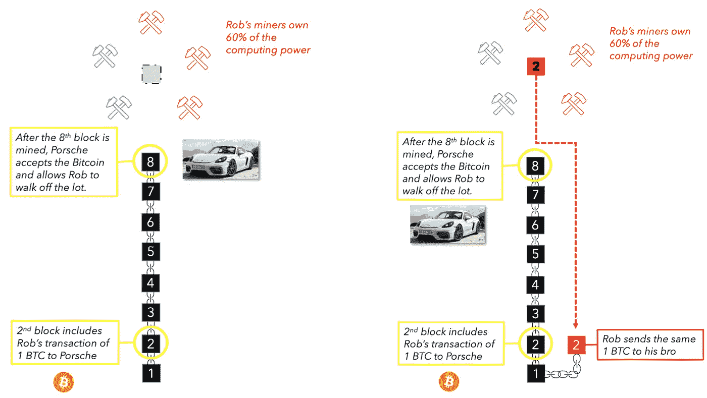

Rob 现在正等着开始攻击，直到 Porsche 把车交给他。现在第八区块已经开采完毕，Porsche 相信了这笔交易，并让 Rob 开出了停车场。Rob 接管了 60%的网络并开始攻击。为了成功地将相同的比特币发送给他的朋友，Rob 必须赶上最长的链。根据 Rob 拥有的采矿权百分比(60%)，他将赢得每五个区块中的三个区块，因此需要大约三十个区块或五个小时才能赶上主链。

今天，为了获得 60%的网络份额，Rob 必须购买 300 亿美元的采矿设备。对于近 1 万亿美元的资产来说，这似乎是一个可以达到的数字。但是采矿设备不是免费提供的，自然供应链的限制将使购买这一数量非常困难。随着计划攻击者寻求购买越来越多的采矿设备，价格将被推高。值得注意的是，采矿设备不是任何普通的计算机。比特币使用专用集成电路或 ASIC 进行挖掘。他们唯一的目的就是挖矿比特币。由于这个原因，对网络的攻击会破坏 ASICS 的剩余价值，这使得攻击的成本和收益更加复杂。

下一个需要了解的财务方面是阻止 Rob 攻击的电力成本。对于目前 60%网络的 5 小时攻击，电力成本将在 500-1000 万美元左右。到 2021 年 9 月，不开采最长链区块和放弃区块奖励的机会成本将在 400 万至 600 万美元之间。

另一个考虑因素是接受交易有效之前的等待时间。在接受交易之前等待阻止或确认被添加到链中使得攻击者难以评估攻击。通常情况下，较大的交易会等待更多的确认，因此攻击的成本会随着双重花费的好处增加而增加。既然攻击的动态更加清晰，博弈论分析就开始了。

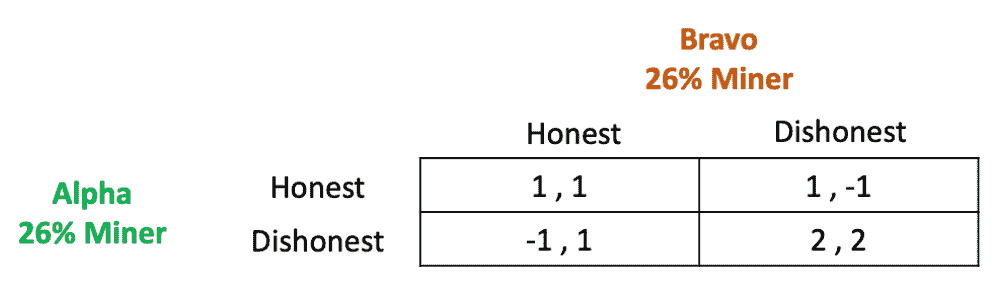

为了建立一次攻击的基线收益矩阵，让我们首先从了解参与者开始。在这个游戏中，将有两个玩家，每个人都拥有网络计算能力的 26%。因此，如果他们联合起来，他们拥有超过 50%的网络，可以攻击。下一步是分析收益。在左上方，两个矿工继续诚实地采矿，并且都获得了他们应得的区块和奖励。在右上角和左下角，一个玩家在攻击，而另一个玩家保持诚实。进攻方浪费了计算能力，因此得到了-1 的收益。在这种情况下，诚实的矿工继续赢得区块，并获得 1 的回报。

这个游戏是用一种悲观的网络安全方法建立的，并假设一次攻击的收益是 26%玩家的最佳结果。比特币网络已被证明是安全的，但可能有理由相信，未来一次成功攻击的回报可能会成为最佳回报。很可能这是最高的收益，两个玩家的收益都是 2，矿工将不得不成功地花一大笔钱，同时做空硬币，从网络的下跌中赚钱。这可能是最高回报的另一个原因是，竞争对手或政府将区块链的灭亡视为最终目标，而没有其他可接受的最终结果。

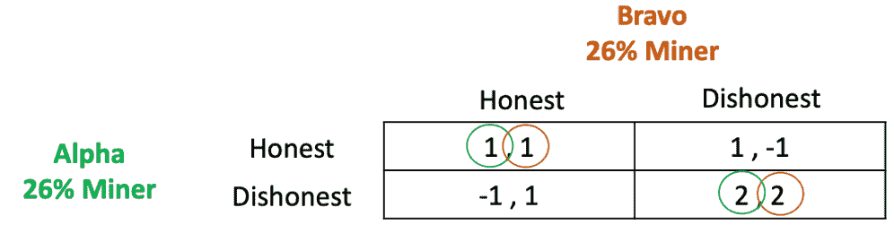

既然已经描述了参与人和收益，下一步就是看看参与人的博弈理论方法。首先是看马希民战略。每个矿工如何最大化最坏的结果？马希民策略是永远诚实，因为它确保当选择不诚实和攻击时，最坏的结果是 1 而不是-1。其次是看纳什均衡。对于这个博弈，有两个纳什均衡，这意味着它并没有告诉玩家如何做决定的全部情况。

因此，下一步的分析将有助于我们理解参与者会如何思考这两个纳什均衡之间的决定。一个有帮助的方法是这样的:“我需要相信我的对手什么才能做出正确的决定？”。要回答这个问题，考虑混合策略是有用的，混合策略是一个涉及概率的博弈论概念

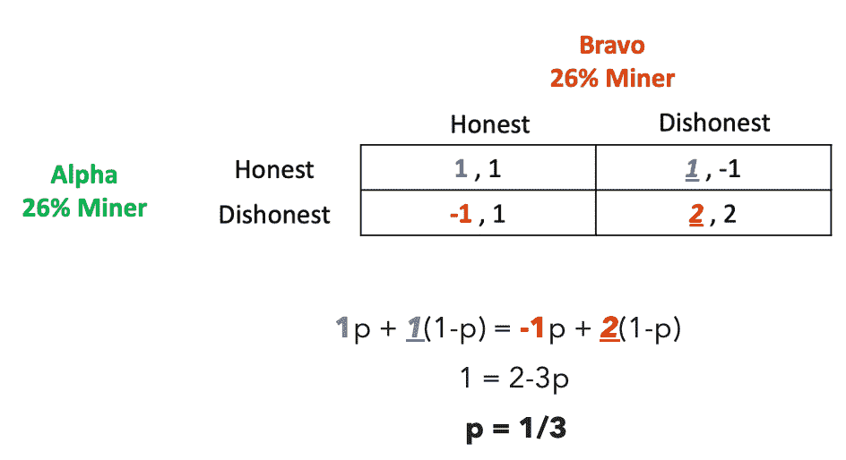

上面的图表显示了阿尔法矿工的所有收益。阿尔法矿工试图理解她需要相信布拉沃矿工什么来做出最好的决定。因此，她把诚实的收益等同于不诚实的收益。当使用这些简化的收益时，结果是她必须相信布拉沃矿工至少有 33%的可能诚实，也选择诚实。换句话说，她必须相信布拉沃矿工有超过 67%的可能不诚实，因为她也不诚实。即使采用成功攻击的最大收益的悲观方法，决策似乎倾向于诚实(和安全)。

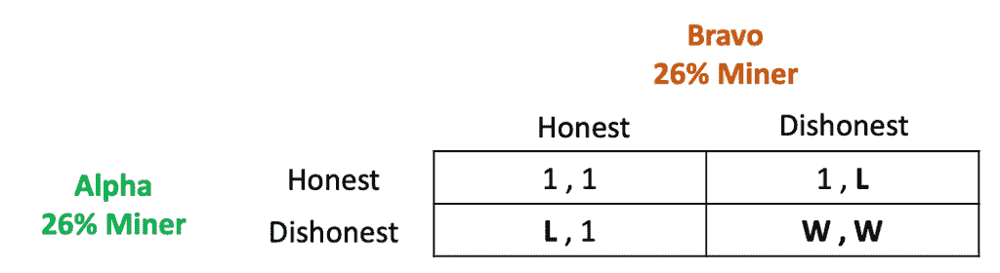

在分析了攻击的复杂性之后，人们可能会认为攻击的收益看起来与收益矩阵的原始构造不同。在上面的收益矩阵中，获胜攻击的收益被标记为“W ”,失败攻击的收益被标记为“L”。然后，阿尔法矿工能够对她必须依赖的关于对手的概率进行敏感性分析。

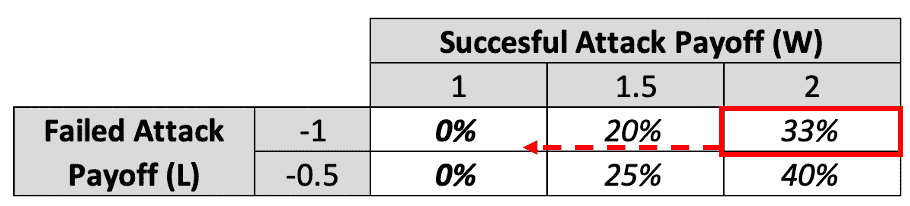

由于攻击的沉重代价和有限的收益，她可能认为“W”不是 2，而是 1.5 或 1。如果成功的攻击是 1.5，她只需要相信有 20%的机会布拉沃是诚实的玩家，以便也是诚实的。如果成功的攻击收益是 1 或者相当于诚实挖掘的奖励，那么诚实挖掘就是最优策略，不管她对 Bravo 怎么看。

当她认为失败的攻击回报可能没有预期的那么糟糕时，这个回报敏感性表也权衡了概率的变化。随着失败的攻击变得不那么痛苦，阿尔法的风险降低，选择攻击的可能性增加，尽管从未超过 50%，因为由于进行攻击所需的能量，成本永远不会为零。

基于这种使用简化收益证明工作的博弈论分析，可以理解为什么比特币网络以其安全性而闻名。由于共识协议中内置的激励结构和能量要求，成功的攻击是极不可能的。对于那些希望攻击的人来说，情况更加复杂，今天需要四个采矿集团或联营公司联合起来才能达到 50%。

随着需要合作的玩家数量增加，成功攻击的可能性降低。协调四个实体，通过做空来实现回报最大化，这似乎是一个令人兴奋的场景。但是，如果一个玩家退出，而这个玩家实际上押注价格上涨(多头)，该怎么办呢？该玩家将赢得更大部分的奖励，而其他人则浪费精力，攻击者的空头头寸可能会变成一项可怕的投资。很明显，采矿的分散化是比特币网络的一个重要目标，因为参与者希望提高安全性。

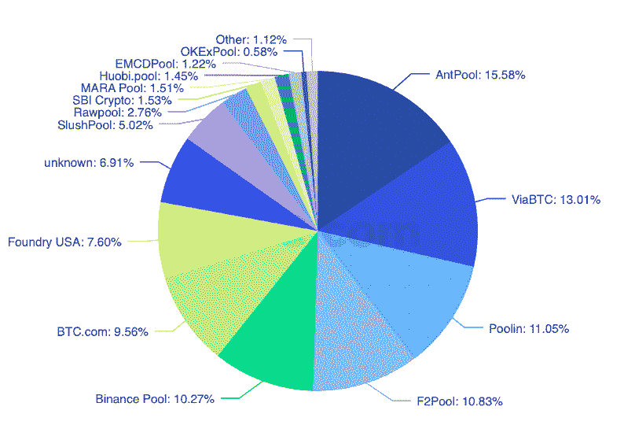

[https://btc.com/btc/insights-pools](https://btc.com/btc/insights-pools)

反对比特币长期安全性的理由之一与采矿动机有关。奖励给矿工的新比特币数量每四年减少一半，直到比特币总数(2100 万)被开采完。随着新铸造的硬币奖励减少，诚实的回报也会减少。事实上，不管对手的决定如何，诚实的回报是一样的，诚实的回报在分析中没有赢得或输掉攻击的回报重要。不管诚实的回报是 1，0.5，还是 0.25，阿尔法仍然必须相信布拉沃有 33%的可能是诚实的。

随着诚实采矿的回报减少，失败攻击的回报可能会减少。采矿设备(ASICs)成本和电力成本的变化长期未知，因此本分析不会对这些成本进行推测。更可估计的变量是诚实开采区块得不到回报的机会成本。随着回报的降低，一次失败攻击的机会成本也会降低。比特币的价格可能会上涨，这可能会增加机会成本，但这也会增加攻击的好处(价格越高意味着欺诈越有利可图)。交易费用可能会大幅增长，这也将增加机会成本，促进更强的安全性，但也意味着使用比特币区块链存储和转移价值的体验将出现不同的范式(高费用)。本文前面展示的支付敏感度表是在不同场景下测试假设的一个很好的方法，包括比特币报酬递减。对减半的影响进行更详细的分析超出了本文的范围。

另一个相反的论点是，政府或竞争者可能不会被系统中的奖励所激励。博弈论的分析仍然适用于那些玩家。政府或竞争者会有不同的收益特征。例如，当政府的目标是不惜一切代价消灭比特币时，它可能不太担心攻击的成本。但是政府要考虑不同的风险——例如，如果他们攻击失败，对网络的信心会增加，并使他们处于比一开始没有攻击时更糟糕的境地。竞争对手也是如此。

政府攻击的一个复杂因素是采矿在各国的分布。下图是根据剑桥大学比特币电力消耗指数，截至 2021 年 3 月全球的矿业分布。在这张地图创建两个月后，中国打击了采矿活动，基本上所有比特币矿工都在从中国迁移到其他国家。如果中国在 2021 年 3 月有 46%的时候或者在 2019 年 9 月有 75%的时候没有协调攻击，那么未来来自中国或任何其他国家的攻击的机会似乎正在迅速下降。

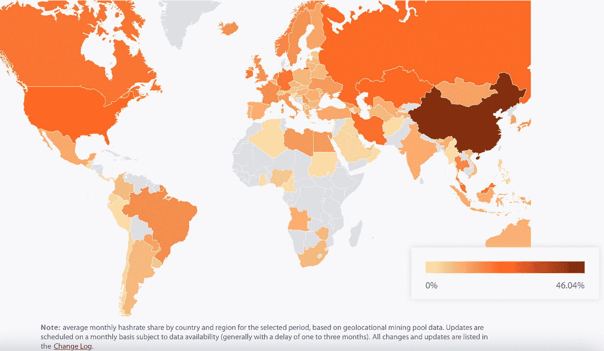

[https://cbeci.org/mining_map](https://cbeci.org/mining_map)

[https://www . jbs . cam . AC . uk/insight/2021/new-data-reveals-timeline-of-China-bit coin-mining-exodus/](https://www.jbs.cam.ac.uk/insight/2021/new-data-reveals-timeline-of-chinas-bitcoin-mining-exodus/)

当考虑成功攻击的概率时，游戏的复杂性和玩家的不同特征是重要的因素。这个分析简化了游戏，只包括两个玩家，并且只使用-1 到 2 的范围作为收益。对于比特币的未来安全性，这并不是一个包罗万象的答案，但它为玩家如何在挖掘比特币的游戏中做出决定提供了指导。这项研究表明，工作证明共识协议中内置的激励结构和能源要求以及跨实体和国家协调的复杂性使得 51%的攻击不太可能发生。

**股权证明**

第一枚比特币在 2009 年被开采出来，从而开启了区块链的新技术。自诞生以来，一直有一种观点认为比特币消耗了太多的能源。截至 2021 年 9 月，比特币每年使用约 100 太瓦时，这与较小国家的能源消耗相当(*剑桥大学 2021* )。

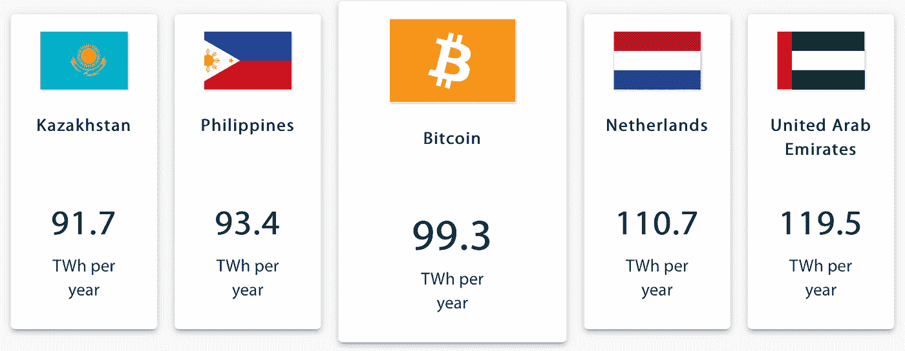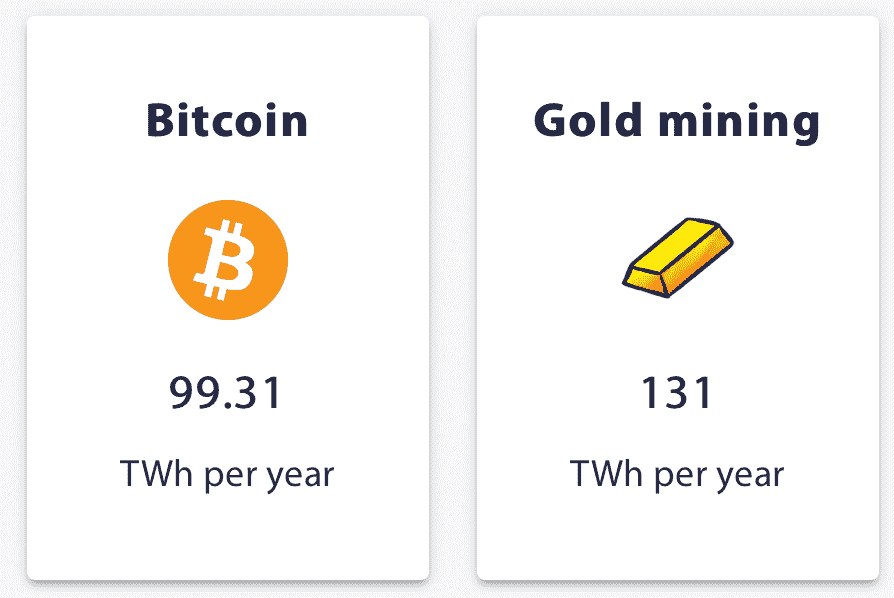

【https://cbeci.org/cbeci/comparisons 

“因此，证明利害关系的“一句话哲学”不是“安全来自燃烧的能源”，而是“安全来自提出经济损失价值”( *Buterin 2016* )。不是矿工使用物理资源的能量来保护区块链，利害关系的证明有验证器使用“合成资源”来保护区块链，通过在网络上“下注”或提交他们的硬币( *Hoskinson 2021* )。赢得区块的概率是由验证者拥有的股份比例决定的，而不是由它对网络的计算能力决定的。请参见下文，了解股权证明交易的基本概述。

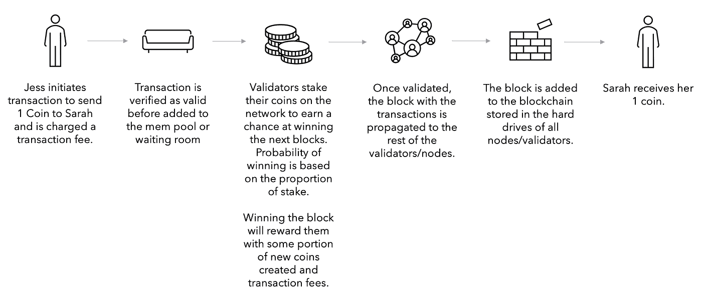

要求验证者把他们的硬币放在网络上的明显好处是，对网络的攻击会使他们自己的硬币贬值。比特币没有这种好处，因为矿工不需要拥有任何比特币。不同版本的利害关系证明有许多复杂之处，但是下面的分析将集中在协议的最基本属性上。在下面的场景中，有五个验证器或五组验证器，它们具有相等比例的赌注= 20%的硬币。因此，每个验证者有 20%的机会赢得下一个区块，并获得新硬币和交易费的区块奖励。

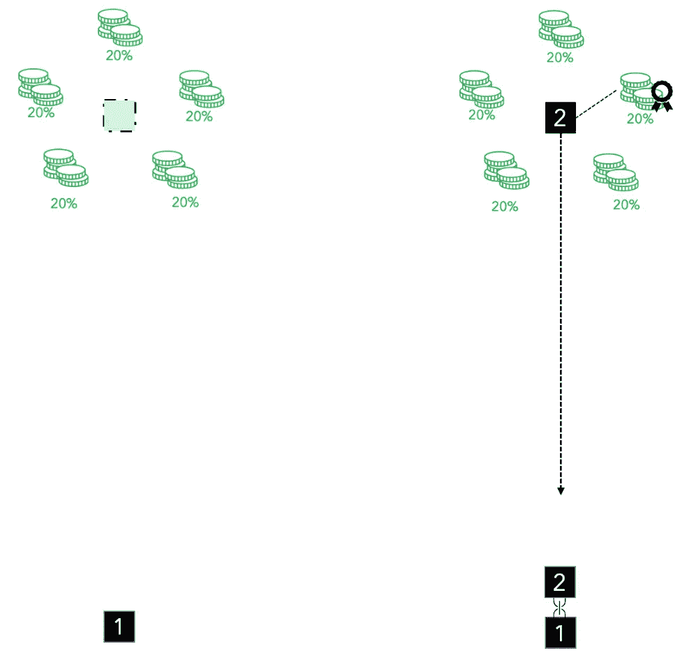

现在基础知识更清楚了，下一步是看攻击的不同版本。此分析将重点关注两种攻击—短程攻击和远程攻击。短程攻击是指任何不从链中的原始块开始创建新的块链的尝试。在**短程攻击期间，**攻击者试图操纵交易的顺序，就像攻击者在证明工作一样。

为了成功地创建最长的利益证明链，验证者必须接管超过 50%的网络。获取超过 50%的网络以证明利害关系是非常昂贵的，因为随着攻击者购买更多的硬币，价格将随着供应的减少和需求的增加而增加。当然，成本细节将根据当前价格和攻击中使用的筹码硬币的供应/需求而变化。

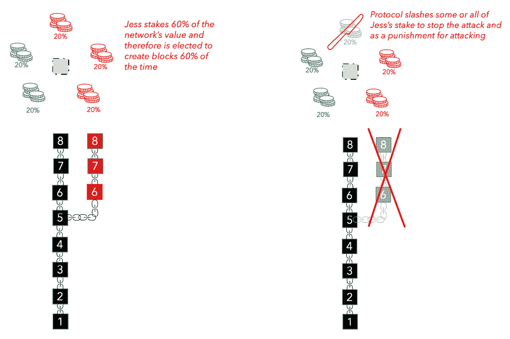

在这次短距离攻击中，Jess 控制了 60%的网络，并试图创建一个新的链。利益证明协议使用一种经济抑制手段来防止这种类型的攻击，“在利益证明共识中有一种内置的“削减”机制，通过这种机制，攻击者的大部分利益(而不是其他人的利益)可以自动销毁”( *Buterin 2020* )。玩家应该对攻击保持警惕，因为这会影响他们下注的硬币的价值。砍杀通过摧毁他们的硬币并结束攻击来进一步惩罚攻击者，因为攻击者不再拥有超过 50%的赌注硬币。

短程攻击背后的博弈理论非常简单，如下所述。该游戏的设置类似于工作证明游戏，两个玩家各有 26%的概率获得积木。对于短程攻击，砍杀减少了成功攻击的任何好处，最佳结果总是继续诚实验证。纳什均衡是双方都诚实，马希民策略也是诚实。

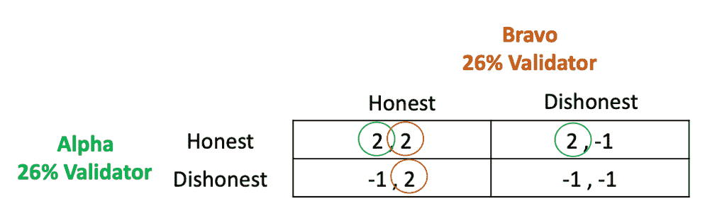

攻击的下一个版本叫做**远程攻击**，必须从区块链的原始街区开始。在这个场景中，Jess 回到最初的块，开始创建一个新的链，她的目标是使其比主链更长。“为了改变主链的历史，[Jess]必须生成更多数量的与主链平行的铸造块。但是，她受到一个事实的约束，即她有一个固定的机会产生块。为了增加与主链竞争的机会，她还需要能够伪造另一个验证器的模块。(*dei mind zoglou 2019*)。

在下图中，情况是 Jess 在链的开始处拥有 40%的赌注硬币，而 Rob 拥有 20%的硬币。因此，Jess 必须说服 Rob 加入攻击，这样她也可以伪造他的积木。说服 Rob 可能很困难，需要贿赂，或者 Rob 可能不再参与网络，并且可能在没有任何必要贿赂的情况下加入攻击。

如果 Jess 和 Rob 能够超越主链，他们的块和放在块中的事务从技术上讲将是最长和最可信的链。但是链会被信任吗？在主链上工作了几天、几个月甚至几年之后，网络中的验证者会简单地继续前进并接受改变吗？

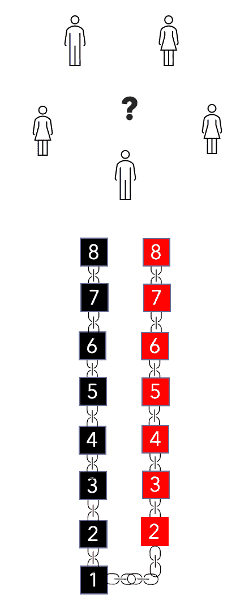

在所有这些验证计算机的背后是人类。他们不太可能接受新的链条。更有可能的是，他们会一起工作，以确保新的链不被接受，而是继续在原来的链上工作。因此，这样的攻击将被检测到，被识别为攻击，并且新的历史被拒绝。如果实现正确，这没有任何问题，除了它*改变了比特币的信任模型*。这是一种不同的共识，它可能以分散的方式在永远在线的对等体中形成，但取决于对新用户和暂时离线用户的信任。它相应地容易受到法律压力、对“可信”实体的攻击以及网络攻击”( *Poelstra 2015* )。

正如 Poelstra 所概述的，在议定书之外接受这种不同版本的共识的想法是有争议的。为了首先降低发生远程攻击的可能性，Proof Stake 社区的领导者和开发者已经开发了几种对策。其中三种对策是“移动检查点”、“密钥进化密码术”和“充足规则”( *Deirmentzoglou 2019* )。

“**移动检查点**背后的想法是，在可以重组的链的最新 *n* 个块上有一个配额”(*deimurzoglou 2019*)。尽管这确实会取消从起源块开始的能力，但它要求所有验证器现在信任检查点，而不是起源块。因此，攻击可以从检查点开始，并具有与远程攻击相同的基本原理，尽管要操作的块的数量会减少。**密钥进化密码术**在一定数量的块被添加到那些块的顶部之后，改变验证者用来创建块的密钥。对于 Jess 和 Rob 来说，他们将不再能够在链的开始处创建块，因为他们不再拥有正确的密钥。对于攻击者来说，绕过这种技术防御可能极其复杂，几乎不可能。充足法则**被用于大毒蛇的起源协议中，适用于卡尔达诺区块链。这个对策相当复杂，超出了本文的范围。简而言之，它使用链的密度来确定链的可信度。对于 Jess 和 Rob 的攻击，他们将只能从链的开始验证 60%的块，因为验证器随着链的建立而旋转。由于 40%的块不会被创建，攻击链不会“密集”,因此不会被信任。**

考虑到所有的漏洞和对策，远程攻击的博弈论收益矩阵看起来与工作证明中的非常相似。主要区别在于一次失败攻击的代价。因为不需要电力，失败的攻击不像工作证明那样昂贵。一些论文引用了“无成本模拟”的概念来证明利害关系，但是协调和/或发明新的对策总是需要时间的。攻击者也可能不得不付钱贿赂其他验证者。因此，攻击不是没有代价的，收益矩阵将失败攻击的收益标记为-0.5。

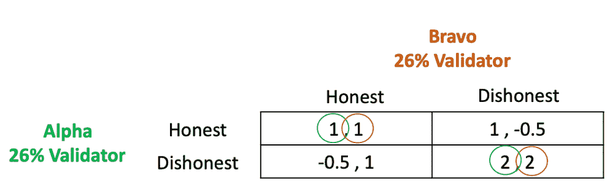

老实说，这里有两个纳什均衡，马希民策略是。所以下一步是看每个玩家需要相信对方什么来做出最好的决定。这就是工作证明和利害关系证明远程攻击之间的区别变得更加明显的地方。对于成功攻击的简化收益为 2，失败攻击的简化收益为-0.5 的基本情况，Alpha 需要相信 Bravo 至少有 40%的可能诚实。或者另一方面，她需要相信 Bravo 不诚实的可能性大于 60%。

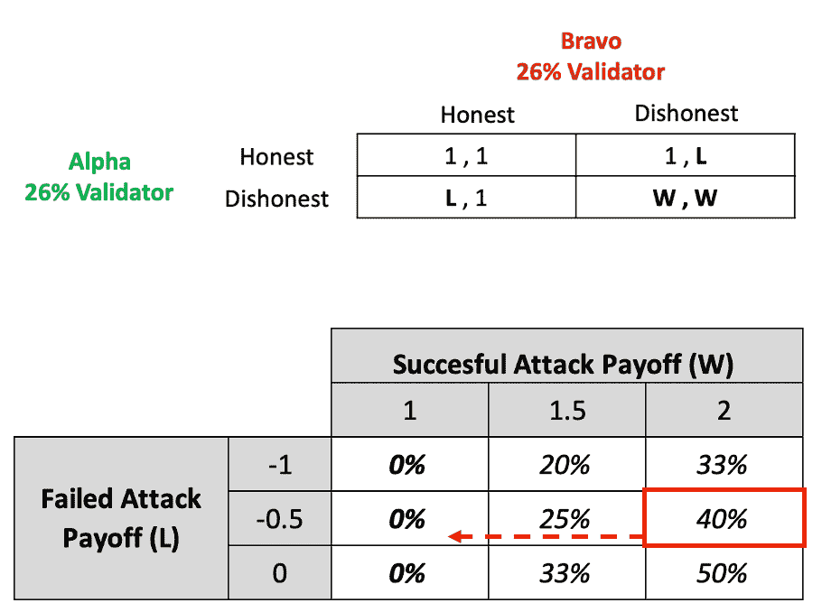

这种使用简化收益的基本情况不如工作证明(33%)乐观，但对策可能会使攻击成本更高或收益更低，从而降低成功和失败攻击的收益。在上面的敏感度表中，向左上方移动显示正确的对策可以将成功攻击的可能性降低到几乎为零。

基于短程和远程攻击的博弈理论分析，可以理解为什么像 Cardano、Algorand、币安链和 Cosmos 这样的大型股份链证明是非常安全的。在得出结论之前，在对安全性做出假设之前，查看一下赌注网络中硬币的分布是很重要的。每个链对于每个验证者可以下注多少有不同的规则，并且存在识别硬币所有者的问题，因为一个人可能有几个硬币钱包和/或他们下注硬币的几个验证池。理解分布的一个方法是看一下最初创造这个链条时硬币是如何分布的。与每个比特币都被开采的比特币不同，股权证明必须从硬币发行或首次发行(ICO)开始。下图比较了一些顶级硬币在诞生时的分布情况。这并不意味着硬币仍然以这种方式分配。

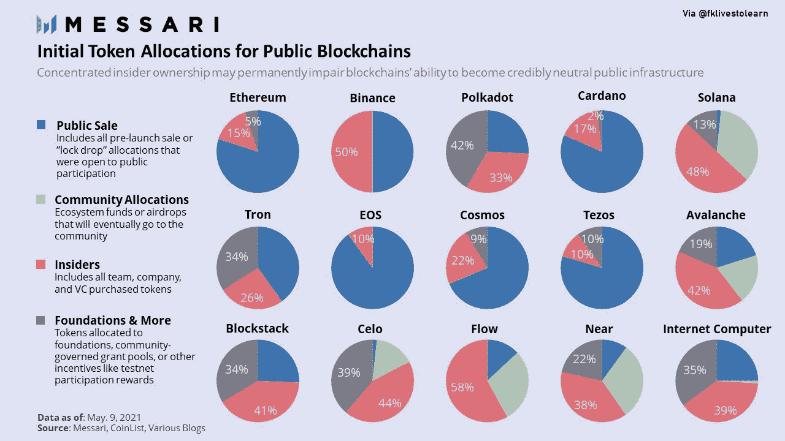

[https://medium . com/open-source-x/what-does-increated-insider-ownership-in-public-区块链-mean-97f8e9e50368](/open-source-x/what-does-increased-insider-ownership-in-public-blockchains-mean-97f8e9e50368)

像币安、索拉纳和雪崩这样的连锁店的“内部人”分配比例很高，这似乎违背了区块链的分权性质。“公开销售”也不是完美的，因为有些人有更多的资金和/或关于销售时间或在开盘时购买最多的信息。不管连锁店如何分配他们的硬币，在 ICO 期间有一个时刻，将允许一些玩家积累大量的硬币，用于立即或未来的攻击。赌注证明中的分配问题被进一步强化，因为下注最多硬币的人有更高的概率赢得更多硬币并增加他们的赌注份额。另一方面，利害关系证明避免了可能导致工作证明集中化的规模经济问题。在购买 ASICs 时，大型比特币矿业公司可能在市场上更具优势，因为它们能够以更低的单位成本购买更大数量的比特币。当“赌注证明”游戏中的玩家试图积累硬币时，他们需要在与小玩家相同的市场上购买，任何重大购买都会提高价格。

基于对利害关系共识协议证明的博弈论分析，成功的 51%攻击概率似乎非常低。就像比特币的矿工分布一样，在衡量安全风险时，也应该评估股份证明中的硬币分布。

**结论**

区块链是分布式账本&在所有参与者之间保持一致是困难的，但却是可以实现的。对前两个共识协议背后的博弈论的分析表明，工作证明和利益证明相对于 51%的攻击是相当安全的，因为三个不同的博弈论解决方案概念指出“攻击”不是最优策略。虽然这两种协议都可以提供安全性，但两者之间的一个关键区别是，证明利害关系的远程攻击不需要攻击者为工作证明这样的有形资源付费。

在两个协议的相对安全性中，一个重要的考虑因素是采矿或赌注的分布有多集中，因为分析表明，只有当攻击涉及少数参与者联合起来进行多数控制时，攻击才可能是最佳的。对于比特币来说，目前的分布需要四组或更多组矿工联合力量才能成功完成 51%的攻击，这将增加复杂性，并进一步降低攻击的可能性。为了证明赌注硬币，在使用链条或在链条上储存财富之前，分析区块链的硬币和赌注分布是很重要的。随着分布的扩大，越来越多的玩家需要在一次攻击中进行协作，就越有可能信任链的安全性。

有几种不同的方法来分析每种协议，从它们对环境的影响到它们扩展和支持不同用例的能力。本文中的任何内容都不应被视为投资建议或解释为对一种协议的明确支持。带着继续学习的目标，我欢迎任何有助于改进我的分析的反馈。

**参考文献**

*   【扎克·丘奇(2017)——《区块链，解说》[https://ide.mit.edu/insights/blockchain-explained/](https://ide.mit.edu/insights/blockchain-explained/)
*   **纳科莫托(2008)** 《比特币:一个点对点的电子现金系统》[https://bitcoin.org/bitcoin.pdf](https://bitcoin.org/bitcoin.pdf)
*   **BTC.com(2021)**BTC.com 的《矿池——比特币 BTC》[https://btc.com/btc/insights-pools](https://btc.com/btc/insights-pools)
*   **剑桥大学(2021a)** “剑桥比特币用电指数”【https://cbeci.org/cbeci/comparisons 
*   **剑桥大学(2021b)** “新数据揭示中国矿业外流时间线”[https://www . jbs . cam . AC . uk/insight/2021/New-Data-Reveals-Timeline-of-China-bit coin-Mining-Exodus/](https://www.jbs.cam.ac.uk/insight/2021/new-data-reveals-timeline-of-chinas-bitcoin-mining-exodus/)
*   **Vitalik Buterin (2016)** 《一个桩设计哲学的证明》[https://medium . com/@ Vitalik buter in/A-Proof-of-stage-Design-Philosophy-506585978 d51](/@VitalikButerin/a-proof-of-stake-design-philosophy-506585978d51)
*   **维塔利克·布特林(2020)** 【为什么要证明利害关系】维塔利克·布特林[https://vitalik.ca/general/2020/11/06/pos2020.html](https://vitalik.ca/general/2020/11/06/pos2020.html)
*   **查尔斯·霍金森(2021)** 《杰克的视频:战俘与战俘的对决》[https://www.youtube.com/watch?v=lMZ1xQzWtl4&t = 1239s](https://www.youtube.com/watch?v=lMZ1xQzWtl4&t=1239s)
*   **evangel OS Deirmentzoglou(2019)**“一项关于证明利害关系协议的远程攻击的调查”——其他作者有**圣乔治·帕帕基里亚科普洛斯、康斯坦丁诺斯·帕察基斯**[https://ieeexplore.ieee.org/stamp/stamp.jsp?arnumber=8653269](https://ieeexplore.ieee.org/stamp/stamp.jsp?arnumber=8653269)
*   **Andrew Poelstra (2015)** 《论利害关系与共识》[https://nakamotoinstitute . org/static/docs/On-Stake-and-Consensus . pdf](https://nakamotoinstitute.org/static/docs/on-stake-and-consensus.pdf)
*   **梅萨里(2021)** “区块链公开发行的初始代币”[https://medium . com/open-source-x/what-does-increated-insider-ownership-in-Public-区块链-mean-97f8e9e50368](/open-source-x/what-does-increased-insider-ownership-in-public-blockchains-mean-97f8e9e50368)

**推荐媒体**

*   “但比特币实际上是如何运作的？”由 3 蓝色 1 棕色[https://www.youtube.com/watch?v=bBC-nXj3Ng4&t = 1247s](https://www.youtube.com/watch?v=bBC-nXj3Ng4&t=1247s)
*   《投资者的播客网络:比特币基础》作者普雷斯顿·皮什——[https://www.theinvestorspodcast.com/bitcoin-fundamentals/](https://www.theinvestorspodcast.com/bitcoin-fundamentals/)特别是第 1 集(罗伯特·布里德洛夫)、第 9 集(吉米·宋)、第 14 集(马蒂·本特和哈里·苏多克)、第 22 集(亚当·贝克)
*   彼得·麦考马克的播客“比特币做了什么”——[https://www . whatbitcoindid . com/the-初学者比特币指南](https://www.whatbitcoindid.com/the-beginners-guide-to-bitcoin)特别是第一部分(安德里亚斯[安东诺普洛斯](https://www.whatbitcoindid.com/podcast/the-beginners-guide-to-bitcoin-part-1-andreas-m-antonopoulos-on-why-we-need-bitcoin))、第三部分(亚伦·范·维尔杜姆)、第四部分(斯蒂芬·利维拉)、第六部分(忍者)
*   "什么是利害关系的证明？"https://www.youtube.com/watch?v=psKDXvXdr7k 币安学院
*   莱克斯·弗里德曼播客:莱克斯·弗里德曼和维塔利克·布特林讨论[https://www.youtube.com/watch?v=3yrqBG-7EVE](https://www.youtube.com/watch?v=3yrqBG-7EVE)
*   IOHK Cardano 白板概述，Charles Hoskinson[https://www.youtube.com/watch?v=Ja9D0kpksxw](https://www.youtube.com/watch?v=Ja9D0kpksxw)
*   “以太坊 2.0:游戏改变者？桩的证明、信标链、分片、对接解释[https://www.youtube.com/watch?v=ctzGr58_jeI](https://www.youtube.com/watch?v=ctzGr58_jeI)

**推荐读物**

*   莱斯利·兰波特[https://lamport.azurewebsites.net/pubs/time-clocks.pdf](https://lamport.azurewebsites.net/pubs/time-clocks.pdf)的《时间、时钟和事件的顺序》
*   哈苏布·库雷希的《塞弗朋克》https://nakamoto.com/the-cypherpunks/
*   《主要共识协议及区块链分析》科学导读[https://www . Science Direct . com/Science/article/pii/s 240595951930164 x](https://www.sciencedirect.com/science/article/pii/S240595951930164X)
*   《走向真正的去中心化:基于博弈论和随机性的区块链共识协议》[http://web.cecs.pdx.edu/~nbulusu/papers/gamesec18.pdf](http://web.cecs.pdx.edu/~nbulusu/papers/gamesec18.pdf)
*   《博弈论与共识协议》作者阿斯特哈·克沙里亚博士[https://www . LinkedIn . com/pulse/Game-Theory-Consensus-Protocols-区块链-阿斯特哈-克沙里亚-ph-d-/](https://www.linkedin.com/pulse/game-theory-consensus-protocols-blockchain-astha-keshariya-ph-d-/)
*   了解区块链基础知识、拜占庭容错、工作证明和股权证明、圣乔治·孔斯坦托普洛斯委托的股权证明[https://medium . com/loom-network/understanding-区块链-Fundamentals-part-1-拜占庭容错-245f46fe8419](/loom-network/understanding-blockchain-fundamentals-part-1-byzantine-fault-tolerance-245f46fe8419)
*   https://www.hindawi.com/journals/scn/2020/8839047/[徐小龙博士的《区块链系统中的理性协议和攻击》](https://www.hindawi.com/journals/scn/2020/8839047/)
*   《什么是加密货币博弈论:基本介绍》作者[阿米尔·罗西克](https://blockgeeks.com/author/ameerrosic/)https://blockgeeks.com/guides/cryptocurrency-game-theory/
*   Nic Carter[https://medium . com/@ Nic _ _ Carter/its-the-Settlement-Assurances-Stupid-5 DC D1 C3 F4 e 4](/@nic__carter/its-the-settlement-assurances-stupid-5dcd1c3f4e41)
*   比特币实际消耗多少能量？Nic Carter[https://HBR . org/2021/05/比特币实际消耗多少能量](https://hbr.org/2021/05/how-much-energy-does-bitcoin-actually-consume)
*   以太坊白皮书—[https://ethereum.org/en/whitepaper/](https://ethereum.org/en/whitepaper/)
*   Cardano 白皮书— [https://why.cardano 或](https://why.cardano.org/) g
*   “利害攸关的证据:对 PoS 加密货币的掠夺性、破坏性攻击”，作者:Suhyeon Lee 和 seung joo Kim[https://dl.acm.org/doi/10.1145/3410699.3413791](https://dl.acm.org/doi/10.1145/3410699.3413791)