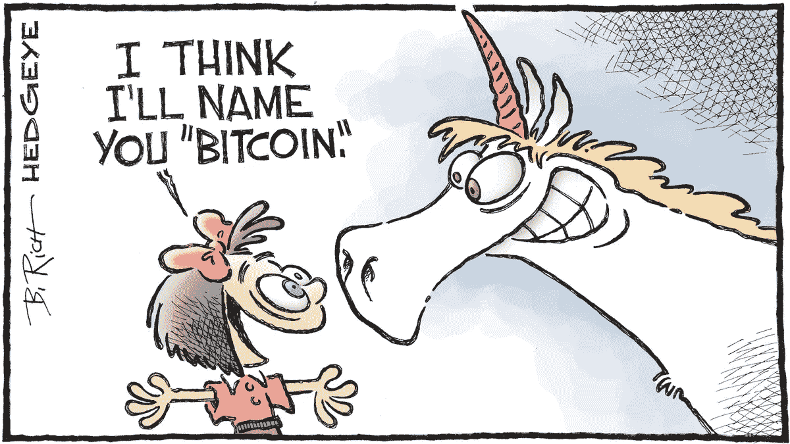
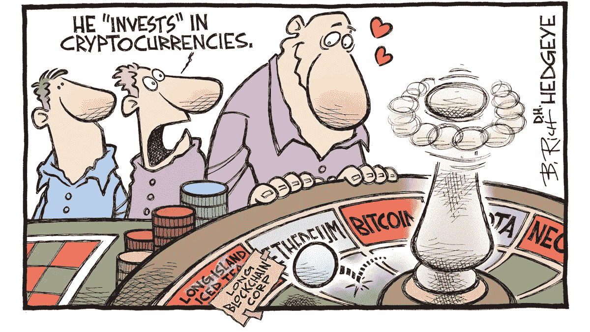
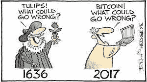

# 区块链和加密货币——你必须知道的

> 原文：<https://medium.com/coinmonks/blockchain-crypto-currencies-what-you-must-know-b23fa6bd9d85?source=collection_archive---------6----------------------->

嗨，伙计们，希望你们喜欢我们之前关于货币是如何创造的，谁控制着它，以及它通向股票市场的路线的讨论。在这次讨论中不能忽视的一些观察结果是……不管怎样，从长远来看……尽管经济不景气，股票市场将继续上涨。这在危机时期会更加明显，比如当前的冠状病毒疫情。我们也看到了政府和央行提供的经济救助计划之间的原因和联系，以及它如何进一步推动指数的增长。这个概念本身就很恐怖。全世界股票交易所指数的空前上升再次证明，它与现实世界没有联系，也没有反映该国的真实经济状况。这也暗示了其易受 SEBI 等监管机构眼皮底下少数强大金融机构操纵的脆弱性。这导致许多投资者寻找不受任何政府机构控制的替代品，因为他们担心有一天整个泡沫会破裂。由于现代货币没有任何实物资产与之相连…..它没有任何内在价值，因此必须接受它的表面价值。如果中央银行或政府搞砸了，它可以一下子抹去你的全部财富。因此，许多人将注意力转向投资传统手段，如黄金/白银或房地产，而许多新时代的技术娴熟的投资者正在探索数字货币或加密货币。

我们的许多年轻读者和投资者一直向我寻求投资加密货币的建议。在我开始讨论这个话题之前，让我总结一下，对我来说，任何创造财富的手段都是受欢迎的，只要它是合法的、干净的，并且它的风险回报比是有利的，但就我个人而言，到目前为止，我一直远离它。为什么？？？？让我们来看看……

2009 年 1 月，为了应对 2008 年的金融危机，一个化名为**中本聪**的神秘人创造了第一个加密货币比特币。不出所料，比特币的创造者中本聪在比特币持有者中排名第一，据估计他拥有约 100 万个比特币，相当于 2021 年约 349 亿美元……很酷…不是吗？？

从概念上讲，比特币是人们在不受银行或政府等中央机构干预的情况下，通过互联网汇款的一种方式。这种新的数字货币的功能与任何其他货币相同，但不受中央控制，因此不受政府操纵。为了实现这一点，它被创造为一种**去中心化的数字货币**,这种货币遵循中本聪在 2009 年出版的白皮书中提出的规则以及比特币的创造。像货币一样，这也没有任何内在价值，它的价值取决于需求和供给。随着越来越多的人对它感兴趣，它的需求和价格都在上升。我确信，和我一样，你也一定在想，为什么我不能创造更多呢？？？现在事情变得有趣了。它不能简单地在一台计算机上克隆或创建。由于本质上是去中心化的，存储比特币分类账的大多数节点都需要识别每一个条目。创建比特币)或从其他人处接收比特币，甚至是为支付商品和服务而进行交易。你看…..不可能创造任何假比特币或篡改其进入数字记录。比特币所基于的技术也随之发明，被称为**区块链**。

在**区块链模型**中，当有人请求任何交易时，它会立即被广播到整个点对点(P2P)网络，该网络由称为节点的计算机组成。这个节点网络将根据设定的算法验证交易。交易通过验证后，将与其他数据一起整理，为分类帐创建一个新的数据块。这个新的区块现在以一种永久且不能改变的方式被添加到现有的区块链中。目前，这看起来像是所有交易的一站式商店，存在信任问题，担心被操纵，或者只是担心记录被销毁或损坏。这看起来确实很神奇，难怪它在商业、法律、文档和金融交易中有如此多的应用。好吧…技术看起来不错，比特币的模型听起来……我应该投资它吗？？？？？？在此之前，让我们来看看，一个比特币值多少钱？？

如前所述，它没有任何内在价值…更有甚者，它本质上是虚拟的。因此，它的价值由著名的**需求和供给**法则决定。幸运的是，比特币的供应在创建之初就受到了定义第一枚比特币的规则的限制，因此，供应将永远小于需求。但是，这种攀升能持续多久，将取决于全球金融监管机构对它的接受程度，这些机构每隔一天就会改变立场。当它在 2010 年开始交易时，它的价值不到一美分，但令人费解的是，在 2010 年 7 月，它上涨到 0.08 美元左右，涨幅超过 300%。到第二年 4 月，它的交易价格为 1 美元，到 7 月跃升至 32 美元，然后在 2011 年 11 月再次跌至 2 美元。在大约十年的交易历史中，类似的模式不断出现。一些人估计，到 2030 年，其价值约为 50 万美元，许多人认为这是一个毫无价值的泡沫，类似于荷兰的郁金香种植或加州的淘金热。在包括印度在内的大多数国家，你不能用比特币购买食品或牛奶。许多国家完全支持它，如新加坡，许多国家小心翼翼地走着这条路，如欧洲国家和美国，还有一些国家强烈反对它，如中国。因此，在它被纳入一些法律框架之前，投资比特币或任何其他加密技术将仍然是投机性的，如果你是赌注的赢家，回报会非常高；如果你碰巧是价格赌注的输家，则会有无法衡量的痛苦，这就是我不投资比特币的原因。对于那些仍然想投资它的人，我的建议是根据拐点理论(支持——阻力),限制你的敞口，有耐心并低价买入(不要担心价格会到达有吸引力的区域),但任何时候都不要感情用事，因为它可能是明天的下一颗超新星，也可能像彗星一样消失，不幸的是，答案都在未来，当然目前还看不到。

这是一个有争议的话题。所有相信的人都不想听到任何反对密码的话，对于所有不相信的人来说，这只是一个证明区块链概念的实验，已经持续太久了。不管是什么，我想提醒大家小心他们的钱，尤其是在一个法律框架有限的虚拟世界中交易时。在下一篇博文中，我将尝试讲述印度投资者应该如何确保其在 Cryptos 的投资，以及其他加密初创公司的未来肯定迟早会争夺空间。

伙计们，像往常一样，了解一个创造财富的新概念是非常令人满意的。你对此有什么看法……请留下你的评论和建议。请不要忘记与和**一样**分享**岗位，并在离开前点击**跟随**按钮。下周再见。**

> 加入 Coinmonks [电报频道](https://t.me/coincodecap)和 [Youtube 频道](https://www.youtube.com/c/coinmonks/videos)了解加密交易和投资

## 另外，阅读

*   [尤霍德勒 vs 科恩洛 vs 霍德诺特](/coinmonks/youhodler-vs-coinloan-vs-hodlnaut-b1050acde55a) | [Cryptohopper vs 哈斯博特](https://blog.coincodecap.com/cryptohopper-vs-haasbot)
*   [币安 vs 北海巨妖](https://blog.coincodecap.com/binance-vs-kraken) | [美元成本平均交易机器人](https://blog.coincodecap.com/pionex-dca-bot)
*   [新加坡十大最佳加密交易所](https://blog.coincodecap.com/crypto-exchange-in-singapore) | [购买 AXS](https://blog.coincodecap.com/buy-axs-token)
*   [投资印度的最佳密码](https://blog.coincodecap.com/best-crypto-to-invest-in-india-in-2021) | [HitBTC 评论](/coinmonks/hitbtc-review-c5143c5d53c2)
*   [加拿大最好的加密交易机器人](https://blog.coincodecap.com/5-best-crypto-trading-bots-in-canada) | [赌注加密](https://blog.coincodecap.com/staking-crypto)
*   [如何在印度购买比特币？](/coinmonks/buy-bitcoin-in-india-feb50ddfef94) | [WazirX 评论](/coinmonks/wazirx-review-5c811b074f5b)
*   [比特币主根](https://blog.coincodecap.com/bitcoin-taproot) | [Bitso 评论](https://blog.coincodecap.com/bitso-review) | [排名前 6 的比特币信用卡](/coinmonks/bitcoin-credit-card-bc8ab6f377c6)
*   [最佳免费加密信号](https://blog.coincodecap.com/free-crypto-signals) | [YoBit 评论](/coinmonks/yobit-review-175464162c62) | [Bitbns 评论](/coinmonks/bitbns-review-38256a07e161)
*   【Huobi 的加密交易信号 | [BitMEX 评论](https://blog.coincodecap.com/bitmex-review)
*   [7 个最佳零费用加密交易平台](https://blog.coincodecap.com/zero-fee-crypto-exchanges)
*   [分散交易所](https://blog.coincodecap.com/what-are-decentralized-exchanges) | [比特 FIP](https://blog.coincodecap.com/bitbns-fip) | [Pionex 审查](https://blog.coincodecap.com/pionex-review-exchange-with-crypto-trading-bot)
*   [用信用卡购买密码的 10 个最佳地点](https://blog.coincodecap.com/buy-crypto-with-credit-card)
*   [OKEx 评论](/coinmonks/okex-review-6b369304110f) | [Kucoin 交易机器人](/coinmonks/kucoin-trading-bot-automate-your-trades-8cf0ca2138e0) | [期货交易机器人](/coinmonks/futures-trading-bots-5a282ccee3f5)
*   [AscendEx Staking](https://blog.coincodecap.com/ascendex-staking)|[Bot Ocean Review](https://blog.coincodecap.com/bot-ocean-review)|[最佳比特币钱包](https://blog.coincodecap.com/bitcoin-wallets-india)
*   [霍比审核](https://blog.coincodecap.com/huobi-review) | [OKEx 保证金交易](https://blog.coincodecap.com/okex-margin-trading) | [期货交易](https://blog.coincodecap.com/futures-trading)
*   [Godex.io 审核](/coinmonks/godex-io-review-7366086519fb) | [邀请审核](/coinmonks/invity-review-70f3030c0502) | [BitForex 审核](https://blog.coincodecap.com/bitforex-review)
*   [Crypto.com 费用](/coinmonks/binance-fees-8588ec17965) | [Botcrypto 审查](/coinmonks/botcrypto-review-2021-build-your-own-trading-bot-coincodecap-6b8332d736c7) | [替代方案](https://blog.coincodecap.com/crypto-com-alternatives)
*   [有哪些交易信号？](https://blog.coincodecap.com/trading-signal) | [Bitstamp vs 比特币基地](https://blog.coincodecap.com/bitstamp-coinbase) | [买索拉纳](https://blog.coincodecap.com/buy-solana)
*   [ProfitFarmers 回顾](https://blog.coincodecap.com/profitfarmers-review) | [如何使用 Cornix Trading Bot](https://blog.coincodecap.com/cornix-trading-bot)
*   [MXC 交易所评论](/coinmonks/mxc-exchange-review-3af0ec1cba8c) | [Pionex vs 币安](https://blog.coincodecap.com/pionex-vs-binance) | [Pionex 套利机器人](https://blog.coincodecap.com/pionex-arbitrage-bot)