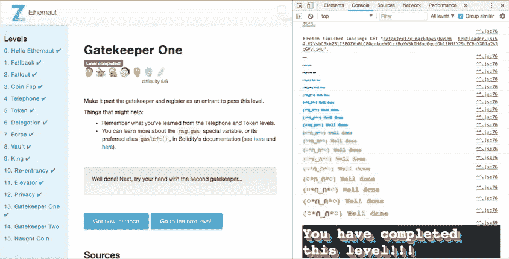

# 区块链 CTF 报道:Ethernaut GatekeeperOne 级别

> 原文：<https://medium.com/coinmonks/blockchain-ctf-write-up-ethernaut-gatekeeperone-level-49f8d0a0528b?source=collection_archive---------9----------------------->

你可能知道，Open Zeppelin 推出了一个名为 [Ethernaut](https://ethernaut.zeppelin.solutions/) 的区块链 CTF，这真的很神奇。不同的级别有不同的复杂程度，但我都喜欢。这也是一个开源倡议，这是一个优势。

我决定写下一些仍然没有记录的级别，以便帮助更多的人了解区块链安全，或者至少可以更好地了解区块链技术的一些构建模块。

这一次，我来描述一下“ **GatekeeperOne** 的水平。

在这个关卡中，你会得到一个区块链智能合同*实例*以及用 solidity 编写的代码。

目标是“进入”网关守护设备，这意味着正确并完全执行“进入功能”:

GatekeeperOne Smartcontract code of delivered instance to hack

快速浏览代码后，我们必须猜测要作为参数传递给函数的“_gateKey”，同时破解 3 个修饰符(gateOne、gateTwo 和 gateThree 安全检查)。一旦我们得到它，enter 函数将简单地将 tx.origin(我们的钱包)指定为进入者，但只有在同一个调用中满足所有条件时才会发生。

gateOne modifier code

**gateOne** 修改器很容易黑掉，我们只需要创建一个[恶意 smartcontract](https://github.com/rriescog/Ethernaut-CTF/blob/master/GatekeeperOnesol.sol) 来代表调用 GatekeeperOne smartcontract，那样的话 msg.sender 将是我们的恶意 smartcontract 地址，tx.origin 将是我们的 metamask 钱包地址。

gateTwo modifier code

gateTwo 修改器更难破解。在这种情况下，修饰符的代码要求在评估条件的堆栈执行的特定时刻“gas left”，msg.gas 必须正好是“8191”的整数倍(%表示“mod”)。

为此，我决定从 Javascript VM 环境开始调试，以便检查在区块链事务中需要发送的“气体”的确切数量，以便在堆栈执行的确切点满足这样的条件。

Remaining “Gas” Debugging to get a multiple value of 8191 (need to open instruction set / assembly)

调试时，您将在“步骤细节”部分看到剩余气体。我使用 REMIX IDE 作为一个强大的 IDE 工具/环境。

因此，smartcontract 需要传递的“气”的确切数量，就是调用中的 **32979** 。

gateThree modifier code

**gateThree** 修改器需要一个名为 **"_gateKey"** 的参数，我们必须猜测。由于所有的条件都必须同时满足，我们在函数中看到了有趣的逻辑。

在最后一行代码中， *_gateKey 依赖于 tx.origin* ，这意味着您将拥有一个与我不同的 _gateKey。我会解释你应该做的过程，但请记住，你将有一个不同的 _gateKey，因为它依赖于 tx.origin(交易的起点，你的钱包)。

请记住，msg.sender 将是恶意的 smartcontract 地址，而 tx.origin 将是您的(元掩码)钱包。

首先，检查你的钱包地址。

第二，如果 **uint32(_gateKey)** 必须等于 **uint16(tx.origin)** ，同时 **uint32(_gateKey)** 必须等于 **uint16(_gateKey)** ，这意味着您必须屏蔽您的钱包地址(tx.origin)多达 32 位(通过填充 0)。

这可以通过一个简单的

***‘a&b’***

操作，其中“a”是您的“tx.origin”地址,“b”是一个类似

***' bytes 8 public mask = 0x ffffffff 0000 ffff '***

您还可以通过使用在线转换器(如[scadacore.com](https://www.scadacore.com/tools/programming-calculators/online-hex-converter/))来检查 uint32、uint 16 和任何其他替代操作。请注意，你将不得不与**【大端】**价值观一起工作。

第三，由于第三个条件是 **uint32(_gateKey)** 必须**不同(！=)** 从 **uint64(_gateKey)，我们只填充了 32 位(见上面掩码中的 0)，其余的，将保持 tx.origin 位不变。**

Gatekeeperhack Smartcontract

综上所述，我创建了上面的**恶意 smartcontract** 命名为**“Gatekeeperhack”**作为代理契约来代表我调用实例化的 GatekeeperOne。

变量 **"target"** 通过打开 **Ropsten 区块链测试网**中的 zeppelin 链接到真实实例(您必须用您的 ropsten ethernaut 实例地址替换“在此复制您的 ETHERNAUT 实例地址”)。

提供的面膜对你完全有用。

我使用低级别的**【调用】**来更好地控制**气体通过**(记住上面的 gateTwo)，不要忘记，在这种情况下，远程调用一个远程函数契约，将迫使您使用:

> **'bytes4(sha3("函数名(参数类型)"))，参数值'**

注意:由于 *sha3* 已被弃用，建议您使用 *keccak256* 代替。

enter function debugging when it is hacked :)

最后但同样重要的是，当关卡完成时，你会收到一些建议！

GatekeeperOne level completed!

我希望你和我一样喜欢这个级别。

最后但同样重要的是，[代码可以在 Github](https://github.com/rriescog/Ethernaut-CTF/blob/master/GatekeeperOnesol.sol) 获得。

祝好运和**快乐黑客**！