# 区块链 CTF 报道:Ethernaut GatekeeperTwo 级别

> 原文：<https://medium.com/coinmonks/blockchain-ctf-write-up-ethernaut-gatekeepertwo-level-bbde5c860a9d?source=collection_archive---------5----------------------->

## 第二部分

是的，第二关比以太人 CTF 的第一关更复杂更有挑战性。

我建议你在继续阅读这篇文章之前，先看看 [GatekeeperOne level 的文章](/coinmonks/blockchain-ctf-write-up-ethernaut-gatekeeperone-level-49f8d0a0528b)。

这一次，我将描述“ **GatekeeperTwo** 的水平。

在这个关卡中，你会得到一个区块链智能合同*实例*以及用 solidity 编写的代码。

目标是“进入”GatekeeperTwo，这意味着正确并完全执行“输入功能”:

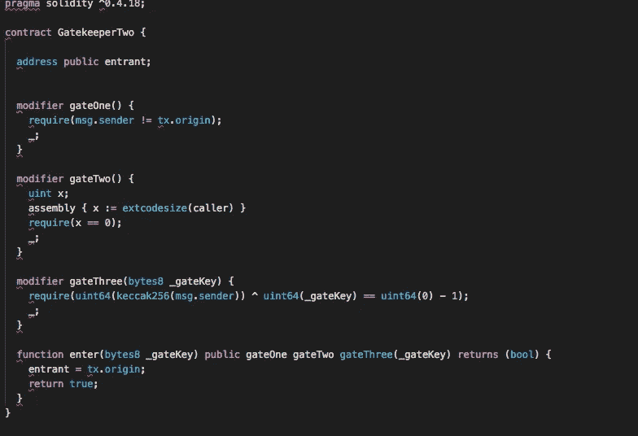

GatekeeperTwo source code of delivered instance to hack

同样，正如 GatekeeperOne 所发生的那样，如果您看一下代码，我们将不得不再次猜测一个新的“_gateKey”作为参数传递给“enter”函数，同时破解新的(和不同的)3 修饰符(gateOne、gateTwo 和 gateThree 安全检查)。

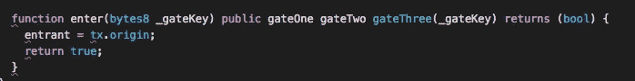

“enter” function that we have to exploit with its 3 gateX (X=One,Two,Three) modifiers

一旦我们得到它，就像 GatekeeperOne smartcontract 发生的那样，enter 函数将简单地将 tx.origin(我们的钱包)指定为进入者，但只有在同一个调用中满足所有条件时才会发生。

**与 GatekeeperTwo 中的 GatekeeperOne 有什么区别？**

主要的区别来自于 gateTwo 和 gateTwo 修饰符。

gateOne 与 [GatekeeperOne 的](/coinmonks/blockchain-ctf-write-up-ethernaut-gatekeeperone-level-49f8d0a0528b)如你所见完全相同:

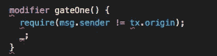

gateOne modifier code

如果你记得的话，这个障碍很容易克服。我们只需要创建一个恶意的 smartcontract，它将代表我的钱包远程调用 enter 函数。

**为什么 GatekeeperTwo 比 GatekeeperOne 级别复杂？**

它确实比以前的 GatekeeperOne 更复杂。让我们详细地看一下**门二**和**门三**以便你能理解这个陈述。

如果你看到 **gateTwo** :

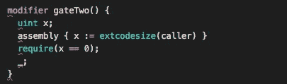

gateTwo modifier code

你有没有注意到一些奇怪的事情？

是的，[内联汇编调用](http://solidity.readthedocs.io/en/v0.4.24/assembly.html)在 solidity 源代码中与其余代码混合是可能的。在这种类型的调用中要小心，因为所有相关的验证(数组长度检查，以避免越界检查等等..)将不会被考虑。

但是，真正奇怪的是，如果我们检查“ **extcodesize** 条件的含义，那就意味着调用者(恶意)smartcontract **的**代码大小**需要为零作为条件**！！！！

我们如何才能让它成为可能？

我们的**恶意 Smartcontract 大小**会一直在 0 以上不是吗？

**有例外吗？**:是的。

**如何？**代码大小会在 0 以上，除非我们让所有发生(远程“回车”调用利用) ***在我们恶意 smartcontract 的构造函数里面！这意味着，恶意的 smartcontract 将在部署时自动利用漏洞。之后，它将具有 extcodesize =真实代码大小。***

那好吧。**我们必须在构造函数代码逻辑**中插入我们的远程函数调用(恶意的 smartcontract 调用要被黑客攻击的实例 smartcontract 的 enter 函数)**。**

但是，【gateThree 安检呢？

像 gateOne 和 gateTwo 一样，gateThree 只有一次被黑客攻击的机会，而且是在恶意的 smartcontract 被部署时。

让我们看看 **gateThree 修改器的代码**:

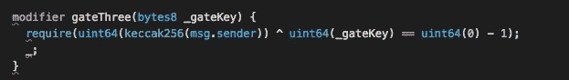

gateThree modifier code

**_gateKey 又是“回车”功能的一个参数。**

你注意到要满足的条件中的某些东西了吗？

没错，就是一个**下溢情况！**

```
uint64(0) — 1
```

**将导致 FFFFFFFFFFFFFF**

因此，我们将不得不强制一个**下溢条件**:

```
uint64(keccak256(msg.sender)) ^uint64(_gateKey)
```

但是现在开始了…

msg.sender 将是我们的**恶意 smartcontract 地址，但它将在部署时被动态分配。**

如果变量是在部署时赋值的，而同时我们只有一次机会(一次尝试)在构造函数中破解它，我们怎么能满足这样的条件呢？:)

这是棘手的部分，它也可以是可能的！！

为了更好地理解它，让我向您展示我为这个一次性利用编写的 [**恶意 smartcontract 代码**](https://github.com/rriescog/Ethernaut-CTF/blob/master/Gatekeepertwosol.sol) **，它与 GatekeeperOne 稍有不同并且更复杂，但是如果您已经阅读过以前的案例，您将会对这个新代码有更好的理解:**

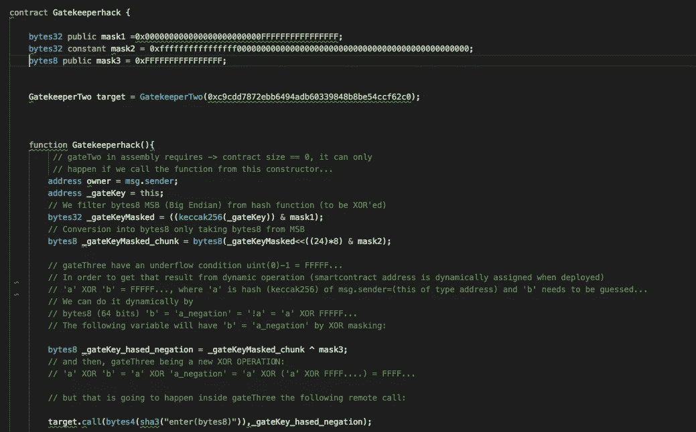

Malicious Smartcontract to exploit / hack GatekeeperTwo level

首先，我们将通过使用**“this”变量**来控制动态 smartcontract 分配地址。

正如你所看到的，所有的逻辑都在“**构造函数**的内部:

**函数 Gatekeeperhack()** { …}

我们需要产生一个下溢条件，然后，我们将计算 **"_gateKeyMasked"** 过滤 big endian MSB (8 字节— 64 位)**。**

“ **_gateKeyMasked_chunk** ”表示有趣的片段——就这 8 个字节(bytes8 类型)。

又来了**【魔】** : ('^'的意思是异或运算)

如果你想有一些像

**‘a’异或‘b’= FFFFF…(下溢)**(见 gateThree 修改码)，

存在

**‘a’= keccak 256(此)**；

然后

**‘b’必须是=‘a _ negation’**，

在哪里

**' a _ negation ' = ' a ' XOR ' FFFF…'**

我将变量 **'_gateKey_hashed_negation '，**命名为**将基于“a”的取反进行动态计算，这依赖于 msg.sender，即依赖于恶意 smartcontract 在部署过程中“动态”分配的地址…:)**

如果我们将这个**字节 8** 变量作为一个**参数传递给“enter”函数的远程调用，我们将进行异或运算**

**'a '异或' a _ 求反'**

这将导致“FFF……”等于 uint64(0)-1，也是“FFF…”

是的， ***一切都需要在部署恶意 smartcontract 时发生，一切都要同时动态计算和分配&调用！！！***

***它有点像“一次性破解”:)***

同样，我使用了 REMIX IDE 调试，这里我向您展示了该过程不同部分的一些截图(请记住，调试已在 Javascript VM 环境下完成，但利用将在区块链 ropsten testnet 网络中完成):

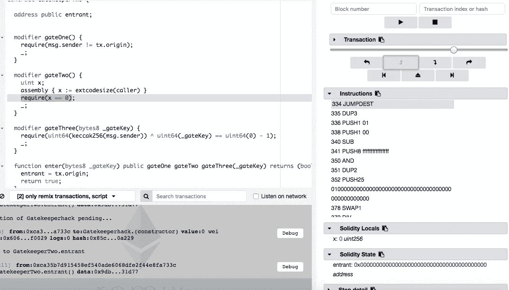

gateTwo-> extcodesize == 0 ! (debug: JUMPDEST)

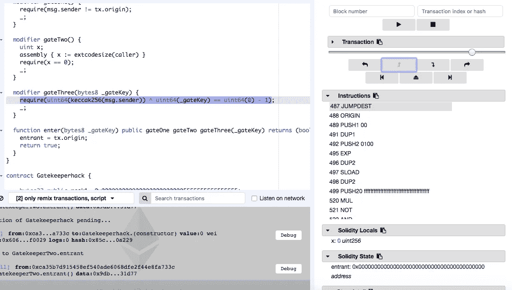

successful gateThree hack (debug: JUMPDEST instruction)

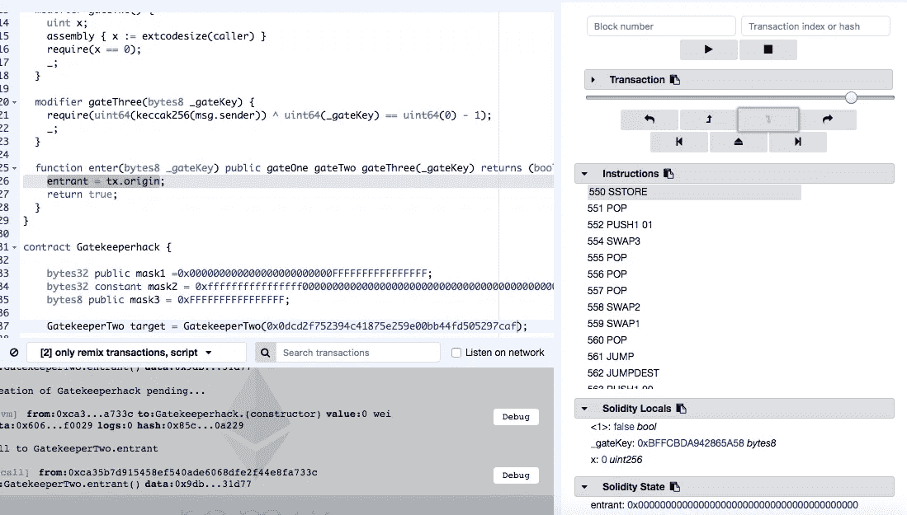

“entrant” variable re-assigned to our wallet (debug: SSTORE instruction)

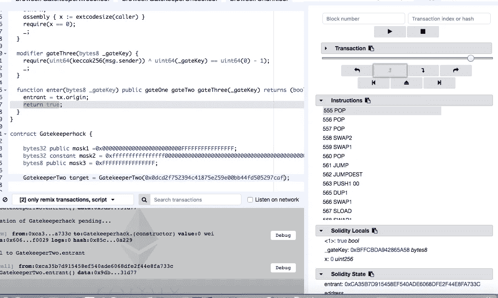

“True” returned after successful execution of enter function!

综上所述，y **你将不得不在 Ropsten 测试区块链网络内部部署恶意的 smartcontract，其中被黑客攻击的 Smartcontract 实例是**；然后，当 ropsten tesnet network 部署它时，您将动态地自动利用/入侵它:)

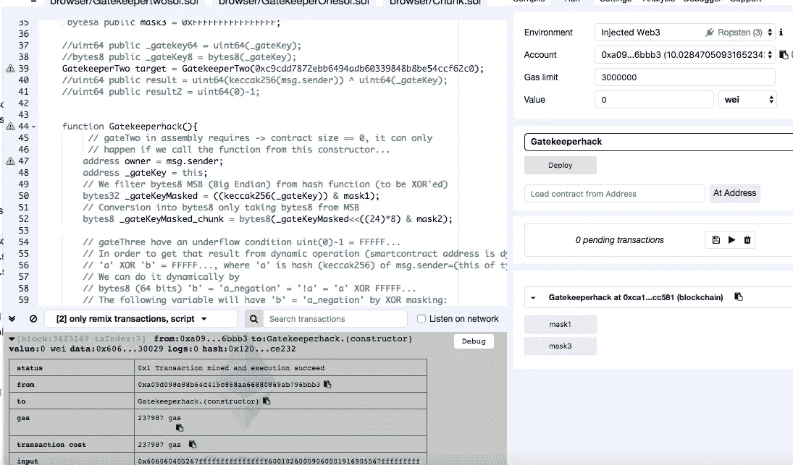

Deploying Malicious Smartcontract while automatic exploitation is taking place

和往常一样，当关卡完成时，Open Zeppelin 总会给你一些建议:

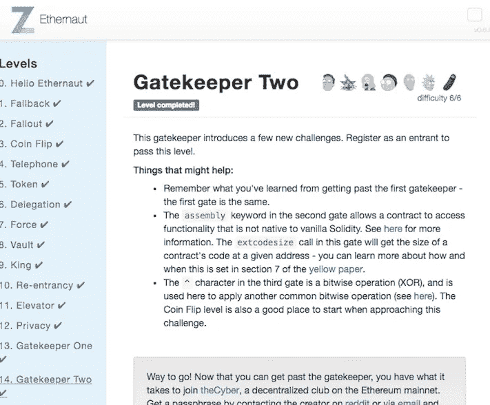

GatekeeperTwo Level complete

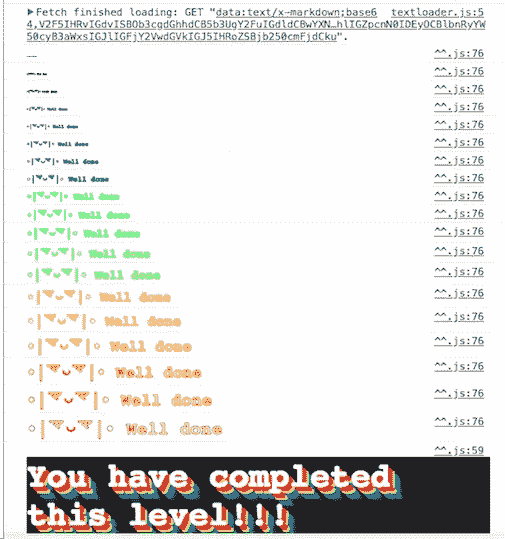

GatekeeperTwo Level complete

通过使用 web 控制台(开发工具)，您还可以在实例仍在区块链中运行时检查变量状态。在此，我们检查利用前后“**入口变量**”是否已成功更新为元掩码钱包地址(tx.origin):

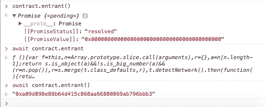

entrant variable in ropsten blockchain network before and after the exploitation!

我希望您已经喜欢并理解了 GatekeeperOne 和 GatekeeperTwo 级别之间的差异。

最后但同样重要的是，[这个漏洞利用 smartcontract 的代码可以在 Github](https://github.com/rriescog/Ethernaut-CTF/blob/master/Gatekeepertwosol.sol) 中找到。

**祝好运，黑客快乐！**