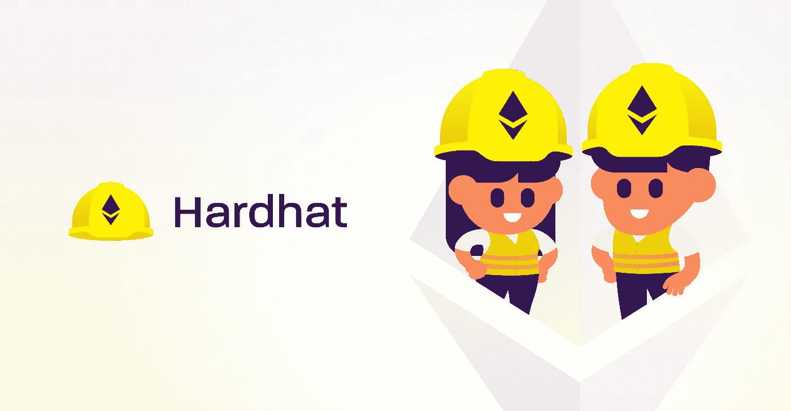
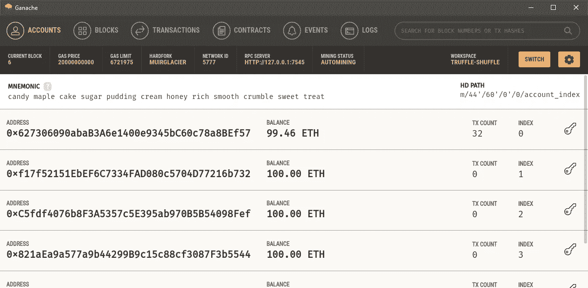
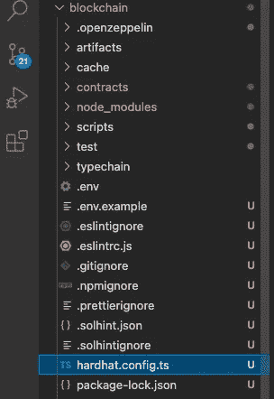
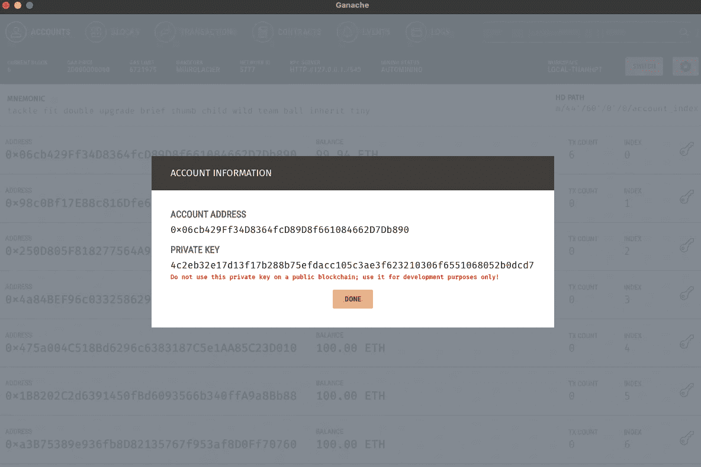
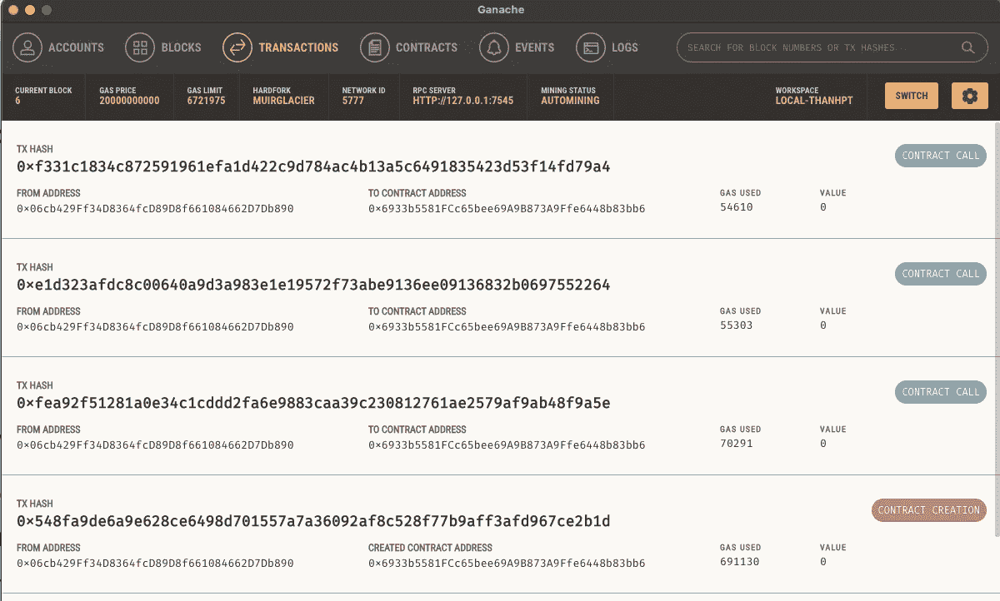
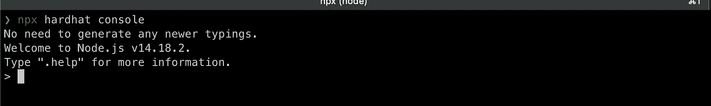

# 区块链:第一天——环境设置

> 原文：<https://medium.com/coinmonks/blockchain-day-1-environment-setup-4b2ed581cc99?source=collection_archive---------0----------------------->



# 概观

在研究区块链技术及其应用的过程中，我决定将我的日常经验记录下来，与其他像我一样的开发人员分享，这是开发一个分散式应用的第一步。在本系列中，我不深入研究构建区块链的概念，这是非常困难的，我宁愿只分享有用的开发经验。既然我们步调一致，就让我们开始吧。

# 设置开发环境

正如您已经知道的，我们的区块链应用程序将由一组智能合同组成。要编写智能合约，我们当然需要学习智能合约编程语言，但谈论它们的细节不在本文的范围内，所以让我分享一些关键词，你可以从它们开始:

*   [坚固度](https://docs.soliditylang.org/en/v0.5.13/index.html)
*   [威普](https://vyper.readthedocs.io/en/stable/)
*   锈
*   java 描述语言
*   [游](https://docs.soliditylang.org/en/v0.8.11/yul.html)

其中，Solidity 似乎是最广为人知的一个，我们将在整个系列中使用 Solidity 作为编程语言来构建我们的智能合约。

> Solidity 是一种面向对象的高级语言，用于实现智能合约。它受 C++、Python 和 JavaScript 的影响，设计目标是以太坊虚拟机(EVM)。

## 开发环境

对于开发环境，我们有一些令人惊奇的选项值得一试:

*   [松露](https://trufflesuite.com/index.html)
*   [安全帽](https://hardhat.org)
*   [布朗尼](https://eth-brownie.readthedocs.io/en/stable/)
*   [混音](https://remix.ethereum.org/)

> 需要注意的是，Remix 是一个带有直观图形用户界面的 IDE，而其他的则没有。它加快了开发周期，并拥有丰富的插件。这是一个开始我们整个合同开发之旅的好地方，也是一个学习和教授以太坊的游乐场。

我尝试了松露和安全帽(不是布朗尼，因为我不熟悉 Python)，但在这篇文章中，我将与你分享安全帽的设置步骤。块菌的设置开发环境将在另一篇文章中讨论。

## **安全帽介绍**

Hardhat 是一个编译、部署、测试和调试以太坊软件的开发环境。它帮助开发人员管理和自动化构建智能合约和 dApps 过程中固有的重复性任务，并围绕该工作流轻松引入更多功能。这意味着在核心处编译、运行和测试智能合约。

智能合同在最大程度上可以被认为是“后端”,它将处理某种业务逻辑，当然我们需要一个前端应用程序来帮助我们与智能合同进行交互。对于前端，我将使用以下代码

*   VueJS
*   web3.js

**节点安装**

因为我们所有的工具都基于 NodeJS，所以我们需要在本地安装 NodeJS。我更喜欢使用`[nvm](https://github.com/nvm-sh/nvm)`,因为它帮助我非常容易地管理和切换节点版本。由于使用 MacOS，安装 nvm 非常简单

```
$brew update
$brew upgrade
$brew install nvm
```

我们的一些工具在最新版本的 Node 上不能很好地工作，所以我建议您应该从使用 Node v14.18.2 (lts/fermium)开始:

```
$nvm install lts/fermium
$nvm alias default lts/fermium
$nvm use default 
```

> 使用前记得检查节点版本:`node --version`

**vue-cli 安装**

安装 vue-cli 是可选的，但我也建议，因为我们在许多其他项目中使用 vue，vue-cli 将提供一个问候帮助

```
npm install -g @vue/cli
# OR
yarn global add @vue/cli
```

**初始化我们的项目:**

让我们从创建第一个项目开始:

```
$vue create hello-blockchain 
$cd hello-blockchain 
$mkdir blockchain 
$cd blockchain 
$npm init
```

我们首先使用 vue-cli 创建一个 Vue 项目。Vue CLI 将询问我们几个问题，以便它可以为我们配置前端项目。然后我们创建一个名为`blockchain`的子文件夹，并使用`npm`初始化它。`blockchain`文件夹将是存放我们所有智能合同开发的地方。由于我们要将 hardhat 作为构建智能合同的开发环境，我们需要安装 hardhat:

```
$npm install --save-dev hardhat
OR
$yarn add --dev hardhat
```

在安装 Hardhat run 的同一目录中:

```
$npx hardhat
888    888                      888 888               888
888    888                      888 888               888
888    888                      888 888               888
8888888888  8888b.  888d888 .d88888 88888b.   8888b.  888888
888    888     "88b 888P"  d88" 888 888 "88b     "88b 888
888    888 .d888888 888    888  888 888  888 .d888888 888
888    888 888  888 888    Y88b 888 888  888 888  888 Y88b.
888    888 "Y888888 888     "Y88888 888  888 "Y888888  "Y888

Welcome to Hardhat v2.8.0

? What do you want to do? …
  Create a sample project
  Create an advanced sample project
❯ Create an advanced sample project that use TypeScript
  Quit
```

我建议从一个`advanced sample project that use TypeScript`开始。Hardhat 也会问我们一些简单的问题来帮助我们初始化我们的第一个项目。当初始化过程完成后，我们可以快速了解什么是可用的以及正在发生什么，在我们的项目文件夹`blockchain`中运行`npx hardhat`:

```
❯ npx hardhat
Hardhat version 2.8.0Usage: hardhat [GLOBAL OPTIONS] <TASK> [TASK OPTIONS]GLOBAL OPTIONS:--config            A Hardhat config file.
  --emoji             Use emoji in messages.
  --help              Shows this message, or a task's help if its name is provided
  --max-memory        The maximum amount of memory that Hardhat can use.
  --network           The network to connect to.
  --show-stack-traces Show stack traces.
  --tsconfig          A TypeScript config file.
  --verbose           Enables Hardhat verbose logging
  --version           Shows hardhat's version.AVAILABLE TASKS:accounts           Prints the list of accounts
  check              Check whatever you need
  clean              Clears the cache and deletes all artifacts
  compile            Compiles the entire project, building all artifacts
  console            Opens a hardhat console
  coverage           Generates a code coverage report for tests
  flatten            Flattens and prints contracts and their dependencies
  gas-reporter:merge
  help               Prints this message
  node               Starts a JSON-RPC server on top of Hardhat Network
  run                Runs a user-defined script after compiling the project
  test               Runs mocha tests
  typechain          Generate Typechain typings for compiled contracts
  verify             Verifies contract on EtherscanTo get help for a specific task run: npx hardhat help [task]
```

**当地区块链网络**

当我们完成智能合约的开发后，我们将在真实网络中部署它们，但从现在到这一步还有很长的路要走。我们首先需要开发我们的智能合同，并在以下方面非常仔细地测试其功能:

*   本地区块链网络
*   测试目的网络(又名 TestNet，如 Ropsten、Rinkeby 或 Kovan)

这两种网络的不同之处在于，前者存在于我们的个人电脑中，而后者实际上是分散的，这形成了一个`staging environment.`多么幸运的是，hardhat 内置了 Hardhat Network，这是一个为开发而设计的本地以太网节点。选择 Hardhat 时，默认使用 Hardhat 网络，它也可以独立运行，以便外部客户端可以连接到它。这可能是元掩码、您的 Dapp 前端或脚本。要以这种方式运行 Hardhat Network，请运行:

```
$npx hardhat node
```

因为某些原因，我把心交给了 [Ganache](https://trufflesuite.com/ganache/) 。 [Ganache](https://trufflesuite.com/ganache) 是一款用于快速以太坊和 Corda 分布式应用开发的个人区块链。您可以在整个开发周期中使用 Ganache 使您能够在安全确定的环境中开发、部署和测试 dApps。

Ganache 有两种风格:UI 和 CLI。Ganache UI 是一个桌面应用程序，支持以太坊和 Corda 技术。作为一名鲜肉区块链开发者，我更喜欢使用 Ganache UI，可以从其官网:[https://trufflesuite.com/ganache/](https://trufflesuite.com/ganache/)下载并轻松运行



Truffle Ganache

默认情况下，如果您正在使用 Hardhat，那么您已经在使用 Hardhat Network。当 Hardhat 执行您的测试、脚本或任务时，会自动启动一个进程内 Hardhat 网络节点，并且 Hardhat 的所有插件(ethers.js、web3.js、Waffle、Truffle 等)将直接连接到该节点的提供者。如果我们想让 hardhat 与 ganache 一起工作(或者将来可能是一个测试网或真实网)，我们需要对`hardhat.config.ts`做一些修改:



```
defaultNetwork: process.env.DEFAULT_NETWORK!==undefined?process.env.DEFAULT_NETWORK:'ropsten',networks: {     ganache: { 
        url: process.env.GANACHE_URL || "", 
        accounts: process.env.GANACHE_PRIVATE_KEY !== undefined ?                 
          [process.env.GANACHE_PRIVATE_KEY] : [], 
    }, 
},
```

请注意，我们需要添加 3 个环境变量到我们的`.env`来使它工作(强烈建议您保留您的私钥。env，而不是出于安全原因将其包含在 it 配置文件中) :

```
GANACHE_URL=HTTP://127.0.0.1:7545GANACHE_PRIVATE_KEY=0x4c2eb32e17d13f17b288b75efdacc105c3ae3f623210306f6551068052b0dcd7DEFAULT_NETWORK=ganache
```

问题是我们怎样才能找到这些信息？答案是我们可以在 Ganache UI 上找到它们

*   url : RCP 服务器 url
*   默认网络:在我们没有指定`--network`命令参数的情况下用作默认网络的名称(在这种情况下，我们使用`ganache`作为名称)
*   私钥:帐户的私钥，我们将使用它在 ganache 上部署合同。在 Ganache UI 中，点击你想要使用的账号的钥匙图标，你会发现如下图。抓取私钥并将其插入配置就像吃蛋糕一样简单。



**编制合同**

样本项目带有样本合同`Greeting.sol`。我们将写一个新的后，但现在只是使用问候样本合同进行测试。可以使用以下命令来编译该契约

```
$npx hardhat compile 
```

**部署合同**

如果编译进展顺利，那么我们准备将我们的契约部署到 Ganache 上。

```
$npx hardhat run scripts/deploy.ts
```

请注意，由于我们指定我们的默认网络将是 ganache，这是我们的 Ganache UI 的配置点，所以这里没有必要使用`--network ganache`。如果你不想使用`ganache`作为默认网络，那么有必要告诉 hardhat 在哪里部署你的合同

```
$npx hardhat run scripts/deploy.ts --network ropsten
```



如果一切顺利，我们可以通过检查 Ganache 的事务历史来验证我们的契约已经成功部署

*   标签:合同创建
*   合同地址:创建合同地址
*   发件人地址:我们选择进行部署的帐户

**与您的合同互动**

所以你的合同部署很顺利。但是我们如何与我们的合同互动呢？当然，我们可以等待我们的 VueJS+Web3JS 被开发出来，但这需要相当长的时间。多么幸运，安全帽给我们提供了一个有用的工具叫安全帽控制台:

```
$npx hardhat console --network ganache
```



Hardhat console

我们可以使用这个工具与区块链网络互动。但是首先，要使用合同，我们需要下面的一个插件:

*   安全帽 web3 插件:[https://hardhat.org/plugins/nomiclabs-hardhat-web3.html](https://hardhat.org/plugins/nomiclabs-hardhat-web3.html)

```
$npm install --save-dev @nomiclabs/hardhat-web3 web3hardhat.config.ts ADD : import "@nomiclabs/hardhat-web3";
```

*   安全帽醚插件:[https://hardhat.org/plugins/nomiclabs-hardhat-ethers.html](https://hardhat.org/plugins/nomiclabs-hardhat-ethers.html)

```
$npm install @nomiclabs/hardhat-ethershardhat.config.tsADD : import "@nomiclabs/hardhat-ethers";
```

现在再次运行控制台并检查可用帐户

```
$npx hardhat console --network ganache
> let accounts = await web3.eth.getAccounts();
undefined
> accounts
[ '0x06cb429Ff34D8364fcD89D8f661084662D7Db890' ]
>
```

要与我们的合同互动:

```
$npx hardhat console 
> let contract = await ethers.getContractFactory('Greeter'); 
> const instance = await contract.attach('<contract_address>'); 
> let result = instance.greet(); 
> result
> "Hello Hardhat"> await instance.setGreeting("Hi Dude"); 
> let new_result = instance.greet(); 
> "Hi Dude"
```

请注意，您需要使用我们在上面的 Ganache 交易历史中找到的地址来更改<contract_address>以创建合同地址。</contract_address>

# 结束

因此，我们完成了创建和初始化 hardhat 项目的第一步。我们在 Ganache 上部署了示例问候契约，并通过 hardhat 提供的插件与之交互。在下一篇文章中，我将分享如何使用 VueJS 和 Web3JS 构建一个前端应用程序。再见！