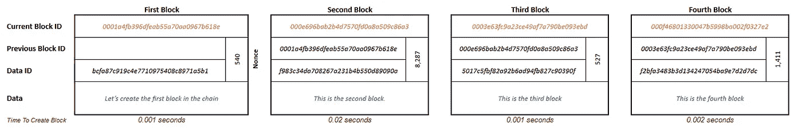

# 区块链 Ep05:矿山深处

> 原文：<https://medium.com/coinmonks/blockchain-deep-in-the-mines-ac69f0fdb083?source=collection_archive---------2----------------------->

在我的[上一篇文章](/coinmonks/blockchain-unhashing-the-hash-functions-part-2-a343ea00ec7d)中，我们看到了对我们在本系列第二篇文章中构建的块结构的一个微小的修改。*修饰语*被作为*引入是为了防止碰撞的一种方式。*

The modified block with a Modifier

然而，在这篇文章的结尾，我还提到了区块链使用的**哈希函数**足够智能，可以防止冲突。所以我们其实不需要*修饰语*，但是我们还有。它叫做***Nonce****它对区块链的工作方式极其重要！*

**

*Sorry but not sorry — A modifier called Nonce really exists in every Block of the Blockchain!*

*但是，如果不是为了防止冲突，为什么 *Nonce* 会存在呢？*

# *关于现时的真相*

*自从我们建造了区块链的原始版本，我们就面临着一个大问题——链条可能被修改。当然，对链的中间部分进行修改需要更多的工作，因为后续块中的**散列**需要更新，但是这并不足以阻止一个恶意的个人实际上这样做。**散列**是一个相当快速的过程，计算任何输入的散列只需要不到微秒的时间，因此更新整个链将是几秒钟的工作。我们能做些什么来阻止这种情况？*

> *让我们创建一个规则—只有以***000000***(6*前导 0*)开头的**哈希输出**将被接受为有效的块 id。*

*这真的不是一个令人愤慨的规则，我们在生活的许多领域都看到这样的规则。你必须达到 18 岁以上才能投票，你必须达到一定的年龄才能买酒，你需要有效的签证才能入境。因此，让我们制定一个规则，就像一个街区的有效签证一样。*

**

*This is an invalid block, because the Block ID doesn’t start with 000..*

*该块没有有效的*当前块 ID* ，因为开始的 3 个字符是 ***e042b3*** 而不是规则要求的 ***000000*** (前一个块也无效)。规则规定，除非*当前块 ID* 以 ***000000*** 开头，否则不能将块添加到链中。但是我们不能改变*数据 ID* ，这取决于块中存储的*数据*。我们也不能改变*之前的块 ID* 。那么我们能做什么呢？Nonce 来救援了！*

## *临时探测*

*就像我们在 ***探测修饰符*** 中为了防止**冲突**所做的那样，我们可以 ***探测 Nonce*** 来找到有效的**散列输出**。只需将 *Nonce* 增加 1，直到我们能够找到以 ***000000*** *开始的散列输出。*一旦我们找到给我们一个有效的*当前块 ID* 的*随机数*，我们就可以将这个块添加到链中。唷……*

*这有什么帮助？首先，这使得随机修改链的任务变得困难。我们知道**散列输出**是随机的，对**散列函数**的输入与输出没有相似之处。我们也知道哈希是一个*单向*函数，我们不知道生成一个特定的输出需要什么输入。当我们将*前导零*的规则强加到我们的链上时，我们试图抑制散列的随机性，并且为我们自己创建了一个任务来识别生成输出格式所需的特定输入。除了试错之外，没有其他方法可以做到这一点！*

*我们必须一遍又一遍地尝试，直到我们找到正确的组合*数据 ID、先前块 ID* 和*随机数*，它们创建有效的*当前块 ID* 。这使得这项工作比寻找一个简单的散列要困难得多。难度越大，意味着耗费的时间越多。*

## *Nonce 探测需要多长时间？*

*为了看看强加 6 *前导 0*规则有多困难，我实际上[写了一个 python 程序](https://github.com/lbhymshr/medium_blockchain_samples/blob/main/primitive_block_mining_sample.ipynb)。该程序计算找到遵循规则所需的*随机数*需要多长时间。下图显示了链如何随着*领先 0s* 规则的变化而演变，从 *0 领先 0s* 规则开始…*

**

*Time taken to create the chain with no leading 0s rule; lzc = 0 in the code*

*当不使用*前导 0 规则*时，创建链几乎不需要时间。让我们看看如果我们有 *3 领先 0s 规则*会发生什么。*

**

*Time taken to create the chain with 3 leading 0s rule; lzc = 3 in the code*

*嗯，时间上有轻微的增加，但不足以阻止有人试图修改链。但是，看一下 *Nonce* 值。尝试了将近 8000 次才为第二个块找到正确的*随机数*！也许我们应该继续前进。如果我们强加 *6 前导 0 规则*会发生什么？*

**

*Time taken to create the chain with 6 leading 0s rule; lzc = 6 in the code*

*哇哦。只要看看那些 *Nonce* 值，已经有几百万了。花了 1 分多钟才找到**第三块**的正确组合。现在我们已经到了有人可能会重新考虑修改块的时候了，除非他们有一个好的理由。但这还够吗？如果我们采用 8 *领先 0 规则*会发生什么？*

*我不知道！我没有耐心让代码停止运行。因此，我可以有把握地假设 Nonce 是万亿，如果不是更多。如果你觉得自己有耐心，可以从这里下载代码自己试试——[*GitHub Python 笔记本链接。*](https://github.com/lbhymshr/medium_blockchain_samples/blob/main/primitive_block_mining_sample.ipynb)*

*米矿**矿**，这是**矿**！找到创建有效散列输出的正确*随机数*值被称为**挖掘**。将一个新的区块添加到链的末端只需要开采 1 个区块——这需要相当多的时间。修改链中间的块需要重新挖掘所有后续的块——实际上是不可能的！*

> *作者注:比特币区块链使用 SHA-256 哈希函数，并强加**巨大前导 0**规则。比如比特币区块链上[区块号— 712449](https://www.blockchain.com/btc/block/0000000000000000000adf409db0fcc82d0838ae3a1bc34f87ab48ac7b88bb7e) 的 Hash 输出是 00000000000000 ADF 409 db 0 FCC 82d 0838 AE 3a 1 BC 34 f 87 ab 48 AC 7 b 88 bb 7 e 就是 19 个前导 0！请点击链接亲自查看。*

# *最后*

*在这篇文章中，我们在模块中引入了一个新的组件— *Nonce* 。然后，我们看到对当前块 ID 的可接受格式强加简单的规则会增加为有效的**散列输出**找到正确的*随机数*值的复杂性。最后我们知道了什么是**采矿**！*

***挖掘**是寻找随机数、*数据 ID* 和*先前块 ID* 的正确组合*的迭代过程，其创建有效的散列输出。有人需要做大量的工作(迭代)来找到正确的组合，只有这样才能将一个块链接到链上。而篡改链条需要重做整个过程。*又要深入矿井了！***

*在我接下来的文章中，我想谈谈为什么区块链非常有用。具体来说，在银行业。但在我们了解区块链如何扰乱银行业之前，我们必须了解银行业到底是什么。到时见…*

# *扣人心弦*

***工作证明**让区块链变得健壮。但是为什么我们需要它是健壮的呢？为什么所有这些关于不可变链的噪音，为什么链中的数据和链本身不被修改如此重要，即使是轻微的修改？*

> *加入 Coinmonks [电报频道](https://t.me/coincodecap)和 [Youtube 频道](https://www.youtube.com/c/coinmonks/videos)了解加密交易和投资*

## *也阅读*

* [## 杠杆代币[多头代币]终极指南

### 杠杆化令牌是具有杠杆化风险敞口的 ERC20 令牌，不考虑保证金、要求、管理…

medium.com](/coinmonks/leveraged-token-3f5257808b22)  [## 最佳加密交易所| 2021 年十大加密货币交易所

### 加密货币交易所的加密交易需要了解市场，这可以帮助你获得利润。之前…

blog.coincodecap.com](https://blog.coincodecap.com/crypto-exchange)  [## 2021 年最佳加密交换平台| CoinCodeCap

### 如果我们看看今天的场景，许多加密货币交换平台提供了广泛的功能和深度…

blog.coincodecap.com](https://blog.coincodecap.com/best-swap-platforms)  [## BlockFi 评论 2021:利弊和利率| CoinCodeCap

### 今天，我们提出了一个全面的 BlockFi 评论，这是一个成立于 2017 年的加密贷款平台，拥有其…

blog.coincodecap.com](https://blog.coincodecap.com/blockfi-review)  [## 如何在印度购买比特币？2021 年购买比特币的 7 款最佳应用[手机版]

### 如何使用移动应用程序购买比特币印度

medium.com](/coinmonks/buy-bitcoin-in-india-feb50ddfef94)  [## 加密税务软件——五大最佳比特币税务计算器[2021]

### 不管你是刚接触加密还是已经在这个领域呆了一段时间，你都需要交税。

medium.com](/coinmonks/best-crypto-tax-tool-for-my-money-72d4b430816b)  [## 存储比特币的最佳加密硬件钱包[2021] | CoinCodeCap

### 保管您的数字资产很容易，但找到正确的存储方式却是一项繁琐的任务。在线钱包有一个风险…

blog.coincodecap.com](https://blog.coincodecap.com/best-hardware-wallet-bitcoin)  [## Pionex 评论 2021 |免费加密交易机器人和交换

### Pionex 是为交易自动化提供工具的后起之秀。Pionex 上提供了 9 个加密交易机器人…

medium.com](/coinmonks/pionex-review-exchange-with-crypto-trading-bot-1e459d0191ea)  [## 仙境提供了 83，412%的 APY 赌注:仙境是一个骗局吗？CoinCodeCap

### 仙境是雪崩网络的第一个基于时间令牌的分散储备货币协议。一篮子…

blog.coincodecap.com](https://blog.coincodecap.com/wonderland-offers-an-83412-apy-on-staking-is-wonderland-a-scam)  [## 天秤座货币——脸书的加密货币

### 自 2018 年马克·扎克伯格决定致力于改善区块链以来，关于天秤座货币的传言就一直存在…

blog.coincodecap.com](https://blog.coincodecap.com/libra-currency-a-cryptocurrency-by-facebook)*