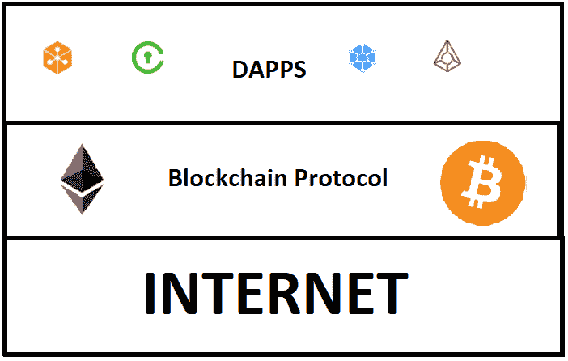

# 区块链不是在真空中运行的—(治理层)

> 原文：<https://medium.com/coinmonks/blockchain-doesnt-operate-in-a-vacuum-governance-layers-5068d4e6599c?source=collection_archive---------8----------------------->

谈到区块链的治理体系，我想到的是**协调**和**决策**达成社区**共识**。在 2017 年，这是一个很大的争论话题，因为比特币(尤其是比特币现金)有很多分叉。

这里的问题是，比特币社区无法就如何最好地扩大比特币的规模达成一致决定。因此，一个阵营支持更大的块大小(比特币现金)，另一个阵营希望保持块大小不变(尽管最初的比特币是用 SegWit 更新的)。

因此，我们已经看到许多区块链项目站出来，描述他们将如何以一种 ***去中心化*** 的方式进行治理，以避免未来出现这种冲突。

一些项目已经实现了治理系统，最著名的是 Dash。作为一个例子，让我们看看 Dash 使用的治理系统。它被称为*国库系统。*

## 国库系统

Dash 机构群体使用的*资金系统*,作为就提议的网络变更和 Dash 生态系统开发达成共识的一种方式。财政部的资金来自进入“国库”的整笔奖金的 10%,用于支付 Dash 受益的项目。

财政部的资金可以用来雇佣额外的开发人员来创建更新和增强，例如与主要交易所和 API 提供商的集成。为了决定在 Dash 网络上进行哪些更新，机构群体会提出建议并投票表决。净票数最高的提案将被支付和实施。

Dash 创造了一个不依赖外部资金的系统；一切都是在 Dash 网络中创建的。这是一个区块链项目的明显例子，它很好地保持了系统的分散性。

这是去中心化治理体系的一个很好的例子。事实上，比特币在区块链发展的早期就开启了治理辩论，这对社区来说是一件好事。

# 更大的生态系统

也就是说，我认为在考虑区块链治理时，我们还必须考虑更大的生态系统方法。这是因为我们知道区块链网络不是在真空中运作的。像 Dash 这样的一些项目已经有了特定于项目的治理，这很好。**但是更大的图景呢？**

例如，如果我们想影响社会中的某个人，我们可以采取直接的方法(例如通过法律系统)直接促使他/她改变他们的行为。或者我们可以采取**间接**的方式(例如利用市场力量或社会规范)，这也是一种影响行为的方式。

这里的要点是，在一个生态系统中，个体不仅可以被直接影响，还可以被间接影响。基于区块链的应用程序和分散式应用程序(dapps)也位于一个生态系统中，无论其内部治理系统如何，都会受到影响。**这是更大的画面，我们将了解一下。**

## 区块链系统的 3 层

那么区块链系统存在于什么样的生态系统中呢？它们在三个不同的层次上运行，每个层次都有自己的运行规则:

1.  **互联网层**
2.  **区块链层**
3.  **应用层**

基于区块链的应用将由管理其系统的规则定义**，也将由构建它们的基础设施定义**。因此，每一层都会对系统的整体治理产生影响。让我们更详细地看看这三层。

# 互联网层

比特币、以太坊等区块链网络直接运行在互联网层之上。这意味着它们将最终依赖于 TCP/IP 等互联网协议。这是做什么的？根据[维基百科](https://en.wikipedia.org/wiki/Internet_protocol_suite):

> Internet 协议套件提供端到端的数据通信，指定如何对数据进行打包、寻址、传输、路由和接收

因此该协议负责将信息包传输到互联网网络中的不同节点。因此，建立在这个**之上的区块链网络没有 TCP/IP** 就不能运行。现在我们知道，对于一个恶意的演员来说，关闭互联网，从而扼杀一个区块链网络是完全不现实的。但是还有另一种方法可以操纵这一层。

互联网服务提供商([ISP](https://en.wikipedia.org/wiki/Internet_service_provider))最终控制互联网上的传输层。因此，**他们可以歧视来自和去往区块链网络的信息包**。这与正在进行的[网络中立辩论](http://fortune.com/2017/11/23/net-neutrality-explained-what-it-means-and-why-it-matters/)非常相关，在这场辩论中，互联网服务提供商可以区别对待来自一些网站的数据包，而偏向其他网站，这对于基于区块链的系统也是如此。

想象一下，如果一个暴虐的政府要禁止区块链网络，他们可以告诉所有的互联网服务提供商屏蔽所有链接到区块链网络的信息。或者，如果一个互联网服务提供商从一个区块链网络中获益(也许他们拥有一个区块链网络),那么他们会禁止来自所有竞争的区块链网络的信息传输，而让他们自己的网络繁荣发展。

**互联网层治理是区块链治理的外部治理，但它仍会对区块链应用性能产生巨大的间接影响。**

# 区块链层

现在让我们看看下一层，即区块链网络。如前所述，最突出的是比特币和以太坊。因此，虽然 ISP 负责在互联网上传输数据包，但比特币和以太坊网络上的矿工负责验证和记录这些区块链网络上的交易(信息)。

共识和信息共享是通过工作证明(PoW)协议实现的。在本文中，我们将重点关注 PoW，因为它是迄今为止最成熟的协议，但是同样的原则也可以应用于利益证明(PoS)。

电力是由经济激励推动，在这种激励下，矿工可以获得新铸造的硬币和交易费。就交易费用而言，您支付的费用越高，交易处理的速度就越快，反之亦然。这已经是一种影响网络使之对你有利的方法。愿意支付比现行价格更高费用的人，总是会在支付更低费用的人之前处理他们的交易。

但是除了费用，还有其他潜在的方式来影响网络:

## **市场**

一个大的矿池可以与第三方在一个链外协议中合作，以有利于他们的交易超过社区的其他人。

## **矿业卡特尔**

矿工可以决定歧视某些 dapps 或钱包地址，不在区块链网络上处理他们的信息。

## **法律法规**

监管机构可能会要求矿商禁止在区块链网络上处理特定 dapps 或钱包地址的信息。

虽然这些例子是针对 PoW 的，但是它们也可以应用于 PoS 系统。

**这些对实际区块链网络的外力都可以冲击和影响系统的运行。**

# 应用层

这是我们发现大多数 dapps 的层。一些 dapp 直接位于区块链网络之上，而其他 dapp 部署在 dapp 框架之上。下图显示了我们与 dapps 在最顶层讨论的层。

当我们到达最后一层时，我们可以看到，即使区块链应用程序被设计为自治的，**它也会在每个底层受到影响**。

以构建在以太网之上的 DAO 应用程序(dapps 层)为例。道被黑，因代码漏洞损失 360 万以太。因此，以太坊网络(区块链协议层)执行了修改以太坊网络的硬分叉，以收回资金。从那以后，这一直是有争议的，因为一些人认为这是对“代码即法律”的背叛。但是这里的重点是道受制于以太坊网络上的决定。

因此，虽然大多数去中心化的区块链应用程序有自己的一套规则和治理，但它们也依赖于它们运行的平台，这可能会导致**两种不同类型的问题**:

1.  智能合约平台存在一个缺陷:

*平台上的任何瑕疵都会影响到所有依赖平台的应用。*

2.一些平台实现了将调用委托给其他智能合约的代理合约:

平台开发者可以更新和修改代理合同，这将影响使用这些代理合同的所有 dapps。

**正如我们所看到的，即使 dapp 有自己的规则，它仍然严重受制于构建它的平台的规则。**

# 结论

从对区块链治理层的探索中，我们可以看到**每个基础架构层都有不同的影响**，无论是对基于区块链的应用程序的直接影响还是间接影响。这种影响或大或小，但它仍然是一种影响。

作为比特币硬分叉的结果，更多的项目现在正在描述它们将被社区治理和管理的方式。这是一个巨大的进步，但是我们现在可以从另一个角度理解治理。治理不仅仅包括特定网络的规则。我们必须把生态系统作为一个整体来考虑。