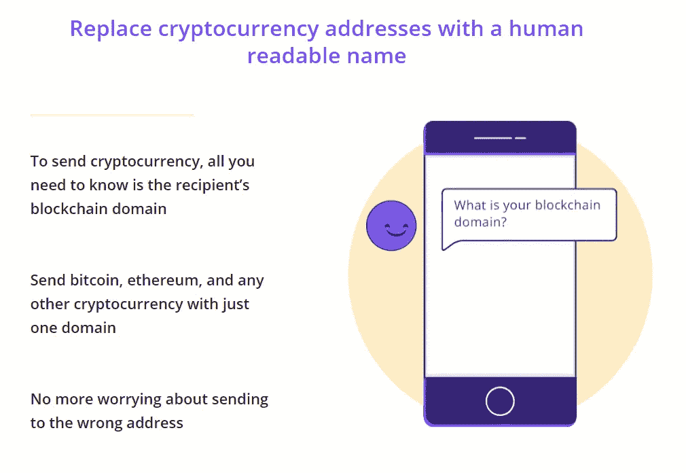
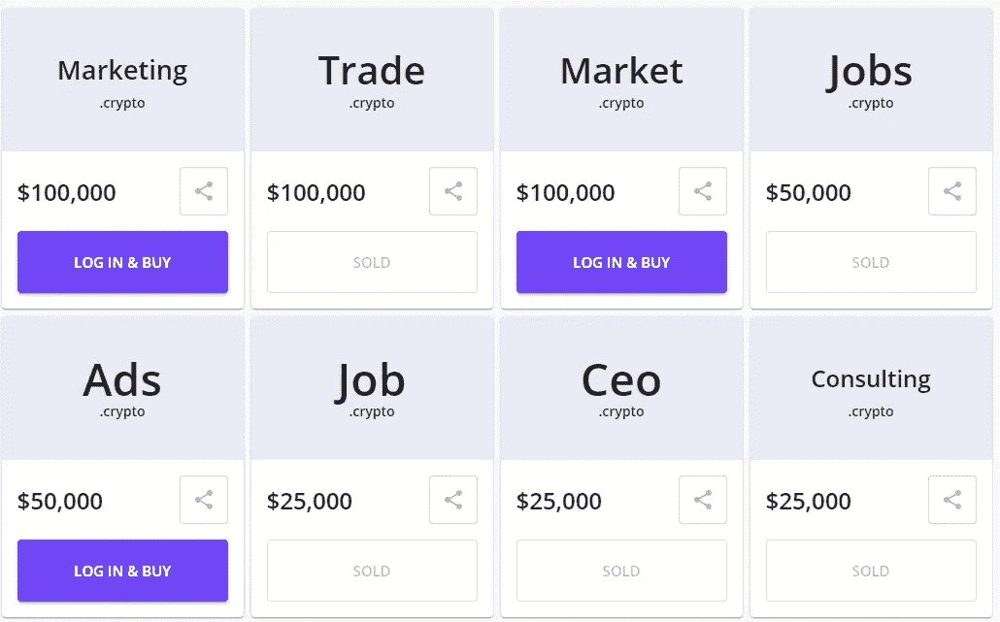
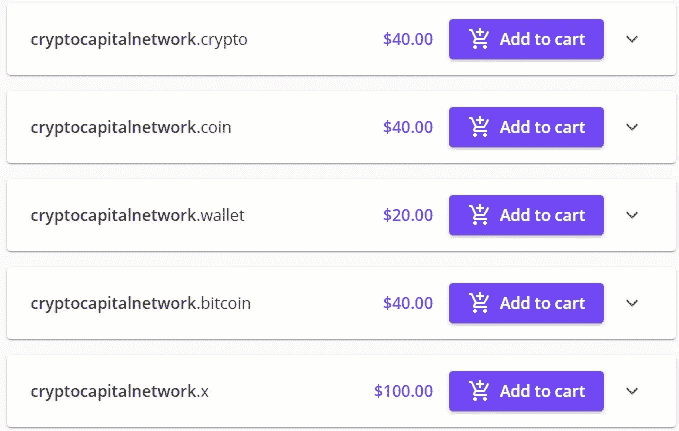
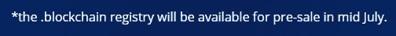
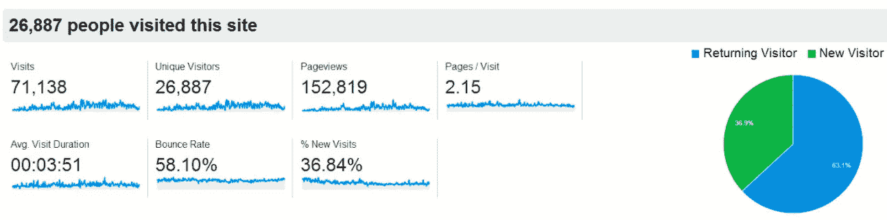
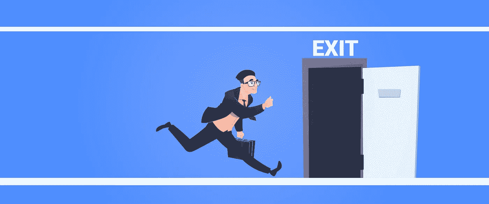
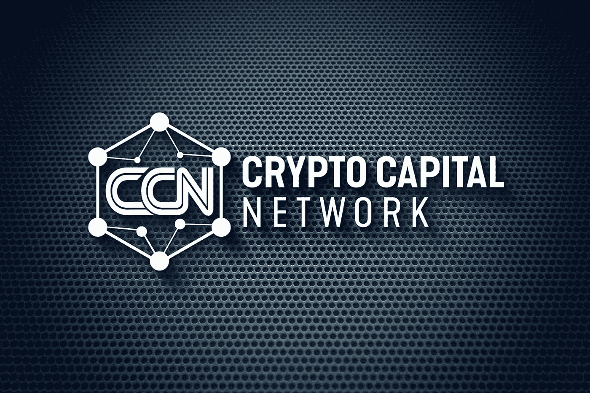

# 区块链域翻转

> 原文：<https://medium.com/coinmonks/blockchain-domain-flipping-b3a060f927e2?source=collection_archive---------0----------------------->

## 翻转区块链域名赚钱指南

Massive Returns For the Patient Investor

# 什么是区块链域？

为了更好地理解什么是区块链域名，最容易想到的是一个网站域名。就像 web 域一样，区块链域允许用户拥有资产，从而可以控制网络的指定部分。

从谁真正控制它们的意义上来说，这两者是不同的。对于网络域名，你必须向托管公司支付存储域名的费用，并按月收取费用。对于区块链域，资产的所有者拥有完全的控制权。

# 我为什么想要一个区块链域？

有两个主要功能**区块链域帮助服务。**

听完之后，你可能只想把它们加入到你不断增长的多元化资产包中。

## 功能 1

第一个函数允许您拥有区块链注册表的一个命名部分，它指向存储在那里的内容。通常，**网站**与一个区块链域名相关联，这给了它们额外的好处:抵制**审查和匿名。**

传统上，网站域名是租用的，每年必须更新。购买区块链域名是一次性事件，导致永久拥有资产。域名存储在个人的钱包里，因此不会受到审查或被窃取。

## 功能 2

第二个功能允许你使用区块链域作为**加密货币钱包**。由于无需输入长的十六进制钱包地址，您可以从更顺畅的交易中获益。

> **0x 9134375 f 0 b 6 b 9746 f 46d 5706 a fdea 10b 429 e 6678**

Crypto Wallet Address as Easy as Name.Wallet- Source: [https://unstoppabledomains.com](https://unstoppabledomains.com/)

想象一下，每次你将比特币从交易所转移到钱包时，你所要做的就是输入金额和你的名字。收件人地址的加密。这确实比一遍又一遍地检查你的公钥来确保你在复制或转置它的时候没有出错要好。

# 区块链域的价值

我相信区块链域有能力从根本上改变分散的金融部门，为其用户提供一种简单的方式来安全地接受和存储各种各样的数字资产。

这些资产的长期价值最终将取决于域名扩展的规模和受欢迎程度。随着某些区块链域名获得支持，他们可能会发展出一个类似于目前发现的污名。com 网站域。

从域名买卖中获利的诀窍是，试图找出哪些域名扩展和名称可能会在未来提供最大的需求。看看下面什么不可阻挡的域名正在考虑溢价区块链域名。

Premium Blockchain Domains as High as $100,000

然而，该平台不承认我目前的业务名称，加密资本网络，作为一个优质域名，它为不同的域名扩展提供合理的价格。

Censorship Resistant Domain Names

# *翻转区块链域*

老实说，为了利润而翻转区块链域名并不是一件容易的事情。这里的目标是不要花费数千美元在各种不同类别的“听起来很酷”的区块链域名上。

然而，我相信有了系统和方法，投资区块链领域可以带来一些严重的回报。

## 第一步——专攻一两个领域

通过允许你自己坚持只购买某个类别的域名，你就提高了理解兴趣、需求、要求、问题和其他与该领域相关的信息的能力。这样做，您将有更好的机会来估计特定区块链领域的未来需求。

例如，你可能会注意到，在研究并积极参与烹饪社区后，人们正在寻找一种方式来分享社交媒体上不断被删除的流行餐厅食谱。然后你可能会决定投资 recipes.crypto 是个好主意，因为你预计到社区内需要一个抵制审查的网站。

## 第二步——快速上车

The Early Bird Gets the Worm

Unstoppable domains 提供新域名扩展的预售，允许用户在其他人有机会之前买下所有流行的域名。归根结底，这是一场人们认为未来最有价值的领域的竞赛。

一个好的策略是买下所有 3 个字母的域名，或者去寻找已经与现有公司有关联的域名。这里的想法是，有许多三个字母的首字母缩略词，因此许多公司和社区可能会发现它们是可取的。

只有当那些公司最终转向去中心化的网络时，追逐现有的企业名称才行得通。

重点是“早起的鸟儿有虫吃”，这是从来没有比试图翻转域名获利更真实的。

## 第三步-搜索引擎优化

这一步可能会花费最多的时间，但绝对是必不可少的，以确定正确的域名购买。这将是你的工作，发现热门关键字在你的利基支付高成本每次点击(CPC)与相对较低的竞争。

本质上，你想要的是广告公司愿意为你支付高价的关键词，同时也要记住这个关键词在搜索引擎中的排名有多难。关键词的竞争越少，用户就越容易点击进入你的网站。

Niel Patel Background — Source: Nielpatel.com

有终生价值的材料和资源在那里帮助教育人们 SEO 的“艺术”。我经常发现自己被 NielPatel.com 的[所吸引。在这里你可以看到其他网站使用什么关键字来排名。我通常会尝试看看我的竞争对手的排名，并尝试选择类似的关键字，可能会更容易排名。](https://neilpatel.com/)

选择正确关键词的技巧很难培养。谷歌的搜索排名算法中包含了如此多的因素，很难确定如何最好地展示你的关键词，把它们放在哪里，以及多久使用一次。随着时间的推移，这是一种不断完善的平衡行为。

像谷歌分析这样的网站有助于跟踪网页浏览量和外部流量。在添加新的关键词和文章时，这可能是一个很好的工具。你可以看到哪些表现最好，并尝试复制这些结果。

Sample Data from Google Analytics

## 第四步——掌握出口

Know When to Get Out — Source: [transitionsib.com](https://www.transitionsib.com/podcast/getting-out-quick-and-clean/)

当翻转区块链域名的时候，最好了解一下你打算什么时候出售域名。有可能购买一个域名，并在一年内出售，以获取利润。如果你追随新的趋势或社区，这种类型的短期玩法是可行的。

想象一下，在 cyber truck 发布后，一些公司出售安装在车上的配件。人们喜欢这家公司，你可以看到他们需要一个区块链网站。幸运的是，你看到了这种需求，以 40 美元的价格买下了 cybertruckaccesories.crypto，并在一年后的拍卖会上以 1 万美元的价格售出。

这是短期域名投机者追求的收益类型。如果他们能够获得上升和未来趋势的域名，他们就有机会在不久的将来获得丰厚的利润。

另一个策略是从你的利基市场购买大量带有流行关键词的廉价域名，然后在上面放置 5 年、10 年甚至 15 年。

这里的想法是，在这段时间后，许多域名将已经被占用，使你购买的更有价值。你的 20 美元域名可能价值 50 到 1000 美元。如果你花时间选择正确的域名，这将会带来丰厚的利润。

# 摘要

一如既往地感谢我所有出色的读者。我希望我已经启发了你，让你打开你的视野，把自己暴露在这种新的数字资产类别中。

我期待着投入研究与您一起寻找世界上最好的区块链域名。我期待着的发布。区块链域名，并计划添加更多的域名到我的钱包。

下次再见，加密资本网络！

[Crypto Capital Network](https://www.facebook.com/groups/2719098648389567)

*   约瑟夫·勒夫勒

> 加入 [Coinmonks 电报频道](https://t.me/coincodecap)，了解加密交易和投资

## 另外，阅读

*   [尤霍德勒 vs 科恩洛安 vs 霍德诺特](/coinmonks/youhodler-vs-coinloan-vs-hodlnaut-b1050acde55a) | [隐蝠 vs 哈斯博特](https://blog.coincodecap.com/cryptohopper-vs-haasbot)
*   [币安 vs 北海巨妖](https://blog.coincodecap.com/binance-vs-kraken) | [美元成本平均交易机器人](https://blog.coincodecap.com/pionex-dca-bot)
*   [如何在印度购买比特币？](/coinmonks/buy-bitcoin-in-india-feb50ddfef94) | [WazirX 评论](/coinmonks/wazirx-review-5c811b074f5b) | [BitMEX 评论](https://blog.coincodecap.com/bitmex-review)
*   [比特币主根](https://blog.coincodecap.com/bitcoin-taproot) | [Bitso 回顾](https://blog.coincodecap.com/bitso-review) | [排名前 6 的比特币信用卡](/coinmonks/bitcoin-credit-card-bc8ab6f377c6)
*   [双子座 vs 比特币基地](https://blog.coincodecap.com/gemini-vs-coinbase) | [比特币基地 vs 北海巨妖](https://blog.coincodecap.com/kraken-vs-coinbase)|[coin jar vs coin spot](https://blog.coincodecap.com/coinspot-vs-coinjar)
*   [印度比特币交易所](/coinmonks/bitcoin-exchange-in-india-7f1fe79715c9) | [比特币储蓄账户](/coinmonks/bitcoin-savings-account-e65b13f92451) | [Paxful 点评](/coinmonks/paxful-review-4daf2354ab70)
*   [杠杆令牌](/coinmonks/leveraged-token-3f5257808b22) | [最佳密码交易所](/coinmonks/crypto-exchange-dd2f9d6f3769) | [密码交易机器人](https://blog.coincodecap.com/best-crypto-trading-bots)
*   [Godex.io 审核](/coinmonks/godex-io-review-7366086519fb) | [邀请审核](/coinmonks/invity-review-70f3030c0502) | [BitForex 审核](/coinmonks/bitforex-review-c4bb28d9e271) | [HitBTC 审核](/coinmonks/hitbtc-review-c5143c5d53c2)
*   [Crypto.com 费用](/coinmonks/binance-fees-8588ec17965) | [僵尸加密审查](/coinmonks/botcrypto-review-2021-build-your-own-trading-bot-coincodecap-6b8332d736c7) | [替代品](https://blog.coincodecap.com/crypto-com-alternatives)
*   [MXC 交易所评论](/coinmonks/mxc-exchange-review-3af0ec1cba8c) | [Pionex vs 币安](https://blog.coincodecap.com/pionex-vs-binance) | [Pionex 套利机器人](https://blog.coincodecap.com/pionex-arbitrage-bot)
*   [我的加密副本交易经历](/coinmonks/my-experience-with-crypto-copy-trading-d6feb2ce3ac5) | [比特币基地评论](/coinmonks/coinbase-review-6ef4e0f56064)
*   [加密货币储蓄账户](/coinmonks/cryptocurrency-savings-accounts-be3bc0feffbf) | [赌注加密](https://blog.coincodecap.com/staking-crypto) | [CEX。IO 审查](https://blog.coincodecap.com/cex-io-review)
*   [最佳比特币保证金交易](/coinmonks/bitcoin-margin-trading-exchange-bcbfcbf7b8e3) | [Bityard 保证金交易](https://blog.coincodecap.com/bityard-margin-trading) | [Prokey 点评](/coinmonks/prokey-review-26611173c13c)
*   [加密保证金交易交易所](/coinmonks/crypto-margin-trading-exchanges-428b1f7ad108) | [赚取比特币](/coinmonks/earn-bitcoin-6e8bd3c592d9) | [Mudrex 投资](https://blog.coincodecap.com/mudrex-invest-review-the-best-way-to-invest-in-crypto)
*   [WazirX vs CoinDCX vs bit bns](/coinmonks/wazirx-vs-coindcx-vs-bitbns-149f4f19a2f1)|[block fi vs coin loan vs Nexo](/coinmonks/blockfi-vs-coinloan-vs-nexo-cb624635230d)
*   [BlockFi 信用卡](https://blog.coincodecap.com/blockfi-credit-card) | [如何在币安购买比特币](https://blog.coincodecap.com/buy-bitcoin-binance) | [网格交易机器人](https://blog.coincodecap.com/grid-trading)
*   [加密副本交易平台](/coinmonks/top-10-crypto-copy-trading-platforms-for-beginners-d0c37c7d698c) | [五大 BlockFi 替代方案](https://blog.coincodecap.com/blockfi-alternatives)
*   [CoinLoan 审核](/coinmonks/coinloan-review-18128b9badc4)|[Crypto.com 审核](/coinmonks/crypto-com-review-f143dca1f74c) | [火币保证金交易](/coinmonks/huobi-margin-trading-b3b06cdc1519)
*   [顶级付费加密货币和区块链课程](https://blog.coincodecap.com/blockchain-courses) | [币安评论](/coinmonks/binance-review-ee10d3bf3b6e)
*   [在美国如何使用 BitMEX？](https://blog.coincodecap.com/use-bitmex-in-usa) | [BitMEX 点评](https://blog.coincodecap.com/bitmex-review) | [币安 vs Bittrex](https://blog.coincodecap.com/binance-vs-bittrex)
*   [最佳免费加密信号](https://blog.coincodecap.com/free-crypto-signals) | [YoBit 评论](/coinmonks/yobit-review-175464162c62) | [Bitbns 评论](/coinmonks/bitbns-review-38256a07e161) | [OKEx 评论](/coinmonks/okex-review-6b369304110f)
*   [比特币基地跑马圈地](https://blog.coincodecap.com/coinbase-staking) | [Hotbit 点评](/coinmonks/hotbit-review-cd5bec41dafb) | [KuCoin 点评](https://blog.coincodecap.com/kucoin-review) | [期货交易机器人](/coinmonks/futures-trading-bots-5a282ccee3f5)
*   [最佳加密交易信号电报](/coinmonks/best-crypto-signals-telegram-5785cdbc4b2b) | [MoonXBT 评论](/coinmonks/moonxbt-review-6e4ab26d037)