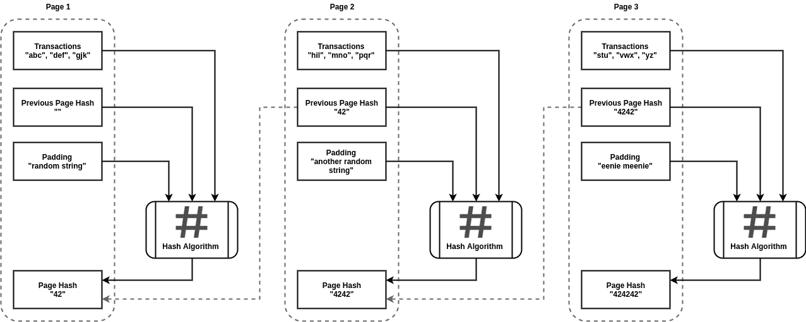
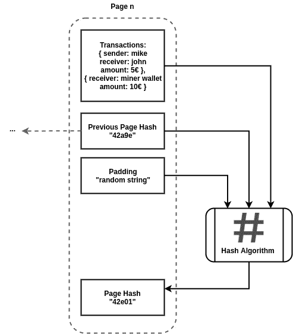
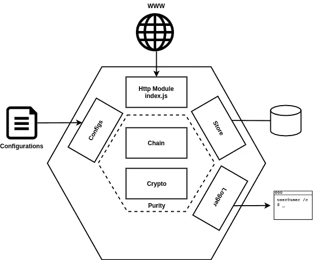
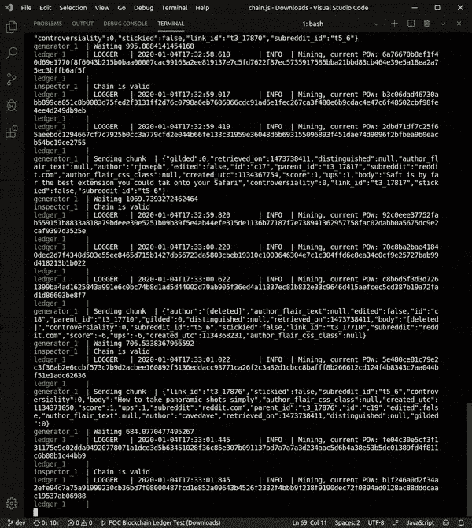

# 一个完整的和工作的区块链

> 原文：<https://medium.com/coinmonks/blockchain-example-c2f97b811d17?source=collection_archive---------2----------------------->


[xresch](https://pixabay.com/it/users/xresch-7410129/?utm_source=link-attribution&amp;utm_medium=referral&amp;utm_campaign=image&amp;utm_content=3750157) photos from [Pixabay](https://pixabay.com/it/?utm_source=link-attribution&amp;utm_medium=referral&amp;utm_campaign=image&amp;utm_content=3750157)

> 区块链:每个人都在谈论它，只有少数人知道它是如何工作的

本文将深入探讨区块链的技术细节，并提供一个简单但有效的 Node.js 示例。

# 区块链简史

区块链在 2008 年末随着中本聪的论文而出现。中本聪是匿名作者选择的笔名。关于中本聪的真实身份，多年来流传着不同的说法。其中一种理论认为中本聪是一群人。

**区块链发明多年来主要用于加密货币**。但是它的使用可以扩展到每一种需要“证明”的情况。**当一个语句被插入到区块链中时，没有人能够不花大力气就改变它的内容**。

> [发现并回顾最佳区块链软件](https://coincodecap.com)

# 它是如何工作的

区块链的细节可以用一个“简单”的图表来解释。



This is a Blockchain “A picture is worth 1000 words” (cit.)

就是这样！我可以在这里结束我的文章，让您来实现它。请随意沿着这条路走下去。

无论如何，对于那些想要一个工作实现的解释的人，我将在我的文章中更进一步。

**区块链核心细节是前一页哈希和页哈希区块**之间的虚线箭头。这一行构建了链，使攻击者无法篡改链。对于旧页面，篡改更难。这是因为如果攻击者将其事务添加到第一页，它必须通过重做数学运算来重建后续页，以便为每个后续页找到**合适的页散列。当页面散列改变时，它也将改变下一个页面散列，因为散列算法参数是不同的。**

合适的页面散列意味着计算出的散列满足一个**工作证明** (POW)。POW 是一个使哈希与区块链页面相关联的问题。在上面的例子中，功率由以下问题表示:

> 找到生成以“42”开头的散列的填充(随机字符串)

每个区块链都定义了它能力。例如，比特币力量是:

> 哈希必须以 n 个零开始

# 处理

交易可以是货币交易，就像区块链的加密货币一样，也可以是用户想要添加的任何内容:购买合同、当日报价。

区块链拥有一个打开的页面，用于放置新的交易。在这里给出的例子中，功率竞争是由单个节点在打开的页面上完成的。**在生产就绪网络中，多个节点加入 POW 竞赛，第一个发现 POW 的节点“关闭”页面并获得奖励**。



The Miner adds it transaction

上图解释了挖掘过程是如何进行的。一名矿工打开当前页面(第 n 页),在他的钱包中添加了一笔 10€的新的特殊交易，没有发送者。然后生成一些填充，直到获得以“42”开始的页面哈希。10€奖励是由区块链规则定义的。**没有发送者的交易就像矿工刚刚通过分辨能力发现的金块**。

# 区块链验证

节点如何满足它们的相互信任？

**区块链账本是公开的**，每个节点都可以:

1.  获取公共分类账
2.  验证每个页面的哈希是否正确
3.  验证页面是否正确链接
4.  核实每笔“金块”交易的金额是否正确

# 与现实的差距

由于其复杂性，这里不解释具有多个节点的区块链网络如何工作的细节。**分布式区块链面临的问题主要和分布式计算一样**:

1.信息(分类帐)传播

2.网络拓扑知识传播

3.并发和冲突解决

这些问题在文献中有很多解决方案。为每个现有区块链选择的解决方案定义了协议的核心部分。这些方面决定了给定区块链的主要漏洞和成败。

# 工作中的 Github 项目

你可以在 Github 库中找到所有的示例源代码。

存储库由不同的文件夹组成。

**/deploy**docker-compose . yml 所在的位置运行整个项目。

**/generator** 是一个简单的 Node.js 流生成器，它获取 Reddit 帖子，并将其作为事务发送到区块链。

**/检查员**是区块链的外部检查员。在区块链网络中，每个人都应该可以自由验证链(账本)是否可信

**/账本**是区块链账本管理器，这个项目的核心组件

在下文中，我们将集中讨论后一个组件。

# 运行代码

如 [Github 项目主页所报道的](https://github.com/ccarcaci/poc-blockchain)先决条件是:

*   码头工人
*   npm
*   wget

要运行和停止代码，只需启动脚本:

```
$ ./run.sh
$ ./stop.sh
```

从/POC-区块链主文件夹。

# 分类帐

分类帐管理器是 Node.js Http 服务器，可以接收新的交易，显示当前链，并在请求时验证区块链有效性。除此之外，**分类帐管理器在后台运行挖掘过程:**

代码没有实现多节点区块链网络:相关问题的解决将核心区块链代码置于后台。

莱杰是一个(几乎)六边形的然而又是[添加的](https://dzone.com/articles/get-started-with-test-driven-development-a-beginne)应用程序。



Ledger is Hexagonal

上面的图片展示了我为保持**在链和密码管理功能**上的纯洁性所做的努力(我希望这些努力足够了)。在纯度界限之外，一些模块与外部世界相互作用。与六边形结构的完整配件的一个区别是缺少适配器。别指望能找到他们。

pure 部分和 Store 组件是使用 TDD 开发的。您可以在/test 文件夹中找到这些测试。

不管怎样，**我会帮你节省时间找到代码的核心部分**，在这里:

该函数首先获取链的当前页面(最后一页)，然后验证是否有新的事务。然后**使用 UUID 函数生成新的随机填充，并尝试使用 SHA-3 函数**计算散列。

如果散列满足 POW，则新的页面被添加到链中，并且链被返回。



Blockchain is running

动画 gif 展示了分类帐、生成器和检查员应用程序的协同工作。Ledger 正在挖掘新页面，Generator 正在发送 Reddit 帖子，Inspector 正在验证区块链是否有效。

您可以使用 curl 命令，使用分类帐应用程序的 get 请求/chain 路径来获取整个区块链。应用程序的端口从 docker-compose 定义中公开。

# 最后的话

我希望你喜欢这篇文章，并且**现在当人们谈论区块链的时候，你已经意识到在舞台后面发生了什么。**

我认为，我们经常听到有人谈论被视为巫术的技术。在我看来，一个好的技术人员应该能够将不一致的聊天和技术细节区分开来。这篇文章旨在得到这一点。

请留下评论，不好的也可以，非常感谢。

> [直接在您的收件箱中获得最佳软件交易](https://coincodecap.com/?utm_source=coinmonks)

[](https://coincodecap.com/?utm_source=coinmonks)[](https://coincodecap.com)