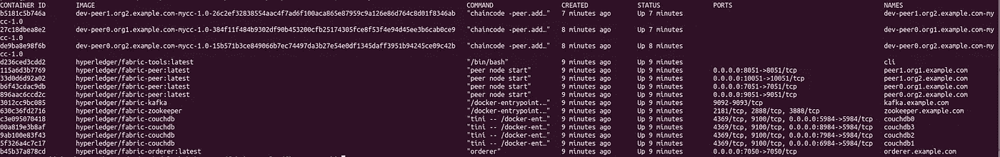
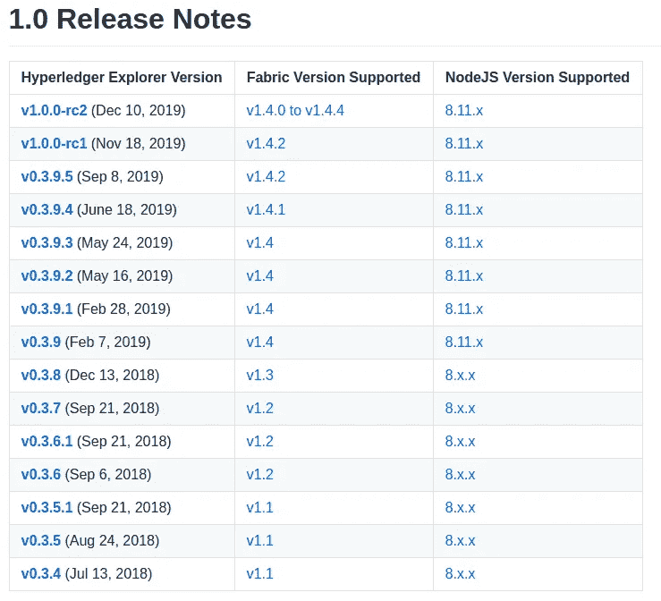
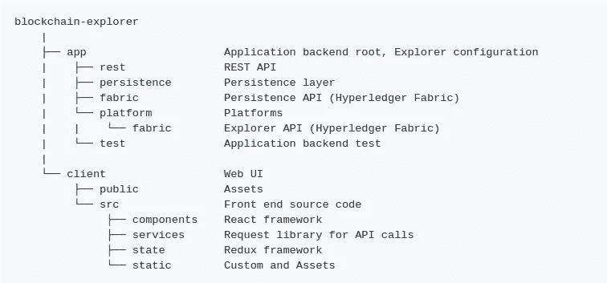

# 区块链浏览器与 Hyperledger Fabric 的集成

> 原文：<https://medium.com/coinmonks/blockchain-explorer-integration-with-hyperledger-fabric-fc14570753f7?source=collection_archive---------0----------------------->

在这里，我假设您已经启动并运行了 Hyperledger 结构网络。确保所有必要的容器服务工作正常，并且您能够调用/查询事务。就我而言。我有以下网络配置。

**Hyperledger 浏览器:**

Hyperledger Explorer 是一个简单、强大、易于使用、维护良好的开源工具，用于浏览底层区块链网络上的活动。

请确保您安装了适当版本的资源管理器，节点和结构应匹配如下。

> [发现并回顾最佳区块链软件](https://coincodecap.com)

从[这里](https://github.com/hyperledger/blockchain-explorer)克隆资源管理器。一旦克隆，回购将有以下结构。

资源管理器使用 PostgreSQL 存储从对等机获取的数据。安装下列依赖项。

*   Nodejs 8.11.x(注意还不支持 v9.x)
*   PostgreSQL 9.5 或更高版本
*   [jq](https://stedolan.github.io/jq/)

## **第一步:**

转到`blockchain-explorer/app`并修改`explorerconfig.json`以更新 PostgreSQL 数据库设置。我

如果您为数据库添加了不同的用户名和配置，请确保在此文件中进行更新(`explorerconfig.json`)。

转到 cd `cd blockchain-explorer/app/persistence/fabric/postgreSQL/db`，如果您看不到 db 文件夹或 db 文件夹中的任何内容，请更改权限。`chmod -R 775 db/`

运行`sudo -u postgres ./createdb.sh`，您将会看到数据库的创建以及存储数据所需的表格。

## **第二步:**

**光纤网络配置**

一旦结构网络启动并运行，转到 Explorer repo 中的`/blockchain-explorer/app/platform/fabric/config.json`。在第一个网络下添加配置文件路径。

定义`test.json`(配置文件):在连接配置文件文件夹下定义一个 test.json 文件。

添加适当的配置文件、密钥、证书和 URL。确保特定路径下的所有文件和证书都可用。根据您的配置进行必要的更改。我们从一个对等体获取所有数据。

按照以下步骤构建浏览器。

*   `cd blockchain-explorer`
*   `npm install`
*   `cd blockchain-explorer/app/test`(如果您也想执行测试，则需要)
*   `npm install`(如果您也想执行测试，则需要)
*   `npm run test`(如果您也想执行测试，则需要)
*   `cd client/`
*   `npm install`

**第三步:**

到新的终端`cd blockchain-explorer/`运行第一条命令
1) `./start.sh`启动服务器
2) `./stop.sh`停止服务器

一旦服务器启动成功，进入浏览器上的`localhost:8080`，你需要登录，一旦登录成功，你将会看到如下屏幕。

可能会有不同的块数和交易，它会显示您的网络交易。

# 油管（国外视频网站）

有关更多细节，您可以关注我的 youtube 视频系列，了解如何将区块链浏览器与 Hyperledger Fabric 集成。

视频 1:

视频 2:

视频 3:

最重要的是，你可以看到`cd blockchain-explorer/logs/console/console.log.`下的所有日志

服务器不断地从对等体获取数据，所有的日志都将打印在控制台文件中。请参考下面的 console.log 文件。

# 日志记录配置

通过使用以下环境变量，您可以控制每个组件(应用程序、数据库和控制台)的日志级别。您可以将这些`ALL < TRACE < DEBUG < INFO < WARN < ERROR < FATAL < MARK < OFF`字符串设置到每个级别。每个文件都按日期(7 天)和大小(8MB)滚动。

日志级别应用程序

*   关于应用层的日志级别。日志被写入`logs/app/app.log`。

日志级别数据库

*   关于后端层的日志级别。日志被写入`logs/db/db.log`。

日志级别控制台

*   关于控制台的日志级别。日志被写入`logs/console/console.log`。

日志 _ 控制台 _ 标准输出

*   您可以将控制台日志的目标从文件切换到标准输出。

用于在 repo 的主目录上停止服务器运行`./stop.sh` 。一旦应用程序启动并运行，您就可以使用它了。更多细节请浏览上面提到的 youtube 视频。如果您在集成 Explorer 和 fabric 时遇到任何困难，可以联系我。

谢谢你。

> [直接在您的收件箱中获得最佳软件交易](https://coincodecap.com/?utm_source=coinmonks)

