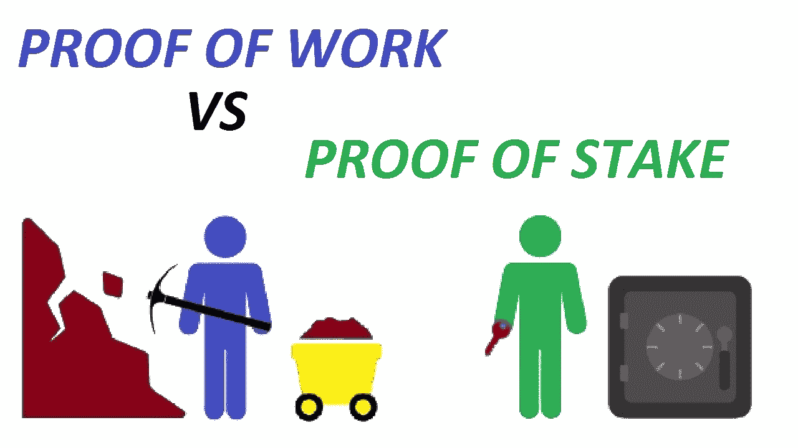
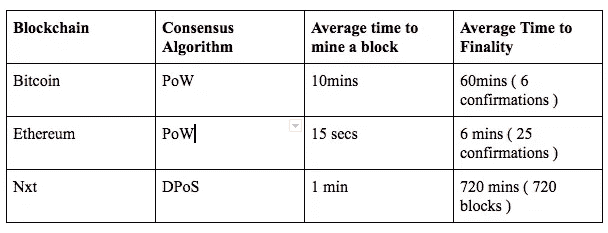

# 区块链终结-工作证明和利益证明

> 原文：<https://medium.com/coinmonks/blockchain-finality-pow-and-pos-35915a37c682?source=collection_archive---------3----------------------->

Source: [https://www.youtube.com/watch?v=t3vwB2osEeY](https://www.youtube.com/watch?v=t3vwB2osEeY)

终局性是过去的交易永远不能改变的保证。

在今天的区块链系统中，事务被认为是不可变的。但是，大多数区块链系统只提供概率交易终结性——交易不是立即终结的，而是最终会终结的。

> [发现并回顾最佳区块链软件](https://coincodecap.com)

因此，建议在比特币区块链交易时等待最多 6 次确认，在以太坊区块链交易时等待 20-25 次确认，以防止双重消费攻击。因此，在进行大额交易时，最好使用较高的确认数，因为确认数越高，交易的最终性越强。

另一个经常被忽视的关键指标是区块链终结时间，这是保证过去或最近的交易不会改变的指标。

下表显示了不同的区块链及其平均结束时间。

Average Time finality for different blockchains

# **为什么终结如此重要？**

终结性衡量一个人要等多久才能得到一个合理的保证，即在区块链写的交易是不可逆的，或者换句话说，不会被孤立。这对企业来说是一项重要的资产，因为在区块链网络上等待一个小时会对企业产生重大影响。

大多数公共区块链使用基于抽签的算法来选择节点以提出新的块。当通过网络交换最少的信息以达成共识时，这种方法可以很好地扩展，但是会导致网络中的链分叉，因此需要更长的时间来完成。

# **工作证明的终结**

大多数功率区块链系统都有一个称为最长工作链的属性，它有助于确定一致性。

让我们讨论一下最长的工作链以及它如何帮助达成共识。

当矿工开采一个区块时，他们总是希望在最长的链条上增加一个区块。然而，在任何时候都有可能存在不止一个链。

当两个不同的矿工同时开采一个区块时，一条链可以分成两个不同的分叉。此时，活动的主链已经分裂成两个不同的分支，很难确定哪个分支是有效的链。

在这种情况下，两个分支都将继续验证块并添加新块。一旦其中一个链在另一个链完成之前验证了一个块，它就成为最长的链。最长的链是具有最长最有效块的链。

最长的链正式成为被接受的链，而在较短链上挖掘的事务被拒绝。然而，在较短的链上被拒绝的事务可能已经被包含在最长的链上的其他块中。

影响异能终结攻击示例

1.  [自私的挖掘](https://www.investopedia.com/terms/s/selfish-mining.asp)
2.  [51%攻击](https://en.bitcoin.it/wiki/Majority_attack)

# **证据确凿**

基于区块链的不同 PoS 具有不同的达到最终结果的设计。PoS 有多种实施方式，如授权证明、授权证明等。在 PoS 系统中实现终结是今天基于 PoS 区块链系统中的主要讨论。

例如，Nxt 协议仅允许重组最后 720 个块，这意味着之前( *current_block_height - 720* )个块中的事务可以说是“最终的”，尽管具有 10 个确认的事务可以说是可靠的。但是这个设计仍然存在一些问题。

另一个例子是卡斯帕·FFG，他是 PoS 的以太坊实现之一，除了矿工之外，他还通过引入“验证者”的概念来实现“终结”。验证人员负责在关键检查站确认区块链——大约每 100 个街区一次。在这些检查点，一旦 2/3 的验证者确认了特定的块，那么它就成为最终的块。一旦完成，将无法再更改检查点之前的任何数据块。这些检查点保证了在检查点之前的块上的历史永远不会被改变。

可能影响发布最终性攻击示例

1.  [没有任何利害关系](https://hackernoon.com/nothing-at-stake-a-dialogue-2ded91318cb9)
2.  [茜玻发作](https://en.wikipedia.org/wiki/Sybil_attack)

# **结论:**

对于区块链系统来说，实现快速和安全的终结仍然是一个非常活跃的研究领域。例如，以太坊正在转向混合动力和 PoS 区块链设计，这有助于更快地完成区块链时间。越快结束越好。

# **延伸阅读:**

[https://blog . ether eum . org/2016/05/09/on-settlement-finality/](https://blog.ethereum.org/2016/05/09/on-settlement-finality/)