# 内容创建者的区块链:第 2 部分:为时间戳使用文字证明

> 原文：<https://medium.com/coinmonks/blockchain-for-content-creators-part-2-using-wordproof-for-timestamps-c25afeb4cf45?source=collection_archive---------3----------------------->

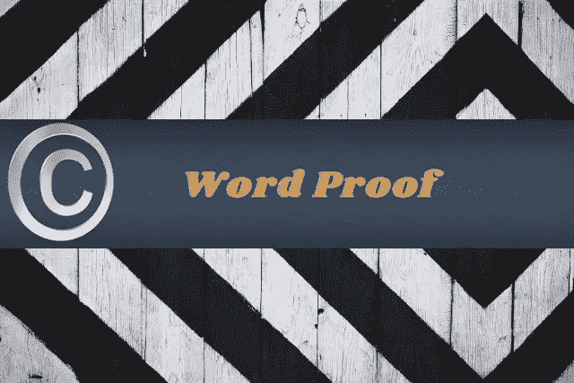

在[语音](https://www.voice.com/post/@tulip/blockchain-for-content-creators-part-2-using-wordproof-for-timestamps-1608404154-741607544)看我的原帖。

[**防字**](https://wordproof.com/) **已经成为内容创作者保护其内容的受欢迎的解决方案。它易于使用，消除了与区块链交互的所有复杂性。你只需要有一个防字账号，并把它和你的 WordPress 链接起来。**

## **功能:**

WordProof 有 4 个主要功能:

1.**版权保护**:在 EOS 或 Telos 区块链中为你的内容打上时间戳。

2.**时光机**:要透明，向你的读者展示你对内容所做的改动。

3.**可验证的真相** : Wordproof 让用户能够使用内容下方的弹出窗口来验证您的内容。

4.**SEO 的结构化数据**:因为有时间戳的内容比没有时间戳的文章更值得信赖，所以你能够证明内容的完整性。输出到 Schema.org 的时间戳，帮助你为下一代 SEO 做好准备。

## **使用 EOS 和 Telos 的版权保护:**

在本文中，我们将关注基本特性，版权保护

WordProof 使用以下步骤来确保您的内容在区块链中有时间戳，

它将内容转换成散列。这是一种生成独特指纹的数学算法

将哈希添加到区块链

证书已准备好供下载，作为您内容的证明。这可以下载为 PDF 格式。

## 如何使用 WordProof

在 Wordproof 网站中创建您的用户 ID 和密码。登录。

主页会显示你有多少时间戳。在免费计划中，你将默认每月获得 10 个时间戳。

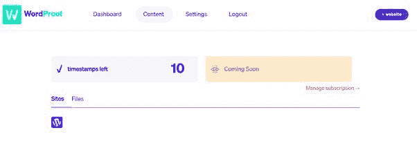

选择管理订阅链接，您将看到一个计划列表。请记住，这些计划针对不同类型的用户。简单的内容作者仍然可以使用免费计划。

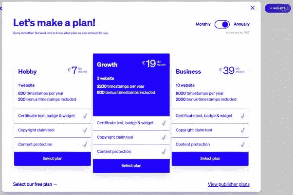

单击“查看发布者计划”以查看详细的计划。

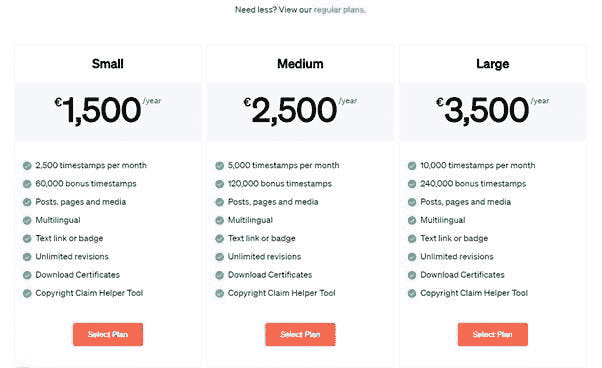

我点击了选择我们的免费计划。免费计划没有提供一些服务，但这是一个很好的开始，然后根据需要转移到下一个计划。

一旦你对你的计划感到满意，回到仪表板，点击网站按钮。

放上你的网址，选择区块链。你有两个选择

1.黎明的女神

2.泰洛斯

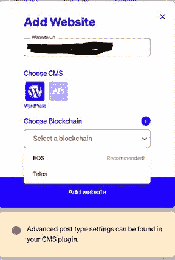

下面是对高级设置的介绍。它仍然是一个正在进行的工作，并放弃垃圾。然而，这并不是一种威慑。

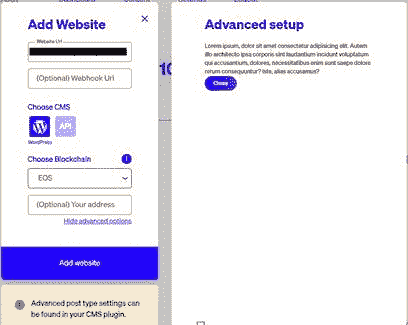

完成后，您将被要求连接您的网站。您需要生成一个站点密钥，您将把它放在您的网站上，以便平台进行同步。

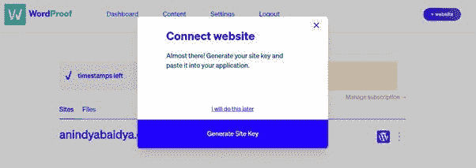

现在，打开你的 WordPress 仪表盘。安装 Wordproof 插件。一旦安装，它将出现在 WordPress 平台的左边栏。

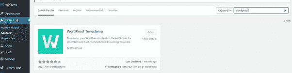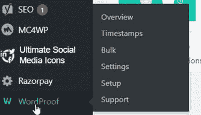

点击概览，它将打开各种选项。

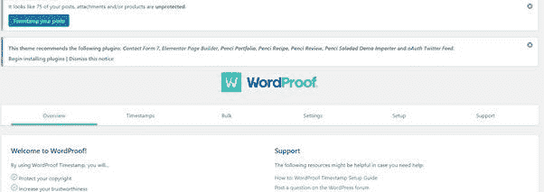

点击设置。该平台将向您展示所需的步骤。对于新加入者，建议您使用自动设置选项。

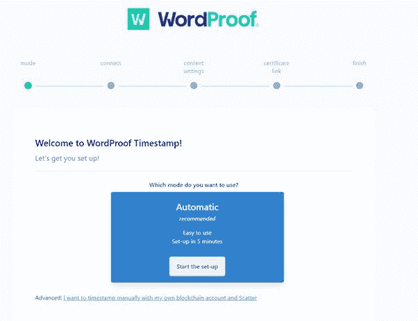

您已经有了从 Wordproof 网站生成的站点密钥(安全地存储此密钥)。点击是。

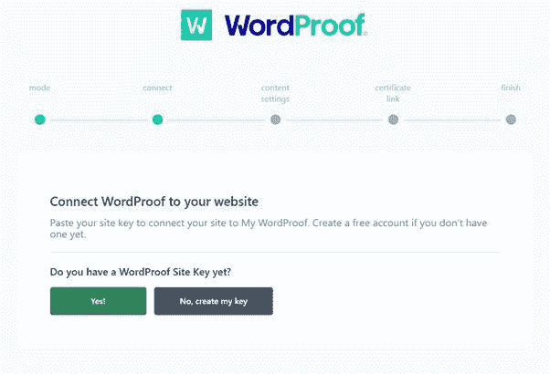

选择要添加时间戳的内容类型。此外，选择是否要显示修订。保存并继续。

你可能想给你的读者看看你作品的真品证书。点击下面的链接，输入你想和证书一起显示的文本。

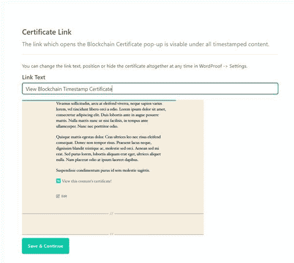

你的设置完成了。现在你可以单独给你的文章打上时间戳了。

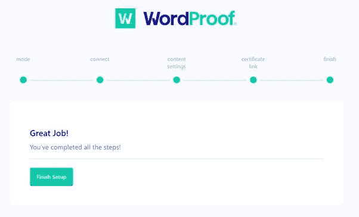

时间戳有两种方式。批量发布。批量，你可以选择在同一时间给你所有的文章打上时间戳。我更喜欢手动时间戳。

转到 WordPress 中的所有帖子。在每个内容的右侧，您会看到一个时间戳选项。点击这篇文章的时间戳。

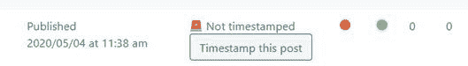

打给区块链的电话将被处理。

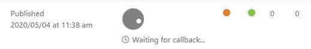

处理完成后，您将能够通过证书链接查看和下载您的证书

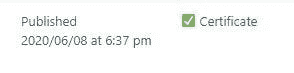

证书会给你你的区块链交易和哈希。检查日期和时间。

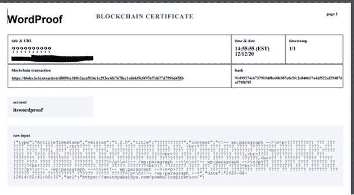

就是这样，下次有人偷你东西的时候，用这个证明作为所有权的证明。

阅读我以前的文章:[内容创作者的区块链:第一部分:区块链和版权流程](/coinmonks/blockchain-for-content-creators-part-1-blockchain-and-the-copyright-process-2facb8bf0dc0)

**加入**

Crypto.com—

**跟着我**

**👉** [推特](https://twitter.com/rumadas123)

**👉**[**Linkedin**](https://www.linkedin.com/in/ruma-das-a1439320/)

## **另外，阅读**

*   **了解以太坊和网络 3**
*   **[密码交易机器人](/coinmonks/crypto-trading-bot-c2ffce8acb2a)**
*   **[3 商业评论](/coinmonks/3commas-review-an-excellent-crypto-trading-bot-2020-1313a58bec92)**
*   **[AAX 交易所评论](/coinmonks/aax-exchange-review-2021-67c5ea09330c) |推荐代码、交易费用、利弊**
*   **[Deribit 审查](/coinmonks/deribit-review-options-fees-apis-and-testnet-2ca16c4bbdb2) |选项、费用、API 和 Testnet**
*   **[FTX 密码交易所评论](/coinmonks/ftx-crypto-exchange-review-53664ac1198f)**
*   **[n 零审核](/coinmonks/ngrave-zero-review-c465cf8307fc)**
*   **[Bybit 交换审查](/coinmonks/bybit-exchange-review-dbd570019b71)**
*   **[3Commas vs Cryptohopper](/coinmonks/cryptohopper-vs-3commas-vs-shrimpy-a2c16095b8fe)**
*   **最好的比特币[硬件钱包](/coinmonks/the-best-cryptocurrency-hardware-wallets-of-2020-e28b1c124069?source=friends_link&sk=324dd9ff8556ab578d71e7ad7658ad7c)**
*   **[密码本交易平台](/coinmonks/top-10-crypto-copy-trading-platforms-for-beginners-d0c37c7d698c)**
*   **最佳 [monero 钱包](https://blog.coincodecap.com/best-monero-wallets)**
*   **[莱杰 nano s vs x](https://blog.coincodecap.com/ledger-nano-s-vs-x)**
*   **[bits gap vs 3 commas vs quad ency](https://blog.coincodecap.com/bitsgap-3commas-quadency)**
*   **最好的[加密税务软件](/coinmonks/best-crypto-tax-tool-for-my-money-72d4b430816b)**
*   **[最佳加密交易平台](/coinmonks/the-best-crypto-trading-platforms-in-2020-the-definitive-guide-updated-c72f8b874555)**
*   **最佳[加密贷款平台](/coinmonks/top-5-crypto-lending-platforms-in-2020-that-you-need-to-know-a1b675cec3fa)**
*   **[莱杰纳米 S vs 特雷佐 one vs 特雷佐 T vs 莱杰纳米 X](https://blog.coincodecap.com/ledger-nano-s-vs-trezor-one-ledger-nano-x-trezor-t)**
*   **[block fi vs Celsius](/coinmonks/blockfi-vs-celsius-vs-hodlnaut-8a1cc8c26630)vs Hodlnaut**
*   **Bitsgap 评论——一个轻松赚钱的加密交易机器人**
*   **为专业人士设计的加密交易机器人**
*   **[PrimeXBT 审查](/coinmonks/primexbt-review-88e0815be858) |杠杆交易、费用和交易**
*   **[Altrady 审查](https://blog.coincodecap.com/altrady-reivew)**
*   **[埃利帕尔泰坦评论](/coinmonks/ellipal-titan-review-85e9071dd029)**
*   **[赛克斯·斯通评论](https://blog.coincodecap.com/secux-stone-hardware-wallet-review)**
*   **[区块链评论](/coinmonks/blockfi-review-53096053c097) |从您的密码中赚取高达 8.6%的利息**
*   **[Coinrule 评论](https://blog.coincodecap.com/coinrule-review-a-perfect-trading-bot)**
*   **[最佳区块链分析工具](https://bitquery.io/blog/best-blockchain-analysis-tools-and-software)**
*   **[加密套利](/coinmonks/crypto-arbitrage-guide-how-to-make-money-as-a-beginner-62bfe5c868f6)指南:新手如何赚钱**
*   **最佳[加密制图工具](/coinmonks/what-are-the-best-charting-platforms-for-cryptocurrency-trading-85aade584d80)**
*   **了解比特币的[最佳书籍有哪些？](/coinmonks/what-are-the-best-books-to-learn-bitcoin-409aeb9aff4b)**

> **[直接在您的收件箱中获得最佳软件交易](/coinmonks/newsletters/coinmonks)**

****