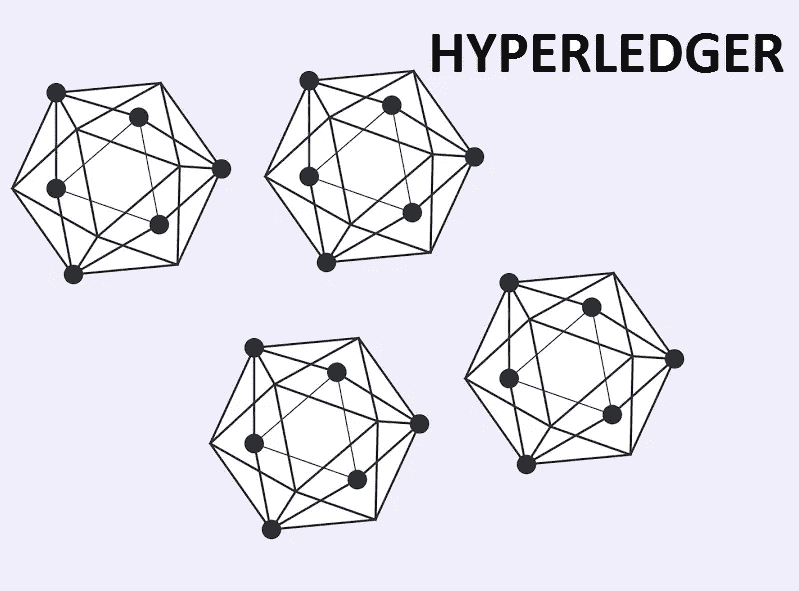

# 面向企业的区块链— Hyperledger

> 原文：<https://medium.com/coinmonks/blockchain-for-enterprises-hyperledger-182bc49c1cc5?source=collection_archive---------5----------------------->

## 面向企业的区块链— Hyperledger

[Source](https://www.openxcell.com/hyperledger)

随着世界各地的企业寻求如何将区块链应用于他们的行业，总会有一场讨论，即在安全性、可扩展性、模块化、可扩展性和分析方面满足大型企业需求的最佳框架是什么。随着时间的推移，我了解到这是一场宗教斗争，没有一个正确的答案，但根据我的研究以及与几位行业同事和大型企业的讨论，Hyperledger 的框架似乎是企业区块链用例的最佳选择。事实上，Hyperledger Fabric 支持各种行业的许可网络上的分布式分类帐解决方案。

那么，什么是 Hyperledger？Hyperledger 是来自 Linux 基金会([https://www.hyperledger.org/](https://www.hyperledger.org/))的开源框架，由超过 235 个组织支持，这些组织为框架贡献代码以使它们更好。它还在 35 多个国家拥有超过 60，000 个强大的开发人员社区。

让我们详细讨论一下这些领域:

**安检:**

企业想要的是私人的和被允许的东西。大多数大型企业都定义了数据架构和流程，并对其进行了很好的控制。当他们听到一些困扰区块链公共网络的失误时，他们最为紧张。Hyperledger Fabric 是私有许可网络的框架，其中所有参与者都有已知的身份，他们只能访问和贡献他们在业务流程中应该有权访问的数据部分。有了这一功能，Hyperledger Fabric 提供了一个许可网络，非常适合 B2B 和 B2B2C 场景，您可以在一个私有规则定义的环境中与供应商、贸易伙伴和最终客户的扩展社区合作。保护数据的散列甚至可以用数字密钥进一步增强安全性。Hyperledger Fabric 为密钥生成提供了已修改和未修改的 PKCS11，支持身份管理等情况，从而为敏感数据提供更多保护。通过 Channels(Hyperledger Fabric 的一部分),您可以确保区块链上数据的原子级分区，提供其他框架难以提供的细粒度安全访问控制。换句话说，人们可以在 Hyperledger Fabric 中非常有效地实现“需要知道基础”范例。

**模块化:**

Hyperledger Fabric 提供了一个即插即用的环境，允许网络主管添加他们的组件或首选实现。一家公司可能希望带来他们自己的组件或片段，他们希望重用，而 Fabric 允许他们无缝地将这些组件或片段放入整体架构中。这就像一个拼图游戏，你可以把你的一部分，并完成整个拼图和扩展。例如，在共识、加密和其他领域，您可以更轻松地用自己的组件扩展 Fabric。

**可扩展性:**

Hyperledger Fabric 的架构中有三个关键层:

1.分布式逻辑处理和协议(“链码”)

2.交易订单

3.交易验证和承诺

由于 Hyperledger Fabric 的架构方式，这三层在可伸缩性方面具有内在优势。网络节点之间需要更少的信任和验证周期。例如，只有签名和读/写集在网络中发送，从而提高了可扩展性和性能优化。向上扩展通常分为两个方面 a)扩展单个对等体 b)扩展网络。Hyperledger Fabric 更有效地支持这两种类型的缩放。

**分析:**

企业的一个关键要求是，我如何将它连接起来，以便为区块链网络提供端到端分析。考虑到对 LevelDB 和 CouchDB 的支持，它增加了完整的富数据查询支持，内容是 JSON 的，并且是完全可查询的。由于数据模型与现有的键/值模型一致，因此不需要将链代码数据建模为 JSON。

这极大地简化了区块链企业项目的分析需求，可以轻松地与任何现有的领先分析工具配合使用，并提供急需的可视化和分析支持，为区块链企业项目注入活力。

DLT.sg 是 Hyperledger [的普通会员](https://www.hyperledger.org/resources/blockchain-showcase?profile=dlt)，我们被列入区块链展示区。我们的开发团队是 Hyperledger 框架的积极贡献者。

With Daniela Barboasa (VP of WW Alliances, Hyperledger) in SFO

在我们最近访问 SFO 期间，与 Daniela barb OSA(Hyperledger 全球联盟副总裁)会面，了解 Hyperledger 框架和社区的最新情况，并与她就 Hyperledger 的未来交换意见，这是一件非常有趣的事情。感谢整个 Hyperledger 团队为这项变革性技术提供了一个优秀的开源框架。

在我结束之前，我很自豪地代表 Hyperledger 新加坡社区与大家分享，我们将于 6 月 29 日与 Julian Gordon(Hyperledger 亚太区副总裁)举行盛大的 Hyperledger 启动活动，他将在新加坡参加这次盛大的启动社区活动。对于那些热衷于贡献和加入这个发展最快的区块链开发者社区的人，请注册

 [## Hyperledger 新加坡社区 2018 盛大聚会

### 新加坡 Hyperledger 集团自豪地宣布将于 6 月 29 日举行社区大会。来学习如何和如果…

www.meetup.com](https://www.meetup.com/Hyperledger-Singapore/events/250809510/) 

[DLT](https://dlt.sg/) 和 [Hyperledger](http://hyperledger.org/) 将于 2018 年 6 月 29 日在新加坡组织一次聚会。请点击以下[链接回复。](https://www.meetup.com/Hyperledger-Singapore/events/250809510/)
这次会面是为了在实践团队之间建立网络并讨论一些重要的兴趣话题。我的文章中概述的讨论框架很少。

我期待着分享我们在 Hyperledger 方面的进一步经验，因为我们在生产中获得了越来越多的客户，并从现实生活中的企业部署中学习。

 [## DLT 和 Hyperledger 在新加坡组织 APAC 会议|分布式账本技术| DLT

### DLT 和 Hyperledger 将于 2018 年 6 月 29 日在新加坡组织一次聚会。请点击以下链接回复。作为企业…

dlt.sg](https://dlt.sg/dlthyperledger_meetup/)