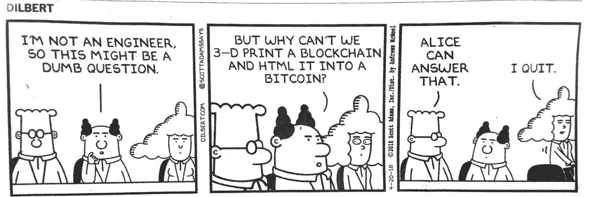
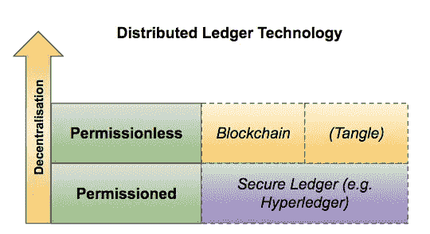
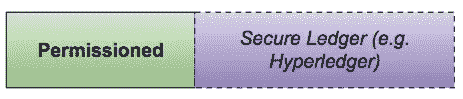
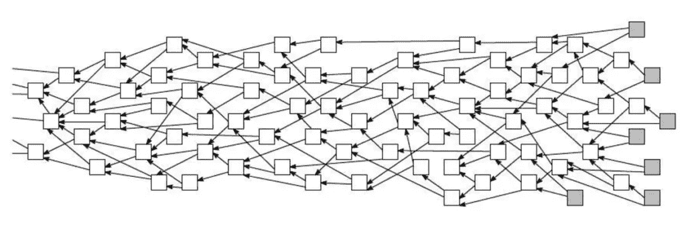

# 面向所有人的区块链？

> 原文：<https://medium.com/coinmonks/blockchain-for-everyone-1de042504c8a?source=collection_archive---------2----------------------->

我们生活在一个激动人心的时代，有如此多的技术革命和创新。对许多人来说，很难跟上多样性、复杂性和速度。为了看到它们的区别和权衡，理解基本原理是很重要的。出于这个原因，我们必须深入挖掘比市场营销和流行语宾果。

在这篇文章中，我想从一个稍微不同的角度提供一个概述，以理解“区块链”的适用性——特别是在企业环境中。大企业目前都在评估区块链，创造人工用例，委托自称专家，因为不想被落下。为了更好地理解，我想分享一下我对区块链真正好处的看法。

The Blockchain experts in enterprises

如今，实现区块链或分布式账本的障碍非常小。只需使用[https://aws.amazon.com/blockchain/templates/](https://aws.amazon.com/blockchain/templates/)并在 ECS / EC2 上部署，只需几分钟。有两个选项可用:Hyperledger Fabric 和以太坊(公共/私有)。

在我看来，“实践”提供了一个很好的机会来更好地理解这个系统，更好地掌握它是如何工作的。最终，它将导致一个顿悟，即不是每个用例都适合区块链，现代共享数据库是更好的选择。

但是，让我们后退一步，试着理解下面的概念:

我试图创建一个图形，它以二维和可消化的格式挤压了相当多的重要细节。最重要的术语是**分布式账本技术**，它基本上定义了一个具有共识机制的对等网络，以实现冲突解决的分布式数据集。

在跳到下一层之前，我想讨论一下**去中心化**，特别是与**分配**的比较，因为人们要么把事情搞混，要么只是把这些术语当作同义词使用。让我这样解释:

> 没有分散就可能有分配，但是没有分配就不可能有分散。

我试图从分布式系统的角度来展示它。需要解决的根本问题是*协议*。这基本上就是*共识*的全部内容:所有节点/参与者都同意某件事。即，在分布式系统中，有必要就单个领导者、组成员、配置等达成一致。如果领导者去世(或由于网络分区而不可用)，所有节点就谁是新领导者达成一致是很重要的。像 Apache Zookeeper 这样的集中式服务可以用于分布式同步。但更重要的是在一组一致的分布式数据上达成一致。分布式系统通常保证*最终的一致性*(或者*收敛)*所以我们可以预期，在某个不确定的时间长度之后，所有的读请求将返回相同的值。然而，这是相当弱的保证，并且有更强的保证，例如线性化。(如果你想深入了解这个话题，我真的可以推荐这本书[https://dataintensive.net/](https://dataintensive.net/)。)
以 Apache Kafka 为例说明*分布式*系统如何工作:

> 每个分区有一个充当“领导者”的服务器和零个或多个充当“追随者”的服务器。领导者处理对分区的所有读写请求，而从者被动地复制领导者。如果领导者失败，其中一个追随者将自动成为新的领导者。每台服务器在它的一些分区中充当领导者，在其他分区中充当跟随者，因此负载在集群中得到很好的平衡。([https://kafka.apache.org/documentation/](https://kafka.apache.org/documentation/))

为每个分区选择一个领导者(在 Apache Zookeeper 的帮助下，它以定额方式投票并存储领导者的数据)。领导者处理所有读/写请求，从者被动地复制领导者。这就是他们如何知道正确的数据并避免不一致:领导者是真理的来源，追随者只是复制数据。
这是一个分布式系统的例子，它不是分散的，因为它以领导者-跟随者的方式行动，并依赖于一个像 Apache Zookeeper 这样的中央分布式服务。

我以比特币为例来解释区块链(这是最突出的一种):它被描述为一个**分散的**和**分布式的**系统。在**分散系统**、**、**中，我们没有任何领导者/跟随者的角色，但是每个系统参与者都是平等的，比如所有参与者接收相同的数据。但是它是如何工作的呢？在比特币的情况下，数据(交易)被广播给所有连接的网络对等体。满节点临时存储未确认交易列表: *mem /交易池*。这些交易为网络所知，但尚未包含在区块链中。广播每一笔交易并不是网络中最有效的通信方式，也不是我们当今互联网的工作方式，因此建议使用第 2 层协议，如闪电网络(如果您感兴趣并需要了解详情，请在此处阅读:[https://media . com/@ melik _ 87377/闪电网络-启用-单播-比特币交易-闪电是比特币-TCP-IP-stack-8ec 1c 42 c 14 F5](/@melik_87377/lightning-network-enables-unicast-transactions-in-bitcoin-lightning-is-bitcoins-tcp-ip-stack-8ec1d42c14f5))。
某些事务是基于多种标准选择的，并且在经过验证后，会创建一个*候选块*作为块链中的下一个块。工作证明计算是由矿工开始的。当数据块被挖掘出来(找到了密码难题的解决方案)时，会向网络宣布数据块，并在开始下一场比赛之前再次进行验证。比特币的挖掘过程平均持续约 10 分钟；像 Litecoin 和 Monero 这样的其他实现就没那么多了。基本上，这足以让新数据块到达网络中的每个节点。然而，由于它是最后一个块，由于重组的机会，有一定的概率不信任最后一个块(零确认)。然而，正如 Emin Gün Sirer 已经概述的那样:比特币的读取协议是可参数化的。(ω= #块确认)

> Satoshi 建议ω值为 6，目前大多数商家都在使用。读取协议只是丢弃最后 6 个块，因此客户端根本看不到长度为 6 的后缀中的重组。([http://hackingdistributed . com/2016/03/01/比特币-保证-强-非最终-一致性/](http://hackingdistributed.com/2016/03/01/bitcoin-guarantees-strong-not-eventual-consistency/) )

然而，可以使用更低的ω。这在性能方面提供了较低的一致性保证(大约 6 个数据块的数据块深度平均需要大约 60 分钟)。买一杯咖啡或一些不太值钱的东西，零确认就足够了；尽管花费数千个比特币，但更强的一致性保证是可取的。这可以单独选择。基于读写机制的区别，我们可以假设比特币具有很强的一致性。

这意味着比特币能够保证很强的一致性，而不需要有一个领导节点。这是相当了不起的，因为在一个+20k 节点和数百万使用该技术的参与者的环境中，他们仍然就哪些数据是真实的达成一致。记住，你总是信任最长的链(投入最多工作的链)。

移动到下一层:**无权限**。这是去中心化和分布式系统产生最有用影响的一层。如前所述，在一个公共的、无权限的(每个人都可以参与和使用)网络中，主要的成就是就哪些数据是正确的达成一致。这是一个相当难解决的问题，但这就是比特币(从而区块链)取得如此革命性成就的原因。

> 从某种意义上说，比特币拥有世界上最丰富的 bug 赏金来揭示任何安全缺陷。于是，比特币用唯一能真正检验它的东西证明了它的安全性:时间。

**区块链**的革命性方面不是技术，如哈希链或工作证明，而是技术之上的游戏理论概念。通过所有块的线性链接和工作证明一致性算法，没有双重花费(或分布式系统术语中的*一致性冲突*)的方式，也没有欺骗系统的动机。没有理性的参与者有动机创建自己的“平行”区块链，或者甚至试图将 51%的计算能力放入网络，只是为了欺骗网络，因为这在经济上根本没有吸引力。试想一下，花费这巨大的精力，仅仅是为了欺骗一些参与者，或者是为了控制网络。

重要的是要理解，在公共(或始终敌对)环境中，每个人都可以参与的区块链博弈理论模型是革命性的成就。没有中央服务器可以黑。根本没有欺骗系统的经济动机，这是比特币自 2009 年(或 2008 年底)以来证明的。

在讨论像 Tangle([https://www.iota.org/](https://www.iota.org/))这样的无许可公共环境中的其他概念之前，我想概述一下与 Hyperledger 这样的区块链类似实现的差异，以及为什么我称它们为**安全账本**和**而不是区块链**。就博弈论模型是区块链的实际成果这一点来说，这对于 Hyperledger 这样的实现来说是不成立的。在 Hyperledger 中，您在一个私人环境中行动，您选择您想要合作的伙伴，并在这个选定的参与者圈子中获得同意。基本上，你信任这个网络中的每个人。不需要工作证明(或 PoS、dpo 等。)既然有了这层信任。

那么 Hyperledger 的成绩如何呢？用起来有意义吗？
我会说:当然！在过去的几十年里，公司从未实施过许可的分布式数据库(分类帐)。他们仍然使用各自为政的受限数据库，并通过传真或 Excel 报告手动共享数据。区块链迫使他们最终升级技术，并考虑许可、共享和分布式数据库。区块链这个词也是一个很好的机会，可以轻松地从其管理层获得一些预算。

让我们举一个最流行的例子，比如用**安全账本**(比如 Hyperledger)追踪钻石或钴。你定义你的合作伙伴，允许他们写入和读取数据链，并最终由 RBFT(冗余拜占庭容错)达成一致。但是，这并不妨碍任何人将虚假信息写入 Hyperledger。理解技术不能单独解决这个问题是很重要的，但是你也必须关注底层的业务流程。如果业务流程是垃圾，技术不会帮助你。

***TL；*博士**:这里我要明确的是**区块链**和**安全账本**的区别。 **区块链**:依靠博弈论向任何人开放网络，但仍然获得良好的结果(没有双重支出/数据一致性冲突)，并在敌对的环境中运行。(**去中心化** & **分布式** )
**安全台账**:许可链中的友好环境。简单地说，这是一种新技术，能够与选定的合作伙伴(集中管理的合作伙伴)实现许可、共享和分布式数据库。(**中枢** & **集散**)

作为最后一段，我想提一下**纠结**。你们中的一些人已经想知道为什么它在括号里。我用几句话解释一下 Tangle 和它与一个区块链的区别:
他们对一个有向无环图(DAG)的实现叫做 Tangle。它有一些不同于区块链的属性。它以非线性方式扩展，用户=矿工，无交易费用，低功耗。在发送交易之前，用户需要验证两个交易(tips)。这意味着，发出交易的用户越多，得到验证的交易就越多。

Visualisation of the Tangle ([www.btc-echo.de](http://www.btc-echo.de))

这个想法听起来很棒，很有前途。然而，IOTA 还处于早期阶段。它仍然骑着辅助轮。目前，一个名为“Coordinator”(或 Coo)的闭源组件正在集中确认交易，设置里程碑，防止重复支出以及垃圾邮件攻击。他们的路线图表明，当网络足够稳定时，可以移除协调器。不幸的是，当协调者被移除时，我无法描述 IOTA 网络的样子，因为我无法找到任何关于它的信息(如果你有什么，请与我分享！我很乐意添加它)，但场景可能是这样的:
1。有多个协调器，它们是同步(分布式系统)，在不同的子角度上工作。这样，一个玩家不能在两个不同的子交易中进行两次交易(重复消费)
2。通过加权随机游走来选择提示。缠结的大树枝变得越来越大，小树枝变得越来越小，直到它们被抛弃。(btw。有一个很酷的模拟:[https://public-krwdbaytsx.now.sh/](https://public-krwdbaytsx.now.sh/)。有必要的是，一个玩家的提示总是附在同一个子角上。这里的想法是一样的:如果一个玩家在两个不同的子角上两次发出相同的交易，就需要防止重复消费的问题。

这些只是我的一些想法。我看到了 IOTA 的底层实现——Tangle——能够完全去中心化的可能性，而不需要像协调器这样的中心组件。这就是我授权属性**分散**和**分布**的原因。但是我不得不加上括号，因为现在不是这样。

在这篇文章的最后，我想补充一些题外话，从几个不同的角度来评价**的**去中心化**和**无权的区块链的方面。从技术角度来看，区块链可以去中心化，但是在以太坊、莱特币、比特币现金等情况下。集中化以不同的方式呈现。莱特币是由[查理·李](https://medium.com/u/2ce693b5864c?source=post_page-----1de042504c8a--------------------------------)创立和管理的，以太坊是由[维塔利克·布特林](https://medium.com/u/587a00dbce51?source=post_page-----1de042504c8a--------------------------------)创立和管理的，比特币现金(BCH)是由罗杰·维尔和他的朋友们大力推广的——它们比比特币(BTC)移动得更快，因为它的创造者(中本聪)几年前就消失了。目前最流行的例子是比特币(BTC)和比特币现金(BCH)之间的冲突。人们积极地寻找领导者；对领导者有一种内在的需求:**他们想知道真正的比特币是什么**。但是，在我看来，不需要领袖。人民决定。如果你认为比特币是真正的比特币:投资。如果你认为比特币现金是真正的比特币:投资。最终的采用将决定哪一个是真正的比特币，那才是真正的去中心化。
此外，采矿集中化是一种属性，也可用于评估。有一篇[Jimmy Song](https://medium.com/u/4acb12744ff8?source=post_page-----1de042504c8a--------------------------------)([https://medium . com/@ Jimmy Song/mining-centralization-scenarios-b 74102 adbd 36](/@jimmysong/mining-centralization-scenarios-b74102adbd36))的文章相当不错，可以深入挖掘一下。

我希望你喜欢这篇文章。我期待得到一些反馈。

如果你想保持联系或者直接问我事情，你可以在推特上联系我:[https://twitter.com/ynkzlk](https://twitter.com/ynkzlk)

**Click to read more about Blockchain**