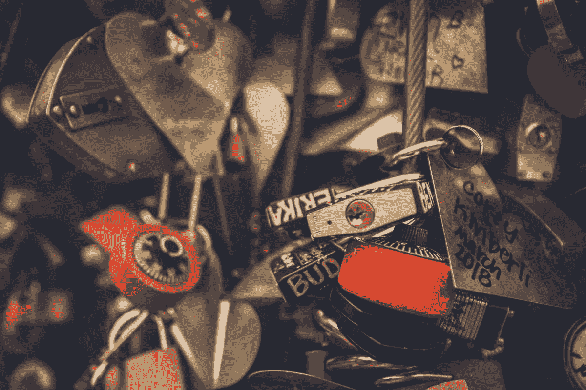

# 区块链:面向终身学习者

> 原文：<https://medium.com/coinmonks/blockchain-for-the-lifelong-learner-af192e6a87c2?source=collection_archive---------6----------------------->

我不是一个典型的技术早期采用者。作为短信的大器晚成者，在酷孩子拥有手机五年后，我也有了手机。几年前，当一个朋友提到她的丈夫正在玩一种叫做[比特币](https://www.investopedia.com/terms/b/bitcoin.asp)的新货币时，我翻了个白眼，这种货币采用了区块链技术。我们知道自从区块链出现以来的十年里发生了什么！

**区块链是…？**

大量的文章和视频试图用简单的语言解释区块链的概念。我将把长描述留给专家，但我喜欢下面六分钟的 explainer 视频。

一般来说，****是一种通过密码方法(使用代码)安全记录交易的数字账本。这是为了防止篡改和不必要的修改(因为多个实体参与了该记录)。这使它们成为比特币等数字货币的理想选择，但它们有许多用例。例如，区块链已经出现在教育领域(稍后将详细介绍)，甚至可以用来证明数字艺术印刷品的稀有性，为数字资产创造真实世界的估值。****

********

****与加密技术一样，区块链的安全性来自于它们通常以分散的方式存储的事实。想象一下一个巨大的 Word 文档，启用了跟踪修改，只有您可以对其进行添加，并且大多数编辑需要就要实施的修改达成一致— *和*10，000 人正在编辑。这是一个不完美的类比，但它描绘了一幅混乱它的困难的图画！****

****在学术证书的情况下，区块链的重要特征似乎是抗篡改性、区块链内用户数据的隐私性、证书提供者的数字签名能力以及验证记录的时间戳信息。****

******教育领域有前途的用例******

****利用区块链档案，一些教育机构希望提供一种标准化、开放和安全的方法来证明学术资格，如验证成绩单。麻省理工学院最近与[学习机](https://www.learningmachine.com/)合作，试点区块链技术，通过应用[麻省理工学院 Blockcerts 钱包](http://news.mit.edu/2017/mit-debuts-secure-digital-diploma-using-bitcoin-blockchain-technology-1017)向学生发送文凭。与传统的成绩单验证流程相比，其优势包括提高了流程效率，节省了时间和资源。****

****区块链还可以帮助学生通过作品集营销自己。展示学生作品的作品集已经存在一段时间了，它提供了一种将关键项目整理成一个学生作品包的方法。这方面有趣的项目来自德克萨斯大学的 [ChainScript](/inside-the-salesforce-ecosystem/the-platform-chronicles-10-questions-with-phil-komarny-chief-digital-officer-at-the-institute-for-c7972fd73acf) 和 [Badgechain](http://utbadgechain.org/) ，旨在成为学生学历证书的电子档案。有了 ChainScript，这个学生记录将包括他们所有的学术成就——从课程、文凭、证书到获得的数字徽章。这些都是奖励终身学习和授权学生掌控他们的知识路径(或学习者地图)的方式，从而创建他们专业故事的完整画面。****

********

****Photo by [Michał Parzuchowski](https://unsplash.com/@mparzuchowski?utm_source=medium&utm_medium=referral) on [Unsplash](https://unsplash.com?utm_source=medium&utm_medium=referral)****

******有哪些挑战？******

****正如数字徽章在很长一段时间没有标准的情况下运行一样(并且那些仍然随着 [IMS Global](https://www.imsglobal.org/) 的伟大工作而发展)，区块链是相对较新的技术；它并没有创建数据标准——它只是一种存储数据的方式。****

****此外，由于您不能在区块链中更改数据，因此撤销证书可能会很混乱，因为撤销本身必须是附加的区块链事务，与原始事务分开。这意味着您实际上只能附加认证，而不能删除它。****

****确实有一些围绕一个记录或地图的简洁对话，展示并验证了学生的所有学习成就，理论上包括学位、证书、推荐信、实习和经验的数字徽章。如今，人们越来越关注让学生的投资获得丰厚的教育回报——无论是在当前的工作岗位上升职，还是培养相关技能以获得新工作——我们应该探索帮助他们最有效地交流职业故事的方法。如果区块链能帮助学生在职场中推销自己，我完全赞成探索。****

****作为一个终身学习者，回顾未来几年的发展会很有趣！****

******如果你喜欢这篇文章，欢迎关注我或者为它鼓掌。** **谢谢！******