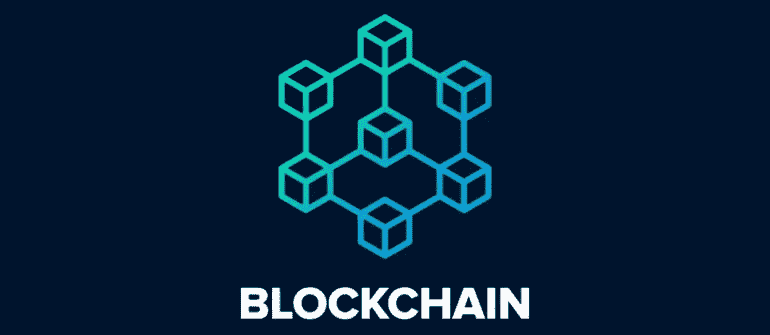
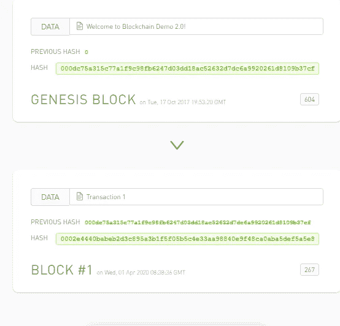
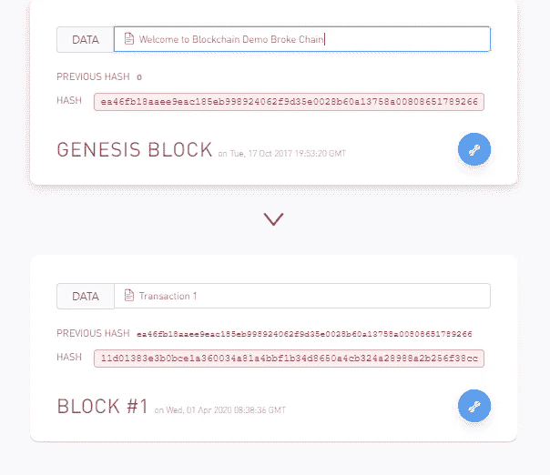
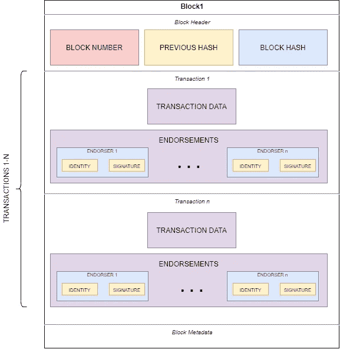
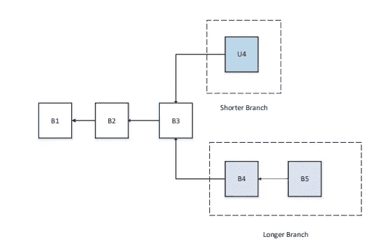
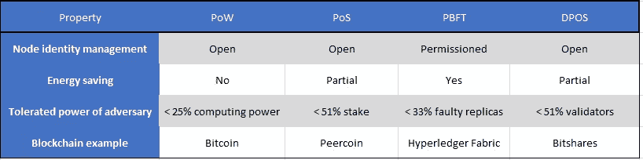

# 区块链框架—第 1 部分:简介

> 原文：<https://medium.com/coinmonks/blockchain-frameworks-part-1-introduction-307846125c71?source=collection_archive---------4----------------------->

## 在这篇和下一篇文章中，我将解释区块链技术和它最著名的框架

# **指标:**

1.  [**第一部分:简介**](/@antonioalfa22/blockchain-frameworks-part-1-introduction-307846125c71)
2.  [**第二部分:智能合约**](/@antonioalfa22/blockchain-frameworks-part-2-smart-contracts-d22606ed577f)
3.  [**第三部分:区块链类型**](/@antonioalfa22/blockchain-frameworks-part-3-blockchain-types-3189c80e3bb2)
4.  [**第四部分:以太坊**](/@antonioalfa22/blockchain-frameworks-part-4-ethereum-9d44d5f22d0)
5.  **第五部分:总账**
6.  第六部分:IOTA
7.  第 7 部分:法定人数
8.  **第八部分:多余的 1；海德拉哈希图**
9.  **第八部分:多余的 2；天秤座**

# **第 1 部分:简介**

区块链是一个分布式的、带时间戳的、仅附加的数据分类帐，其中分布式网络的每个节点同时具有分类帐信息，并由地址标识。

区块链采用非对称加密(使用公钥)来确保只有账户的所有者(公钥和私钥的所有者)才能发起与该账户相关的交易。

[区块链](https://blog.coincodecap.com/what-is-blockchain-a-simple-guide-for-dummies/)交易被分组为区块(其中可能有一个或多个交易)，每个区块存储关于前一个区块的信息(形成一个链)。

Blockchain Demo (source: [https://blockchaindemo.io/](https://blockchaindemo.io/))

如果我们改变一个块的内容，它的散列也会改变，从而打破这个链。

Blockchain Demo2 (source: [https://blockchaindemo.io/](https://blockchaindemo.io/))

区块包含的内容可以根据我们使用的[区块链](https://blog.coincodecap.com/what-is-blockchain-a-simple-guide-for-dummies/)框架而变化，但不能变化的内容是我将在下面列出的内容:

**块标题**

*   批号
*   以前的哈希
*   块散列

**交易(1-n)**

1.  背书(一对多)

*   背书人-n 身份(证书、公钥)
*   背书人签名

2.事务数据

**块元数据(可选)**

Block content

只能通过追加新块来改变记录，并且如果不替换所有后续块，就不能改变有效块，因此只能通过添加新块来更新块链。

# 共识:

在区块链，如何在不可信的节点之间达成共识是拜占庭将军们的一个转变

(BG)问题([https://dl.acm.org/doi/pdf/10.1145/3335772.3335936](https://dl.acm.org/doi/pdf/10.1145/3335772.3335936))。

在区块链，没有中央节点来确保分布式节点上的分类账都是相同的。需要一些协议来确保不同节点中的分类账是一致的。现在我们将介绍几种在区块链达成共识的常用方法。

An scenario of blockchain branches (the longer branch would be admitted as the main chain while the shorter one would be deserted).

# **工作证明(战俘):**

这是一种主要由比特币使用的共识策略，其中，为了避免随机选择要添加到链中的块(因为这种随机选择容易受到可能的攻击)，想要向网络发布新块的节点必须做大量工作来证明该节点不可能攻击网络。

通常，该工作意味着多个计算机计算，其中网络的每个节点都在计算可以被服务器容易地验证的块报头的散列值(如上所述)。如果区块通过验证，其他采矿者会将这个新区块附加到他们自己的区块链中。计算哈希值的节点被称为矿工，PoW 过程被称为比特币的挖掘。

有势力的区块链例子:Mainnet 中的比特币和以太坊

# 股权证明(PoS):

PoS 是 PoW 的节能替代方案，在 PoW 中，矿工必须证明他们对网络中货币数量的所有权。

这种共识算法假设拥有更多货币的人不太可能攻击网络。

由于基于账户余额的选择是相当不公平的，因为最富有的人注定在网络中占主导地位，所以提出了许多结合股份大小的解决方案来决定谁包括网络的下一个区块。

带 PoS 的区块链实例:研究中的以太坊

# 实用拜占庭容错(PBFT):

在 PBFT，新街区是在一轮中确定的。在每一轮中，将根据一些规则选出初选。并且它负责订购交易。整个过程可以分为三个阶段:前期准备、准备和提交。在每个阶段，如果一个节点获得了超过 2/3 节点的投票，则进入下一阶段。因此，PBFT 要求网络知道每个节点(私有区块链)。

PBFT 区块链示例:Hyperledger Fabric

# 委托股权证明(DPOS):

波斯和 DPOS 的主要区别在于波斯是直接民主的，而 DPOS 是代议制民主的。

在 DPOS，利益相关者选举他们的代表来生成和验证区块。由于验证该块的节点显著减少，所以该块可以被快速确认，从而导致交易的快速确认。同时，代理可以调整网络的参数，如块大小和块间隔。此外，用户不需要担心不诚实的代表，因为他们很容易被投票淘汰，但 DPoS 系统容易受到集中化的影响，因为见证人的数量是严格限制的。

DPOS 区块链的例子:BitShare 或 EOS

# 主要共识总结:

Main consensus summary

# 其他共识算法:

*   涟漪
*   嫩薄荷

> [在您的收件箱中直接获得最佳软件交易](https://coincodecap.com/?utm_source=coinmonks)

