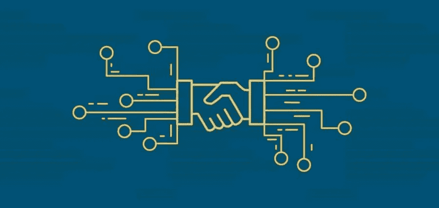
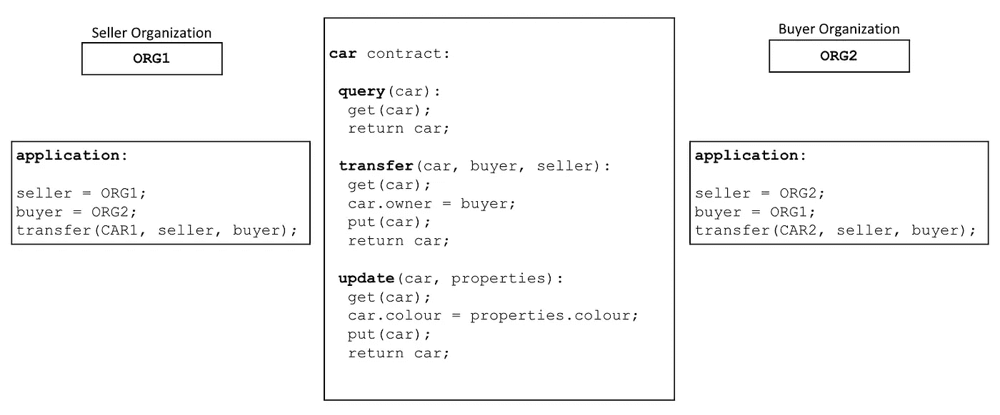
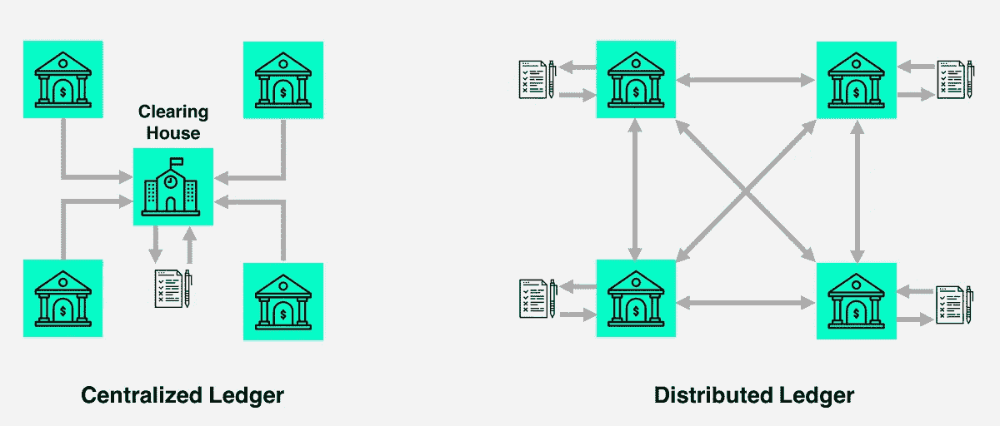

# 区块链框架—第 2 部分:智能合约

> 原文：<https://medium.com/coinmonks/blockchain-frameworks-part-2-smart-contracts-d22606ed577f?source=collection_archive---------3----------------------->

## 在这篇和下一篇文章中，我将解释区块链技术和它最著名的框架

# 索引:

1.  [**第 1 部分:简介**](/@antonioalfa22/blockchain-frameworks-part-1-introduction-307846125c71)
2.  [**第二部分:智能合约**](/@antonioalfa22/blockchain-frameworks-part-2-smart-contracts-d22606ed577f)
3.  [**第三部分:区块链类型**](/@antonioalfa22/blockchain-frameworks-part-3-blockchain-types-3189c80e3bb2)
4.  [**第四部:以太坊**](/@antonioalfa22/blockchain-frameworks-part-4-ethereum-9d44d5f22d0)
5.  **第五部分:总账**
6.  第六部分:IOTA
7.  第 7 部分:法定人数
8.  **第八部分:额外 1；海德拉哈希图**
9.  **Part 8:Extra 2；天秤座**

# 第 2 部分:智能合约:

区块链技术的最初用途是在不需要可信第三方的情况下进行点对点货币交易。

比特币就是最好的例子。

后来，区块链技术开始发展，并开始支持交易期间智能合同的执行，为区块链添加了更多功能。

一个 [**智能合约**](https://blog.coincodecap.com/tag/smart-contact/) 是运行在区块链中的一个程序或者一段代码，在交易发生时执行，并由网络的共识算法强制其正确执行。

合同可以对其编程语言中表示的任何规则集进行编码，例如，合同可以在某些事件发生时执行转移(例如，在托管系统中支付保证金)。

因此，智能合约可以实现广泛的应用，包括金融工具(例如，子货币、金融衍生品、储蓄钱包、遗嘱)和自我执行或自主治理应用。

**例如:**

Smart Contract Example from [https://hyperledger-fabric.readthedocs.io/en/release-2.0/smartcontract/smartcontract.html](https://hyperledger-fabric.readthedocs.io/en/release-2.0/smartcontract/smartcontract.html)

在前面的示例中，我们可以看到两个组织`ORG1`和`ORG2`如何为`query`、`transfer`和`update`汽车定义了一个`car`智能合同。

来自这些组织的应用程序调用这个智能契约来执行业务流程中商定的步骤，例如将特定汽车的所有权从`ORG1`转移到`ORG2`。

# 分类帐:

Centralized and Distributed Ledger

简单来说，区块链以不变的方式记录了分布式账本中发生的所有交易。区块链网络中的每个节点都有该账本的更新副本。

智能合约以编程方式访问分类帐的两个不同部分:

*   一个**，它不变地记录了所有交易的历史，**
*   **一个**世界状态**，它保存了这些状态的当前值的缓存，因为这是一个通常需要的对象的当前值。**

**通常，智能合约主要用于添加、删除、获取或更新世界状态中的状态，以及可以查询不可变的交易区块链记录。**

**任何操作(无论是添加新元素还是从世界状态中删除现有元素)都在区块链不可变记录中。**

# **智能合同语言:**

**为了开发智能合约，根据您使用的区块链框架，您必须用特定的编程语言对其进行编码(尽管目前多个框架支持多种编程语言)。**

**一些例子是:**

*   **[**以太坊**](https://solidity.readthedocs.io/en/v0.6.4/) :坚固性**
*   **[**Hyperledger Fabric**](https://hyperledger-fabric.readthedocs.io/en/release-2.0/getting_started.html#hyperledger-fabric-smart-contract-chaincode-apis)**:**支持 Go、NodeJS 和 Java**
*   **[**海德拉哈希图:**](https://www.hedera.com/smart-contract) 坚固度**
*   **[**NEO**](https://docs.neo.org/docs/en-us/sc/gettingstarted/introduction.html) : C#**
*   **[EOS:c++](https://developers.eos.io/manuals/eosio.contracts/latest/key-concepts/system)**

> **[直接在您的收件箱中获得最佳软件交易](https://coincodecap.com/?utm_source=coinmonks)**

********