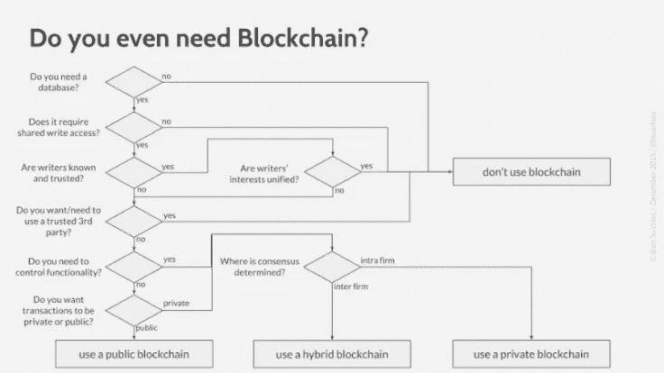
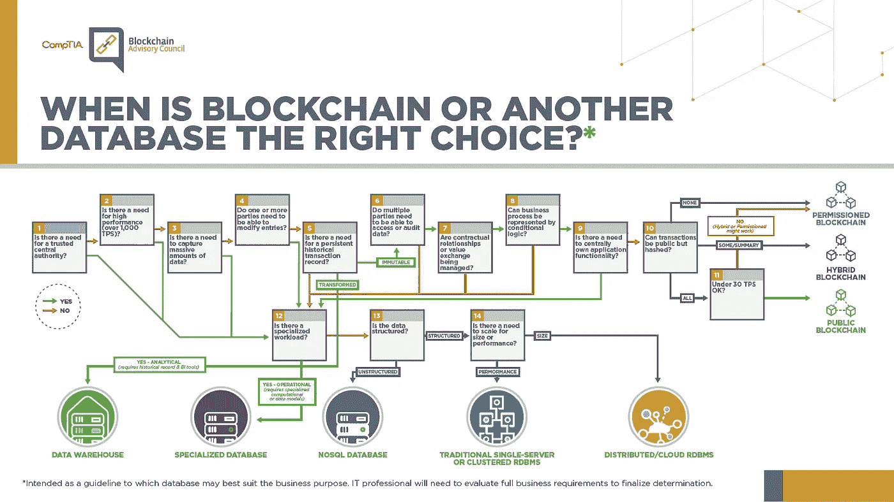

# 区块链框架—第 3 部分:区块链类型

> 原文：<https://medium.com/coinmonks/blockchain-frameworks-part-3-blockchain-types-3189c80e3bb2?source=collection_archive---------0----------------------->

## 在这篇和下一篇文章中，我将解释区块链技术及其最著名的框架

# 索引:

1.  [**第一部分:简介**](/@antonioalfa22/blockchain-frameworks-part-1-introduction-307846125c71)
2.  [**第二部分:智能合约**](/@antonioalfa22/blockchain-frameworks-part-2-smart-contracts-d22606ed577f)
3.  [**第三部分:区块链类型**](/@antonioalfa22/blockchain-frameworks-part-3-blockchain-types-3189c80e3bb2)
4.  [**第四部分:以太坊**](/@antonioalfa22/blockchain-frameworks-part-4-ethereum-9d44d5f22d0)
5.  **第五部分:总账**
6.  **第六部分:IOTA**
7.  第七部分:法定人数
8.  **第八部分:额外 1；海德拉哈希图**
9.  **第八部分:多余的 2；天秤座**

# 第三部分:区块链类型:

根据如何对网络参与者(对等体)进行管理，现有的区块链可以分为三种类型，它们是:

*   **公共区块链:**对广泛的个人开放
*   私人区块链:对有限数量的个人开放
*   **混合区块链**:取决于实现区块链的框架

公立和私立区块链(以及混合型)各有利弊。一旦你知道这一点，你就应该选择最适合你想要使用区块链的用例。

# **公共区块链:**

在公共区块链，任何人都可以加入公共网络。参与者阅读、添加条目，并参与区块链流程。

这种系统的特点是分散化，这意味着没有任何第三方对区块链的控制，以及在系统中确认核查后防止区块发生变化。

**优点:**

*   完全分权
*   添加和读取信息的开放性—所有参与者都有同等的查看和执行操作的能力
*   不变

**缺点**

*   慢速交易< 30 TPS
*   Limited number of transactions in each block
*   Excessive openness of a public blockchain may be a disadvantage for some companies, as there is no privacy due to the available transaction history

# Private Blockchains

A private blockchain only allows a limited number of participants to read the chain. These participants are known and must be authorized in advance.

Private type Blockchains are more suited to the business environment where you do not want the content stored in the blockchain to be public.

**优势:**

*   控制哪些实体可以加入区块链
*   比公共区块链更快的交易
*   改进的可扩展性—一个重要的优势是能够添加节点和必要的服务
*   私人交易

**缺点**

*   随着参与者数量的增加，注册中心遭受攻击的风险也会增加。
*   集中控制是一个巨大的缺点，因为规则是由一个人或一群人制定的。

# 混合区块链

私有区块链仅允许有限数量的参与者读取该链。这些参与者是已知的，必须事先获得授权。

混合区块链位于私人和公共区块链之间，取决于它们的架构。

一般来说，混合区块链的操作取决于实现它的框架。

混合区块链的区别在于它们并不对所有人开放，但仍然提供了区块链的特性，如完整性、透明性和安全性。

Do you even need Blockchain? From [Suichies Model](https://eprint.iacr.org/2017/375.pdf)

# **无权限&有权限区块链**

除了区块链中的公有、私有和杂种的分离之外，在这些之内我们还可以分为另外两类:

*   **无许可的区块链**是开放的、去中心化的。任何对等体都可以作为读者和作者随时加入和离开网络。有趣的是，没有一个中央实体来管理会员资格，或者禁止非法读者或作者。

这种开放性意味着任何对等体都可以阅读所写的内容。然而，通过使用密码原语，设计隐藏私人相关信息的无许可区块链在技术上是可行的，

*   被许可的区块链只授权给有限的读者和作者。在这里，中央实体决定并赋予各个对等体参与区块链的写或读操作的权利。

为了提供封装和隐私，读取器和写入器也可以在互连的独立并行区块链中运行。

> [直接在您的收件箱中获得最佳软件交易](https://coincodecap.com/?utm_source=coinmonks)

> [**也读作:无权限区块链 vs 有权限区块链**](https://blog.coincodecap.com/permissionless-and-permissioned-blockchain/)

# 什么时候用区块链，用哪个？

When is Blockchain or another database the right choice? by [CompTIA 2019](https://www.comptia.org/content/infographic/blockchain-decision-tree)

