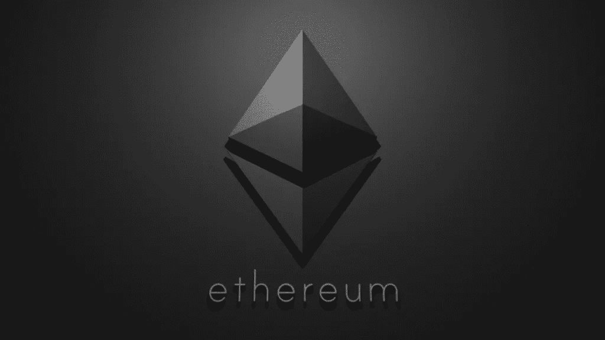

# 区块链框架—第 4 部分:以太坊

> 原文：<https://medium.com/coinmonks/blockchain-frameworks-part-4-ethereum-9d44d5f22d0?source=collection_archive---------4----------------------->

## 在这篇和下一篇文章中，我将解释区块链技术和它最著名的框架

# 索引:

1.  [**第一部分:简介**](/@antonioalfa22/blockchain-frameworks-part-1-introduction-307846125c71)
2.  [**第二部分:智能合约**](/@antonioalfa22/blockchain-frameworks-part-2-smart-contracts-d22606ed577f)
3.  [**第三部分:区块链类型**](/@antonioalfa22/blockchain-frameworks-part-3-blockchain-types-3189c80e3bb2)
4.  [**第四部分:以太坊**](/@antonioalfa22/blockchain-frameworks-part-4-ethereum-9d44d5f22d0)
5.  **第五部分:总账**
6.  **第六部分:IOTA**
7.  第七部分:法定人数
8.  **第八部分:额外 1；海德拉哈希图**
9.  **第八部分:多余的 2；天秤座**

# 第四部分:以太坊:

在[以太坊](https://ethereum.org/)中，状态由被称为**账户**的对象组成，每个账户有一个 20 字节的地址，状态转换是账户之间价值和信息的直接转移。以太坊帐户包含四个字段:

*   nonce 是一个计数器，用于确保每笔交易只能处理一次
*   账户的当前余额
*   帐户的合同代码(如果有)
*   帐户的存储空间(默认为空)

**以太** **(ETH)** 是以太坊主要的内部加密燃料，用于支付交易费用。

**钱包**是允许以太坊用户存储以太并与以太坊网络上的智能合约交互的应用。

# **智能合约**

在以太坊中，合同被赋予一个地址来唯一地识别它们(它是创建者地址和他们以前发送过多少交易的散列)。然后，客户端可以通过发送以太网、调用函数、查询它管理的分布式状态等方式与该地址进行交互。

以太坊智能联系人是用一种叫做 [**Solidity**](https://solidity.readthedocs.io/en/v0.6.4/) 的编程语言编写的，看起来很像 Javascript。

**气体**

智能合约由网络中的每一个完整节点通过 **EVM(以太坊虚拟机)**来执行。执行计算的成本与代码执行的计算直接相关。

EVM 中的每个低级代码执行起来都要消耗一定量的**气体**(是执行计算的成本)。

天然气的“价格”由市场决定，类似于比特币的交易费。如果您支付更高的天然气价格，节点将优先处理您的交易。

# 分散应用程序

在以太坊中，分布式应用程序是调用网络中现有智能合约的另一种方式。

一个 [dApp](https://blog.coincodecap.com/what-are-dapps-an-ultimate-guide/) 最终会在区块链中存储一个任何人都可以读取的信任状态。一些 dApps 也使用分布式技术如 [**IPFS**](https://ipfs.io/) 和 [**假人**](https://golem.network/) 来处理区块链以太坊之外的计算和存储，但采用同样分散的方式。

**dApp 客户端**

dApp 客户端是一个应用程序(通常是 web app ),它提供了一个友好的界面来与 dApp 进行交互。

**dApp 浏览器**

dApp 浏览器是一个使使用 dApp 客户端更容易的应用程序。

dApp 浏览器的主要用途是:

1.  提供到以太坊节点的连接，并提供一种简单的方法来将该连接更改为指向不同的节点。
2.  为用户提供帐户接口(“钱包”)，以便他们可以轻松地与这些 dApps 进行交互。

示例:

*   [迷雾](https://github.com/ethereum/mist)(官方以太坊 dApp 浏览器)
*   现状年代
*   [Toshi](https://blog.toshi.org/introducing-token-2f2ceeab6d4c)
*   [元蒙版](https://metamask.io/)(镀铬扩展)

# dApps 示例

 [## HelloZeroNet/ZeroNet

### 使用比特币加密和 BitTorrent 网络的分散网站- https://zeronet.io 我们相信开放、免费的…

github.com](https://github.com/HelloZeroNet/ZeroNet)  [## 占卜项目

### GitHub 是 4000 多万开发者共同工作的家园。加入他们，发展您自己的开发团队，管理…

github.com](https://github.com/AugurProject)  [## 是/eth-tweet

### 这个库包含了运行在以太坊区块链上的分散式微博服务的代码。的…

github.com](https://github.com/yep/eth-tweet)  [## d11e 9/阿凡达

### Avatar 以太坊合约以开放和分散的方式合并了 keybase.io 和 Gravatar 的功能…

github.com](https://github.com/d11e9/avatar) 

# 资源

 [## 以太坊/维基

### 以太坊的介绍性论文，在发布前介绍，维护。中本聪对…的发展

github.com](https://github.com/ethereum/wiki/wiki/White-Paper)  [## 坚固性-坚固性 0.6.4 文件

### 如果您不熟悉智能合约的概念，我们建议您从用…编写的智能合约示例开始

solidity.readthedocs.io](https://solidity.readthedocs.io/en/v0.6.4/)  [## 以太坊 Dapp 终极教程(如何构建全栈去中心化应用…

### 今天我将向您展示如何在以太坊区块链上构建您的第一个去中心化应用程序，或 dApp

www.dappuniversity.com](https://www.dappuniversity.com/articles/the-ultimate-ethereum-dapp-tutorial)  [## 快速了解以太坊

### 从零到💯没有那些废话。

medium.com](/@mattcondon/getting-up-to-speed-on-ethereum-63ed28821bbe)  [## 以太坊工作室| Solidity IDE

### 帮助学习、编码、构建和部署智能合约和分散应用程序的工具。不要浪费宝贵的时间…

studio.ethereum.org](https://studio.ethereum.org/)  [## 面向开发者的以太坊| Ethereum.org

### 基于以太坊的开发者指南、资源和工具。如果您是以太坊开发的新手，那么您在…

ethereum.org](https://ethereum.org/developers/#getting-started)  [## 以太坊/dapp-bin

### 所有应用程序的生存之地。在 GitHub 上创建一个帐户，为以太坊/dapp-bin 的开发做出贡献。

github.com](https://github.com/ethereum/dapp-bin) 

> [在您的收件箱中直接获得最佳软件交易](https://coincodecap.com/?utm_source=coinmonks)

