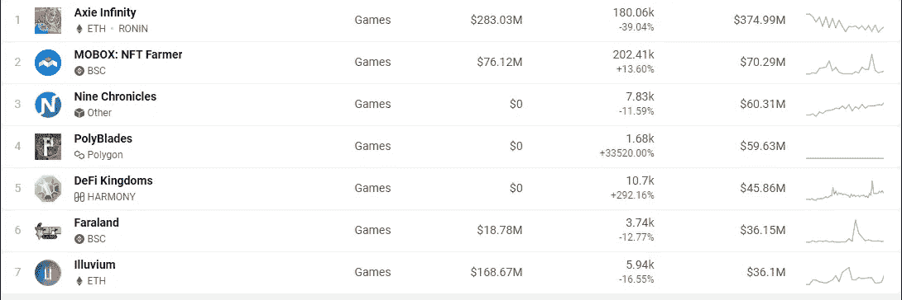
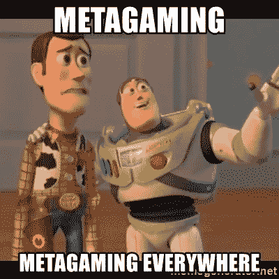
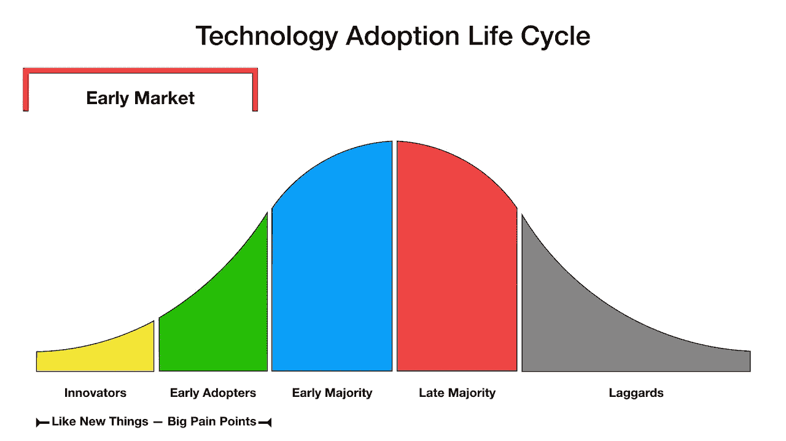

# 娱乐和盈利的区块链游戏

> 原文：<https://medium.com/coinmonks/blockchain-gaming-for-fun-and-profit-6d103c56f872?source=collection_archive---------19----------------------->

#playtoearn 是一个神话般的机会，但真正的钱是在元游戏。

区块链游戏现在很火！每天都有新的报道说人们从主要的书籍中赚了多少钱。无限轴。分裂之地，外星世界。泽德跑了。高地。

你是在火车上，还是觉得错过了什么？

[https://dappradar.com/rankings/category/games](https://dappradar.com/rankings/category/games)

> 订阅 [**Coinmonks Youtube 频道**](https://www.youtube.com/c/coinmonks/videos) 获取每日加密新闻。

# 你到底在玩什么游戏？

令人惊讶的是，区块链让你能够拥有自己的游戏内资产和货币，促进了游戏本身以外的市场。任何多人游戏都有一个元游戏——元游戏是“围绕游戏的游戏”。我被教导“任何有三个或更多员工的工作场所都有办公室政治:如果你认为你的没有，那是因为你在失败。”

游戏也是如此。每个多人游戏都有一个“元游戏”……关于不同游戏风格的文化规范，认为职业更强大的不断变化的规范，以及通常超越个人游戏的各种派系、公会或联盟之间的政治，因为玩家在多个游戏平台上相互加入。

双层系统(内部游戏设计，外部市场)将元游戏提升到一个全新的水平。在你进入#playtoearn 并开始将你对游戏的热情转化为热门的新数字现金之前，是时候进行一些反思了。

你打算玩实际游戏，还是玩元游戏？你必须知道规则才能在任何游戏中表现出色，所以你真的需要知道你实际上在玩什么游戏，以及应该关注哪些规则。

# 市场的游戏

无论你专注于玩游戏本身，还是元游戏，你都受到市场力量的影响。实际上，如果你玩游戏，你也在玩元游戏，但是你可以不玩实际的游戏而玩元游戏(尽管玩游戏可以帮助你玩元游戏)。

#playtoearn 的核心理念是游戏内动作可以获得有价值的奖励。您可以通过为游戏投资 NFT 来提高游戏时间所能产生的价值，从而帮助您优化游戏性能。玩你喜欢的游戏赚钱是一个很酷的想法，但区块链游戏受制于全球市场力量。这意味着**一个游戏中“磨”的*基数*值将被降低**到游戏流行的最贫穷国家的生计工资水平。你通常可以通过选择正确的游戏内优化来改善这一点，但如果你生活在一个相对富裕的国家，那么*基数*值将会太低，以至于你无法生活下去。但是不要绝望，真正的钱在元游戏里！

# 评估新项目

想想这个:如果我玩游戏是为了赚钱，或者投资游戏资产，我要把它们卖给谁？每笔交易都必须有买家。

我总是先玩几次实际的游戏，然后问自己一些快速的问题:

*   玩起来好玩吗？
*   有没有什么深度或者战略复杂度？
*   我能想象休闲玩家每月花几块钱在游戏中做得更好吗？

需要有玩家玩游戏，因为他们享受游戏，而不仅仅是为了赚钱。如果每个玩家都只想赚钱，那么这个游戏就是一个漂亮包装的庞氏骗局。可能还有盈利的策略，但是风险更高，潜力更低。

没有一些#paytowin 游戏机制，你就不可能有一个健康的#playtoearn 游戏经济，但游戏需要足够的战略复杂性，没有#paytowin 它也可以很有趣……这样休闲玩家就可以享受而不会成为一个金钱汇。

# 深度指南

接下来我要找的是深入的指南。如果一个游戏是全新的，这些可能还不可用，但如果游戏已经推出了一段时间，通常会有一些可用的。在我写这篇文章的时候，我的一个朋友发表了一个[的奇妙例子](https://peakd.com/hive-13323/@ecoinstant/splinterlands-investing-battling-and-earning-12-beginner-s-tips)。

深入的指南帮助你看到游戏和元游戏之间的关系。他们帮助你评估一个游戏是否有足够的复杂性来吸引和留住更多的休闲玩家。最后，它们会给你一个起点，让你知道哪些游戏内资产可能是最好的投资。

*专家提示:当你找到很棒的深度指南时，看看作者还写了什么，并关注他们未来的工作。这是一个找到更多区块链游戏的好方法，在那里你可以在元游戏中获得优势！*

# 市场成熟度

最后，我想了解游戏在其采用周期中的位置。两周前，我写了关于通货膨胀和象征经济学的文章。就区块链游戏而言，当玩家基数的增长速度超过游戏令牌组学创造新游戏资产的速度时，回报就会最大。需求得不到满足将推动价格上涨。

当增长放缓时，游戏内资产的膨胀将开始推动价格下降，直到游戏达到更成熟的均衡。在平衡阶段建立大量头寸也是有用的，这是对未来增长的预期……只要意识到这是一项长期投资，并据此制定计划。

Earlier is better, but you can take bigger positions as the market grows, so that has some advantages too.

# 所以你找到了一个好游戏…现在呢？

大多数区块链游戏都混合了游戏内货币、NFT 和治理令牌。类别也可能有点模糊…如果治理令牌有游戏内的好处，或者如果 NFT 提供治理令牌赌注奖励的提升，等等。

这里的策略将非常依赖于游戏。理想情况下，我希望看到游戏内货币和非功能性货币都有独立的市场。如果游戏只有 NFT，但还没有游戏内货币或治理令牌，那就更好了！一旦他们达到一定的增长指标，团队可能会计划一个大的令牌发布，空投可以很好地提升你在游戏中的资产的价值！

最后，游戏机制的改变会影响资产的价值。实际上玩游戏，跟随不和或电报组的情绪，找到好的游戏指南都可以帮助你弄清楚什么东西被压制了或者可能被削弱了。如果某样东西被削弱，它的价值可能会下降。**不要买 OP 资产！**

与此同时，如果某些东西受到削弱，那么游戏平衡将会改变，现在力量不足的资产在变化后可能会更加平衡(甚至被压制)。预测哪些资产将受益于游戏机制的改变是非常有利可图的。

# 结论

最后，记住这都是游戏！即使你在玩市场元游戏并试图赚钱，它仍然是一个游戏。有时你会赢，有时你会输。即使有一个好的系统，也会有错误、结果的变化和意外事件。

将你的投资[保持在你的风险计划](https://www.savagecorner.io/p/managing-risk)内，并使你的风险计划与你的生活方式和环境保持一致。

***不是财务或税务方面的建议。*** *本时事通讯具有严格的教育意义，并非投资建议或购买或出售任何资产或做出任何财务决策的建议。这份简讯不是税务建议。和你的会计师谈谈。自己做研究。*

***交底。*** *我可能会不时地在本简讯中添加我使用的产品的链接。如果你通过这些链接之一购买，我可能会收到佣金。此外，* [*野蛮角落*](https://www.savagecorner.io/) *作者持有加密资产，并在某些市场积极交易。*

> 加入 Coinmonks [电报频道](https://t.me/coincodecap)和 [Youtube 频道](https://www.youtube.com/c/coinmonks/videos)了解加密交易和投资

## 另外，阅读

*   [尤霍德勒 vs 考尼洛 vs 霍德诺特](/coinmonks/youhodler-vs-coinloan-vs-hodlnaut-b1050acde55a) | [Cryptohopper vs 哈斯博特](https://blog.coincodecap.com/cryptohopper-vs-haasbot)
*   [如何匿名购买比特币](https://blog.coincodecap.com/buy-bitcoin-anonymously) | [比特币现金钱包](https://blog.coincodecap.com/bitcoin-cash-wallets)
*   [币安 vs FTX](https://blog.coincodecap.com/binance-vs-ftx) | [最佳(SOL)索拉纳钱包](https://blog.coincodecap.com/solana-wallets)
*   [如何在 Uniswap 上交换加密？](https://blog.coincodecap.com/swap-crypto-on-uniswap)
*   [币安 vs 北海巨妖](https://blog.coincodecap.com/binance-vs-kraken) | [美元成本平均交易机器人](https://blog.coincodecap.com/pionex-dca-bot)
*   [新加坡十大最佳加密交易所](https://blog.coincodecap.com/crypto-exchange-in-singapore) | [购买 AXS](https://blog.coincodecap.com/buy-axs-token)
*   [投资印度的最佳密码](https://blog.coincodecap.com/best-crypto-to-invest-in-india-in-2021) | [HitBTC 评论](/coinmonks/hitbtc-review-c5143c5d53c2)
*   [加拿大最好的加密交易机器人](https://blog.coincodecap.com/5-best-crypto-trading-bots-in-canada) | [赌注加密](https://blog.coincodecap.com/staking-crypto)
*   [如何在印度购买比特币？](/coinmonks/buy-bitcoin-in-india-feb50ddfef94) | [WazirX 评论](/coinmonks/wazirx-review-5c811b074f5b)
*   [比特币主根](https://blog.coincodecap.com/bitcoin-taproot) | [Bitso 评论](https://blog.coincodecap.com/bitso-review) | [排名前 6 的比特币信用卡](/coinmonks/bitcoin-credit-card-bc8ab6f377c6)
*   [最佳免费加密信号](https://blog.coincodecap.com/free-crypto-signals) | [YoBit 评论](/coinmonks/yobit-review-175464162c62) | [Bitbns 评论](/coinmonks/bitbns-review-38256a07e161)
*   【Huobi 的加密交易信号 | [BitMEX 评论](https://blog.coincodecap.com/bitmex-review)
*   [7 个最佳零费用加密交换平台](https://blog.coincodecap.com/zero-fee-crypto-exchanges) | [硬件钱包](/coinmonks/hardware-wallets-dfa1211730c6)
*   [分散交易所](https://blog.coincodecap.com/what-are-decentralized-exchanges) | [比特 FIP](https://blog.coincodecap.com/bitbns-fip) | [Pionex 审查](https://blog.coincodecap.com/pionex-review-exchange-with-crypto-trading-bot)
*   用信用卡购买密码的 10 个最佳地点
*   [OKEx 回顾](/coinmonks/okex-review-6b369304110f) | [Kucoin 交易机器人](/coinmonks/kucoin-trading-bot-automate-your-trades-8cf0ca2138e0) | [期货交易机器人](/coinmonks/futures-trading-bots-5a282ccee3f5)
*   [AscendEx Staking](https://blog.coincodecap.com/ascendex-staking)|[Bot Ocean Review](https://blog.coincodecap.com/bot-ocean-review)|[最佳比特币钱包](https://blog.coincodecap.com/bitcoin-wallets-india)
*   [霍比审核](https://blog.coincodecap.com/huobi-review) | [OKEx 保证金交易](https://blog.coincodecap.com/okex-margin-trading) | [期货交易](https://blog.coincodecap.com/futures-trading)