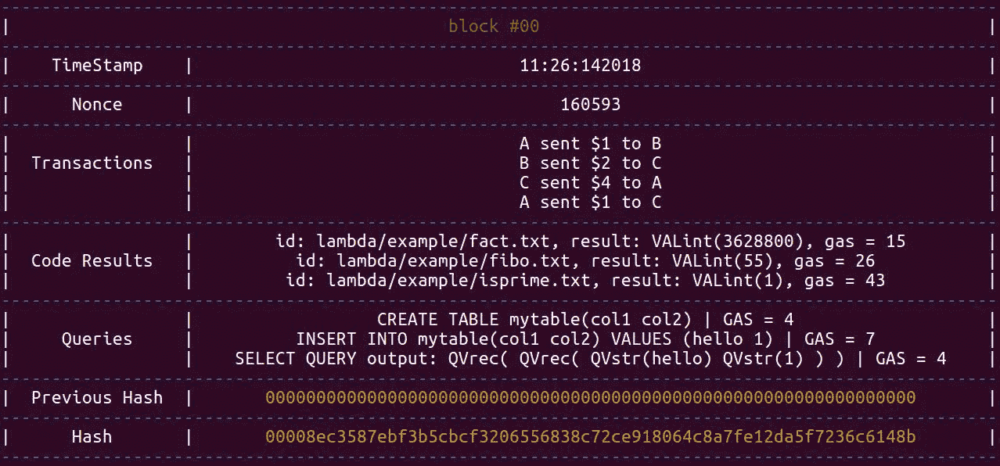

# 从零开始以函数式编程风格实现区块链

> 原文：<https://medium.com/coinmonks/blockchain-implementation-from-scratch-and-in-a-functional-programming-style-ad8d0c424b30?source=collection_archive---------6----------------------->


本文旨在带您从零开始，以函数式编程风格一步步实现区块链和智能契约语言。我们将使用编程语言[](http://www.ats-lang.org/)**。**

**完整代码可以在* [*这里找到*](https://github.com/gallettilance/ATS-blockchain) *。**

# *什么是智能合约？*

*智能合同允许规避对第三方实体的需要，第三方实体的作用是确保和执行合同得到尊重。例如，考虑用户 A 想要在区块链上创建一个老虎机，以便用户可以用他们的加密货币赌博。如果没有智能合约，参与这场赌博的风险将超过机器设定的赔率。考虑吃角子老虎只是一个随机数发生器(RNG)。用户 B 必须相信向 A 发送硬币将导致运行良好校准的(即，按照玩游戏所达成的心照不宣的契约中指定的那样校准的)RNG。并且，如果 B 赢了，适当的奖励(如果有的话)将被送过去。*

*用户 A 可以编写所谓的智能合同来指定投币机的校准和语义，以供用户 B 在决定参与游戏之前查看。为了确保这些合同得到遵守，它们是用区块链的矿工执行的一种编程语言写成的。此代码的效果和结果在区块链中持续存在(如同普通交易一样),供所有人查看和验证。在这种情况下，用户 B 不再需要信任任何第三方，并且可以简单地阅读智能合同(就像任何人阅读任何普通合同一样)来理解条款和/或条件。*

# *定义区块链类型*

*ATS 中的元组是不可变的，由它们的大小静态定义。通过将**块**定义为各种类型的元组，如果我们希望以后扩展我们的区块链数据类型(通过向元组添加一些元素)，类型检查器将很容易捕捉到我们忘记更新的函数。这将使我们代码的未来增强变得非常高效！*

```
*typedef hash = stringtypedef transaction = (string (* from *), string (* to *), int (* amount *))
typedef data = list0(transaction)typedef contract = (string (* id *), string (* value *))
typedef result = list0(contract)typedef header = ( 
                    (* index *) int, 
                    (* nonce *) int, 
                    (* transaction data *) data, 
                    (* code result *) result, 
                    (* prevhash *) hash
                 )typedef block = ( header, (* currhash *) hash, (* timestamp *) string)
typedef chain = list0(block)*
```

*一个单独的块将看起来像这样:*

**

# *与区块链对接*

*为了与区块链接口，我们将创建一个简单的 CLI。我们希望我们的 CLI 易于扩展，以包含与区块链交互的新方式。目前，我们希望我们的 CLI 能够这样工作:*

1.  *定义矿工/用户*
2.  *进行交易(有效或无效)*
3.  *撰写/执行智能合同*
4.  *决定谁将开采下一个街区*
5.  *挖掘上面的(它执行事务和代码)*
6.  *查看用户余额和交易结果*
7.  *从 1/2 开始重复*

*因此，我们将 CLI 实现如下:*

```
*extern
fun
cli_start(lines: stream_vt(string)): voidextern
fun
cli_do(args: list0(string)): voidextern
fun
cli_stop(): voidextern
fun
print_cmds(): voidextern
fun
read_loop(lines: stream_vt(string)): voidimplement
cli_start(lines) = let
  val () = print_cmds()
in
  read_loop(lines)
endimplement
read_loop(lines) = let
  val () = fprint!(stdout_ref,"blockchain> ")
  val-~stream_vt_cons(l, lines) = !lines
  val args = parse_args(l)
in
  case+ args of
  | list0_nil() => read_loop(lines)
  | list0_cons(a, _) =>
      case+ a of
      | "exit" => (~lines; ())
      | _ => (cli_do(args); read_loop(lines))
endimplement
cli_do(args) = 
  case+ args of
  | list0_nil() => ()
  | list0_cons(a, args) =>
      case+ a of
      | "balance"       => do_balance(args)
      | "blockchain"    => do_blockchain(args)
      | "code"          => do_code(args)
      | "define"        => do_define(args)
      | "execute"       => do_execute(args)
      | "mine"          => do_mine(args)
      | "transact"      => do_transact(args)
      | _               => ()*
```

*用户输入被视为线性流，因此我们的 CLI 非常节省内存，并保证在 CLI 终止后不会泄漏任何用户输入。你可以在这里阅读更多关于线性流[的内容。](http://ats-lang.github.io/DOCUMENT/INT2PROGINATS/HTML/INT2PROGINATS-BOOK-onechunk.html#programming-with-linear-views-and-types)*

*浏览代码，我们看到大部分工作是在 **read_loop** 函数中完成的。如果输入是“退出”，那么我们调用 **cli_stop()** 并从内存中释放作为输入流的资源。否则，我们调用 **cli_do()** ，然后递归调用 **read_loop()** 。 **cli_do()** 函数非常简单——我们希望尽可能简单地添加功能。这些“do_”函数中的每一个都应该要么在本地写，要么向对等体发送消息。*

# *采矿*

*挖掘包括验证事务和查找使报头散列有效的 nonce。*

```
*extern
fun
mine(hd: header): block(* ****** ****** *)implement
mine(hd) = let 
  val (ind, nonce, trns, code, h) = hd
  val theValids = list0_filter(trns, lam(t) => is_valid_transact(t))

  fun aux(hd: header): block = let
      val currh = sha256(encode_header(hd))
    in
      if valid_hash(currh) then (hd, currh, get_time())
      else let
        val (ind, nonce, data, res, prevh) = hd
      in
        aux((ind, nonce + 1, data, res, prevh))
      end
    end
in
  aux((ind, nonce, theValids, code, h))
end*
```

*注意，在递归挖掘块之前，我们使用 **list0_filter** 过滤掉无效的事务。 **is_valid_transact()** 函数的预期副作用是在验证事务时执行事务。这对于以下情况是必要的:*

*用户 A 有 2 美元，进行了两笔交易:*

1.  *甲给乙寄去 1 美元*
2.  *甲给丙寄了 2 美元*

*每笔交易都是有效的，但是两笔交易不能一起执行——否则 A 的账户将出现负余额。**的副作用是 _valid_transact()** 一旦事务 1 被执行，事务 2 就会失效。我们可以很容易地修改这些交易的执行顺序，以最小化或最大化所需的数量。例如，采矿者可以决定最小化无效交易的数量，或者最大化转移的总量，或者甚至最大化交易的费用总和。*

***mine()** 的[尾递归](http://ats-lang.github.io/DOCUMENT/INT2PROGINATS/HTML/INT2PROGINATS-BOOK-onechunk.html#tail-call-and-tail-recursion)实现与 CLI 的内存效率是内联的。此外，请注意，挖掘者希望达到的目标散列在这里是一个以 4 个零开始的散列，但很容易调整。*

# *智能合同*

***λ演算***

*我们将设计用来创建智能合约的编程语言将基于[非类型化的λ演算](http://www.cs.bu.edu/~hwxi/academic/courses/CS520/Spring18/notes/utlc.pdf)。因此，我们的语言将是图灵完备的，但是，正如你将看到的，这将是非常不切实际的，因为定义复杂的函数将是乏味的。*

*首先，让我们定义一个称为“term”的数据类型来表示 lambda 演算术语。*

```
*datatype term =
  | TMint  of  (int)
  | TMstr  of  string
  | TMtup  of  termlst
  | TMproj of  (term, int)
  | TMvar  of  string
  | TMlam  of  (string, term(*body*))
  | TMapp  of  (term(*fun*), term(*arg*))
  | TMfix  of  (string(*f*), string(*x*), term)
  | TMopr  of  (string(*opr*), termlst)
  | TMifnz of  (term(*test*), term(*then*), term(*else*))
  | TMseq  of  (term, term)

where termlst = list0(term)*
```

*为了便于解析我们的语言，我们决定给它以下类似 lisp 的语法:*

***整数**
1 表示为 **(TMint 1)** ，2 表示为**(TMint 2)**…等等。*

***Bool**
真为 **(TMint 1)** 假为 **(TMint 0)***

***字符串**
“你好，世界！”被定义为 **(TMstr 你好，世界！)***

***变量**
一个变量 x 被声明为 **(TMvar x)***

***元组**
一个元组(t0，t1，T2)例如被定义为 **(TMtup t0 t1 t2)***

***运算**运算
2 + 3 + 4 定义为*

```
*(TMopr + (TMint 2) (TMint 3) (TMint 4))*
```

***λ函数**
*λ* x.x + x 可以定义为*

```
*(TMlam x (TMopr + (TMvar x) (TMvar x)))*
```

***函数应用***

```
*(TMapp (TMlam x (TMopr + (TMvar x) (TMvar x))) (TMint 1))*
```

***定点**
斐波那契函数可以写成*

```
*(TMfix f x (TMifnz (TMvar x) (TMifnz (TMopr — (TMvar x) (TMint 1)) (TMopr + (TMapp (TMvar f) (TMopr — (TMvar x) (TMint 1))) (TMapp (TMvar f) (TMopr — (TMvar x) (TMint 2))) ) (TMint 1)) (TMint 0)) )*
```

***顺序操作***

```
*let val () = println!(“hello, world!”) in add(2, 3) end*
```

*可以编码为*

```
*(TMseq (TMopr println (TMstr hello, world!)) (TMapp (TMapp (TMlam y (TMlam x (TMopr + (TMvar x) (TMvar y)) ) ) (TMint 2)) (TMint 3)) )*
```

*如你所见，这种语言不适合编码复杂的函数——尽管由于图灵完备性，它是可能的。因此，不鼓励直接用这种语言编写，相反，我们建议从 ATS 生成 lambda 代码。这允许扩展 lambda 语言以允许更简洁的冗长，除此之外，还可以利用 ATS 的类型检查器和编译器进行静态语法调试。例如，我们可以重载+符号，使两个整数相加的语法更加实用:*

```
*extern
fun
add_term_term
(t1: term, i2: term): termoverload + with add_term_term*
```

*在 ATS 中，我们现在可以把 **TMint(1) + TMint(1)** 写成**(TMopr+(TMint 1)(TMint 1))**。*

# ***解析器***

*我们的解析器也非常节省内存，因为它对待解析的文件内容是字符的线性流。一个 **tokenize()** 函数将字符流映射到一个字符串流，该字符串流又可以映射到一个术语(通过我们的 **parse_tokens()** 函数)，该术语将通过我们将在下面实现的 **interp** 函数解释为一个值。*

*你可以在这里查看完整的解析实现。*

# ***翻译***

*在我们为 lambda 语言设计解释器之前，我们需要定义一个**值**数据类型——即被解释的**项**的值。与我们定义 lambda term 数据类型的方式类似，我们可以将 value 数据类型定义如下:*

```
*datatype value =
  | VALunit of ()
  | VALint of int
  | VALstr of string
  | VALtup of valuelst
  | VALfix of (term, envir)
  | VALlam of (term, envir)where
envir = list0($tup(string, value))
and
valuelst = list0(value)*
```

*上面的内容应该是直观的，因为在 ATS 中，一个整数项的计算结果应该是一个 int 类型的整数值。*

*在高层次上，我们的解释器将需要评估一个术语的值，而且还要跟踪环境中定义的术语(以便您可以定义变量和函数)。再次使用 ATS 的模式匹配功能，我们可以如下实现 **interp** 功能:*

```
*implement
interp(t0, env) =
(
case t0 of
| TMint(i) => VALint(i)
| TMstr(s) => VALstr(s)
| TMvar(x) => envir_find(env, x)
| TMlam _ => VALlam(t0, env)
| TMfix _ => VALfix(t0, env)
| TMtup(ts) => VALtup(interp_list(ts, env))
| TMproj(t_tup, i) => interp_proj(t_tup, env)
| TMapp(t1, t2) => interp_app(t1, t2, env)
| TMopr _ => interp_opr(t0, env)
| TMifnz (t1, t2, t3) => interp_ifnz(t1, t2, t3, env)
| TMseq(t1, t2) => let val _ = interp(t1, env) in interp(t2, env)
)
end*
```

*其中 **interp_app** 需要添加到环境中。下面是一个 TMopr 的解释器的例子， **interp_oper:***

```
*fun
interp_opr
( t0: term, env: envir): value =
let
val-TMopr(opr, ts) = t0
val vs = list0_map<term><value>(ts, lam(t) => interp(t, env))
in
case- opr of
| "+" =>
  (
    case- vs of
    | VALint(i1)::VALint(i2)::nil() => VALint(i1+i2)
  )| "-" =>
  (
    case- vs of
    | VALint(i1)::VALint(i2)::nil() => VALint(i1-i2)
  )| "print" =>
  (
    case- vs of v0::nil() =>
      (
      let val () =
        case+ v0 of
        | VALunit() => print("")
        | VALint(i) => print(i)
        | VALstr(s) => print(s)
        | VALtup(vs) => print("VALtup(...)")
        | VALlam(_,_) => print("VALlam(...)")
        | VALfix(_,_) => print("VALfix(...)")
      in
        VALunit()
      end
      )
  )*
```

*我们的 TMopr 术语解释器可以很容易地扩展，以包含更多的操作符(" * "，" ")等。)和区块链上的事务性操作，或者便于用这种语言编写代码。*

*这个 **interp** 函数的下一步是将术语解释成一个**选项(值)**，其中**选项**是一个具有两个构造函数的数据类型: **None()** 和 **Some(值)**。这样，我们可以为我们的 lambda 语言实现错误消息。也就是说，如果没有**选项**数据类型，所提供的术语不能被解释为一个值，程序将报告一个运行时类型错误(因为一些期望值的函数将被给定一个术语)。在这种情况下，如果我们期望一个**选项**类型，我们可以使用模式匹配来处理**选项**类型为 **None()** 的情况(这是解释器未能将术语转换为值的情况)。*

*如果您认为还可以为此使用异常处理，那么您是正确的。但在这种情况下，不建议这样做，因为不同的 lambda 误差会产生相同的 ATS 误差。这意味着要么代码的复杂性会增加，要么从 lambda 语言接收到的错误消息的质量会降低。*

## *代码生成*

*为了好玩，我们用这种 lambda 语言实现了各种函数，比如斐波那契、阶乘、8 皇后等等。每一个。dats 文件[这里的](https://github.com/galletti94/ATS-blockchain/tree/master/lambda/example)将生成一个. txt 文件，其中的代码是用我们的 lambda 语言编写的，可以被解析和解释以产生一个值。这些文件可以通过 **do_execute()** 函数在 CLI 中访问。目前只有 **do_execute()** 执行的文件的返回值存储在区块链上。将来，我们希望将编译后的字节码和结果一起存储到区块链上，以便进行验证。*

# *结论*

*许多非常有趣的研究正在区块链的编程语言上进行。一般来说，尤其是在区块链应用程序中，我们希望绝对确定代码会完全按照我们的预期运行——而且是在第一次执行的时候。这是由于*

1.  *区块链的不变性，以及代码的无限持久性(及其潜在的错误)*
2.  *在完全分散的网络上执行运行时测试的困难*

*回到吃角子老虎机的例子，如果你误校准了吃角子老虎机，除了为你丢失的硬币哭泣，你什么也做不了——这个错误将永远存在于区块链上，供用户自由利用。为了解决这个问题，许多语言试图将定理证明与编程结合起来。例如， [ATS](http://www.ats-lang.org/) 使用类型(更准确地说是[依赖类型](http://ats-lang.github.io/DOCUMENT/INT2PROGINATS/HTML/INT2PROGINATS-BOOK-onechunk.html#programming-with-dependent-types))在编译时(即在运行代码之前)清除潜在的 bug。通过特殊的动态函数构造关于代码的数学证明的能力增强了这一点，这些函数只作为编译时的助手存在。这样，可以提供可证明的保证，而不需要运行时测试，并且不影响运行时效率。你可以在 ATS [这里](https://github.com/galletti94/magnificATS/tree/master/INTRO/DepTypesIntro)找到一些关于依赖类型的介绍性例子，在 ATS [这里](http://ats-lang.github.io/DOCUMENT/INT2PROGINATS/HTML/INT2PROGINATS-BOOK-onechunk.html#theorem-proving_in_ats_lf)找到一些关于定理证明的介绍性例子。*

> *加入 Coinmonks [电报频道](https://t.me/coincodecap)和 [Youtube 频道](https://www.youtube.com/c/coinmonks/videos)了解加密交易和投资*

## *也阅读*

*[](https://blog.coincodecap.com/crypto-exchange) [## 最佳加密交易所| 2021 年十大加密货币交易所

### ICON _ PLACEHOLDEREstimated 预计阅读时间:28 分钟加密货币交易所的加密交易需要知识…

blog.coincodecap.com](https://blog.coincodecap.com/crypto-exchange) [](https://blog.coincodecap.com/crypto-lending) [## 2021 年 10 大最佳加密贷款平台| CoinCodeCap

### 当谈到加密货币贷款时，大量因素等同于良好的收入状况。此外，借款的一部分…

blog.coincodecap.com](https://blog.coincodecap.com/crypto-lending) [](/coinmonks/crypto-trading-bot-c2ffce8acb2a) [## 2021 年最佳免费加密交易机器人

### 2021 年币安、比特币基地、库币和其他密码交易所的最佳密码交易机器人。四进制，位间隙…

medium.com](/coinmonks/crypto-trading-bot-c2ffce8acb2a) [](/coinmonks/best-crypto-signals-telegram-5785cdbc4b2b) [## 最佳 4 个加密交易信号电报通道

### 这是乏味的找到正确的加密交易信号提供商。因此，在本文中，我们将讨论最好的…

medium.com](/coinmonks/best-crypto-signals-telegram-5785cdbc4b2b) [](https://blog.coincodecap.com/blockfi-review) [## BlockFi 评论 2021:利弊和利率| CoinCodeCap

### 今天，我们提出了一个全面的 BlockFi 评论，这是一个成立于 2017 年的加密贷款平台，拥有其…

blog.coincodecap.com](https://blog.coincodecap.com/blockfi-review) [](/coinmonks/buy-bitcoin-in-india-feb50ddfef94) [## 如何在印度购买比特币？2021 年购买比特币的 7 款最佳应用[手机版]

### 如何使用移动应用程序购买比特币印度

medium.com](/coinmonks/buy-bitcoin-in-india-feb50ddfef94) [](/coinmonks/best-crypto-tax-tool-for-my-money-72d4b430816b) [## 加密税务软件——五大最佳比特币税务计算器[2021]

### 不管你是刚接触加密还是已经在这个领域呆了一段时间，你都需要交税。

medium.com](/coinmonks/best-crypto-tax-tool-for-my-money-72d4b430816b) [](https://blog.coincodecap.com/best-hardware-wallet-bitcoin) [## 存储比特币的最佳加密硬件钱包[2021] | CoinCodeCap

### 保管您的数字资产很容易，但找到正确的存储方式却是一项繁琐的任务。在线钱包有一个风险…

blog.coincodecap.com](https://blog.coincodecap.com/best-hardware-wallet-bitcoin) [](https://blog.coincodecap.com/bitsgap-review) [## 获取信号、交易机器人和套利

### 在本文中，我们将回顾 Bitsgap，这是一个满足您所有交易需求的一站式加密交易平台。它…

blog.coincodecap.com](https://blog.coincodecap.com/bitsgap-review)*