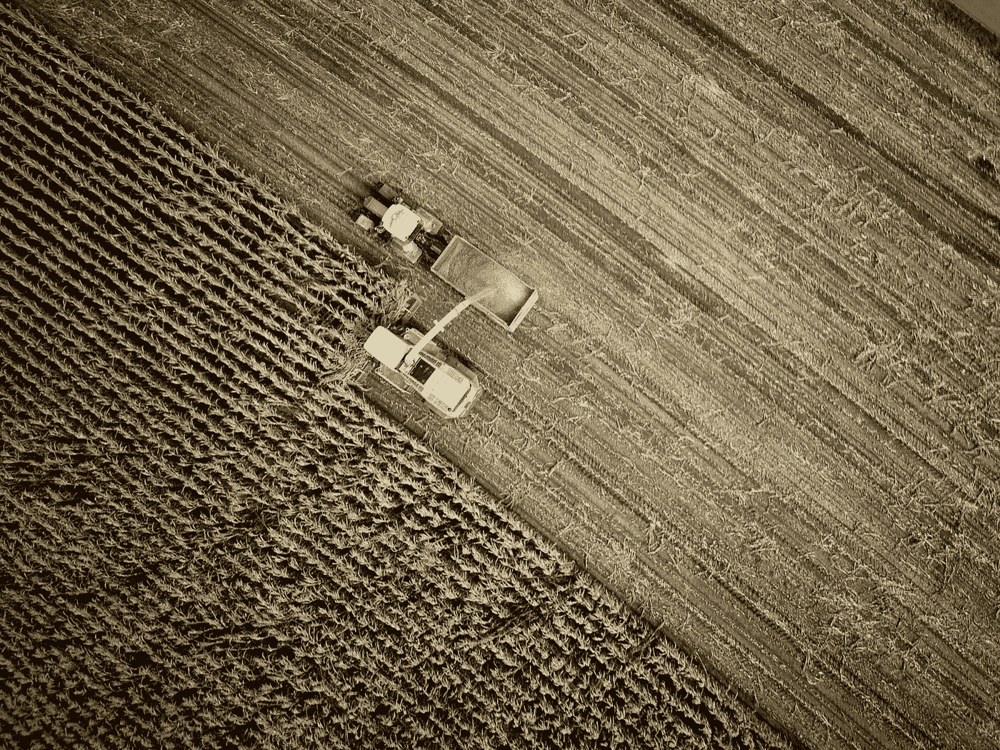

# 农业中的区块链:区块链(再次)拯救了世界

> 原文：<https://medium.com/coinmonks/blockchain-in-agriculture-blockchain-saves-the-day-again-6f2836b34b28?source=collection_archive---------6----------------------->

Photo by [no one cares](https://unsplash.com/@no_one_cares?utm_source=unsplash&utm_medium=referral&utm_content=creditCopyText) on [Unsplash](https://unsplash.com/?utm_source=unsplash&utm_medium=referral&utm_content=creditCopyText)

我们很多人认为区块链只能应用在金融行业。

这是可以理解的，因为我们已经看到了区块链技术为我们提供了许多分散的解决方案。

有了比特币、以太坊和其他替代币，个人和公司可以在几分钟内以低廉的交易费用进行数千、数十万、有时数百万的交易。

是的，没错。

区块链是不同领域的游戏规则改变者，如[教育](https://www.nuwireinvestor.com/the-role-of-blockchain-technology-in-the-education-sector/)，数字实体，游戏，房地产，[医疗](https://www.forbes.com/sites/forbestechcouncil/2021/10/25/the-future-of-blockchain-in-healthcare/)等。

但今天，我们正在研究区块链以及它给农业领域带来的奇妙解决方案。

# **区块链与农业**

农业趋势与世界人口直接相关，包括持续的人口增长和城市化。

根据 Worldometer 的数据，目前全球有 78 亿人，并且每天都在增加。

专家估计，这个数字到 2050 年将达到 97 亿，到 2100 年将达到 112 亿。

如果你问我…

那可是一大堆人要养活。

随着人口的不断增长，很明显，世界范围内的粮食需求将大幅增加。

从全球来看，农业在发展中国家的经济增长中发挥着重要作用。农业产业规模庞大，因此面临诸多对其可持续性产生负面影响的挑战。

从农业流程的第一步到劳动以及收获产品，生产者必须遵守许多流程。

这些流程效率低下，导致对创新农业解决方案的巨大需求，而区块链技术可以解决这一问题。

区块链可以协助食品和农业行业应对整个生态系统中可预测的危险。

但在我们深入探讨之前，到底什么是**区块链技术**？

## **区块链技术到底是什么？**

通俗地说，区块链就是一个负责以块(又名单元)为单位存储数据的链接链。

它被比作谷歌电子表格，通过锁定技术接受不同作者的贡献。

区块链是一种更安全的价值存储和交易方式，也是推动比特币和以太坊等加密货币的主要技术。

所有交易都由 P2P(点对点)网络监控，该网络记录并保存交易数据。

然后，记录的每个交易形成一个块，这些块构成链。

您无法在不更改其他块的情况下修改一个块，并且此操作需要所有相关系统的批准。

下面，您将了解农业行业面临的各种挑战，以及区块链技术如何解决这些问题。

但是，首先，让我们从农业中的区块链是什么开始:

## **区块链在农业中是什么？**

在这里，农业中的区块链使用区块链理工大学来优化农业过程，以获得更好的结果。

农业中的区块链有许多应用，从减少浪费到创建和管理可持续的业务，到理解消费者的购买决策，以在消除欺诈的同时实现更好、更顺畅的交易。

将区块链理工大学融入农业也可以被称为*智能农业。*

智能农业利用自然资源，并通过 ICTs(信息和通信技术)、区块链和其他数据收集技术减少对环境的影响。

与加密金融生态系统相比，农业中的区块链应用仍然不成熟。

但是这个行业对我们的繁荣至关重要，它面临着许多挑战。

这些挑战激起了区块链的支持者开始将这项技术融入农业。

但是这种转变真的可行吗？或者仅仅是在已经播种的土地上毫无意义的挖掘？

让我们来了解一下！

## **农业面临的挑战**

我们对农业的要求不止于生产；我们还用它来增加经济繁荣和社会福利收入。

农业还被用来保护土地和水资源，同时面临工业化和不稳定气候的压力。

除了上述问题，其他挑战也降低了农业流程的效率。

*   缺乏透明度:农业企业，就像其他行业一样，没有一个通用的数据库。尽管互联网已经把我们的世界变成了一个小村庄，但是组织仍然把他们的数据库留给自己。

农业企业也不例外。

所有团队通常保留他们的记录，只有在需要时才在他们之间共享。正因为如此，整个过程出现了沟通的隔阂，缺乏透明度。

*   **食品质量与安全**:农业是雨水、阳光、气候变化、害虫、疾病等的行业之一。，有显著效果。像一段时间内的降雨量这样微不足道的事情也会让农民损失收成。

养活不断增长的人口绝非易事。

为了获得最好的农产品，农民们必须对农作物进行严格的加工。

但是当食物变质时，努力就白费了。

食物腐败是不可避免的。

即使生产了足够数量的食物，由于其数量，也需要储存和保存。

在储存过程中，一些因素会导致腐败，如微生物、酵母、天然食物酶、寄生虫和害虫、温度、湿度或干燥度以及时间。

从本质上讲，产品从收获开始会逐渐变质。知道发生这种情况需要多少时间有助于减少这个过程。

*   **食品可追溯性:**农业面临的另一大挑战是，生产商无法准确跟踪和追踪其产品的去向。

低效的食品追溯系统导致了这一点。

食品可追溯性是生产者在生产、加工和分销的所有阶段跟踪任何农产品的能力，包括进口和零售。

这一挑战非常棘手，因为它直接关系到特定地区的食品供应和安全。

如果没有高效的追溯系统，当存在潜在的食品安全问题时，产品召回等纠正措施就无法快速有效地实施。

可追溯性还允许生产商跟踪分销产品的去向。

这种可追溯性的优势极大地减少了商品的囤积和稀缺。

*   **供应链效率低下:**对于公司来说，拥有一个有效、高效的供应链是一个永无止境的循环。

效率低下是因为供应链很复杂。

供应链效率低下的范围从低效的数据跟踪到低效的系统，这些系统在成本和时间上都是无效的。

供应链也受到能见度低的影响。

这意味着，当出现问题时，你不可能准确地确定原因。

此外，如果供应链不能准确跟踪资产，剥削者和囤积者很容易获得原始产品，并用类似产品和假冒产品替换它。

*   **大量第三方:**从农田到加工厂再到零售店，农产品在到达消费者手中之前要经过大量的“手接触”。

正因为如此，生产者不能保证产品的质量和安全。

此外，成本将不可避免地比预期的要高，因为在制造、加工和销售过程中涉及到许多方面。

这可能会损害生产商的利润率。

以上提到的以及更多的是农业部门面临的挑战。

虽然它们看起来很可怕，但区块链技术可以大大减少甚至消除它们对农业过程的影响。

让我们看看区块链技术如何做到这一点，以及它带来的解决方案。

## **区块链如何帮助**

这里的好处是解决农业的问题；你只需要应用区块链的基本特征，就像我们在其他领域使用它们一样。

以下是区块链给农业带来的一些解决方案:

*   **一旦加入区块链，永远在区块链上:**

区块链技术的一个美丽的特点是，没有人可以删除你添加的每一条信息。而且信息总是准确的，因为有多个网络对其进行验证。

举个例子:津巴布韦的一个农民把他出售小麦的收据放错了地方。丢失收据意味着没有证据证明他收到了付款，但有了区块链，他的手机上总是有一张电子收据。

*   **检测欺诈和故障:**

区块链集成农业没有消除欺诈的可能性，但它可以帮助降低风险。通常，利用传统技术，供应链很容易被操纵和利用。

但有了区块链，我们现在可以跟踪供应链的所有阶段，由于有人无法改变信息，操纵很难实现。

*   **区块链增加透明度和信任:**

大多数企业习惯于从第三方寻求他们需要的服务。但是区块链技术正在改变这种情况，比如加密、强制身份验证等。，都是为了确保网络参与者之间的信任。

当零售商和农民了解食品加工过程和食品供应方式等时，消费者现在可以更加信任他们。

可以通过基于区块链的应用程序访问这些信息。

*   **第三方？不用了谢谢:**

区块链在金融生态系统中如此受欢迎的主要承诺是它的去中心化。这消除了第三方和权威人物在整个过程中的存在和影响。

权力下放减少了整个过程发生的摩擦和时间。

*   **提高食品质量和安全:**

农业-食品过程是复杂而庞大的。

为了确保产品的质量，需要为农民、供应商、零售商和最终消费者简化和改进过程，他们的健康活动很大程度上取决于他们购买和食用的东西。

借助支持区块链的应用，供应链中的人们可以实时报告新出现的问题。

当食源性疾病开始时，零售商可以及时发现受污染的食品来自哪里。

它能够召回产品，帮助拯救生命。

现在你知道区块链技术可以帮助农业的各种方式。

你可能认为它们是区块链在农业中的主要用例。

你是正确的…

部分地。

农业中可能的区块链用例的数量要大得多，从种植作物到保险，延伸到农业的商业方面。

当谈到区块链科技为农业电子商务带来的解决方案时，我们可以看到这一点。

## **面向电子商务农业企业的区块链解决方案**

在网上订购产品时，什么对你来说最重要？

自然是信任。

你想知道你是否可以信任制造商和电子商务平台。

下一个上线的是一种便捷的支付方式，也很容易跟踪。但当涉及到食品时，我们的要求更加具体，这通常会给农业企业带来问题。

首先，他们需要快速处理订单，这样产品才不会变质并失去客户的信任。而且总是很难确认他们产品的交货条件。

## **区块链在农业电子商务中的优势**

区块链为上面提到的任何问题和其他问题提供了解决方案。以下是一些例子:

安全性:区块链技术的主要承诺是安全性。

加密、私钥和多因素认证是保证电子商务平台安全的有效工具。

从农场收集并输入区块链的信息对生产商和客户来说仍然至关重要。

2.小生产者进入在线市场:

传统电子商务通常涉及大型组织，因为在线平台会带来更多收入。

但是许多重要的农产品都是由小家庭生产的。

区块链可以让小生产者获得市场份额，同时降低交易成本。

3.有效的供应链管理:

为了管理生产商的供应链，需要某些信息。

管理者可以向区块链添加农民、产品产地、运输条件、仓库甚至存储温度状态等信息。

一旦它在区块链上，数据就可以在任何需要的时候被引用。

4.更好的支付方式:

区块链的超级力量是提供更好、更快的支付方式。

难怪在金融界受欢迎。

很明显，随着区块链一体化农业的发展，农民现在可以使用加密货币进行交易。

使用密码进行交易非常节省时间和成本。

5.增加客户信任:

恐惧是购物者不从电子商务平台购物的主要原因之一。

由于区块链是一个去中心化的系统，信息可以被验证并公开，用户可以放心数据的真实性。

这一特点将使消费者更加信任生产商和产品。

## **区块链综合农业的未来**

在未来，我们将看到以下几个方面的相互关联的增长:*全球人口增长，*这将导致*需要创新的食品需求增长*。

而这个问题最有希望的解决方案就是*区块链技术。*

农业领域的区块链解决方案可以解决重要的行业挑战，如食品质量和安全、天气预报和监控。

这项技术也将使农业更加高效、有利可图和安全。

然而，所有的农业企业都不一样，所以他们需要制定一个适合他们模式的定制计划。

关于区块链农业的未来…

区块链一心要革命农业产业，这只是时间问题。

你对区块链综合农业有什么想法或评论吗？

请在评论区分享它们。

> 加入 Coinmonks [电报频道](https://t.me/coincodecap)和 [Youtube 频道](https://www.youtube.com/c/coinmonks/videos)了解加密交易和投资

## 另外，阅读

*   [交易信号是什么？](https://blog.coincodecap.com/trading-signal) | [Bitstamp vs 比特币基地](https://blog.coincodecap.com/bitstamp-coinbase)
*   [ProfitFarmers 回顾](https://blog.coincodecap.com/profitfarmers-review) | [如何使用 Cornix Trading Bot](https://blog.coincodecap.com/cornix-trading-bot)
*   [如何在势不可挡的域名上购买域名？](https://blog.coincodecap.com/buy-domain-on-unstoppable-domains)
*   [印度的加密税](https://blog.coincodecap.com/crypto-tax-india) | [altFINS 审查](https://blog.coincodecap.com/altfins-review) | [Prokey 审查](/coinmonks/prokey-review-26611173c13c)
*   [Blockfi vs 比特币基地](https://blog.coincodecap.com/blockfi-vs-coinbase) | [BitKan 评论](https://blog.coincodecap.com/bitkan-review) | [Bexplus 评论](https://blog.coincodecap.com/bexplus-review)
*   [南非的加密交易所](https://blog.coincodecap.com/crypto-exchanges-in-south-africa) | [BitMEX 加密信号](https://blog.coincodecap.com/bitmex-crypto-signals)
*   [MoonXBT 副本交易](https://blog.coincodecap.com/moonxbt-copy-trading) | [阿联酋的加密钱包](https://blog.coincodecap.com/crypto-wallets-in-uae)
*   [雷米塔诺审查](https://blog.coincodecap.com/remitano-review)|[1 英寸协议指南](https://blog.coincodecap.com/1inch)
*   [iTop VPN 审查](https://blog.coincodecap.com/itop-vpn-review) | [曼陀罗交易所审查](https://blog.coincodecap.com/mandala-exchange-review)
*   [40 个最佳电报频道](https://blog.coincodecap.com/best-telegram-channels) | [喜美元评论](https://blog.coincodecap.com/hi-dollar-review)
*   [折叠 App 审核](https://blog.coincodecap.com/fold-app-review) | [StealthEX 审核](/coinmonks/stealthex-review-396c67309988) | [Stormgain 审核](https://blog.coincodecap.com/stormgain-review)
*   [购买 PancakeSwap(蛋糕)](https://blog.coincodecap.com/buy-pancakeswap) | [俱吠罗评论](/coinmonks/coinswitch-kuber-review-1a8dc5c7a739)