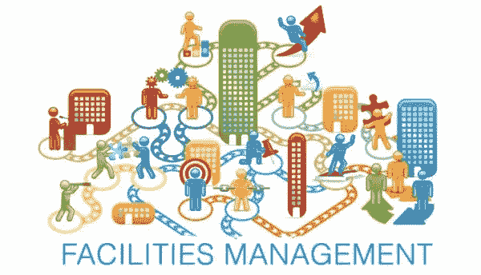
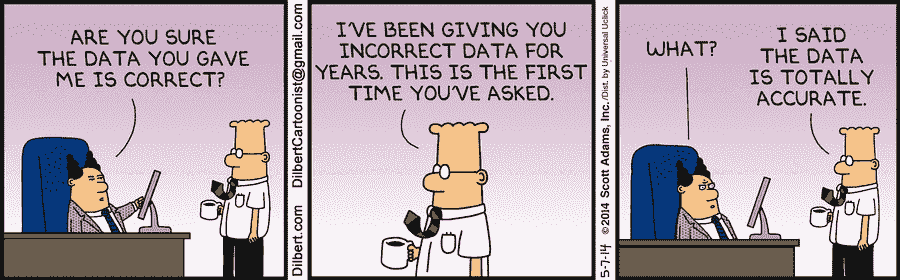
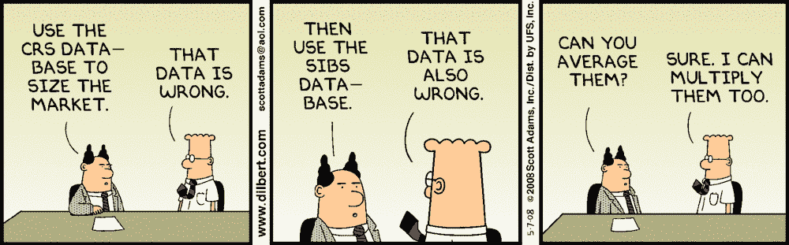
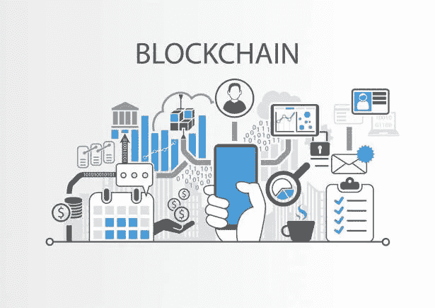

# 设施管理中的区块链:重新聚焦办公室体验

> 原文：<https://medium.com/coinmonks/blockchain-in-facilities-management-refocusing-on-the-office-experience-7e9efbe9ab29?source=collection_archive---------2----------------------->

[Source](https://www.sclogic.com/higher-education-facilities-management/)

面向外行的设施管理(FM)是你永远不会关注的行业之一，除非你的办公室突然出现问题。FM 行业主要致力于为建筑物(本文中的商业房地产)中的租户提供高效和有效的支持服务。空调吹到你脸上，眼睛都干了？红着眼睛向你的 FM 提供商抱怨；办公室感觉像个俱乐部？通知您的调频提供商照明不足(或不亮)；蜘蛛在办公室里跑来跑去？当你烧掉现在的办公室时，和你的 FM 提供商一起寻找一个新的办公室。

严肃地说，对许多人来说，现在的 FM 就像保险一样，你为它付费，希望你永远不必处理它，直到有更新的需要。大楼中的租户只希望日常运营没有任何中断，这样他们就可以专注于核心业务。调频服务行业的出现是为了减轻公司的这一责任。公司愿意为服务提供商提供的便利和价值支付额外费用。在许多情况下，拥有一个服务提供商实际上可能比雇用全部员工来管理他们的所有服务合同更便宜，同时在这种情况下也最大限度地减少了他们的责任。

就其核心而言，服务提供商在 FM 行业中扮演着市场匹配的角色。服务提供商与供应商建立了强大的网络，因为他们能够利用其规模经济。供应商愿意向服务提供商报更低的价格，因为他们可以带来更多的业务，而供应商不必寻找更多的客户。尽管这本质上是一个中间人的角色，这是分权纯粹主义者所厌恶的，但是在这里引入区块链的目的并不是要取代中间人，而是要简化现有的流程。此外，鉴于房地产(RE)的异质性，对这种服务的需求总是存在的。通过采用区块链可能实现的一个好处是，进入壁垒将降低，从而为行业提供更多选择，将重点从单纯的成本基础上移开。

对于大多数公司来说，FM 只是做生意的另一个主要成本。这是一个长期的承诺，一旦达成一致，谈判的余地很小。此外，对于此类公司来说，FM 成本通常是最大的支出之一。再加上 FM 的复杂性在他们的财务模型中几乎被压缩成一个数字，客户对价格极其敏感。这种对定价的关注往往掩盖了其他考虑，并导致许多服务提供商竞相杀价。更重要的是，该行业面临着来自合作的竞争，这种合作在成本和合同方面提供了很大的灵活性。此外，在这种情况下，他们只需与一家提供商打交道，而不是分别管理他们的租赁和服务合同。

好消息是，CRE 行业正在慢慢意识到这样一个事实，即 FM 有能力通过提高员工生产率来推动核心业务的回报。你只需看看许多科技公司在过去十年里建造的占地数公顷的园区，就能看出这一趋势。这种校园的兴起也导致员工在工作场所对雇主提出更多要求。FM 提供商的优势在于，他们可以利用自己在该领域的经验来帮助客户提出适合客户战略的 FM 模型。这可以说是调频行业应该提供的最有价值的服务，区块链技术将使该行业专注于此。

**糟糕的数据实践导致视野狭窄**

[Dilbert on point as usual](https://dilbert.com/strip/2014-05-07)

与金融行业类似，由于当前系统固有的低效率，许多 FM 行业实际上仍然存在，这是一个公开的秘密。这在很大程度上是由于数据模糊不清，无论是通过对数据的资本控制，还是首先难以获得数据。虽然很容易批评当前的行业，因为它有大量的这两个问题，但有必要认识到，鉴于现有技术的成本，这是一个经过多年专业人员试图简化流程后发展起来的系统。

因此，在 FM 服务提供商方面有一些有限的经验，这篇文章将在很大程度上通过这样的视角来提供信息。首先，一般业务流程概述如下:

1.  客户发出一份新合同的招标书(RFP ),或者他们以前的合同是否需要续签。
2.  服务提供商对所提供的信息进行消化，并进行现场考察，以决定是否投标该合同。
3.  如果没有现有的主服务协议，服务提供商将微调需求并将其转发给相关供应商。
4.  供应商根据他们的最佳知识提供报价。
5.  服务提供商汇总所有这些报价，并起草对 RFP 的回复，其中包括服务提供商成本的合理性证明。
6.  响应被提交给客户端。较大的合同通常要向客户进行陈述，以便最终澄清。
7.  客户在 RFP 中约定了一个有限的时间框架来宣布合同的获胜者。
8.  如果合同被授予新的服务提供商，过渡期开始，否则一切照常，直到合同续签。

一切都很好，直到你意识到 RFP 通常采用没有固定结构的 pdf 格式。然而，它确实包括了客户方澄清的详细联系方式，尽管我不希望我的敌人遭受同样的命运。任何附加文件，如果提供的话，通常通过电子邮件与 RFP 一起发送。即使赢得了合同，也不能让服务提供商松一口气，因为服务提供商必须适应客户的系统，每个系统都有自己的嵌入式实践和复杂性。更糟糕的是，供应商的大部分发票(至少在新加坡)仍然是纸质的。不足为奇的是，该行业的大部分资源实际上都用于数据的协调，而不是推进客户的目标。

Couldn’t resist another Dilbert strip

根据一般的营销宣传，区块链架构(特别是获得许可的区块链)是减少由孤立数据库导致的低效率的主要候选。就其核心而言，区块链技术只是一个共享数据库，但拥有单一真实来源的好处不可低估，尤其是在一个涉及数据移动时存在重大摩擦的行业。区块链技术引入了一种使用基于标准的焦点的数据治理模型，同时还提供了额外的安全性和可靠性保证。关于 FM，要解决的棘手问题有:

*   **数据协调:**这与更广泛的数据发现问题有关，本质上以冗余通信通道为中心。例如，如果 RFP 中提供的数据不足以让供应商提供报价，将通过服务提供商进行澄清，然后服务提供商需要与客户核实并回复给供应商。如果 RFP 细节突然发生变化，这是双向的。难怪 FM 专业人士似乎永远无法跟上电子邮件和电话的洪流。鉴于许多 RFP 的时间紧迫，许多报价需要考虑信息不完整的风险。当然，每个属性的唯一性是需要这样做的主要原因，但是我们没有理由不能转移到更有效的数据架构。
*   **数据可靠性:**由于上述原因，行业中的利益相关者永远无法确定他们是否在使用最相关的数据。除此之外，历史数据是不存在的，因为这些数据被那些拥有特定资产经验的人所掩盖，要么是为了保持竞争优势，要么是因为他们受到 NDA 的限制。因此，报价是基于类似物业的经验，但细节上的差异可能会导致成本的重大变化。由于没有参考点，所有利益相关者都只能猜测这种服务的合理价格。这种片面的数据模糊导致更高的风险溢价，以便服务提供商和供应商可以保护他们的基线。
*   **进入壁垒:**数据模糊性和数据资本控制的结合也导致了行业竞争力的下降，因为它对新的市场进入者形成了巨大的壁垒。有一些初创公司通过建立一个可搜索的平台来连接 FM 利益相关者来解决这个问题，但这个行业仍然主要由已建立的网络驱动。更糟糕的是，该行业的现有企业拥有显著的竞争优势，因为它们在实际运营时不必进行任何猜测。此外，从现任者过渡出来会带来很大的风险和成本。因此，调频业面临任何变革的巨大阻力都不足为奇。
*   **激励失调:**如前所述，该行业目前正处于一场逐底竞争中。鉴于这是一个支持性行业，该行业的业绩大多被归入计算不履行合同违约的数量。那些在地面上的人也陷入了一个没完没了的循环中，包括买票、检查系统和盘点。因此，服务提供商和供应商忙于确保不断下降的利润，使得整个行业几乎没有时间去思考实现增值的替代方法。

答案是区块链吗？

[Source](https://www.moneycontrol.com/news/business/real-estate/transfer-of-property-title-likely-on-same-day-through-blockchain-2449981.html)

简而言之:这取决于。Blockchain 只是解决上述问题的可用技术之一，但将其与其他技术联系起来讨论很重要。对于即将颠覆可再生能源行业的物联网来说，情况尤其如此。物联网有望通过智能传感器解决数据发现问题，但这类数据的所有权和可靠性可能是一个更难克服的问题。正是在区块链和物联网的交汇处，存在着巨大的增值机会。至关重要的是，任何技术解决方案都不能孤立地考虑，因为现实世界的问题伴随着人类行为的所有微妙和多变。

可以说，区块链带来的主要优势是它能够激励利益相关者采用一致同意的数据治理模型。如本文所述，广泛采用的障碍很多，但要实现的好处更大。理想情况下，区块链的 IFM 数据应该映射到核心属性数据的主链，从而确保最小的数据冗余。此外，通过在主稀土链上设置适当的数据类别，调频行业可以参考这些数据，并且只能更新调频状态变化。那么，最大的问题是应该提交给链的调频数据类型以及对这些数据的访问权限。

*   **房产:**这包括位置和建筑数据，更属于交易和市场团队的范畴。因此，只要为每个行业建立相应的激励机制，调频行业就应该能够引用这些数据，而不需要在调频链上复制这些数据。某些类型的财产数据可能需要读取访问权限，但调频专业人员不需要对此类财产数据进行任何状态更改。
*   **工厂和设备:**这是调频行业的命脉，随着物联网的引入，数据洪流即将到来。拥有链上的规格和维护计划将是实现共享分类账优势的关键。此外，设备制造商将能够验证每个现场使用的设备的确切型号，因为可以根据他们自己的交易进行检查。拥有每台设备的历史数据(性能数据、服务订单、EHS 等)也将加强责任线，同时也使供应商能够证明他们在特定机器方面的经验。对具有类似功能的设备进行基准测试也将有助于建立供应商声誉。最终，链上有这样的数据将消除行业中的许多猜测和资源冗余，但在数据可访问性方面当然会有重大挑战。
*   **软服务:**这是数据变得不太客观的领域，因此也是服务提供商能够真正区分自己的领域。尽管如此，由于这些服务中有许多是在合同中约定的，如果按照历史 RFP 的一般工作范围可用，这仍然是有益的。类似于在清洁度级别等方面的行业标准，应该针对不同的软服务尽可能地推广这些标准。这种透明度将为服务提供商和供应商提供公平的竞争环境，同时也确保向客户提供最佳的可用选项。
*   **利用率:**在物联网兴起的推动下，未来的 CRE 也将充斥着建筑利用率数据。特别是对于 FM 行业来说，这些数据对于优化所提供的服务将是无价的，因为它使用户体验更加接近未来的个性化工作空间，例如在获奖的阿姆斯特丹 [The Edge](https://www.bloomberg.com/features/2015-the-edge-the-worlds-greenest-building/) 大楼中看到的那些工作空间。尽管前景看好，但从客户的角度来看，数据的保密性以及办公室用户的隐私顾虑将是处理这类数据的最大障碍。

与当前技术相比，区块链技术的优势在于通过优化系统信任来简化以下流程。

*   **共识:**出于实用性考虑，授权证明是最有可能被采用的协议，因为它与行业中的信誉系统非常相似。采用可能需要通过监管来推动，或者通过专业机构和行业巨头的联盟来推动(记住这将与可能出现的其他 RE 链相关)。随着对运营数据的更好了解，声誉将与实际能力更加一致，因为每个利益相关者将对其交易历史(成功、失败、合同变更)负责，而不是对其利益相关者网络负责。同时，随着网络的增长，链上的数据将逐渐成为行业最具代表性的状态，换句话说，是真实的单一来源。至关重要的是，没有哪一方拥有数据的全部所有权。
*   **保密性:**通过共享所有权，数据保密性要求可以通过区块链不断发展的加密模型来解决。FM 行业将不得不决定哪些数据应该公开，但对于其余的数据，可以创建访问控制系统并散列此类信息，以便关键交易数据可用。例如，如果工厂规范必须保密，规范细节可以通过散列来隐藏，但供应商仍然可以通过让他们的交易引用规范散列的标题(很可能是工厂标识号)来证明他们进行了维护。零知识证明似乎也是满足这些需求的一个有希望的解决方案。有了如此多样的访问权限，如何分配这些权限将是如何构建区块链的关键考虑因素之一。
*   **设备可靠性:**一个微妙但重要的变化是，对区块链系统的信任将从个人转移到技术本身。对于商业应用程序(相对于消费者而言)来说，这不是一个很大的问题，但是保证数据不被篡改确实消除了对非核心业务运营的另一个担忧(因此也消除了风险)。考虑到物联网设备要监控的数据量，这一点尤为重要。当然，设备和区块链之间的整个连接也必须是防篡改的，这样才能发挥有效的[神谕](/coinmonks/oracles-how-blockchains-perceive-the-world-390dcce3789c)的作用。资源将用于维护设备，而不是人工检查和处理设备和数据。
*   自动化:这是可以最大限度减少 FM 行业冗余的地方。并不是对系统缺乏信任，而是数据协调的成本如此之高，导致很大一部分资源投入到行政工作中。这里的自动化不仅仅是通过行业范围的数据结构实现实时数据同步，还包括智能合同提供的自动化机会，智能设备充当此类合同的触发器。FM 合同中的许多条款都可以简化为二元期权。例如，与供应商签订的合同可能会规定，如果供应商的设备在商定的时间内出现一定次数的故障，供应商将提供赔偿。可以在链上创建智能合同，从服务提供商到供应商的潜在费用被锁定在合同中，只有在完成规定合同中的条款时才会释放，否则如果发生违约，费用可以存回服务提供商的账户。当然，这将仅限于定义良好的用例，但它确实有望消除大量冗余流程。

最终，在这种情况下，区块链技术并不意味着通过去中心化来革新行业，而是为需要它的各方提供一个共享的真理。区块链技术实际上是普通的数据库技术，但共享真理的意义是绝对积极的。它将通过引入新标准、简化流程和互操作性，以及重新平衡 FM 中的风险，使行业重新专注于其核心业务，从而推动真正的增值。以上肯定忽略了实际实现该技术的许多微妙之处，但区块链技术似乎是一个非常有前途的解决方案，尤其是在与其他技术结合使用时。

*谢谢你坚持到最后。希望听到你的想法/评论，所以请留言。我在 twitter 上很活跃*[*@*AwKaiShin](https://twitter.com/awkaishin)*如果你想收到更多易消化的密码相关信息，或者访问我的* [*个人网站*](https://www.awkaishin.com/) *如果你想要我的服务:*