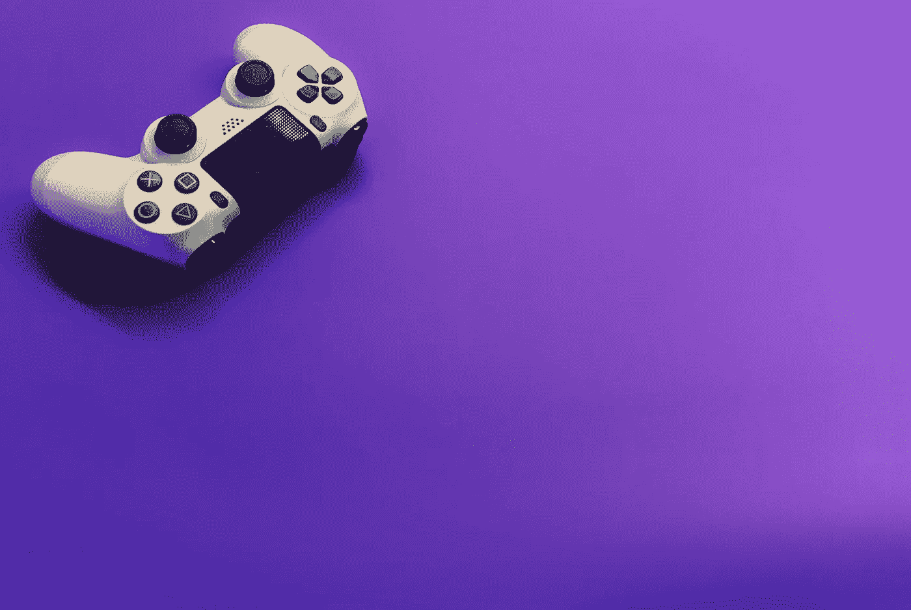

# 游戏行业中的区块链:趋势、障碍和潜力

> 原文：<https://medium.com/coinmonks/blockchain-in-the-gaming-industry-trends-obstacles-and-potential-be7b852cc1a0?source=collection_archive---------8----------------------->

## 你看过博彩业的最新数据吗？

Photo by [Igor Karimov](https://unsplash.com/@ingvar_erik?utm_source=unsplash&utm_medium=referral&utm_content=creditCopyText) on [Unsplash](https://unsplash.com/s/photos/gaming?utm_source=unsplash&utm_medium=referral&utm_content=creditCopyText)

近年来，游戏市场的参与用户越来越多。

机会越来越多，人们对这些机会越来越感兴趣。

最近区块链视频游戏的兴起和 NFTs 进入游戏市场是这种指数增长的原因吗？

让我们看看。

尽管现代技术已经存在了很长时间，但博客、TikToking 和迷因等领域仍然像闪电一样流行。

区块链经历了同样的命运。

区块链在 2008 年作为比特币提案的一部分首次推出，但直到加密技术扰乱了金融生态系统，这一想法才获得了关注。

据用户称，区块链技术现在被视为具有多种金融用途的成熟技术。

我相信您可能已经看到并使用了其中的一些解决方案和应用程序。

然而，区块链的发展不仅仅是为了金融业。

它在其他领域有特殊的适用性，尽管潜在用户已经花了一些时间来适应这个概念。

区块链技术在各种行业中有多种应用，但今天我们将重点讨论在游戏中使用它的优势。

通过区块链游戏的真实例子，我们也将看看区块链游戏仍然面临的挑战。

# 今天的游戏产业

视频游戏业务已经很大，但仍在以极快的速度增长。

目前[价值约 1780 亿美元](https://www.mordorintelligence.com/industry-reports/global-gaming-market)，但专家预测，到 2026 年将增长到 3144 亿美元，未来五年的复合年增长率(CAGR)为 9.65%。

这些统计数据无疑受到了 2020 年全球疫情和封锁的影响。当我们为了安全被迫把自己关在家里时，各种各样的活动和平台越来越受欢迎。

玩电子游戏就是这样一种活动。

根据 2020 年 6 月的报告，玩电子游戏的时间翻了一番。拉丁美洲人领先，比世界其他地区多花 52%的时间玩游戏。

不管哪个地方的游戏玩家最多，很明显，视频游戏的趋势和机会正在蔓延，许多人都加入了这一行列。

博彩业表现不错。

云游戏正在崛起，电子竞技在全球范围内发展，在美国和韩国有着强大的根基，智能手机游戏玩家也在崛起，这要归功于 PUBG、Call of Duty 等游戏。

在这一切当中，人们对 NFT 和区块链的游戏项目兴趣大增。

两周，英雄联盟，交火，《我的世界》，Dota 2，以及更多的游戏是目前游戏世界的重量级游戏。

另一方面，区块链技术提供了一些急需的进步，可能会吸引游戏玩家参与基于密码的游戏。

让我们看看区块链能做什么。

# 区块链能做什么

考虑你喜欢的游戏。

它可以是琐事，休闲游戏，或者你在堵车时玩的 iPad 上的游戏。你可以在 PS4 或 PS5 上玩 GTA 或 FIFA 22。

所有这些游戏的共同点是什么？

所有这些都依赖于中央系统。

“拉斯维加斯发生的事情就留在拉斯维加斯”，我相信你已经听说过了。

游戏中的一切都是一样的:你的全部历史、资产、数据和游戏币都不会丢失。

开发商保留所有产权。

区块链技术的真正好处是去中心化，这有助于博弈，尤其是在资产交换方面。

你可以出售在分散游戏中赢得的游戏内资产，也可以在另一个游戏中购买。智能合同遵循记录的程序，能够验证所有权。

复杂的加密技术、智能合约和区块链技术有助于提高安全性。

区块链可以防止甚至消除非法数字资产交易。

当你审视当前游戏行业的变化时，你会发现区块链在游戏行业的潜力是无限的。

# 游戏中的区块链趋势

最近，区块链科技及其应用已经成为游戏行业的趋势。正因为如此，NFTs、资产令牌化和即玩即赚(crypto)模型等一些功能在技术上已经成为可能。

Photo by [Vadim Bogulov](https://unsplash.com/@franku84?utm_source=unsplash&utm_medium=referral&utm_content=creditCopyText) on [Unsplash](https://unsplash.com/collections/4dl1g8sxPYc/nft?utm_source=unsplash&utm_medium=referral&utm_content=creditCopyText)

## **NFTs:**

NFTs。

如今，你很难在 Twitter 上不看到与 NFT 相关的推文。

NFT 是最近撼动了密码世界的数字资产。

每天，似乎都有人花费数百万美元在某个地方买了一只猴子或一只猫。

许多人对 NFT 现象感兴趣。

但是，在游戏中，如何使用它们呢？

他们给游戏行业带来了什么好处？

在我们开始之前，让我们定义一下什么是不可替换的令牌。

不可替换令牌是独一无二的数字令牌。

从录音到绘画和电子游戏，任何东西都可以作为代币。

你可以把 NFTs 看作是一种收藏品，它是独一无二的、稀有的，而且你不能像用其他密码那样换另一个令牌。

然而，NFT 热并非始于今天的游戏行业。

2017 年，一款名为 CryptoKitties 的区块链游戏让 NFTs 在游戏界名声大噪。

在游戏中，玩家可以购买、繁殖和出售具有独特外观和特征的数字小猫。

另一个游戏，“与神同行”，一个基于 RPG 的游戏，允许你突袭，战斗，并收集强大的 NFT 英雄。

它拥有大量的追随者，是目前互联网上最受欢迎的区块链游戏之一。

在互联网上可以找到数百个以区块链为基地的游戏，这些游戏用 NFT 和硬币奖励玩家。

也就是说，视频游戏可以从区块链和 NFTs 中获得很多好处，数字收藏品是最突出的用例之一。

**资产的令牌化**

游戏资产的令牌化有助于提高过程的安全性和透明度。

令牌化是将数字甚至物理资产转换为区块链兼容的令牌。

令牌化的概念最近获得了关注，它对资产管理业务产生了重大影响。

自从游戏出现区块链以来，资产令牌化变得更加流行和简单。

有了代币化，游戏中的资产，如皮肤、硬币、钻石，甚至人物，现在都可以作为代币在市场上交易。

购买它们的玩家成为它们的主人，任何所有权的转移都被安全地记录在区块链上。

此外，玩家可以跟踪和检查市场上列出的任何资产的合法性。

**玩赢游戏**

"玩游戏真的能赚到密码吗？"大多数人都想知道。

当然可以！

我指的不是 Playstore 上充斥着垃圾广告的游戏。有些仍然不奖励用户的活动，而另一些支付微薄的报酬。

玩视频游戏赚取加密货币是一种玩赚(P2E)模式，目前在加密领域越来越受欢迎。

“玩即赚”视频游戏中的物品和资产被令牌化并表示为作为奖品提供给玩家的 NFT。游戏玩家可以在数字市场上出售他们的资产，并将其兑换成其他 NFT 或加密货币。

在[边玩边赚](https://playtoearn.net/blockchaingames)，你可以找到各种在线 P2E 游戏来赚取密码、NFT 和代币。

今天，玩赚是一些人的收入来源，就像玩视频游戏和上传视频到 YouTube 一样。

像 NFTs 这样的游戏越来越受欢迎。

Axie Infinity 和 NBA Top Shot 是目前最受欢迎的两个 P2E 游戏，每天都有成千上万的用户。

随着玩到赚游戏越来越受欢迎，难怪许多人都在玩它们。

然而，说到 crypto，没有什么比免费的午餐更好的了。

玩大多数 P2E 游戏都需要资金投入。

用户需要设置一个加密货币钱包，购买一些硬币/代币，并支付交易费用。

总的来说，从玩到赚游戏是区块链科技如何让游戏业务变得更加有利可图的绝佳展示。

继续阅读，了解用户和开发者如何分享利润。

# 如何将区块链游戏货币化

**游戏内资产的令牌化:**

游戏行业利润丰厚。

而且一天比一天赚钱。

其中一个原因是游戏玩家认为虚拟资产和真实资产一样有价值。

如果你以前玩过电子游戏，考虑一下你玩过的游戏。想想如果有一天你发布了你的游戏，却发现你已经丢失了所有的游戏进度，那该有多沮丧。

如果你曾经经历过这种情况，我相信你知道这有多痛苦。

多亏了区块链，这种情况不再是一个问题。在支持区块链的游戏中，你不能丢失你的进度，因为在方块中输入的每个数据都是不可变的。

**游戏内购买:**

区块链技术有助于将数字游戏资产的价值货币化。

玩家现在可以用真钱购买游戏内资产、增强功能和升级。

开发者可以用区块链构建代币，用户可以购买应用内的东西，并在 crypto 中获得激励，同时跟踪他们钱包中的所有代币。

此外，自推出以来，NFTs 已经成为游戏领域最突出的盈利模式。

不可替换的令牌具有独特的实际价值。

你可以把它们放在公开市场上出售。

NFT 允许游戏开发者赚钱，并允许玩家通过交易有价值的代币进行投资和获得被动收入。

**游戏内广告:**

每个玩过联网游戏的人都至少看过一个游戏内置广告。

游戏内置广告是游戏开发者从他们开发的游戏中获利的一种流行且可靠的方式。

潜力是巨大的，但游戏内置广告的一个缺点是它们非常烦人，而且是垃圾广告，这会让用户对游戏产生反感。

有了区块链，开发者可以用广告视频和调查取代垃圾广告，用加密令牌奖励游戏玩家，让事情变得更有趣。

看着上面提到的，很明显区块链科技提供了解决方案，同时使游戏行业越来越有利可图。

但是就像区块链的所有应用一样，区块链在游戏方面也有它的问题。

# 区块链奥运会面临的困难

有许多成功的区块链游戏项目。

然而，区块链游戏和其他区块链应用程序一样遭遇了同样的问题。

为什么？

几个因素促成了这一点。

区块链游戏很复杂。

复杂不是因为故事情节长，而是因为技术本身。

你需要创建一个游戏账号，这是最简单的部分。

然后根据游戏基于哪个区块链和它的首选钱包，你需要设置一个钱包和购买密码。

你购买的密码必须是游戏所基于的区块链的硬币/代币。

例如，如果游戏运行在以太坊区块链，你必须使用 ETH。

此外，大多数区块链游戏滞后，并经历网络拥塞，这是任何一个称职的游戏玩家都讨厌的。

拥塞经常发生，尤其是在以太坊上运行的流行游戏。

玩家和开发者都知道以太坊的高交易成本、可扩展性问题和低吞吐量。

有了这些麻烦和更多，开发者仍然需要制作他们的游戏。

他们仍然需要吸引尽可能多的用户来创造收入。

大多数 P2E 游戏都建立在以太坊区块链上，但这并不意味着游戏开发者没有选择。

如果用户数量变得太多，平台无法处理，开发者可以将游戏转移到另一个区块链，或者创建游戏的区块链并转移游戏。

这方面的一个很好的例子是 2017 年的 CryptoKitties 拥堵危机。

开发者在以太坊上构建了游戏链(这被证明是灾难性的)。

Crypto Kitties 是一款基于 NFT 的游戏，允许用户繁殖、收集和交易数码猫，以生产稀有品种。

随着游戏需求的增加，价格也在上涨。在高峰期，游戏使用了大约 5,000 ETH 的容量，相当于以太坊网络使用量的 95%。

以太坊每秒只能处理 13-15 笔交易，但随着游戏的流行，交易时间和油价飙升。买猫的人面临着高得离谱的汽油费，而且要比平时等更长时间。

这个问题促使该公司建立了名为“流”的区块链来消除拥塞。

以太坊的可扩展性问题是游戏开发者担心的一个原因。

虽然随着基金会对合并和以太坊 2.0 的谈论，以太坊开发者有望在不久的将来解决问题。

也就是说，目前，以太坊已经有了有价值的竞争对手，如 Flow、EOS、WAX、币安智能链等。

下面，让我们看看区块链游戏是如何建立的，过程和成本。

# 基于区块链的游戏是如何构建的:

区块链游戏开发可能是一个相当长的学习曲线。但是如果你了解区块链理工学院的运作方式并付诸实践，你会看到无限的机会。

既然如此，你如何制作一款基于区块链的游戏呢？

*   **探索区块链技术**

第一步是研究这项技术是如何工作的，并确定它能给你的游戏带来什么。

您还需要探索去中心化如何改变和增强游戏玩家的体验。

理解区块链共识机制、加密和散列函数的工作原理也是至关重要的。

*   **研究选择最适合游戏的区块链平台**

你的游戏可能必须在以太坊区块链。

除了阅读该平台的所有文章和文档，你也有必要研究区块链上成功的游戏。

其他区块链可能是一个完美的适合你的游戏需求。

*   **投资优质智能合同开发**

智能合约可能是任何区块链平台最重要的部分。

你将需要一个区块链游戏开发商，他了解智能合约的概念，以及如何测试，编码和部署它们。

为游戏玩家提供安全的游戏平台。

尽管区块链的主要优惠之一是提高安全性，但没有技术是无法破解的。

开发人员需要通过识别潜在威胁(如私钥窃取、代码利用)并消除风险来创建一个防黑客环境。

开发人员还需要保护用户事务的端点。尽管区块链非常安全，但易受攻击的钱包可能会给游戏玩家和公司带来大问题。

目的是建立一个完全不受 DDoS 攻击和破坏的游戏平台。

# 区块链奥运会的建设成本

说到区块链奥运会，建筑成本各不相同。

区块链是一种依赖于功能的技术，因此成本通常取决于项目的要求。

成本通常取决于:

*   应用程序的行业
*   项目的复杂性
*   您需要的应用程序/网站的类型
*   使用的第三方工具的成本
*   相关人员的成本
*   应用程序构建流程
*   项目管理方法
*   持续集成维护

区块链游戏的开发成本通常从 3 万美元起，具体取决于开发商。

# 区块链博彩业的未来

通过所有这些区块链应用，我们可以看到游戏行业的技术前景是光明的。

随着最近的 NFT 热潮，更多的玩家和游戏中物品的价值必将迅速增加。

2020 年上半年，NFT 市场只有 1370 万美元。到 2021 年第二季度，其主要项目的总市值已达 25 亿美元，增长了 1785%。

Opensea 是目前最常用和最受欢迎的 NFT 市场，在 2021 年 1 月的第一周销售额仅为 500 万美元。三个月内，该平台的销售额超过了 1 亿美元。

有了区块链，用户现在可以在游戏中获得具有真实价值的物品，然后通过出售这些物品获利。

谁不喜欢玩游戏赚钱的想法？

然而，区块链游戏不应该仅限于收集物品，所以游戏开发商需要想办法让游戏更有趣。

一般来说，冒险类型的游戏在游戏行业是顶级的。

他们受欢迎是因为游戏玩家喜欢让他们感觉很酷的游戏，具有挑战性的战斗、排名和几乎不可能完成的任务。

区块链游戏缺少这些东西，所以有足够的提升空间。

区块链游戏开发商需要做的另一件事是为区块链游戏已经存在的问题找到解决方案。

诸如低可伸缩性、高交易成本和能量消耗等问题是需要解决的问题。

# 结论

很明显，区块链技术为游戏行业带来了急需的解决方案:即玩即赚(加密)模式、NFTs、去中心化和游戏内物品的绝对所有权。

尽管基于区块链的游戏仍处于早期阶段，存在一些严重的障碍，但这项技术可以发展，并在游戏领域变得普遍。

> 加入 Coinmonks [电报频道](https://t.me/coincodecap)和 [Youtube 频道](https://www.youtube.com/c/coinmonks/videos)了解加密交易和投资

## 也阅读

 [## 杠杆代币[多头代币]终极指南

### 杠杆化令牌是具有杠杆化风险敞口的 ERC20 令牌，不考虑保证金、要求、管理…

medium.com](/coinmonks/leveraged-token-3f5257808b22)  [## 最佳加密交易所| 2021 年十大加密货币交易所

### 编辑描述

blog.coincodecap.com](https://blog.coincodecap.com/crypto-exchange)  [## 2021 年最佳加密交换平台| CoinCodeCap

### 编辑描述

blog.coincodecap.com](https://blog.coincodecap.com/best-swap-platforms)  [## 2021 年最佳加密借贷平台| 6 大比特币借贷平台

### 获得比特币和其他加密货币的最佳贷款利率

medium.com](/coinmonks/top-5-crypto-lending-platforms-in-2020-that-you-need-to-know-a1b675cec3fa)  [## 2021 年 6 大最佳硬件钱包|顶级加密硬件钱包[更新]

### 最好的加密货币硬件钱包是绝对必要的。我们将在 NGRAVE、Ledger Nano X 和…

medium.com](/coinmonks/the-best-cryptocurrency-hardware-wallets-of-2020-e28b1c124069)  [## 2021 年最佳免费加密交易机器人

### 2021 年币安、比特币基地、库币和其他密码交易所的最佳密码交易机器人。四进制，位间隙…

medium.com](/coinmonks/crypto-trading-bot-c2ffce8acb2a)  [## 最佳 4 个加密交易信号电报通道

### 这是乏味的找到正确的加密交易信号提供商。因此，在本文中，我们将讨论最好的…

medium.com](/coinmonks/best-crypto-signals-telegram-5785cdbc4b2b)