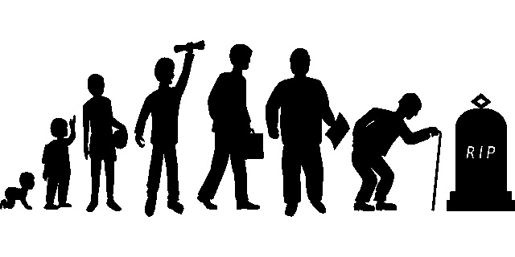

# 人类生命周期中的区块链

> 原文：<https://medium.com/coinmonks/blockchain-in-the-lifecycle-of-a-human-being-a-case-study-part-1-580a003393dd?source=collection_archive---------3----------------------->

## 案例研究—第一部分

在[语音](https://www.voice.com/post/@tulip/blockchain-in-the-lifecycle-of-a-human-being-a-case-study-part-1-1610907427-173612364)阅读我的原创文章。

到目前为止，区块链已经被证明是生活各个方面的一个奇妙的使能器。我们跟踪的大多数项目都是一个更大拼图的一小部分。更大的难题是“如何让世界变得更好”。铭记这一共同愿景，区块链公司一直在努力改善我们工作方式的各个方面。Defi 专注于改善贷款系统，Civic 等项目致力于数据认证，供应链项目致力于提高产品的可追溯性。这些组织大多以商业为中心。但是如果有一种产品是针对个人的呢？它将如何影响一个人从出生到死亡的生命周期？

注意:有些概念可能会因国家而异。为了简单起见，我将以我的国家印度为例进行案例研究

**婴儿期**

*   **出生证明:**

从你出生的那一天起，你的出生数据就会被纳入区块链。婴儿在出生第一天可能没有名字，但有其他细节，如出生日期和时间、出生地、性别、父母姓名等。是系统的基本入口。我们见过很多为了进入某所学校或运动队而伪造年龄的事情。区块链的出生证明将防止任何不道德的手段。

思域是一个可以提供帮助的项目。

*   **婴儿食品(食品真实性):**

随着新生儿的成长，父母害怕给他们吃婴儿配方奶。有一整套假冒产品。食物的真实性将确保婴儿只得到真实的产品。从长远来看，这将直接改善健康状况。

阅读这篇文章，乳制品巨头 Vinamilk 为一种新的优质婴儿配方产品[实施了](/te-food/dairy-giant-vinamilk-implements-te-food-for-a-new-premium-infant-formula-product-fcbe03eb5362) [TE-FOOD](https://te-food.com/)

*   **病历(疫苗接种):**

婴儿在 0 到 2 岁之间需要接种多种疫苗(甚至在这之后也需要接种一些)。随着这些记录在区块链和婴儿的病史中，医生会更有信心开出某些药物。在不发达国家尤其如此，在那里你的父母甚至不知道你迄今为止服用了什么药物或疫苗。

在这方面，MedicalChain 是一个有趣的项目。

**童年**

*   **唯一识别号(公民身份):**

在一个正常的获得唯一身份/公民身份的过程中，你需要拿着你的身份证明、居住证明、照片等等，然后排队。一旦通过验证，您将在手机上获得您的详细信息。在区块链的世界里，这些细节中的许多都已经在区块链出现了，如果有任何缺口，政府只会打电话给你。否则，该过程将自动进行。这将进一步帮助您创建或批准其他重要文件，如护照、签证等。

*   **教育记录(学校和大学记录):**

学历决定你的未来。在当今世界，进入一流学校和大学的竞争异常激烈。这种竞争导致欺诈行为和腐败，从而摧毁了许多合格候选人的希望。教育记录的区块链应用程序可分为 12 类:证书管理、能力和学习成果管理、评估学生的专业能力、保护学习对象、确保协作学习环境、费用和学分转移、获得数字监护同意、竞赛管理、版权管理、增强学生在电子学习中的互动、考试复习和支持终身学习。

阅读:[基于区块链的教育应用:系统综述](https://mdpi.com/2076-3417/9/12/2400/pdf)

**青少年**

*   **投票:**

你已经 18 岁了，可以投票了。看看最近美国总统选举期间的事件。有大量关于选举舞弊的指控。问题不在于谁的主张是正确的，问题在于这些当事人中是否有人能够证明他们的主张是正确的。区块链解决了这一点。把投票系统带到区块链，现在你有一个透明的投票，没有任何虚假的声明。所有的数据都存在，有待证明。这项技术仍处于萌芽阶段，应该在较小的规模上开始。

一个好的起点是卡尔达诺的[项目催化剂](https://forum.cardano.org/t/project-catalyst-voting-the-genesis-of-a-new-era-of-blockchain-governance/43103)

在本文的第 2 部分，我们将继续讨论青少年，然后转向青年、成年和老年。我们会谈到社交媒体，旅行，结婚，贷款，买房，买车，甚至死亡证明，都在区块链里。

阅读我以前的文章:[NFTs 的世界:第 9 部分——Terra Virtua 用户指南](/coinmonks/the-world-of-nfts-part-9-terra-virtua-user-guide-89a87606a83)

**通过我的推荐加入**

Crypto.com—

**跟着我**

**👉** [推特](https://twitter.com/rumadas123)

**👉**[**Linkedin**](https://www.linkedin.com/in/ruma-das-a1439320/)

*   **包括附属链接**

> **加入 T21 电报集团，学习加密交易和投资**

## **另外，阅读**

*   **什么是[闪贷](https://blog.coincodecap.com/what-are-flash-loans-on-ethereum)？**
*   **最好的[密码交易机器人](/coinmonks/crypto-trading-bot-c2ffce8acb2a)**
*   **[3 商业评论](/coinmonks/3commas-review-an-excellent-crypto-trading-bot-2020-1313a58bec92) | [Pionex 评论](/coinmonks/pionex-review-exchange-with-crypto-trading-bot-1e459d0191ea) | [Coinrule 评论](https://blog.coincodecap.com/coinrule-review-a-perfect-trading-bot)**
*   **[AAX 交易所评论](/coinmonks/aax-exchange-review-2021-67c5ea09330c) | [德里比特评论](/coinmonks/deribit-review-options-fees-apis-and-testnet-2ca16c4bbdb2) | [FTX 密码交易所评论](/coinmonks/ftx-crypto-exchange-review-53664ac1198f)**
*   **[n 零审核](/coinmonks/ngrave-zero-review-c465cf8307fc)**
*   **[Bybit Exchange 审查](/coinmonks/bybit-exchange-review-dbd570019b71) | [Bityard 审查](https://blog.coincodecap.com/bityard-reivew)**
*   **[3Commas vs Cryptohopper](/coinmonks/3commas-vs-pionex-vs-cryptohopper-best-crypto-bot-6a98d2baa203)**
*   **最好的比特币[硬件钱包](/coinmonks/the-best-cryptocurrency-hardware-wallets-of-2020-e28b1c124069?source=friends_link&sk=324dd9ff8556ab578d71e7ad7658ad7c)**
*   **[总账 vs 平均](https://blog.coincodecap.com/ngrave-vs-ledger)**
*   **[密码本交易平台](/coinmonks/top-10-crypto-copy-trading-platforms-for-beginners-d0c37c7d698c)**
*   **[莱杰 nano s vs x](https://blog.coincodecap.com/ledger-nano-s-vs-x)**
*   **[Vauld 评论](https://blog.coincodecap.com/vauld-review) | [YouHodler 评论](/coinmonks/youhodler-4-easy-ways-to-make-money-98969b9689f2) | [BlockFi 评论](/coinmonks/blockfi-review-53096053c097)**
*   **最好的[加密税务软件](/coinmonks/best-crypto-tax-tool-for-my-money-72d4b430816b) | [CoinTracking 评论](/coinmonks/cointracking-review-a-reliable-cryptocurrency-tax-software-5114e3eb5737)**
*   **最佳[加密贷款平台](/coinmonks/top-5-crypto-lending-platforms-in-2020-that-you-need-to-know-a1b675cec3fa)**
*   **[莱杰纳米 S vs 特雷佐 one vs 特雷佐 T vs 莱杰纳米 X](https://blog.coincodecap.com/ledger-nano-s-vs-trezor-one-ledger-nano-x-trezor-t)**
*   **[block fi vs Celsius](/coinmonks/blockfi-vs-celsius-vs-hodlnaut-8a1cc8c26630)vs Hodlnaut**
*   **[Bitsgap 审查](/coinmonks/bitsgap-review-a-crypto-trading-bot-that-makes-easy-money-a5d88a336df2) | [四国审查](/coinmonks/quadency-review-a-crypto-trading-automation-platform-3068eaa374e1)**
*   **[埃利帕尔泰坦评论](/coinmonks/ellipal-titan-review-85e9071dd029) | [赛克斯斯通评论](https://blog.coincodecap.com/secux-stone-hardware-wallet-review)**
*   **[BlockFi 评论](/coinmonks/blockfi-review-53096053c097) |在您的密码中赚取高达 8.6%的利息**
*   **[DEX Explorer](https://explorer.bitquery.io/ethereum/dex) 和[区块链 API](https://explorer.bitquery.io/graphql)**
*   **[加密套利](/coinmonks/crypto-arbitrage-guide-how-to-make-money-as-a-beginner-62bfe5c868f6)指南:新手如何赚钱**
*   **最佳[加密制图工具](/coinmonks/what-are-the-best-charting-platforms-for-cryptocurrency-trading-85aade584d80)**
*   **了解比特币最好的[书籍有哪些？](/coinmonks/what-are-the-best-books-to-learn-bitcoin-409aeb9aff4b)**

> **[直接在您的收件箱中获得最佳软件交易](/coinmonks/newsletters/coinmonks)**

****