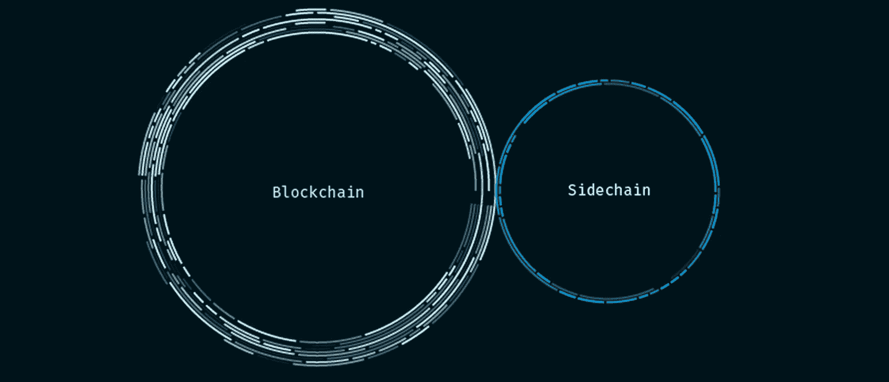

# 区块链互操作性—侧链

> 原文：<https://medium.com/coinmonks/blockchain-interoperability-sidechains-e8204b8c2a10?source=collection_archive---------7----------------------->

[https://medium.com/zapchain-magazine/how-to-explain-sidechains-to-a-parent-1739f6a28bd](/zapchain-magazine/how-to-explain-sidechains-to-a-parent-1739f6a28bd)

在过去的几天里，我一直在研究区块链互操作性领域的各种技术和项目。区块链正处于这样一个阶段，即研究已经从构建单个区块链转移到更多地研究可扩展性问题以及实现区块链之间的互操作性。

**为什么需要互操作性？**

在过去两年的某个时间点，各种组织疯狂地构建区块链应用程序——在多个区块链上构建多个应用程序(仍在继续..).假设工作顺利，应用程序稳定，现在我们希望这些应用程序能够相互连接、通信和共享。举个例子，如果我能把比特币换成以太坊网络上的一种资产，那就真的有用了。如果我可以将我在比特币或以太坊上的一些交易转移到另一个支持所需延迟和性能的网络上，那就更好了。还有更多这样的例子，但所有这些都需要区块链之间的互操作性才能启用。Vitalik Buterin 在他关于[链互操作性](https://static1.squarespace.com/static/55f73743e4b051cfcc0b02cf/t/5886800ecd0f68de303349b1/1485209617040/Chain+Interoperability.pdf)的论文中，强调了一些我们可以实现互操作性的策略。它们是:

1.  集中式或多组公证方案
2.  侧链/继电器
3.  哈希锁定

在这篇文章中，我想探索更多关于侧链是如何工作的。

**什么是侧链？**

侧链是次级区块链，与比特币、以太坊等主链并行。它们是与主链挂钩的链，主链支持读取数据、解释来自主链的数据以及主链和侧链之间的资产交换。侧链可以有自己的共识算法和令牌。它们必须由自己的矿工来维护，主链上的矿工不负责侧链的维护。

它们是如何工作的？

假设有两条链，主链-以 ETH 为令牌的链 A 和侧链-以 S-ETH 为令牌的链 B。我将要经历的机制叫做**双向挂钩**。

1.  第一步是启动一个事务，将 ETH 发送到 sidechain 上的一个特定地址。该交易由智能合同执行，该合同为发送方锁定 ETH。发送者将不再能够使用链 a 上的 ETH。也就是说，ETH 被保存在链 a 的锁箱中。
2.  在链 B 上，相同数量的 ETH 作为链 B 的本地令牌 S-ETH 被发送到事务中提到的地址。

撤销交易时适用完全相同的流程，即在链 a 上将 S-ETH 移回 ETH。资金被锁定在侧链锁箱中，并在收到锁定事件后立即在主链上释放。释放的 ETH 被发送到 sidechain 上发起的交易中的地址。

有许多方法可以实现这一点，当另一端的锁箱有资金时，资金的释放是同时进行的。

**集中式交换** —交换可以通过在两端提供节点来促进双向 peg。这些节点控制锁箱，监听事件，并且它们可以被告知在另一侧链上发生的事情。但是这又存在用户依赖中央权威机构来确认交易的问题。随着所有黑客攻击的继续，最好是远离这样的实现。

**联合钉住** —在这种类型中，没有一个实体，但是有一群公证人类型的节点控制着锁箱。为了进行交换，锁箱需要具有来自节点组的 m 个签名中的 n 个。同样，在此选项中，我们信任一组节点。

**SPV 证明**——以前的所有方法都依赖中间人来确认和控制锁箱交易。SPV(简单支付验证)证明是一种向侧链加密证明交易已在主链上启动的方式，该交易锁定了侧链上某个地址的资金。这遵循与网络中的光节点的验证相同的过程。每次需要验证过程时，它不需要侧链来下载整个主区块链。以下是提交证明所需的详细信息:

1.  由交易明细组成的 Merkle 分支。显示了用其中的特定交易计算的 merkle 根。
2.  块头，确认已使用当前值、先前的哈希创建了有效的块。
3.  显示图片中的区块是通过更多的区块添加到链中来确认的(最长链规则！！).

向侧链提交这些详细信息有助于评估主链上的锁箱事务是否已成功执行。没有中间人和公证人的参与。密码学赢了！！

**确认期和重组期..**

当使用 SPV 证明时，在交易提交到锁箱后，有一个确认期，在此期间节点可以创建 SPV 证明并提交到 sidechain。另一方面，在释放资金之前，有一个等待期，称为重组期。这对任何人来说都是一个挑战已经提交的 SPV 证明的机会。就在释放资金之前，在侧链和主链上强制执行这一重组期。这有助于减少恶意矿工劫持交易。

**一些侧链项目..**

1.  宇宙
2.  [波尔卡多](https://polkadot.network/)
3.  [方舟](https://ark.io/)
4.  [RSK](https://www.rsk.co/)

大概就是这样，关于侧链的一个简短的 jist。我将在下一篇文章中进一步探索这些项目。