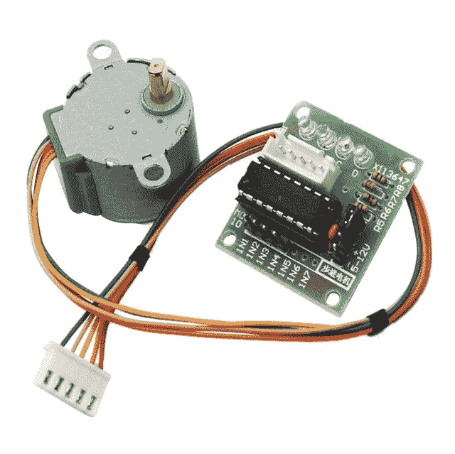
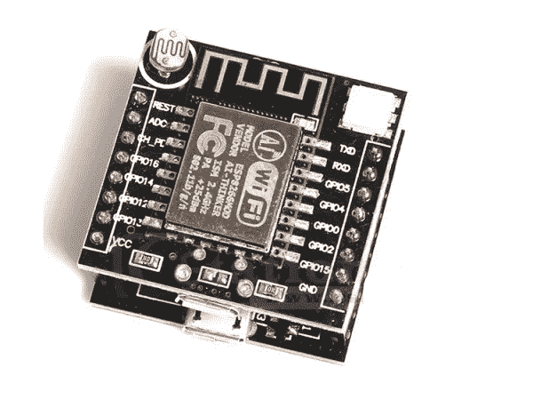
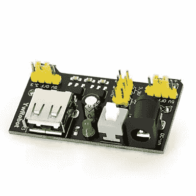
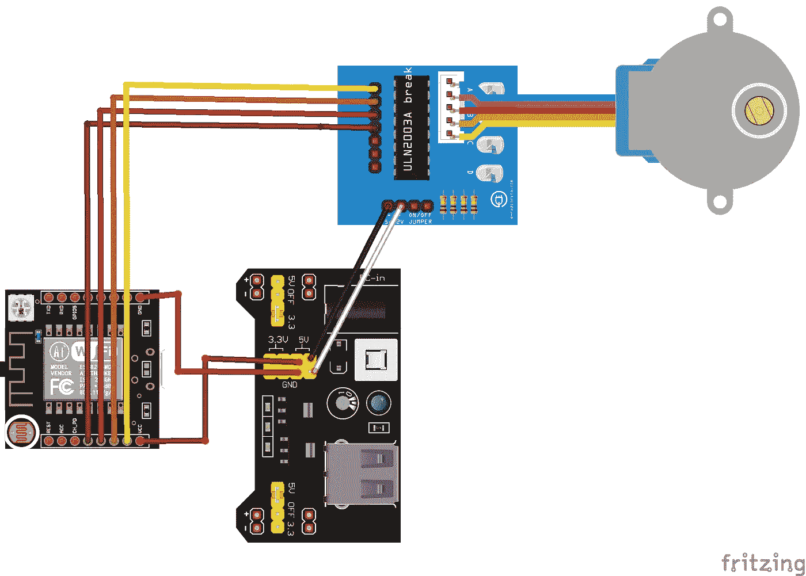
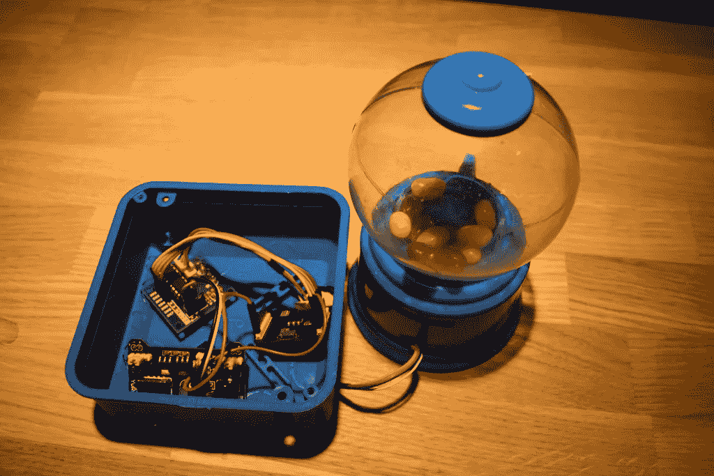

# ❤️+物联网=区块链

> 原文：<https://medium.com/coinmonks/blockchain-iot-waves-bf732e5f60df?source=collection_archive---------1----------------------->

区块链是一项伟大的技术，它可以改变我们的日常生活，并可以帮助改善很多其他技术。自从 Satoshi 的论文发表以来，我们多次听到比特币可以取代货币，但事实并非如此。比特币和以太坊的交易费用和支付时间存在很多问题。2016 年有一篇论文叫做比特币-NG:一种可扩展的区块链协议，它展示了一种如何解决大量区块链问题的方法，并使其更快更可靠。Waves 是少数几个已经实现 NG 协议的区块链之一。Waves-NG 提供了很多机会，其中之一是**快速支付，这导致了另一个优势——廉价支付。**

快速和廉价的支付可以用在很多方面，但在波我们喜欢糖果。[Waves 的开发者之一 Sergey Tolmachev](http://github.com/Tolsi) 决定为接受 Waves 加密货币的糖果机做概念验证。这种概念验证可以用于任何稍加改进和修正的自动售货机。

# 主要零件

我们发现手动旋转扭转糖果机如下图所示:


Manual Rotation Torsion Candy Machine

它的价格大约是 3 美元，而且很容易找到。它在玻璃球下也有放置硬币的空间。我们可以在那里安装步进电机，使其自动旋转，而不是手动旋转。



28BYJ-48 Stepper Motor

其中最便宜，但最好的选择是 [28BYJ-48 步进电机](https://ru.aliexpress.com/item/New-Style-5V-Stepper-Motor-28BYJ-48-ULN2003-Driver-Test-Module-for-Arduino/32820485530.html?spm=a2g0v.search0104.3.16.5a1e70f8YFnNMy&ws_ab_test=searchweb0_0,searchweb201602_5_10152_5722813_10151_10065_10344_10068_10342_5722613_10343_5722913_10340_10341_10698_10697_10696_10084_10083_5722713_10618_10307_10301_10059_5723015_10534_308_100031_10103_441_10624_10623_10622_10621_10620_5722513,searchweb201603_25,ppcSwitch_7&algo_expid=cc732c4e-7eb4-4e1c-a98a-db8c7dd9634c-2&algo_pvid=cc732c4e-7eb4-4e1c-a98a-db8c7dd9634c&transAbTest=ae803_1&priceBeautifyAB=0)。28BYJ-48 是一个小型 5 伏齿轮传动单极步进电机。

我们将使用 [ESP8266WiFi 12e Witty](https://ru.aliexpress.com/item/Breadboard-Power-Supply-Module-3-3V-5V-MB102-Solderless-Bread-Board-DIY-2012-New-3PCS/708949986.html?spm=a2g0v.search0104.3.9.33fb72c4IvNLX5&ws_ab_test=searchweb0_0,searchweb201602_5_10152_5722813_10151_10065_10344_10068_10342_5722613_10343_5722913_10340_10341_10698_10697_10696_10084_10083_5722713_10618_10307_10301_10059_5723015_10534_308_100031_10103_441_10624_10623_10622_10621_10620_5722513,searchweb201603_25,ppcSwitch_7&algo_expid=38677a45-a8a8-40b5-9eb8-316ef6c37552-1&algo_pvid=38677a45-a8a8-40b5-9eb8-316ef6c37552&transAbTest=ae803_1&priceBeautifyAB=0) 来监听区块链的交易，并决定何时必须分发糖果。ESP-12 模块是 ESP 系列中最完整的模块之一，因为它允许您使用所有模块中数量最多的引脚。可以对该模块进行编程，使其与 Arduino IDE 或 LUA 节点 MCU 一起独立工作。这个小芯片有很多优点，但对我们来说最重要的是 WiFi。



ESP8266WiFi 12e Witty

作为电源我们决定选择 [YwRobot 试验板电源 MB-V2](https://ru.aliexpress.com/item/Breadboard-Power-Supply-Module-3-3V-5V-MB102-Solderless-Bread-Board-DIY-2012-New-3PCS/708949986.html?spm=a2g0v.search0104.3.9.33fb72c4IvNLX5&ws_ab_test=searchweb0_0,searchweb201602_5_10152_5722813_10151_10065_10344_10068_10342_5722613_10343_5722913_10340_10341_10698_10697_10696_10084_10083_5722713_10618_10307_10301_10059_5723015_10534_308_100031_10103_441_10624_10623_10622_10621_10620_5722513,searchweb201603_25,ppcSwitch_7&algo_expid=38677a45-a8a8-40b5-9eb8-316ef6c37552-1&algo_pvid=38677a45-a8a8-40b5-9eb8-316ef6c37552&transAbTest=ae803_1&priceBeautifyAB=0) ，它也很便宜和简单，然而，同时，它可以通过 USB 供电。



YwRobot Breadboard Power Supply MB-V2

该模式如下所示:



另一件重要的事情是将步进电机放入糖果机，没有简单的方法——只有锯切和胶合，工作结果如下:


# 跳入代码中

在我们能把所有部件组装在一起之前，我们必须写一些代码。我们用 Arduino IDE 吧。有几件重要的事情需要意识到:

1.  我们要导入 ESP8266WiFi，比如我们可以用[这个库](https://github.com/ekstrand/ESP8266wifi)
2.  我们将使用一个小芯片解析 JSON，所以可能会很慢——我们的代码应该是高效的。

让我们从 inclides 和全局设置变量开始:

```
#include <ESP8266WiFi.h>
// Determines the type used to store integer values in JsonVariant.
// 0 - Long
// 1 - Long Long
#define ARDUINOJSON_USE_LONG_LONG 1

#include <ArduinoJson.h>

#include<AccelStepper.h>
```

我们必须创建 AccelStepper 对象，向构造函数传递 4 个参数，就像单极步进电机一样，由 4 个晶体管控制。

```
AccelStepper myStepper(8, 13, 14, 12, 16);

// Steps per revolution for our motor
**const int** stepsPerRevolution = 4076;
```

我们还需要为我们的 Arduino 芯片提供 WiFi 凭证:

```
// Wi-Fi settings
**const char** *ssid = "";
**const char** *password = "";
```

以及一些关于使用的 Waves 节点、JSON 字段和地址的常量，我们希望对它们进行监控。如果你有你的 Waves Full 节点，你可以使用它的 URI，而不是公共的。

```
**const char** *balanceJsonField = "balance";

// Waves public node URI
**const char** *host = "nodes.wavesnodes.com";
**const int** port = 80;
**const** String address = "3P7CHn3nndASs6UqgUf9atBEgue7C4cANdY";

// Price of one candy
**const unsigned long long** price = 100000000;
```

在主逻辑с之前，我们需要设置步进机和 WiFi 的几个选项，例如，以位/秒为单位的数据速率、以步/秒为单位的所需恒定速度、连接到 WiFi。

```
**void** setup() {
    // Sets the data rate in bits per second (baud) for serial data transmission.
    // For communicating with the computer we can use 115200
    Serial.begin(115200);
    Serial.println();

    // The desired constant speed in steps per second. Positive is clockwise.
    // Speeds of more than 1000 steps per second are unreliable.
    myStepper.setMaxSpeed(700.0);
    myStepper.setAcceleration(700.0);
    myStepper.setSpeed(700);
    myStepper.moveTo(myStepper.currentPosition() - stepsPerRevolution / 2);

    **if** (ssid == ""){
        Serial.println("WiFi ssid is empty.");
    }

    connectToWiFi();
}
```

我们的逻辑将每 N 秒检查一次地址，并试图找到对应于预定义地址的事务。如果它发现交易和金额涵盖糖果的价格步进旋转和糖果挂出来。

对于重复的 HTTP 请求，我们将使用 [Waves 节点 REST API](https://docs.wavesplatform.com/application-development-and-api/node-api-overview.html) 。普通 JSON 中的响应如下:

```
{
  "address": "3PAQT8mofh7EYhvgtXfAgWkdW1b6ptNgXMJ",
  "confirmations": 0,
  "balance": 0
}
```

循环函数看起来很庞大，但是大部分代码调试信息。

```
**void** loop() {

    // Check WiFi connection and reconnect if needed
    **if** (WiFi.status() != WL_CONNECTED){
        WiFi.disconnect();
        connectToWiFi();
    }

    **if** (candiesToGive > 0) {
        **if** (myStepper.distanceToGo() == 0) {
            candiesToGive--;
            Serial.printf("[Candy was given, %d left]\n", candiesToGive);
            myStepper.moveTo(myStepper.currentPosition() - stepsPerRevolution / 2);
        }
        myStepper.run();
    } **else** {
        // Client will make HTTP requests and get JSON response
        WiFiClient client;

        Serial.printf("\n[Connecting to %s ... ", host);
        **if** (client.connect(host, port)) {
            Serial.println("connected]");

            Serial.println("[Sending a request]");
            client.print(String("GET /addresses/balance/" + address) + " HTTP/1.1\r\n" +
                         "Host: " + host + "\r\n" +
                         "Connection: close\r\n" +
                         "\r\n"
            );

            Serial.println("[Response:]");
            **while** (client.connected()) {
                **if** (client.available()) {
                    // Parse JSON
                    JsonObject &root = jsonBuffer.parse(client);
                    **if** (root.containsKey(balanceJsonField)) {
                        root.printTo(Serial);
                        **const unsigned long long** newBalance = root[balanceJsonField];
                        Serial.print("\nUpdated balance: ");
                        printLLNumber(newBalance, 10);
                        **if** (balance != -1) {
                            **int** candies = (newBalance - balance) / price;
                            candiesToGive += candies;
                        }
                        balance = newBalance;
                    }
                }
            }
            client.stop();
            Serial.println("\n[Disconnected]");
        } **else** {
            Serial.println("connection failed!]");
            client.stop();
        }
        // Wait for the 5 sec. before next check
        delay(5000);
    }
}
```

有两个函数，我们还没有定义，但它们被称为— ***连接到 WiFi*** 和 ***打印号码。*** *第一个如果需要，每 500 ms 尝试连接到 WiFi，第二个打印 long long 数字(默认不支持)。这里就不展示****printl number****函数的代码了，因为它脱离了我们的业务逻辑。*

```
**void** connectToWiFi(){
    Serial.printf("Connecting to %s ", ssid);
    WiFi.begin(ssid, password);

    **while** (WiFi.status() != WL_CONNECTED) {
        delay(500);
        Serial.print(".");
    }
    Serial.println(" connected");
}
```

完整的代码可以在 Github 上找到:

[](https://github.com/Tolsi/waves-arduino-candy-toy) [## tolsi/waves-arduino-糖果-玩具

### waves-arduino-candy-toy -在 ESP8266 12e 上使用 waves 区块链支付的 arduino 糖果玩具的源代码

github.com](https://github.com/Tolsi/waves-arduino-candy-toy) 

## 一起

我们有工作代码和对模式的理解，让我们把它们放在 Waves Blockchain 和 IoT 之间的一个伟大的爱件中。



唯一要补充的重要的东西——带地址的二维码。用户应该把他们的电波发送到那个地址。最后的观点是:


仅此而已！它工作，接受加密货币，并使用物联网来监控区块链和加工糖果。

这是它如何工作的演示:

# 结论

区块链能给我们的生活带来巨大的改变，甚至像这样的小例子也能证明这一点。使用区块链作为支付方式，你可以在世界任何地方购买任何东西，不需要卡和现金，不需要货币兑换等等。

我认为在我们这个时代，随处都能买到糖果是非常重要的。