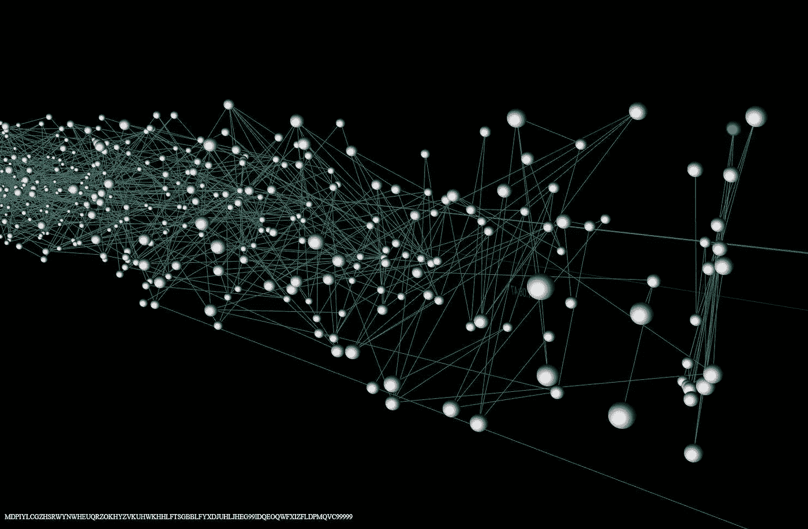

# 区块链、IOTA、Tangle & DAG——围绕这些的新热门到底是什么？

> 原文：<https://medium.com/coinmonks/blockchain-iota-tangle-dag-what-exactly-is-the-new-buzz-around-these-915e3ef9e7bb?source=collection_archive---------1----------------------->

[https://www.reddit.com/r/Iota/comments/736rnm/cool_3d_iota_tangle_visualizer/](https://www.reddit.com/r/Iota/comments/736rnm/cool_3d_iota_tangle_visualizer/)

锁链——比特币背后的技术对这个世界来说不再陌生。拥有使交易安全、可靠和透明的品质，使得这一革命性的技术在世界范围内被接受。防篡改、不可改变的账本为比特币和其他基于它的加密货币提供了这些惊人的功能，在过去几年中获得了巨大的人气。然而，这并不意味着它是完美的。

比特币在过去的六年里已经涨到了一个不可思议的水平。这反过来证明了区块链技术具有很高的价值。尽管区块链提供了流畅交易的强大功能，但区块链仍然存在一些缺点，限制了它成为全球加密货币的唯一选择。

# 区块链的问题

**交易价值和费用-** 随着现代世界中业务的增加，交易的数量不会减少。随着物联网的发展，小额支付的需求也将增加，为低价值交易支付更高的费用没有任何意义。

**采矿收费-** 区块链网络由负责验证交易的矿工组成。通过这样做，他们从网络中获得一定数量的奖励。不可能摆脱这一过程，因为它们是生态系统的重要组成部分。

**可扩展性-** 随着时间的推移，区块链将持续增长，最终对存储空间的需求也会增加，以便保持分类账中的交易更新。这是一个大问题，因为它可能会导致交易和存储成本非常高。

**异构系统-** 现有的加密货币技术本质上是异构的，因为它涉及系统中的两个主要参与者，即交易发行者和交易批准者。这增加了系统的依赖因素。

# **简介-纠结**

正如我们到目前为止所看到的，区块链有其局限性。但有一种新的方法可以解决这些问题，并允许以分散和防篡改的方式存储数据。这种新方法被称为 Tangle，IOTA 项目中使用了这种技术。

**什么是 IOTA，它与比特币和以太坊有什么不同**

IOTA 是一种新的分布式账本技术(DLT ),于 2014 年问世。IOTA 项目旨在成为物联网的主干。IOTA 不同于现有的区块链，如以太坊和比特币，因为它根本不使用任何区块链。它实际上使用了一个有向无环图——“Tangle”。一个复杂的新技术概念，基于一个在不同情况下被使用和应用的数学原理。

纠结是如何进行的？
Tangle 是一种有向无环图，即以指向一个方向的非循环(无环)图形格式存储交易的分类账。考虑一个由不同节点(在 Tangle 术语中称为“站点”)组成的网络，这些节点通过边相互连接。一条边连接两个站点。为了得到验证，一个交易必须批准两个以前的交易/站点。未确认的交易/站点称为 tips。

对于通过节点成功发生在 Tangle 中的事务，它必须首先验证两个先前的事务。根据算法选择这两个事务。为了让节点验证交易，它必须通过解决密码难题来提供工作证明。一旦成功完成，交易就完成了。tangle 的这一功能使我们不再需要网络中的挖掘器，因为现在节点本身就充当了一个挖掘器。这导致交易成本降低到零。

既然我们已经确定 IOTA 和区块链的功能不同，那么让我们来看看 IOTA (TANGLE)的不同之处

*   IOTA 不是区块链，它基于一种叫做 Tangle (DAG)的不同技术
*   IOTA 中不涉及采矿者、区块或交易费用
*   IOTA 中的可伸缩性不是问题因素
*   IOTA 旨在解决物联网的问题

# 控制集中化

**区块链**
在任何基于区块链的系统中，矿工执行验证和确认网络中交易的任务。为此，他们在网络上以比特币的形式获得奖励。正如在某些情况下看到的那样，为了减少报酬的变化，矿工们组成团体，由于这些团体，计算和政治权力掌握在少数经营者手中。这使他们能够控制网络，过滤和推迟交易，这又导致了集中控制的问题。

当谈到 IOTA 网络时，没有涉及到采矿。对于在 Tangle 中发生的事务，前两个事务必须经过它的验证。随着使用的增加，这使得网络速度更快。IOTA 允许每个已经启动事务的用户充当挖掘者。

# 量子计算

**区块链**
量子计算，一个尚未发展的概念，能够为我们提供异常快速的计算能力。这些系统将能够克服经典计算机难以解决的问题。如果量子计算出现，为网络提供安全的区块链增强加密标准将变得过时。区块链需要变异，以确保其长期生存。

**IOTA 纠结
IOTA 网络使用的技术是面向未来的。这意味着，即使量子计算机在不久的将来出现，IOTA 也将存在。它使用“独家量子抗密码算法”,使网络免受暴力攻击。此外，Tangle 拥有将量子共识攻击的影响降低近一百万倍的能力。**

# 小额支付

**区块链**此前，小额支付所涉及的交易费用是可以接受的，因为它很低。然而，随着网络的日益普及和令人难以置信的增长，交易数量大大增加，这增加了矿工接受的处理交易的交易费。这使得网络在小额支付方面毫无用处。虽然像闪电网络这样能够克服这一问题的解决方案正在开发中，但它们的实施还有待观察。

另一方面，IOTA 要求执行任何交易都不收取任何费用。每个 IOTA 事务需要验证两个先前的事务才能被执行。为了验证之前的两次交易，用户的设备基于一系列低难度数学问题执行“工作证明”,这些问题可以在任何设备上执行。由于每个站点都做了自己的工作来加入网络，因此不需要从验证费中提取费用。

虽然 Tangle 是一项新技术，但它仍然具有强大的潜力来解决当前区块链中存在的问题，如可扩展性、集中化、成本等。有了 Tangle，IOTA 可以创建更加可靠和可持续的系统和市场。

> [直接在您的收件箱中获得最佳软件交易](https://coincodecap.com/?utm_source=coinmonks)

