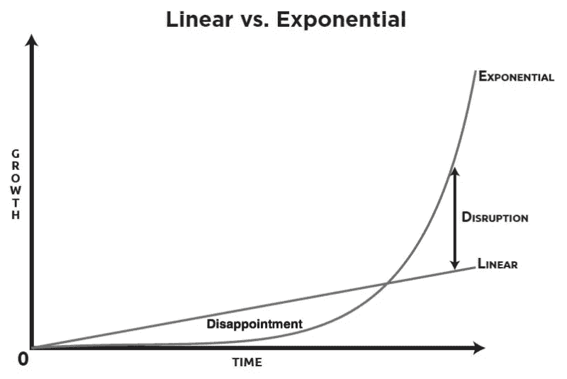

# 区块链——不就是一个大肆炒作的骗局吗？

> 原文：<https://medium.com/coinmonks/blockchain-isnt-it-just-a-scam-with-lots-of-hype-4df247520af6?source=collection_archive---------0----------------------->

作为科技行业的一员，我从 2015 年开始就听说了区块链，但我从来没有真正关注过它，因为我真的看不出有什么大不了的。

去中心化？不可变？分布式分类账？那又怎样？

当我遇到一个描述颠覆的人时，这种“那又怎样”的态度改变了，就像下面的图片一样。

当你意识到技术并不令人失望的时候，已经太晚了。

我们在历史上已经见过无数次了。以下是对 1995 年互联网和 2007 年 iPhone 的一些批评:

> 然后是网络商务。我们承诺即时目录购物-只需点击一下就能买到特价商品。我们将通过网络订购机票、预订餐厅和谈判销售合同。商店会变得拥挤不堪。为什么我当地的商场一个下午的生意比整个互联网一个月的生意还多？即使有一种可靠的方式在互联网上汇款——实际上没有——网络也缺少了资本主义最重要的组成部分:销售人员。—[https://then extweb . com/shareables/2010/02/27/Newsweek-1995-购书-报纸-straight-intenet-uh/#。tnw_92YdWL7k](https://thenextweb.com/shareables/2010/02/27/newsweek-1995-buy-books-newspapers-straight-intenet-uh/#.tnw_92YdWL7k)
> 
> iPhone 在一个盒子里塞进了太多的功能。把所有东西都放在同一个包里，这样你就只需要带一个盒子，这听起来是个好主意，除非你想边听音乐边上网、看邮件或玩游戏。然后，用户会发现，要使用这个小盒子的一个功能而不干扰另一个功能，基本上是不可能的。一些专注的技术爱好者可能，只是可能，会知道如何做到这一点，但这需要比普通用户愿意投资学习和记忆更多的投入。—[http://bgr . com/2016/07/01/iphone-点评-原创-负面-鲍尔默-德沃夏克/](http://bgr.com/2016/07/01/iphone-reviews-original-negative-ballmer-dvorak/)
> 
> 几乎**每个人都期望未来是现在**的一个略微修改的版本，但它通常是非常不同的——雷伊·达里奥

在我深入研究什么是区块链之前，有必要探究一下加密货币(区块链的第一个也是最广为人知的应用)出现的原因。

当我问我 16 岁的妹妹她对比特币的看法时，我们的对话是这样的:

> 我:“你怎么看待比特币？”
> 妹子:“不就是一个大家都在努力赚钱的骗局吗？”
> 
> 我:“你为什么觉得是骗局？”
> 妹子:“因为它没有实际价值。”
> 
> 我:“你觉得钱有价值吗？”
> 妹子:“是的，因为和黄金挂钩。”

最后一行是事情变得有趣的地方。金钱是社会最基本的概念之一，然而我们并没有完全理解它。

# 什么是货币？

在我们开始之前，有必要研究一下货币的属性:

1.  稀缺——供应有限，非常受欢迎
2.  可替代性——符号应该是可互换的(如果你称之为“现金”并不重要，我称之为“美元”,因为它指的是同一个东西)
3.  可分性——它可以被分成更小的部分
4.  耐用性——可以长时间使用，不会变质
5.  可转让性——在所有者之间轻松转让的能力

现在让我们回到几千年前。

我有一只山羊，你有一头母牛。我们最终会以物易物。

显然，如果我们交易的商品不是稀缺的(或者我不需要它)，可分割的(我不能交易 0.002 的山羊)，耐用的(你的牛不久就会死)和可转让的(将需要设备来移动动物)，这就有问题了。

那么我们人类做了什么呢？我们同意共同交换价值。这种形式包括贝壳、食物、石头等等。最终，我们将青铜、白银和黄金等稀土金属作为价值交换的标准。

快进几千年，直到 20 世纪 70 年代。

如果我去银行，我可以把 35 美元换成 1 盎司黄金。除非我能开采大量黄金(这非常困难)，否则我知道供应是有限的，我的纸币有外在价值。这一切都在 1971 年发生了变化，当时美国政府为了满足国家的需要，在国际上终止了金本位制。现在，如果没有足够的钱来买东西，政府可以简单地印更多。

我在 1971 年价值 1000 美元的商品到 2016 年将会因为 505%的通货膨胀率而价值 6000 美元(来源:[http://www.usinflationcalculator.com/](http://www.usinflationcalculator.com/))。这意味着如果我在 1971 年持有 1000 美元，它现在的相对价值大约是 166 美元。

所以回到钱是否有价值的问题——其实没有。它的主要价值在于，世界上的每个人都会接受某种形式的美元(USD，AUD)来交换价值(商品和服务)。

# 介绍比特币

1982 年，一个名叫大卫·乔姆的人创造了第一种加密货币，名为 ecash。为了在参与者之间安全地管理和转移电子现金，它使用了当时先进的加密技术。母公司 DigiCash 最终耗尽资金，不得不停止运营。这凸显了集中化的危险——只需一击就能摧毁整个网络(破产、监管、安全漏洞等)。互联网是一个去中心化系统的例子，没有人拥有它，也不能被“关闭”。

去中心化加密货币的解决方案出现在 2008 年，当时中本聪(我们不知道他到底是谁)创造了比特币。他通过先进的加密技术和解决许多计算机科学问题的组合实现了这一点，例如拜占庭容错，这确保了分布式系统(其中一些可能是不诚实/恶意的)的网络可以达成共识(也就是就同一件事达成一致)。

比特币包含了一种货币的所有属性，并且非常稀缺，因为它只能存在 2100 万枚。

## 那么它是如何工作的呢？

1.  每笔交易都被广播给一个“矿工”网络(任何人都可以是矿工)
2.  矿工收集有限数量的交易，直到一个“块”形成。为了验证这个区块，他们需要在任何其他矿工之前解决一个极其困难的数学问题(通过猜测和检查)。得到正确答案的概率约为 1/10 亿分之一。同样值得注意的是，开采这些区块的资源量(电力、硬件、时间)非常高。
3.  一旦问题得到解决，矿工们就可以获得 12.5BTC(在撰写本报告时价值约 12 万美元)，用于“开采”/验证该特定区块。新的块被广播到整个网络，并且每个人将最新的块添加到他们自己的区块链副本中。如果一个黑客试图用虚假交易创建一个区块，他需要比整个网络的 51%更快地挖掘来验证他的虚假区块(这非常难做到，并且没有经济利润)。区块链技术是以这样一种方式设计的，即最有利可图的策略是通过诚实。
4.  最终，网络中的每个参与者都有他们自己版本的区块链，他们监听要添加到其中的经过验证的块。这就是分散的(不归一个人所有)、不可变的(不能改变/没有意义)和可分配的分类账(每个人都有相同的副本)的含义。

回到我们开始的地方，除了维持系统运转所需的能量之外，比特币还有任何“外在”价值吗——不完全是。虽然与法定货币不同，更多的比特币不可能凭空产生。只要每个人都同意这是一种价值交换(或者将来会是)，它就保留了它的价值。

在互联网的世界里，信任是一种极难获得、更难维系的商品。每个集中化的组织都有自己的失败点，如果受到威胁，可能会产生灾难性的后果。区块链保护我们免受这些集中故障点的影响。

虽然我还没有深入研究区块链的其他用途(下一篇文章)，但我希望你能够对它的所有内容以及为什么它如此令人兴奋有一个像样的理解！

> [在您的收件箱中直接获得最佳软件交易](https://coincodecap.com/?utm_source=coinmonks)

