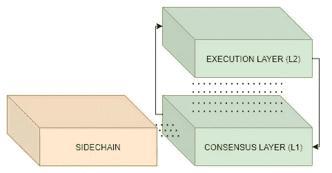

# 区块链第 2 层协议

> 原文：<https://medium.com/coinmonks/blockchain-layer-2-protocols-89356c1aa54e?source=collection_archive---------3----------------------->

## 第一个区块链没有被设计成具有很高的 tps，这就是为什么研究和开发第二层的原因。但是它们是什么呢？发展集中在哪些类别？

像比特币和以太坊这样的区块链显然有一个可扩展性问题，不允许它们承受一个…