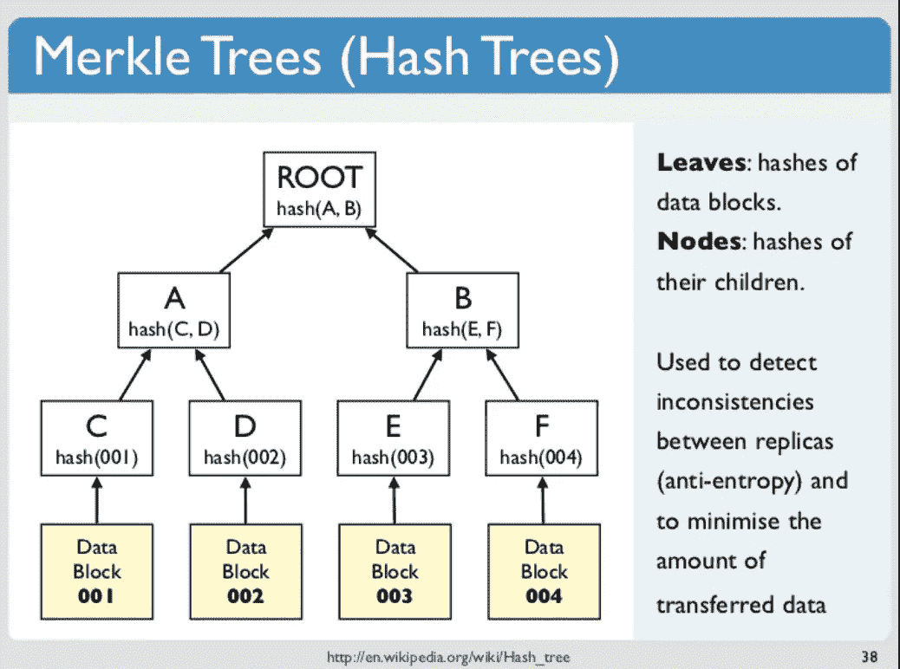
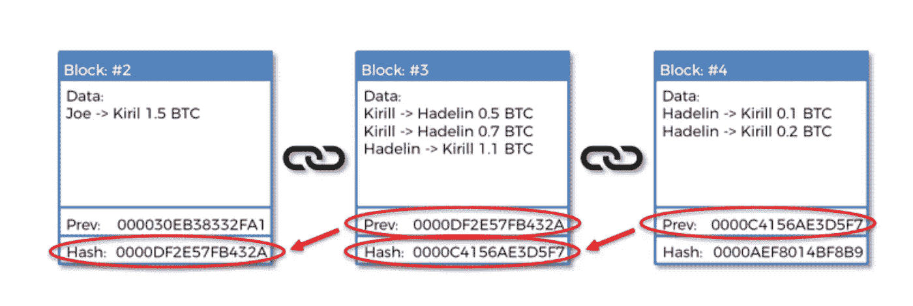
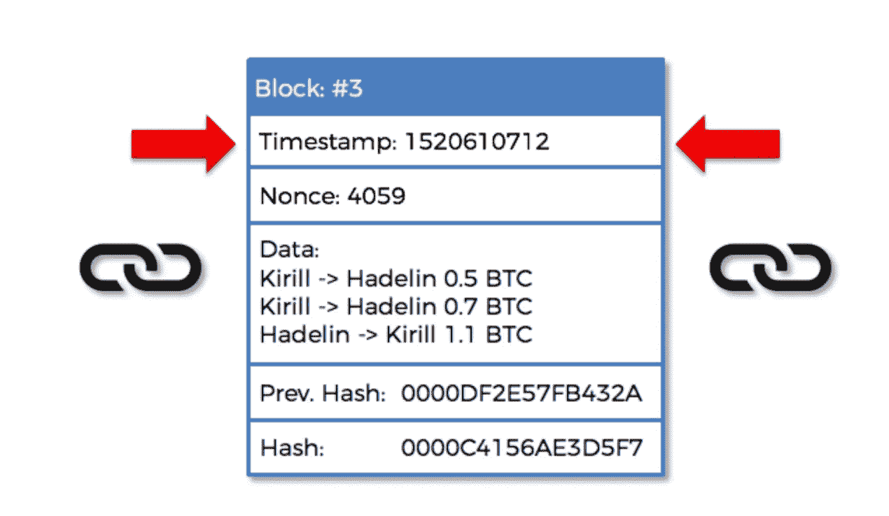
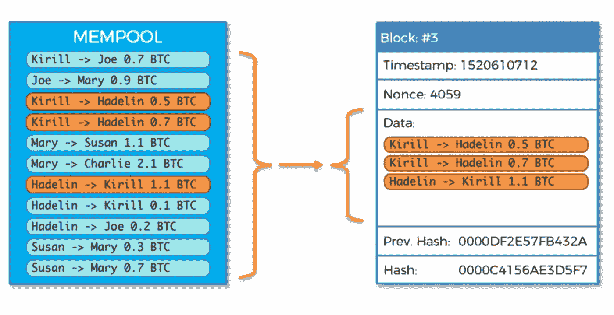

# 区块链挖掘(技术深度挖掘)

> 原文：<https://medium.com/coinmonks/blockchain-mining-deep-dive-f35ee2d5f86?source=collection_archive---------4----------------------->

一个常见的问题是“我们为什么需要区块链？”区块链 Dapps(去中心化应用)仍然可能被黑客攻击。它只有在技术允许的情况下才是安全的。区块链和它们的实用性取决于伴随它的技术和应用。此外，人们经常质疑为什么我们甚至不用区块链来存储数据？如果我们仍然需要将实际数据存储到另一个服务器上，这是否真正分散了框架？

了解区块链人擅长什么和不擅长什么是一个好的开始。正如我们都喜欢“不可变”这个术语一样，理解使它们不可变的机制也很重要。此外，如果您可以通过一个简单地使用 AWS 和基于触发器自动更新分类帐的平台来实现不可变的东西，那么挑战是有帮助的。然而，达成共识并确保各方都有一个事实来记录无可辩驳的事件才是真正的优势。

# 设置节点

节点是计算机网络，用于在智能合约被发送到区块链之前对其进行校准。各种计算机可以设置自己的节点。以以太坊为例，您可能有兴趣在自己的私有网络上尝试一种新的智能合约。根据你的需要，这可能是一个比使用公共测试网更好的选择。Eric Rafaloff 的 block 提到“通过运行您自己的专用网络，您可以保持对网络的完全控制，并创建您可能会发现有用的特定测试条件。在你准备好向全世界公布之前，你也不会冒险让别人发现你的新合同。”

他还分享了两个流行的选择

*   ["Geth](https://github.com/ethereum/go-ethereum/) 是一款受欢迎的成熟客户端，能够开箱即用。设置是必需的，但这相当简单”。最简单的方法是通过[自制](https://brew.sh)。一旦你设置了你的创世纪文件，难度，气体，分配，你就可以开始你的节点了！
*   ["TestRPC](https://github.com/ethereumjs/testrpc) 模拟内存中的区块链，提供 HTTP RPC 服务器。这是非常快速和容易安装和拆卸。然而，到目前为止，TestRPC 并没有实现所有的以太坊 API。这些限制是显而易见的，例如，当试图使用 Mist 发送个人事务时(见错误报告[这里](https://github.com/ethereumjs/testrpc/issues/236))。
*   还有两个很棒的入门链接:[以太坊前沿指南](https://ethereum.gitbooks.io/frontier-guide/content/installing_linux.html)和[水星协议的媒体帖子](/mercuryprotocol/how-to-create-your-own-private-ethereum-blockchain-dad6af82fc9f)

# 分解块和块头

当谈到采矿，重要的是要明白，这不像淘金热，你只是简单地挖掘得到一堆硬币。开采硬币还有另外一个目的。这是为了帮助一个没有中央权威的系统去中心化，正如达米安·克洛泽在这篇[文章](https://dev.to/damcosset/blockchain-what-is-mining-2eod)中提到的。

Damien 的另一篇文章深入探讨了块的分解，这篇文章很棒[这里](https://dev.to/damcosset/blockchain-what-is-in-a-block-48jo)。我将参考他的文章总结一些要点。

他注意到每个块都有块头和事务列表。下面是他提到的块头中包含的三种类型的元数据

*   **“前一个块哈希”。这是必需的，因为每个新的散列都是从以前的散列创建的。如果你想作为初学者尝试创建你自己的散列，你可以使用[miracel salad](https://www.miraclesalad.com/webtools/md5.php)来创建一个有趣的小 MD5 散列。根据[维基百科](https://simple.wikipedia.org/wiki/Cryptographic_hash_function)，*哈希函数也称为“‘哈希值’，‘消息摘要’，‘数字指纹’，‘摘要’或‘校验和’，它有三个主要属性:(1)对任何给定的数据计算一个哈希是极其容易的。(2)*[*计算具有给定散列的字母数字文本极其困难*](https://simple.wikipedia.org/wiki/Computational_complexity_theory) *。(3)两个稍有不同的消息具有相同的散列是极不可能的”。***
*   **《挖矿大赛》。**要成功举办采矿比赛，每个矿工都需要参与其中，并获得完成比赛的激励。正如 Closset 提到的“要使一个块成为区块链的一部分，需要给它一个有效的散列。这包含时间戳、现时值和难度”。难度还是需要和预期的交易时间一致。nonce 代表只使用一次的数字。这是一个唯一的数字，用于像 [SHA256](https://www.movable-type.co.uk/scripts/sha256.html) 函数这样的函数来计算当前块的散列。当试图解决挖掘竞争时，需要实现随机数或“黄金随机数”,以生成将被指向区块链上的区块链标识符的最终散列。根据[我的以太钱包](https://kb.myetherwallet.com/transactions/what-is-nonce.html)*中的* ***以太坊*** *，每笔交易都有一个****nonce****。****nonce****是从给定地址发送的交易数量。每发送一笔交易，****nonce****加 1。存在关于什么交易是有效交易的规则，并且* ***随机数*** *用于实施这些规则中的一些。该字段防止重复花费，因为现时是交易进入的顺序”。*
*   **“第三部分是积少成多的树根**。这是一种数据结构，用于汇总块中的交易”。

这篇由基里尔·叶列缅科写的文章也列出了很好的上下文和一个模块的布局。由于每个散列都连接到下一个块中的散列，这使得区块链技术比传统的记录保存系统更有吸引力。

blocks that are traced and linked by hashes

Components of a block

由于指向特定的区块链地址需要一个事务时间，Kirill 共享了这个额外引用的上下文"*"新条目被添加到一个称为 mempool 的暂存区。然后，矿工的工作是从内存池中挑选一批这样的事务，并将它们添加到他们正在挖掘的新块中。*

块的大小是有限的，并非所有来自内存池的事务都适合新的块。这意味着矿商可以选择哪些交易将进入下一个区块。这也意味着矿工可以随意改变交易的配置(在区块被成功开采之前)。这是他文章中的另一个很棒的图表…

Kirill 还提到了以下内容以牢记"*"类似于时间戳的情况，每当我们在 Nonce 范围内尝试所有 40 亿个可能的值而没有运气时，我们所要做的就是稍微改变我们从 mempool 中选择的事务的组合。*

*这里的主要区别是我们不必等待。通过改变所选的事务，我们可以随意重置随机数范围——因此我们可以每秒钟做任意多次。当然，这一切都是在算法上完成的。这样，即使是矿池和工业规模的矿工也可以连续测试新的哈希值，而没有任何空闲时间。*“换句话说，这就是如何利用正确类型的技术进行大规模挖掘，这些技术可以处理事情并调整 mempool 暂存区中的潜在哈希。

希望这是有帮助的！请随时给我更多的评论、见解和有益的技术贡献。