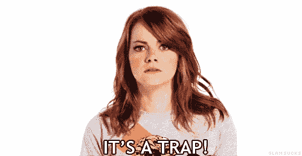

# 区块链 mock chain——人们其实不在乎的 5 个理由。

> 原文：<https://medium.com/coinmonks/blockchain-mockchain-5-reasons-people-dont-actually-care-a802c41b3503?source=collection_archive---------5----------------------->

每天我打开我的推特，发现自己在区块链和加密货币的老一套争论、观点和“好处”中滚动。现实是——人们实际上并不在乎。好吧，有些人在乎，但对于世界上的大部分人口来说，人们似乎并没有完全理解一个分散的网络能为他们带来多大的变化。原因有几个:

Crypto 行话。HODL，ASIC，FUD，Altcoin，Block reward，Fork，Hashrate..这一切意味着什么！？加密货币；我觉得我们的关系一开始就错了——我们能重新开始吗？不如这次我们简化一下，或许减少所有的标签？事实上，理解加密货币背后的技术并不困难。但是，如果你认为是——那么让我问你几个问题:印刷、估价和发行法定货币(主流法定货币)的过程是什么？老实说，想想吧。谁印了你的钱，印了多少，为什么印那么多，这对整体经济有什么影响。没那么简单，是吗？事实是，我们不需要理解加密货币的本质细节来利用它，因为我们大多数人甚至不理解我们当前货币系统背后的复杂性。

T何不断的冲突。我已经厌倦了每一个密码传播者摧毁下一个，仅仅因为他们相信他们的模型更像“聪”#WWSD。这让我想起了全球教堂。全世界大约有 22 000 种面额！是的，你没看错——[22000](http://www.philvaz.com/apologetics/a106.htm)！虽然它们都是“不同的”，但它们的大部分核心原则是相同的，然而它们之间却有如此多的冲突。我在等待有一天，有一群主要的加密货币——服务于独特的目的——和谐相处。

Crypto 过载。想买一些加密货币，哪一种？你可以在主流的:比特币、以太坊、EOS、莱特币、Ripple、比特币现金、Stellar、Dash、NEM、Steem 中选择，更多的另类币怎么样:邪币、杂草币或者猫币？你到底从哪里买的这些？Luno，Bitstamp，Cex，币安，北海巨妖，Indacoin，比特币基地——你明白了。这是一个极其密集的市场，充斥着各种骗局和复杂的购买程序。说它令人生畏完全是轻描淡写。我们怎么能指望大众秘密地购买还没有实现的东西。事实上，整个市场似乎没有明确的方向。

B **洛因何**。让我们面对现实吧——对于普通人来说——很难理解为什么去中心化会影响他们的生活。比如说；即使有了[脸书剑桥分析数据丑闻](https://en.m.wikipedia.org/wiki/Facebook%E2%80%93Cambridge_Analytica_data_scandal)，大多数人都没有意识到缺乏隐私对他们的全面影响。听到有这么多的人不介意让公司和政府知道他们的身份、生活方式甚至位置，这令人担忧。正如备受争议的前中央情报局成员爱德华·斯诺登所说，“在观察下，我们的行动更不自由，这意味着我们实际上更不自由”。是时候意识到企业和政府收集我们的个人数据确实很重要了。是的，在很大程度上

R可靠性。我第一次读到区块链是在 2016 年麦肯锡的文章上— [区块链如何改变世界](https://www.mckinsey.com/industries/high-tech/our-insights/how-blockchains-could-change-the-world)。作为一名会计出身的人，阅读分类账系统对现代技术的潜力非常有趣。但是可以说，我确实花了大量的阅读才开始理解这一切背后的逻辑。当我意识到如此多的出版物、网站和有影响力的人都有一些秘密议程，让人难以信任时，困难就来了。在不被骗去购买一些新代币的情况下，确切地知道去哪里和听谁的话不是很好吗？新人是时候拥有一个安全的港湾了，在这里他们可以不受任何恐吓地学习他们需要知道的一切。

在我寻求在业余时间了解整个行业的过程中，我将分享一切有价值的东西，从加密货币、企业区块链、ICO 到区块链的整体利益，同时易于消化。哦，还有很多迷因。此外，随着时间的推移，我将与 [@devslopes](http://twitter.com/devslopes) 一起构建我自己的加密货币，以更好地理解所有的技术细节。因此，如果这是一个让你感兴趣的话题，一定要关注我的文章，因为我会更深入地研究它的复杂性。

