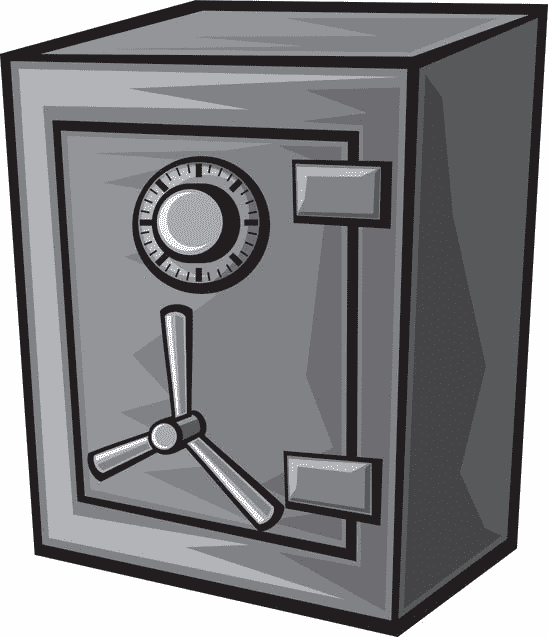

# 区块链神话 5:证明工作浪费能量

> 原文：<https://medium.com/coinmonks/blockchain-myth-5-proof-of-work-wastes-energy-a848000aea9a?source=collection_archive---------0----------------------->

这是关于区块链实施中普遍存在的神话的六篇系列文章中的第五篇。以前的神话都在:

1.  [*区块链 vs 比特币，*](https://link.medium.com/dfEUNG2jHU)
2.  [*区块链和数据共享，*](https://link.medium.com/gIKviFYjHU)
3.  [*区块链与隐私*](https://link.medium.com/JxFKVUEjHU) *，*
4.  [*区块链和*](/@jangrabski/blockchain-myth-4-public-blockchains-are-too-slow-for-insert-use-case-92207b9d9e01) *。*

# TL；速度三角形定位法(dead reckoning)

1.  所有的安全都是由破坏安全所需的能量来定义的，而安全只能通过使用等于或大于最佳攻击能量的能量来制造。
2.  工作证明是生成区块链安全性的最有效的方式，因为它需要已知(尽管可变)的能量来解决密码难题，并且不提供替代的攻击媒介。
3.  一个拥有专用集成电路和大型数据中心的电力开采市场，是一个高度专业化的系统，用来建造越来越复杂的能源屏障，以保护能源链。今年的优势并不意味着矿商明年会保持优势，因为另一个竞争对手可能会开发出更好的技术。因此，随着时间的推移，这种类型的市场是分散的。
4.  PoS 安全机制依靠静态和低能量来保护它。这表现在它受制于利益相关者的物理安全性，更重要的是，受制于利益相关者必须运行的软件的安全性。因此，PoS 和其他非能源密集型激励机制不会增强区块链的安全性，并且可能会降低安全性，因为它们的目标是降低能源使用量(并且它们试图低效地做到这一点)。
5.  告诉我，为什么我错了。一个有效的反驳论点可以是现实生活安全模型的反例，其中最终的安全性依赖于能源投资和持续的能源消耗，这些能源消耗比针对这种框架的最节能攻击的能源消耗低。

# 序文

在这篇前卫的文章中，我探讨了安全性的含义，并尝试定义一些关于它如何工作的基本原则，以及这对工作证明(PoW)与利益证明(PoS)的辩论意味着什么。这对 PoS 来说不是好消息，因为 PoW 可能是实现安全性的最有效方法，无一例外。

在整篇文章中，我经常提到比特币是纯粹区块链的一个例子，但这些概念也同样适用于其他依赖 PoW 实现安全的区块链，包括当前版本的以太坊 1.x (ETH)、Monero (XMR)或 Zcash (ZEC)。

自 2018 年 4 月以来，我一直在考虑更广泛地发布这篇文章，因为我想让它在我的脑海中扎根，并听听是否有任何论点可以说服我怀疑我将要写的东西。

不幸的是，我还没有找到能很好地反驳这一论点的人。如果你确实有这样的争论，请随时告诉我。你可能会惊讶地知道，我听到的最常见的反驳是一种没有根据的声明，说我错了，有时会被更著名的诋毁者匆忙跟进，评论我对能源的理解，或者说我把能源误认为是财务成本。既没有回答能量是用焦耳或千瓦时定义的，这就是功的功率，也没有回答成本主要是能量的代理(主要是因为成本差异也可以归因于信息不对称)。

说到这里，我还必须说，自从阅读以太坊白皮书以来，我一直认为它是一个优于比特币的概念。在无许可区块链上的图灵机允许一个任意的生态系统在协议上进化，并利用它的安全性。这种生态系统的一个例子是分散金融(DeFi ), maker Dao 的戴 stablecoin 就是这种平台所能支持的辉煌的体现。通过图灵完全 EVM 以太坊成为一个新的金融系统的真正的多用途平台。为了继续成功，以太坊继续保持可达到的最高安全水平是至关重要的。我祝愿生态系统一切顺利，并希望能够在未来很长一段时间内参与其中。

这篇文章最大的缺陷是它的长度。我考虑过把它缩短，但是我选择保持论点原样，因为一些概念可能对一些读者来说不熟悉。你应该能够评估一个给定的部分对你来说是否显而易见，并且可以随意跳到下一部分。反正重点都突出来了。

# 安全和能源有什么共同点？一切，因为能源定义安全。

基本论点是这样的:在*的基础上，任何*安全机制都是一种能量权衡，任何攻击都必须考虑这种权衡。正因为如此，最健壮的安全机制是攻击的能量权衡是已知的和大的。

有许多文章认为比特币受到能源的保护，这是一个既定的事实，但由于能源的使用被认为是浪费和对我们的环境有害，世界各地的加密项目都试图创造更节能或更少耗能的方法，以达到与比特币的 PoW 相当的安全水平。我将在这里争辩说，一个更节能的方式来确保区块链是不存在的*根据定义，*因为*能源定义了一般的安全。*

# 一个关于自然如何欺骗的小故事。

我将告诉你一个故事，通过揭示我们的模型相对于复杂系统的实际功能是多么有限，来激发我提出的问题。它始于《科学美国人》,或者可能是《大众力学》,一篇我十几岁时读过的文章。粗略的谷歌搜索没有找到这篇文章，但是我在这里找到了[源研究论文](http://citeseerx.ist.psu.edu/viewdoc/download?doi=10.1.1.50.9691&rep=rep1&type=pdf)。过了这么久重读它，我仍然认为它是一项伟大的研究。这里有一个简短的总结。

Adrian Thompson 博士设计了一个实验来实现物理数字电路的进化，以区分 1kHz 和 10kHz 信号。使用的电路是 FPGA，它是一种具有硬件逻辑的芯片，可以重新配置为使用逻辑门(硬件)而不是计算机指令(软件)来执行任何逻辑操作。因此，这个实验是要发展一个硬件电路来执行给定的任务。

FPGA 配备了几个随机门排列，并连接到一个适应性测试，该测试将评估给定电路识别输入信号的能力。一种从最佳配置中产生后代的进化算法是创建每一代要测试的新配置。

evolution 面临的另一个挑战是，FPGA 无法获得有助于测量频率的时钟。这使得任务太难，人类无法设计解决方案。

进化或自然能设计出一种硬件逻辑电路，不需要时钟就能识别输入信号的频率吗？我被这个问题迷住了，解决方案超出了我最疯狂(和天真)的期望。

该实验在几个小时内进行了数千次重复。出现的设计符合假设。以最终设计配置的芯片可以准确地区分 1kHz 和 10kHz 信号。读到这个结果，我很兴奋，但也不是完全出乎意料。接下来发生的是我想知道的最有趣的事情:大自然超越人类技能的辉煌设计是什么？我迫不及待地想读到它！

原来设计是胡言乱语！没有人能理解，逻辑电路的模式会产生什么结果。作为逻辑门的组合，它根本没有意义。他们反复试验，结果相似。从这个过程中产生的逻辑门设计似乎根本没有实现逻辑。它们循环往复，有些地方是断开的。有趣的是，当移动到 FPGA 的另一个区域时，该设计并没有很好地工作(最初，该设计仅局限于芯片的一个角落)。

该论文指出，进化过程忽略了人类设计者会使用的抽象逻辑，而使用了芯片的所有物理特征。很明显，进化在它应该做什么的问题上被误导了，并且被我们的 FPGA 工作原理的理论模型欺骗了！

我觉得我脖子后面的汗毛都竖起来了。大自然的天才是惊人的。当有机会时，大自然会按照自己的规则进行游戏，并不关心芯片设计的逻辑模型。事实证明，在实验中，大自然玩的是一副完整的牌，而我们人类被限制在这张牌的子集上，我们可以将这些子集放入模型中。

实验有两种结果，无聊和刺激。枯燥的实验表明，自然遵循我们的理论模型。激动人心的实验让大自然展示出我们模型之外的新牌。FPGA 进化实验是第二种。当大自然在实验中与我们玩耍时，它有时会拿出我们甚至不知道存在的卡片，或者我们自己无法使用的卡片。

> 区块链是大自然，它向我们展示了它与我们行为相关的全部内容，在这种特殊情况下，我们自己似乎就是它使用的卡片。

区块链同样令我着迷。它们可以被认为是软件和数据的混合体，依靠人类提供的能量来换取安全的数字资产。虽然这个总结听起来很简单，但我们必须记住，这只是一个不完整的心理模型，区块链实际上的工作方式要微妙得多，正如 hard fork 动荡、比特币最大化作为一种持续的意识形态等所证明的那样。

我在这里看到了几年前我在那篇文章中看到的东西。有人编写了聪明的代码(比特币)，从计算机科学的角度来看，这些代码似乎定义良好(见我的第一篇神话文章)，但这些代码与周围环境相互作用，揭示了比大多数人预期的更多的东西。区块链是大自然，它向我们展示了它与我们行为相关的全部内容，在这种特殊情况下，我们自己似乎就是它使用的卡片。

# 观察比特币我们能学到什么？

如果有一件事我们必须承认的话，那就是比特币和安全方法的证明似乎是有效的。现在我们的练习是要找出这个游戏是如何运作的，因为如果有人认为他们已经弄清楚了规则，他们就低估了规则大师。

对我来说，有人不理解这个游戏有多复杂，这是第一个危险信号，当他们说工作证明是比特币或以太坊安全的核心要素，是低效的。他们怎么知道电力是低效？相比之下，还有什么其他行之有效的机制呢？

诚然，与我们习惯使用能量相比，电力使用的能量是不寻常的，但是说因为它似乎消耗了很多能量，所以电力是低效的是不合理的。我们已经习惯了能源使用是一种污染活动，随着全球燃烧的化石燃料泛滥，这是一个准确的评估。但是说一项消耗能量的活动是浪费，仅仅因为它使用的能量比我们感觉到的多，它就应该强迫一个不存在的联系。

# 有可能达到 100%的能源效率，但看起来仍然很耗能。

我给你举个例子。考虑一个在冬天加热房间的电空间加热器。这个加热器消耗多少能量？答案是相当多。也许 1500W 或更多来保持房间温暖。也许你需要两三个来完成这项工作？这当然比我的笔记本电脑或灯需要的多，但这意味着空间加热器效率低吗？绝对不行。

电热取暖器恰好是我们知道如何制造的最节能的设备！这是 100%的效率，你不能得到任何比这更好的。所以，仅仅因为 power 是耗电大户，并不能说明它的效率。有可能达到 100%的能源效率，但看起来仍然很耗能。结案了。

那么，我们知道些什么？嗯，*我们知道*虽然 PoW 看起来很耗电，但我们实际上*不知道*工作证明到底有多有效，这是一个开始。

> 能量是宇宙的可兑换货币。

虽然以太坊社区似乎很有信心，他们有下一个激励/扩展模型[都已经弄清楚了](https://twitter.com/vitalikbuterin/status/1131045739168186374?s=21)并且在论文和测试代码中进行了模拟，但我不太相信。如果有一件事是清楚的，那就是当我们让游戏在现实生活中展开时，没有人费心让大自然知道，我们希望它按照哪种模式来玩。

我认为在现实生活中，较低的能耗必然导致较低的安全性，因为任何系统的安全性总是由攻击它所需的能量来定义。此外，当我们权衡系统的安全性时，关键的能源权衡通常隐含在我们的环境中，因此是理所当然的。

毕竟能量是宇宙的可兑换货币。

# 了解安全和让我们晚上睡觉的东西。

让我们从物理世界中的一些思想实验开始，然后进展到计算机系统，然后是区块链。如果你愿意，你可以直接跳到前面，但这种进展是我说服自己的必要条件，很可能所有系统都遵循能源支撑所有安全的原则。

# 例 1。一个小保险箱。

一个简单的保险箱(或锁箱)的安全性是我们大多数人都熟悉的情况，我们不会给予它第二个想法。我们知道保险箱有助于防止物品被盗，但我们也知道这种安全性是有限度的。因此，如果不采取额外的预防措施，我们不会将最贵重的物品放在一个小保险箱里。我们知道这一点，因为这是常识。

当你把一个贵重物品放进一个小保险箱时，你就对这个装置的安全性做了一个隐含的计算。计算是，“提取保险箱内的东西是否比这些东西的价值更费力气？”你将根据这一计算，并根据你想保护的东西来选择保险箱。

你可以在酒店里选择一个简单的锁箱来存放你的钱包，在你的房子里选择一个较大的保险箱来存放一些家里的贵重物品，或者在银行保险库里选择一个保险箱来存放大量的存款或者需要防火的文件，等等。在上述任何一种情况下，你都会认为攻击者必须首先砸开箱子才能拿到你的贵重物品，并且你会考虑撬开箱子有多困难。撬棍是否足够(低能量)，还是需要重型钻孔(略高能量)，如果有人使用中等能量的方法，如从建筑物或喷灯上扔下盒子，是否会导致其内容物的破坏？在所有这些情况下，您将考虑攻击的成本与潜在收益，攻击者还将考虑更高能量的攻击(可能可用)是否会最终破坏内容。这些考虑都是严格意义上的能源权衡，或者努力、风险和回报。很简单。

银行的保险箱怎么样？那里的能源权衡看起来如何？无论你想把什么放在那个保险箱里，肯定都不值得去抢银行，所以你选择支付一点租金来搭载银行的能源密集型物理安全设备。

现在我们准备看看一个更复杂的系统。

# 例 2。诺克斯堡。

让我们考虑抢劫诺克斯堡，因为有证据表明它有大量的黄金储备。

诺克斯堡金库里有很多非常耐用的贵重物品，所以一次足够高能量的攻击应该会让这次攻击物有所值。你甚至可以说，攻击的能量(就像一堆威力巨大的炸弹)可能相当大，但仍然可以很好地访问内容，即使它们在攻击过程中确实分散了一些。你应该想象这样一个场景:茫然的行人在凌乱的街景中徘徊，捡起金币，抓住在微风中飘扬的百元大钞。

然而，有一个问题。诺克斯堡受到安全机构的保护，从警卫开始，一直到该地区的警察部队(使得携带黄金变得困难)，最终是美国军事力量。美国的军事机器是一个非常高的能量安全系统，它太大了，无法试图推翻诺克斯堡可能令人印象深刻的黄金数量，所以能源交易表明，在任何情况下都不值得攻击诺克斯堡的高能屏障。

然而，这并不是故事的全部。

如果我们找到一个偷偷摸摸的方法进入金库并偷走黄金呢？这会降低它感知的能量屏障吗？我们能有一个内部人员像海洋 11 号一样帮助我们吗？在不打破厚重的大门或引爆美国军事安全设备的情况下将赃物运出，将降低携带黄金的能量障碍，或许会使这种努力和风险变得值得？因此，诺克斯堡(希望如此，因为我不是诺克斯堡的专家)采用了一个精心设计的过程，通过良好的安全程序来防止低能攻击媒介的存在，或者通过保密来防止被发现。最后，由于安全设备的隐蔽性，很难确定和利用最低可用能量的攻击向量。据我们所知，如果它已经被利用，我们甚至没有办法发现，直到有人对内容进行审计。

*披露者:我对诺克斯堡周围的阴谋论没什么兴趣，只是想强调，诺克斯堡周围的“通过模糊的安全”并不使得核实其内容特别容易。关键是，可以想象诺克斯堡上的低能量攻击向量绕过了象征其安全性的明显的高能量防御*。*最重要的是，我们几乎没有办法查明这种低能攻击载体是否存在，也没有机会证实它不存在。嗯。*

# 例 3。现代银行。

如今，当银行遭到抢劫时，是在社会工程的帮助下通过电子手段。基本上，窃贼窃取某人的密码或贿赂内部人员帮助操作。这又是一个能量权衡。

攻击者知道你不可能走进一家银行偷走数百万美元，所以他们必须通过访问这些计算机上的账户来闯入计算机系统。他们通过低能量攻击做到这一点:社交伎俩、病毒/蠕虫和网络钓鱼。

特别是网络钓鱼并不直接攻击银行的防御，而是集中在低安全性用户及其资金上。如果小偷能得到顾客的密码，他就能在不破坏银行安全的情况下把钱转移出去。小偷会破坏顾客的安全。当然，作为银行客户，我们不会主动管理我们的安全，但我们依赖于银行为我们提供的安全模型。通常，这是一个密码和第二个因素，就像通过 SMS 发送的带有一次性密码的代码，用于风险较大的操作。

银行向用户提供的安全级别取决于用户帐户中有多少钱。因此，零售用户将有一个基本的密码和短信，而企业用户可能有硬件加密狗等。然后，安全模型更加本地化，具有更小的能量攻击向量和相应更小的回报，只限于客户的资金，而不是整个银行的资金。

请注意，银行本身依赖于能源密集型的国家安全机构，因此以激活该机构的方式抢劫银行几乎无利可图。

# 计算机系统的安全性。

# 私钥

任何计算机系统都是如此，包括用现代加密技术保护的系统，这在理论上是非常安全的。已知的高能攻击手段包括通过尝试所有可能的密钥来强力加密。这对于大多数谨慎的配置来说是不切实际的，甚至对于政府来说也是如此。(相对)容易的低能量攻击是从其保管者或用户处获得密钥。

> 我们习惯于使用高安全性加密技术，同时相信对我们资源的物理访问受到另一种高能量安全设备的保护，这种设备被编织到我们的环境中。

获得加密密钥需要对用户进行物理或社会攻击，这绕过了硬加密和高能防御。这里我引用 xkcd 关于一个 [$5 扳手攻击](https://external-preview.redd.it/0ei0772QhulzgWJKWCnXx-63MsdhQye9BWml5fwg_1c.png?auto=webp&s=7065d611206af891cad5e76f0af2d3df8ca1bbcb)的精彩漫画。在漫画中，两个潜在的小偷计划闯入一台加密的笔记本电脑。第一个角色建议使用高性能计算机来破解笔记本电脑上的加密，但这还不够，因为所用的加密方案太强，无法用现有的计算能力来破解。这篇文章认为这是书呆子们一厢情愿的想法，认为攻击可以通过强加密来挫败，并提出了另一个更现实的场景。小偷们简单地决定，他们需要做的就是用 5 美元购买的扳手殴打笔记本电脑的所有者，受害者很快就会交出秘密的加密密钥，从而使加密变得无用。与使用耗费时间和能量的昂贵计算机的暴力攻击相比，使用廉价武器的物理攻击能量相对较低。还有一个警察力量的问题，等等，但这些仍然只是其他的能量屏障，通常比通过获得并驱动一台不切实际的巨大超级计算机来破解加密更容易克服。

我们嘲笑并声称这些攻击可以通过一些常识来预防，比如避开黑暗的小巷等等，但是我们意识到我们认为理所当然的事情了吗？对于我们大多数生活在高度安全国家的人来说，用扳手袭击别人并逃脱惩罚是很难的，因为我们依赖于这些社会提供给我们的高能量的执法机构。如果没有警察的帮助，打印在一张纸上的明文私钥的默认安全性只需要 5 美元的扳手就可以破解，甚至可能更少。低能防御可以很容易地被模型设计之外的低能攻击所克服。

因此，我们习惯于使用高安全性加密技术，同时相信对我们资源的物理访问受到另一种高能量安全设备的保护，这种设备被编织到我们的环境中。我认为，当我们宣称加密技术或任何其他安全系统的能效时，我们认为这种外部性是理所当然的。

尽管存在一个隐含的物理安全框架，但我们对它的依赖无论如何都必须受到限制，因为老实说，我们对自己的网络安全有多少信心？在现实生活中，对我们数字安全的大多数攻击不是使用廉价的扳手，而是通过网络攻击，这些攻击更容易逃避物理安全措施。稍后会详细介绍。

总之，强加密的最低安全阈值等于两个安全框架中的较小者:我们的物理安全级别和我们的网络安全级别。这两个框架都是能源密集型工作，在当今的现实中，网络安全要薄弱得多。

# 不可信的区块链和工作证明案。

区块链是无国界的，不能依靠国家高能安全系统或保密来预防或事后执法和惩罚。因此，我们必须非常小心如何设计不可信  系统的安全性。 [⁴](#a12b)

工作证明是对安全性的能量权衡问题的极好的解决方案，因为它使攻击系统的能量显式化。该系统被设计成没有较低能量的后门。只有核选项，要么购买或窃取足够的资源(包括电力供应)来实施攻击。这种攻击要么对那些需要购买哈希功能的人来说非常昂贵，要么对那些在数据中心拥有昂贵 ASICSS 的人来说弄巧成拙，攻击后这些 ASIC 将变得一文不值。为什么不值钱？

> 对于所有被认为是利害关系证据的错综复杂的攻击和防御场景，系统中存在的能量权衡是什么，因为它们肯定存在？

加密货币采矿场是大型的专业基础设施项目，随着时间的推移可以收回初始投资，通常需要几个月的时间。现在想象一下，矿工决定用他们的设备攻击这个链可以赚钱。很公平，但是实施攻击的成本是多少？如果被攻击的硬币在攻击中失去价值，矿工将会耗尽他们获得预期采矿收入的能力。如果像一些采矿场那样，有价值 1 亿美元的设备处于危险之中，那么计算这一策略的风险回报就不容易，而且非常可怕。

很明显，对于一个矿工来说，攻击他们的设备正在开采的区块链是有风险的，因为攻击可能会导致他们未来利润的价值大幅下降。

现在是价值百万美元的问题:对于所有被[视为利害关系证据的可以论证的错综复杂的攻击和防御场景](https://github.com/ethereum/wiki/wiki/Proof-of-Stake-FAQ)，系统中存在哪些能源权衡，因为它们肯定存在？

安全的能量依赖模型表明，通过降低 PoS 的能量需求，我们失去了安全性。剩下的就是弄清楚这是如何发生的？

答案很可能不藏在以太坊协议工程师开发的 PoS 划片算法和理论模型里。他们是一群聪明人，我们应该假设他们的模型，尽管可能很复杂，但理论上可能是正确的。

大自然会如何惊喜？关于理论模型的弱点，经验教会了我们什么？

“你的假设是你观察世界的窗口。每隔一段时间就把它们擦掉，不然光线就照不进来了。”

―艾萨克·阿西莫夫

与进化型 FPGA 示例一样，让我们寻找 PoS 设计者可能忽略的模型假设。

## 错误假设#1:电力效率低下。

我们已经发现了一个例子，在这个例子中，能量消耗与效率的缺乏有着不正确的联系。我们不知道它的效率有多高，所以不能假设它是无效率的。还能有什么其他假设？

## 错误假设#2:散列权力就像投票权。

让我们来探讨一下著名的 51%攻击。就像投票一样吗？51%攻击指的是获取 51%的散列能力以生成一个更长的链，然后该链将作为一个真正的链。虽然这可能看起来像表面上的投票，但想象一下，由于纯粹的运气，少数矿工开采的链比 51%的攻击捕获的链更长。虽然统计上这种情况很少发生，但实际上至少在短时间内是可能的。在这种情况下，由少数矿工产生的更长的链也将作为官方的一个真正的链而获胜。这意味着哈希函数根本不是真正的投票机制。更恰当的比喻是，哈希力量就像火力(没错，在军事战斗意义上)。更多的火力当然会增加胜利的机会，但是这并不能保证在任何情况下都能取得胜利。我希望我们能够同意，拥有更多的火力并不等于拥有更多的选票。

## 错误假设#3:节点民主投票增加了安全性。

假设区块链安全性随着节点数量的增加而增加，如何，因为每个节点都可以像投票人一样被对待。这个我自己也听过很多次，问，怎么会这样？在比特币中，节点的工作是监听网络中的新块，保留那些积累了最多工作证据的块，并将其传输给其他块。虽然这似乎类似于投票，但想想如果 99%的节点合谋传播一个虚假(更短)版本的比特币区块链会发生什么。拥有更长链的 1%的节点会被大多数人认为是错误的吗？他们不会。这不是投票，是吗？

如果 99%(或更多)的串通比特币节点无法压倒比特币共识，那么随着比特币节点数量的增加，安全性并没有增加，这一定是真的。

那时，比特币一点也不民主，而且几乎和它们来的时候一样不民主。一个更长的链的单个副本，不管它是如何产生的，都足以使所有其他的伪装者无效，不管他们的数量、散列能力或“票数”。

错误假设#4:如果节点有所损失，他们的投票可以更诚实。

如果我们看一下 PoS 博弈论的讨论，他们确实假设游戏中有一些皮肤(股份)的更多投票节点会导致更高的安全性，所以让我们再深入探讨一下这个假设。

在 PoS 中，节点被视为投票者，正如我们已经知道的，这与 PoW 的工作方式有很大的不同。你可能会争辩说，邮政应该是对权力背离，你是对的。但是我们不能忽略的是引入了一个新的假设，即大量的选民可以产生安全感！这个假设听起来足够安全，但是我们有没有考虑过，它是否需要更多的前提条件才能成立？

在现实生活中，民主似乎确实能带来安全，但只是在特定条件下。民主的力量在于每个选民都了解自己的选择，并根据自己的自由意愿做出个人和知情的决定。此外，选择可能因个人情况而异，投票不会受到处罚。因此，一个潜在的假设是，为了让民主发挥作用，每个选民都必须在不受胁迫的情况下自由做出明智的选择。咄！PoS 下是这样吗？事实并非如此，因为 PoS 没有让每个节点自由选择如何投票，而是由确定性编写的软件来决定，这将惩罚被认为是不正确的投票。看起来 PoS 根本不像民主。它会像这样工作吗？

让我们从小赌注者的角度来看这个问题，因为小赌注者，通过他们的绝对数量，预计将成为 PoS 安全的主体。他们将运作一个节点，将自己的 32%资金作为独立真实投票的保证。他们可能期待这个获得无风险回报的机会，因为赌注者肯定不会计划作弊。这很好，但是如果他们不打算花费任何努力*自由思考*每一次投票，并且他们会因为不同意大多数而受到惩罚，那么他们对民主安全模式的预期增量贡献是什么？嗯。

似乎每个利益相关者都将贡献一个确定性自动机的投票，该自动机保证以与所有其他善意利益相关者相同的方式投票。他们会做出自由和明智的选择吗？绝对不会，但你可以打赌，如果他们行为不端，他们将受到处罚！这是引起麻烦的原因。

好吧，PoS 的论点可能会在这里承认，赌注者不会每次都自由投票*，但他们都将被授权通过开源软件诚实地*投票*。即使他们不能单独自由选择，他们也可以选择运行哪个软件，但他们不会有资源自己审核或编写软件。这还是选择吗？*

我们现在已经偏离了我们假设的民主进程几度，我们已经到达了一个假设软件独裁的模型，而不是个人利益相关者。

## 错误假设#5:同行评审的开源软件保证诚实。

关于开源软件的“诚实”还有另一个看起来很天真的假设。尽管我是开源软件的粉丝，但我不认为它有任何内在的诚实。开源软件的好坏取决于开发人员，他们编写软件并保证其在 T4 的发布。不幸的是，无论是开发人员的技能还是他们发布框架的安全性都不是完美的。所以 PoS 似乎用已知的 PoW 攻击能量代替未知的代码安全性和分发渠道。

我真的很尊重编写激情作品的天赋，比如以太坊，也许正因为如此，我不会把整个经济的安全寄托在一群热情的个人身上。个人，他们可能没有意识到他们所承担的责任。

记住这一点，让我们看看通过软件分发网络的攻击，我们通常称之为计算机病毒。

# 病毒、僵尸网络和网络攻击

物理安全的世界是熟悉的，我们已经在我开始的三个例子中探索过了。它也是由政府提供的，并且在世界各地差别很大。更重要的是，它大多不在我们的直接控制之下。让我们暂时关注一下不太为人所知的网络安全问题，因为政府还没有为其居民提供多少网络安全。

> 在不改变运行这些装置的软件或硬件的情况下，增加依赖投票的区块链中的节点数量会降低而不是增加区块链的安全性。

计算机病毒的想法既有趣又可怕。这种病毒是一种软件，它在计算机之间自我复制，并随着每次感染而成倍增加其影响。那是什么效果？一开始，病毒的目的是骚扰用户，突然出现意想不到的消息，一些早期的恶意病毒继续破坏或删除数据，最近的恶意病毒记录击键(和密码)，使用麦克风和摄像头，加密数据并要求赎金等。所有这一切，都是在我们背后的物理安全机制和我们高能执法的眼皮底下偷偷进行的。精心编写的病毒是一种低能攻击，其能量消耗在编写病毒代码上，这些代码利用了我们在设备上使用的软件中存在的漏洞。

近几十年来流行的一种病毒是僵尸网络。僵尸网络像病毒一样传播，但它们的功能是让它们的宿主参与由指挥和控制中心发起的集体行动。这些集体行为可能包括发送垃圾邮件或参与分布式拒绝服务(DDoS)攻击。僵尸网络中的机器数量越多，攻击就越强大。

僵尸网络病毒最成功地传播到同质的安装集合中，例如易受攻击的 Windows PCs 或运行标准软件堆栈的小型以太坊。由这种僵尸网络实施的网络攻击的威力会因安装数量的增加而放大。

准确地说，具有相对较小股份的 PoS 配置需要较低的安全性投资，实际上将是默认配置。如果所有的节点都被利用并加入一个执行恶意代码的僵尸网络，那么许多小的利益相关者运行节点也没什么关系。僵尸网络可以通过病毒或者通过劫持节点软件分发网络来分发，并且可以是故意的，或者是错误的，例如通过引入关键错误。最终效果是一样的:安全性降低。

换句话说，大量克隆节点可以被建模为一个大节点，其投票能力是运行特定软件的小节点的总和。

攻击看起来像什么？想象一下，一个攻击者获得了一小群赌注节点，他们有能力改变他们的投票，以迫使少数无效投票，这将使他们失去他们的股份。在一些交易所建立空头头寸并发起攻击就足够了。赌注者遭受的损失可能比空头头寸的利润大一个数量级，但对攻击者来说仍然是值得的，他们只需编写一个好的病毒，或劫持节点升级脚本，将他们的恶意代码部署到网络的大部分。

防范针对同构投票节点的病毒式网络攻击的一种方法是提供几个可用的节点实现。这将降低单个漏洞影响网络多个部分的可能性。有趣的是，当以太坊区块链启动时，它的创造者凭直觉意识到这种方法的有效性，并决定资助以太坊在不同语言中的几种不同实现:Go、C++、Haskell、Java、Rust 和 Python 是最早的一些。这种安全方法现在已经基本上被放弃了，取而代之的是 Go (geth 客户端)和 Rust(奇偶校验客户端),它们负责运行以太坊 mainnet 的大多数节点。这种同质性已经被确定为该链的[安全漏洞](https://www.coindesk.com/unpatched-ethereum-clients-pose-51-attack-risk-says-report)，因为许多节点没有及时更新以修补已知的漏洞。幸运的是，以太坊使用 PoW 来保护其安全，我们可以假设负责保护网络安全的大型矿商已经将他们的房子打理得井井有条，而小型矿商和节点仍然没有修补，只有他们自己面临风险。

除非某处有根本不同的安全方法，否则相同的风险状况将适用于任何其他 DLT 的大量同质节点，这些节点具有依赖于投票的共识机制，如 PBFT(结构、法定人数等。)或 DAG (IOTA、Hashgraph 等)。

> 一个黑客(从各种意义上来说)，有史以来最具颠覆性的，不亚于所有邪恶的根本密码

PoS 支持者认为，协议中的激励措施激励了对节点安全的投资，这就是该链如何抵御网络攻击。虽然这在原则上是正确的，但它将多少投资才算足够的责任交给了人类，而没有给他们一个一致的方法来衡量所实现的安全性。唯一剩下的安全措施是存在成功的攻击。这与传统的安全模型没有什么不同，在传统模型中，在没有成功攻击的情况下，我们假设安全性必须足够。这方面的一个例子是 Equifax 数据泄露事件，该事件的安全性已经松懈了好几个月，只是通过一次泄露才被发现。PoS 似乎根本没有处理这个模型的缺陷，并且通过发布同类软件使问题系统化而不是个体化。

## 盗梦空间黑客

作为最后一个论点，任何依赖于软件安全的安全方案都是有根本缺陷的，我将在这里向你推荐一篇关于 Ken Thompson Hack [的高级读物。这是一种高级攻击方法，只有对如何使用编译器创建计算机程序有所了解的人才能理解。这种攻击方法劫持一个编译器，将一段恶意的机器码注入到所有使用该编译器编译的程序中，*包括编译器本身*。有趣的是，这种攻击在成功注入编译器或创建可执行文件的另一个管道之后，实际上是不可检测的。这种攻击在 1984 年被证明是可行的，从那时起编写和部署软件的工具就没有改变过。](http://wiki.c2.com/?TheKenThompsonHack=)

我将引用链接文章中的一段话，将肯·汤普森黑客描述为“一个黑客(在任何意义上)，有史以来最具颠覆性的，不亚于所有邪恶的根密码。”这些令人不寒而栗的话不是我自己说的，但我确实理解这个概念。对我来说，这句话听起来很恰当，让我血脉贲张。适合非技术读者的一个更现代的比喻是，根据 2010 年的电影《盗梦空间》，称这种黑客为*盗梦空间黑客*。这是因为黑客使病毒不知不觉地渗透到所有的软件，从它的诞生，在一个无意识的水平。

# ASICs 并不邪恶。

另一个我经常提到的假设是，ASIC 电阻是一个崇高的目标。ASIC 电阻的概念围绕着创建挖掘算法，这些算法很难在称为 ASIC(专用集成电路)的专用挖掘芯片中实现。这个假设与另一个关于权力下放绝对好处的毫无根据的假设联系在一起。ASIC 采矿需要从专业制造商那里购买更多的硬件，这意味着采矿设备和采矿设施的生产都可以批量进行，这不利于分散化。

虽然去中心化肯定有很多好处，比如弹性或更容易的数据隐私，但它在规模经济方面做得不好。规模经济是有益的，因为在一个更大的设施中，更多的投资可以用于管理费用。物理和网络安全就是这样的开销。将一个小型数据中心与一个更大的数据中心进行物理安全保护需要类似数量的资源，网络安全也是如此。

在一个 PoW 系统中，矿工有很多利害关系，必须不断地投资保护他们的哈希值(物理的和数字的),开发更有效的方法来挖掘哈希值。因此，他们陷入了相互之间的军备竞赛，总是寻求和找到保护 PoW 链上唯一攻击媒介所需的最低能量，即在使用相同或更少功率的同时更快地找到散列。

这场军备竞赛促使矿工尝试不同的技术，投资网络安全，并编写自己的优化采矿软件。所有这些个性化的投资相当于一个异构的软件和硬件环境，它更难被病毒利用，也更不容易成为危险程度的僵尸网络的一部分。

此外，今年的优势并不意味着矿商明年会保持优势，因为另一个竞争对手最终会开发出更好的技术。这意味着 ASICS 也会随着被更新更高效的型号所取代而贬值。因此，该系统鼓励对围绕安全模型的能量权衡进行大量投资，包括散列能力和设施的物理安全性(通常通过设施的地理分布，有时通过设施的宇宙分布)。这意味着 ASIC 挖掘实际上本质上是*随时间分散的，*我们可以称之为流失。另一方面，PoS 挖掘本质上是静态的，因为缺乏获得或失去竞争优势的逻辑基础。另一种看待 PoS 桩节点的方式就像是永远无法被更好的模型取代的虚拟专用集成电路。PoS 矿工流失不是市场的固有属性。

事实上，PoW 鼓励将通过节点提供的数据弹性机制与通过挖掘提供的安全机制分离开来。因此，矿工被鼓励定制开发他们自己的最佳矿工实现，这最大化了 PoW 安全生成机制的异构性。

最后，PoW 的利益是有形的，不能(轻易地)通过巧妙的软件黑客蒸发掉，而 PoS 的利益就像执行黑客攻击本身一样容易消失。

丹·赫尔德在 2018 年 9 月的这篇[精彩文章](https://link.medium.com/wS4wdG8fbZ)中深入探讨了专业化电力开采对我们文明的益处。我独立地得出了与丹在他的文章中相同的结论，我建议你通读一下。

另一篇值得一读的文章是 Paul Sztorc 关于[为什么 PoW 是达成共识的最便宜的方法](http://www.truthcoin.info/blog/pow-cheapest/)的文章，他在文章中讨论了关于 PoW 如何有效产生价值的几个经济学和博弈论观点。这些争论是 PoS 最终不如 PoW 有效的有趣例子。虽然保罗的论点解释了 PoS 不一定比 power 更耗能，但他总结说，“区块链安全不是比特币 power 的主要功能。”我得出了完全相反的结论，即*独特的* PoW 在建筑安全方面达到了可观的效率，而 PoS 则没有。这源于这样一个事实，即 PoS 安全是由人的勤奋所保证的(这不仅是不可测量的，而且是不可靠的)，而 PoW 安全是由真实数量的设备、电力和技术成就所保证的。

我错过了什么？

# 最后的想法。

尽管 PoW 似乎是实现区块链安全的最有效(和最不耗能)的方法，但其本质意味着在技术的不断发展中，总有一些东西需要修复，以生成哈希，并在物理上保护采矿设施和能源的获取。

电力也容易因采矿(暂时)集中化而发生故障。通过使用更好的技术和更便宜的能源，某个特定的矿商可能会在短时间内实现垄断。这将迫使链的安全性受到该矿工的安全性的强烈影响。这种集中化发生在 2017 年，当时比特大陆似乎正在控制足够的比特币开采权(51%)以有效控制交易秩序。

旨在处理这种可能性的工作证明架构创新的一个例子是在 Zen 协议(ZP)上提出和实现的[多哈希](https://www.zenprotocol.com/files/multi_hash_mining.pdf)挖掘。在这种方法中，挖掘奖励确定地分布在几个 PoW 挖掘算法之间。如果算法选择得当，这种方法应该会导致采矿技术市场的分裂，并降低单个 ASIC 制造商的捕获概率。

意识到能源似乎是所有安全的基础，让我对当今最有希望的区块链的未来深感不安。当然，我清楚地意识到需要增加该平台的吞吐量和容量，但我要告诫不要希望它会像一些人希望的那样快。请注意我的关于速度的[误区 4](/@jangrabski/blockchain-myth-4-public-blockchains-are-too-slow-for-insert-use-case-92207b9d9e01) 的文章，在关于容量和扩展的[误区 2](/@jangrabski/myth-2-blockchains-are-for-reliably-sharing-data-d4d3943404d0) 中概述了建议的 dapp 解决方案架构，或者在涉及什么适合存储在区块链上的[误区 3](/@jangrabski/blockchain-myth-3-public-blockchains-do-not-offer-privacy-c6622f83acc6) 中。

摆在我们面前的是存储和网络容量、专用区块链验证硬件以及第 2 层扩展架构的改进。虽然它们不会很快出现，但在今天的范围内，可能有足够的空间来创新，让一个聪明的头脑保持忙碌。新兴的 DeFi 生态系统就是一个很好的例子。

一位建筑师曾经告诉我，伟大设计的敌人是缺乏约束。随着时间的推移，我学会了欣赏约束，并在约束中工作，即使我相信它们最终可能是暂时的。

注意: *我敏锐地意识到，我上面提出的论点是不确定的，没有证明它是不完整的。然而，我希望我成功地概述了一组相当广泛的例子，这些例子似乎不会导致反例，反例可能会反驳能量(而不是聪明)定义任何系统安全的最大边界这一论点背后的基本观点。我会努力想出一个更全面的，希望是正式的方法来在将来讨论这个问题。*

***鸣谢:*** *区块链神话的想法(本文是其中的一部分)最初是在 ConsenSys 开发的，得到了许多个人的精彩反馈和帮助，包括:Tee Ganbold、Zunaira Arshad、Arielle Schnaidman、Brett Li、Micah Dameron、Chris Leishman、Van Sedita、John Wolpert、Jeff Gillis、jérme de Tychey、Ray Valdes、Igor Lilic 和其他漫游 cryptoland 的伟大人士。这篇文章的这个版本得到了 Ahmad Hammoudi、Joseph Khalife、Katarina Podlesnaya、Marc Ziade 和 Nic Carter 的积极参与。谢谢各位。更多伟大的人已经阅读了草案，我感谢他们的时间。*

我最近发现的一篇文章，接近我在这篇文章中描述的概念，是丹·赫尔德 2018 年 9 月的文章[这里](https://link.medium.com/8o9nbSxtaZ)。

看到许多关于诺克斯堡的黄金储备可能很低的谣言，因为黄金被借出，而且基本上是在合法的车队中偷偷运出。

一些人认为无信任是一个不正确的术语，信任最小化更准确。我认为这两个概念有区分的余地，选择前者来描述战俘营链。我所说的不信任是指，当我们从某人那里收到区块链(或最新区块)的副本时，我们根本不需要相信他们发送给我们的链的正确性。相反，我们只信任数据结构本身，并对是否可能存在冲突的长链进行概率判断(不考虑我们对发送者可信度的评估)。这使得战俘在原则上真正不可信。在实践中，我们可能相信我们收到的链的第一个副本就足够了，并且我们可能满足于最低程度的信任，在这种情况下，我们可以称这种情况为“信任最小化”，但这是我们选择做出的妥协，而不是系统的固有属性。

⁴:我必须在这里强调，在处理区块链安全时，有两个不同的安全领域:交易顺序的不变性和用于签署交易的私钥的保密性。两者都有自己的安全配置文件。在本文中，我只把安全性作为交易顺序不变性的一种度量。私钥容易受到$5 扳手攻击，所有避免这种攻击的方法都遵循与保险箱和诺克斯堡相同的主题。保护私人密钥(秘密)是个人持有人的责任，这在区块链之前就已经存在，并且还没有任何显著的突破，但也受到能量屏障的限制。

> [直接在您的收件箱中获得最佳软件交易](https://coincodecap.com/?utm_source=coinmonks)

