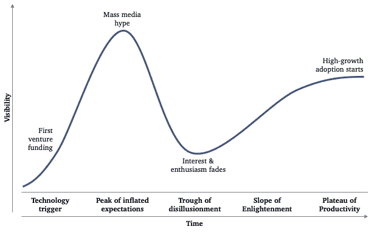
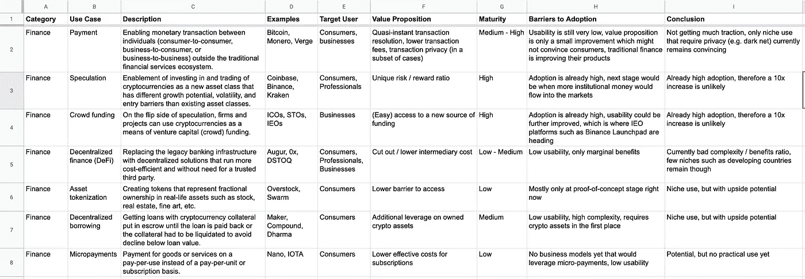
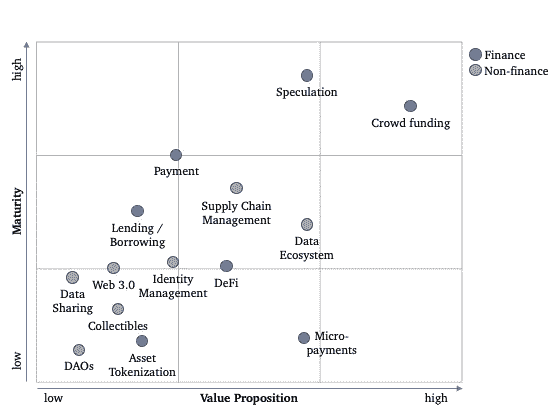

# 区块链需要一个黑仔用例

> 原文：<https://medium.com/coinmonks/blockchain-needs-a-killer-use-case-2f4def841883?source=collection_archive---------0----------------------->

## 从炒作走向主流采用

*回顾 2017 年底，比特币和区块链无处不在。它的飞速发展成为了报纸、电视和广播的头条新闻。每个人都在谈论它。一个真实的炒作。2018 年，价格在下降，公众兴趣也在下降。就连狂热分子也开始对比特币和区块链的未来持怀疑态度。*

> [发现并回顾最佳区块链软件](https://coincodecap.com)

## 完成炒作周期

过去几年我们所经历的是一个教科书式的 [Gartner 炒作周期](https://www.gartner.com/en/research/methodologies/gartner-hype-cycle)。从早期用户最初的热情，到大众媒体的大肆宣传，再到宣传结束后兴趣的消退。

**Figure 1**: Gartner hype cycle

好消息是，对于新的颠覆性技术来说，在充分发挥潜力之前，经历炒作周期是一种自然规律。对于经历了幻灭低谷的区块链来说，下一步就是达到生产率的稳定期。然而，要实现这一点需要主流的采用，这只能通过现实生活中的用例来实现。有些目前正在金融及其他领域开发。

## 支付、投资和后端解决方案

自比特币和区块链诞生之初，金融领域就出现了一些关键用例，这些用例支持新型支付、投资模式和金融后端解决方案:

1.  **支付**:在传统金融服务生态系统内外实现个人之间的货币交易(C2C、B2C 或 B2B)
2.  **投机**:投资和交易具有不同增长潜力、波动性和进入壁垒的资产类别
3.  **众筹**:在投机的另一面，公司可以利用它作为一种手段，通过 ico、s to 或 ieo 获得投资资本
4.  **去中心化金融(**[**DeFi**](https://defi.network/)**)**:创建去中心化的银行服务，使其运行更具成本效益，并且不需要可信任的第三方
5.  **资产代币化**:创造可交易代币，代表现实生活中资产的部分所有权，如股票、房地产、艺术品等。
6.  **借入/借出**:获得以加密货币为抵押品的贷款，并将其交由第三方保管，直到贷款被偿还(或被清算)
7.  小额支付:在无摩擦的按使用付费的基础上为商品或服务付款

## 协作生态系统

主要是在 2017 年初之后，增加了几个非财务用例。除了少数例外，他们专注于为企业和专业人士创造[新的协作生态系统](/coinmonks/why-cryptonetworks-are-eating-the-world-7a147919c7ac):

1.  **Web 3.0** :云服务，如文件或数据库存储、软件定义的网络或通过分散网络提供的 Web 代理
2.  **数据生态系统**:为数据科学家和人工智能开发者提供更好的数据供应、人工智能模型训练和模型重用的专门服务
3.  **身份管理**:个人、组织或设备的通用、唯一、可验证的身份
4.  **供应链管理**:管理运输物品和供应链上组织之间的互动
5.  **数据共享**:跨组织更轻松地共享数据
6.  **分散自治组织(DAO)** :由代码中预先定义的规则集自治的非层级组织
7.  **收藏品**:具有独特收藏品的协作游戏，可以被创建、共享和交易

## 审查用例潜力

我在谷歌表单上创建了这 14 个用例的清单(见下面的链接),并从几个方面对每个用例进行了审查。清单部分包含描述、示例和目标用户群(消费者、专业人员、企业)。审查部分捕获用例的价值主张(可以创造什么以及有多强的优势)、当前市场成熟度和采用障碍(例如，可用性、竞争、解决方案的可用性)。

 [## 加密使用案例和采用

### 加密用例:类别、用例、描述、示例、目标用户群、价值主张、成熟度、采用障碍、结论

docs.google.com](https://docs.google.com/spreadsheets/d/1BM0zEhsU-6fr_ch62SBhFzAK2rrQFUhVlgfU1zqHNno/edit#gid=0) 

**Figure 2**: Snippet from the Crypto Use Cases inventory

我的主要收获如下:

*   众筹和投机显然具有很高的潜力，它们是 2017 年牛市的一部分，但它们也已经相当成熟，很难想象它们会独自推动另一个 10 倍。
*   一般的支付用例似乎已经达到了一个平台；它在比特币早期就已经存在，但还没有取得任何重大进展。微支付具有令人兴奋的潜力，可以实现新的商业模式，尽管这些商业模式尚未确定，所以它仍然主要是理论。
*   试图创建协作生态系统的用例似乎有潜力，但每个用例都有强大的个人障碍需要克服。DeFi 努力实现其价值主张，供应链由企业巨头主导，数据缺乏成熟的解决方案。
*   其他人可能有一些潜力；但是，他们尚未取得足够的进展和/或开发出令人信服的价值主张。

**Figure 3**: Blockchain use cases by current maturity & value proposition

## 还在寻找黑仔用例吗

使用区块链技术有很多有意义的方式，但是从上面所有的方式中，很难找出一个杀手级的用例可以立即推动主流的采用。许多使用案例确实有明确的价值主张，但只是提供了渐进式改进，而不是颠覆性技术证明自己所必须展示的 10 倍改进。

有几个候选方案，如协作生态系统(DeFi、供应链、数据)或微支付，但它们都还不够成熟和/或其价值主张不够清晰。

这些情况可能是为什么 [fat 协议假设](https://www.usv.com/blog/fat-protocols)仍然成立的原因。投资者喜欢基础层协议投资([或技术第二层解决方案](/@PanteraCapital/a-crypto-thesis-47eaacf861ca))作为对技术的赌注，而不是它的使用。除了投机和众筹，我们肯定需要更多真实的用例，才能让这些投资最终获得回报。

> [在您的收件箱中直接获得最佳软件交易](https://coincodecap.com/?utm_source=coinmonks)

