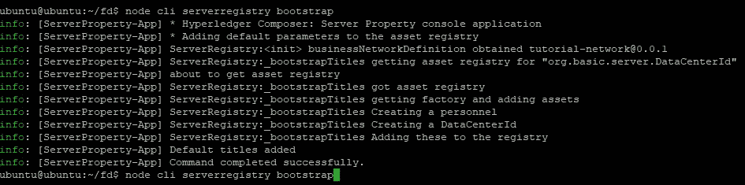

# 区块链节点服务器监控

> 原文：<https://medium.com/coinmonks/blockchain-nodejs-server-monitoring-69f0dd2772ab?source=collection_archive---------5----------------------->

我想介绍一下如何用区块链构建一个简单的服务器监控。我们将编写一个 NodeJS 客户端应用程序，该应用程序将使用服务器参数(如活动内存数量、硬件型号、安装的 CPU 和 RAM 数量、服务器型号和数据中心 ID)将事务提交到结构。

我们需要两台运行 Ubuntu 的机器。我们将在每台机器上安装 NodeJS 客户端和 Hyperledger Fabric 组件。

高层架构应该是这样的:


# **Hyperledger 结构服务器**

按照我下面的帖子来设置服务器。在第一台机器上安装和配置 Hyperledger Fabric。

[](/coinmonks/getting-started-with-hyperledger-composer-34cb7228d44c) [## Hyperledger Composer 入门

### 在第一篇文章中，我想介绍一下 Hyperledger Composer 在 Ubuntu 16.0.4 LTS 版上的安装过程…

medium.com](/coinmonks/getting-started-with-hyperledger-composer-34cb7228d44c) 

您不需要安装和配置 REST 服务器。记下这台机器的 IP 地址。

# **NodeJS 客户端 App**

在第二台机器上，安装`composer-client`和`composer-cli`:

```
npm install --save composer-client@0.20npm install --save composer-admin@0.20
```

我们需要将我们在结构端创建的`admin@tutorial-network` 复制到客户端。登录第一台机器，复制位于 **$HOME/的`admin@tutorial-network` 文件夹。作曲/卡**和 **$HOME/。作曲者/客户-数据。**


登录到客户机，并将这些文件粘贴到客户机上。

从 **$HOME\中打开 **connection.json** 。composer \ cards \ admin @ tutorial-network**并更新从 localhost 到服务器 IP 地址的连接字符串(在我的例子中是 192.168.0.109):

## 执行脚本

我们将在客户端执行 NodeJS 应用程序:

*   要创建参与者和资产，请执行:

```
node cli serverregistry bootstrap
```



该脚本将用预定义的值填充参与者和资产:


Participant Registry


Asset Registry

*   要获取资产列表，请执行:

```
node cli serverregistry list
```


从上面的截图可以看出，Active_Memory、HW_Model 等的值仍然为空，因为我们还没有提交事务。

*   要提交事务，请执行:

```
node cli serverregistry submit 64 "Model A" 8 4 "Server A" ADM
```

带参数:

**活动内存** : 64

**HW _ 型号**:型号 A

**已安装 _ CPU**:8

**已安装 _RAM** : 4

**服务器型号**:服务器 A

数据中心 id:ADM


尝试执行前面的命令:`node cli serverregistry list`，您将看到事务已经被填充:


*   要监听事件，请执行:

```
node cli serverregistry listen
```

事件将在您提交事务后发出。您将看到控制台日志被打印出来。

所有代码都可以在我的 Git 回购上找到:[https://github.com/ferrygun/NodeJS-Blockchain](https://github.com/ferrygun/NodeJS-Blockchain)

> [在您的收件箱中直接获得最佳软件交易](https://coincodecap.com/?utm_source=coinmonks)

[](https://coincodecap.com/?utm_source=coinmonks)