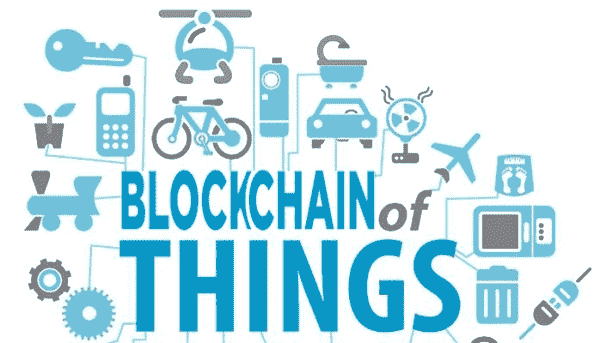
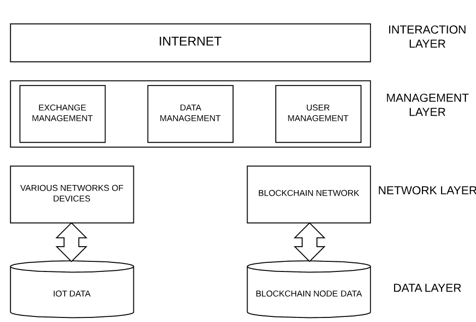
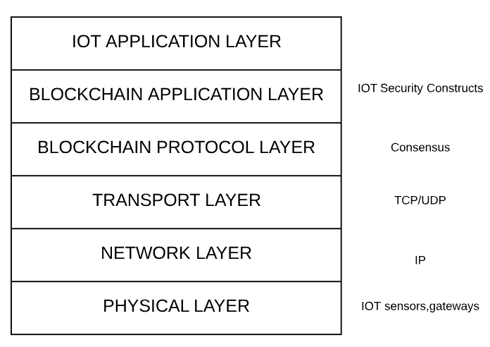

# 物联网区块链

> 原文：<https://medium.com/coinmonks/blockchain-of-things-f0d86d0d1533?source=collection_archive---------1----------------------->

**块#3:没有安全性的物联网=威胁互联网**

区块链技术不再处于起步阶段，但它仍然非常新。关于物联网(IoT)也可以做出类似的陈述。然而，围绕物联网中区块链应用的讨论是最近才开始的。这两者的结合接近于未经检验的——目前是未应用的。

让我们后退一点，从我们的方式中得到一些定义:

区块链是一种共享的、不可变的分类账，用于记录交易历史。它培育了新一代的交易应用程序，从合同到契约再到支付，这些应用程序建立了信任、责任和透明度。

物联网(IoT)是一个由相互关联的计算设备、机械和数字机器、物体、动物或人组成的系统，它们具有唯一的标识符和通过网络传输数据的能力，而无需人与人或人与计算机的交互。

目前，物联网设备上的数据交换是通过集中式服务器进行的。这实际上导致了“数据宝库”的形成。数据宝库可以定义为集中在单个站点的宝藏(与设备相关的数据)。如果攻击者以该站点为目标并成功获取这些数据，网络的所有其他成员都将受到威胁。

让我们看看区块链技术可以帮助分散数据交换的一些方法。基于区块链的解决方案将始终确保:

*   可信交易:所有交易都记录在分类账中，一旦确认就不可更改。此外，分类账是分布式的，因此任何人都可以下载和审计交易。
*   可信数据访问:数据的访问权限可以由数据所有者决定。
*   可信的隐私保护:数据所有者可以在交换数据时保护他们的个人信息，因为他们只会将他们的公钥给别人。

这可以通过使用这种分层架构来实现:

我们将从下往上看各层:

**数据层:**

1.  IOT 数据:存储云，数据库云，无线传感器节点。
2.  区块链节点数据:存储在区块链网络上，用于记录整个数据交换过程。

**网络层:**

1.  各种设备网络:对等设备网络、网站、存储云。
2.  区块链网络:存储所有交易副本的节点。

**管理层:**

它控制用户的安全并管理平台上的权限。除此之外，它还跟踪数据访问权限、交换关系和事务历史。此外，数据的可审核性高度依赖于这一层。

**交互层:**

它是数据交换各方通过网页或连接到互联网的移动设备进行交互的接口。

当包含在网络堆栈中时，这些层看起来会像这样:

物联网和区块链的联盟有四大支柱:

1.  共识；一致
2.  分类帐
3.  密码系统
4.  智能合同

这四大支柱实际上帮助我们提出了一种沟通模式，包括:

1.  对等消息传递:用于建立共识
2.  分布式数据共享:维护分布式集成分类帐。
3.  与设备的自主协调:这可以通过使用智能合约来实现，智能合约管理传感器读取任何数据时执行的交易。

通信模型的所有这些组件都受到加密算法的支持，例如椭圆曲线数字签名算法(ECDSA ),它支持使用公钥和私钥交换和访问数据。

这种组合可以实现的另一个有趣的目标是设备的身份和访问管理。通常，来自 IOT 设备的数据被认为更可靠。但是如果设备本身受到损害，这就不成立了。设备固件配置和状态的加密散列可以帮助我们验证数据不是来自流氓设备。我们可以使用哈希来验证设备是否是真实的，软件设置是否被篡改。

我们可以定义一个元组，用于表示网络中的物联网设备:

**< ID，Kpub，Kpriv，π(nonce，固件，Kpub) >**

在哪里，

ID —公钥的唯一标识符/较短版本

Kpub —公钥

Kpriv —私钥

π(nonce，firmware，Kpub) —使用不可逆哈希函数生成的哈希:

1.  随机生成的随机数。
2.  设备的固件配置和状态。
3.  设备的公钥。

π(nonce，firmware，Kpub)基本上构成了设备的硬件信任根。让我们称之为“固件证明”。

这种算法的可行性可以使用连接到分散式区块链网络的传感器的低功率自主网状网络来测试。事务池可能具有很高的可变性，但是事务池的分支因子和最大大小可能是有限的。

测试参数可以是:

*   考虑到网络的规模，阻塞到达时间。
*   各种网络规模的稳定时间
*   测试网络中的损耗链路

让我们来看看这种算法有什么帮助:

*   Sybil 攻击是指通过在对等网络中伪造身份来破坏信誉系统。更简单地说，Sybil 攻击是指恶意设备能够冒充网络中的其他设备。该算法有助于防止这种攻击。
*   此外，由于硬件信任根中的随机数，它提供了动态认证并可以避免重放攻击。

然而，将物联网用于区块链存在一些挑战，这也是区块链领域的一个潜在研究领域:

1.  存储所有对等方的分类帐
2.  系统的可扩展性(块大小、块到达时间)
3.  处理不断增长的设备数量和这些设备之间的通信成本。
4.  处理网络中各种设备的延迟和带宽。
5.  区分网络中的恶意节点
6.  固件更新管理、固件篡改检测、虚假组件检测。

**说得轻松点……**

> [在您的收件箱中直接获得最佳软件交易](https://coincodecap.com/?utm_source=coinmonks)

