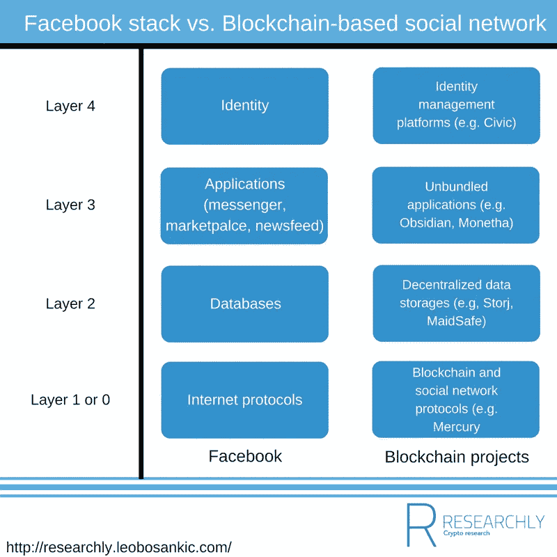

# 区块链项目和社交网络:产品、分拆和重建堆栈

> 原文：<https://medium.com/coinmonks/blockchain-projects-and-social-networks-products-unbundling-and-re-creating-the-stack-8c330955c5ba?source=collection_archive---------6----------------------->

鉴于脸书最近在剑桥分析(Cambridge Analytica)和由此产生的#删除 Facebook 的背景下出现的问题，区块链被认为是脸书和整个社交网络的一个可能的解决方案。

区块链公司有几种方式来建设一个新的“脸书”。然而，在研究他们的战略之前，重要的是“从概念上”定义什么是脸书。我觉得有三个方面值得一提:

1.  **一套产品**
2.  **一个人的在线身份**
3.  **一个社会技术系统**

## **一套产品**

这是最明显的方面；这是一个可以使用的产品。除了核心产品——新闻订阅——还有信使或市场。这包括触觉方面的东西，如 UX 和内容，但也包括触觉程度较低的东西，如已经发展起来的用户网络。

## **一个人的在线身份**

对很多人来说，脸书代表了他们的网络“自我”。一方面，是一个人的网络生活:朋友、关系、兴趣等等。至关重要的是，正如我在[比特币、区块链和加密资产:讨论泡沫与讨论社会技术系统](http://researchly.leobosankic.com/2018/01/28/bitcoin-blockchain-cryptoassets-discussing-bubbles-vs-socio-technical-systems/)中提到的那样，人们不能将这些信息(朋友、关系、兴趣等)迁移到其他服务中。与可以在提供商之间移植的电话号码相反，脸书的数据(以及所有其他社交网络的数据)都是附属于那个应用程序的。

另一方面——类似于护照——它是一种工具，允许你通过脸书登录进入其他网站。关键在于，尽管它几乎已经成为一种“普遍商品”，但它是由一个非中立的实体控制的。这与前面提到的由政府签发的护照形成了鲜明的对比——这是一个中立的例子。

## 社会技术系统

一个社会技术系统由技术本身、应用及其周围的一切组成，如用户实践、象征意义、法规和更广泛的利益相关者网络。技术和应用指的是我在“一套产品”下描述的内容(新闻提要、信使、市场、UX、内容、用户网络)。除此之外，还有数不清的其他方与脸书有关，比如专门从事脸书市场的营销机构，或者建立在脸书周围或之上的企业(想想 vbloggers)。此外，人们积累了许多关于正确使用脸书的知识。这包括与营销相关的洞察力，比如知道哪种类型的内容有效，还包括大量法律案例，表明人们和脸书可以做什么。在这种背景下，也考虑一下直接通过股票或通过购买广告间接流入脸书的所有资金。最后，还有嵌入社会的脸书；询问某人的脸书而不是电话号码，或者查看脸书而不是抽根烟休息一下。

这些区别导致了脸书创造的三个“护城河”:

1.  一套工作产品:要与脸书竞争，首先必须制造更好的产品。也许是最容易的部分，但仍然是困难的和必须克服的。
2.  **网络效应**:要建立一个新的社交网络，你必须说服大量的人和公司转向并贡献内容。尽管新的网络不时出现，启动一个像脸书这样大的网络需要时间(和金钱)。
3.  **社会技术系统:**如上所述，脸书在社会中根深蒂固。重建它需要时间。此外，这种社会技术系统是在各种利益相关者的影响下“发生”的事情，其中脸书可能没有最大的影响力。

现在，记住这些护城河和区别，看看区块链公司试图对抗现有社交网络的方式是很有趣的:

1.  **应用**
2.  **社交网络协议和平台**
3.  **基于区块链的广告平台**

## **应用**

这些项目正在区块链上建立社交网络。例子包括[social](http://researchly.leobosankic.com/cryptos/sociall/)或者 [Sphere](http://researchly.leobosankic.com/cryptos/sphere/) 。此外，还有 LinkedIn/Xing-pendant 职业社交网络[indoness](http://researchly.leobosankic.com/cryptos/indorse-token/)。除此之外，还有一些项目只涉及脸书产品的一部分，如信使或市场。[黑曜石](http://researchly.leobosankic.com/cryptos/obsidian/)是使用区块链技术构建的信使的一个例子，而 [Monetha](http://researchly.leobosankic.com/cryptos/monetha/) 是使用区块链技术构建的市场的一个例子。

## 社交网络协议和平台

属于这一类的项目不创建最终用户应用程序，但正在开发使其他人能够构建这些最终用户应用程序的协议。[汞议定书](http://researchly.leobosankic.com/cryptos/mercury-protocol/)就是这样一个例子。Mercury 协议是一个开源协议，其他社交网络(和类似的平台)可以加入该协议，以利用 Mercury 的功能，如假名、通过令牌的激励和通过去中心化增加的安全性(公平地说，这些功能通常适用于区块链)。此外，还有奖励系统，如 [Synereo](http://researchly.leobosankic.com/cryptos/synereo/) 或 [Steem](http://researchly.leobosankic.com/cryptos/steem/) 。STEEM 是一个基于区块链的奖励平台，由 Steem 平台、Steem 令牌、 [Steem 美元](http://researchly.leobosankic.com/cryptos/steem-dollars/)和 SMT(智能媒体令牌)组成。SMT 是可以使用 Steem 平台发布的令牌的总称。然后，这些 SMT 可以用于创建社交网络，通过 upvotes 或赞奖励这些代币，从而激励“好内容”。 [STEEMit](http://researchly.leobosankic.com/cryptos/steemit/) 是在 Steem 上启动的第一个应用程序，使用 Steem 令牌。Synereo 也是一个奖励系统，但它是平台不可知的，它的令牌——AMP——可以用来奖励创作者和内容分享者，而不管内容是在哪里发布的。 [WildSpark](http://researchly.leobosankic.com/cryptos/wildspark/) 是第一款使用 Synereo 打造的产品。每当有东西通过 WildSpark 分享时，接收者可以用 AMPs 奖励创建内容的人和分享内容的人。

## 基于区块链的广告平台

属于这一类别的项目，如[基本注意力令牌](http://researchly.leobosankic.com/cryptos/basic-attention-token/)正在创建去中心化的广告平台，像脸书这样的中间商被剔除，利润——以平台令牌 BAT 的形式——在出版商、广告商和用户之间分配。

## 身份管理解决方案

这些项目仅采用脸书生态系统的一部分——在线身份——并利用区块链技术建立在线身份。例子包括[思域](http://researchly.leobosankic.com/cryptos/civic/)或者[钥匙](http://researchly.leobosankic.com/cryptos/thekey/)。

现在，当我们综合考虑这些区块链项目时，我们可以总结出一些他们如何攻击现有社交网络的策略:

1.  **利用区块链的** **固有优势(分布式、激励性)建立更好的社交网络**
2.  **放开脸书**
3.  **重建“脸书堆栈”**

## **利用区块链的** **固有优势(分布式、激励性)建立更好的社交网络**

上面提到的[social](http://researchly.leobosankic.com/cryptos/sociall/)和 [Sphere](http://researchly.leobosankic.com/cryptos/sphere/) 正在建立没有中心实体的分散式社交网络，并对用户的贡献进行补偿。考虑到离开脸书所固有的转换成本、脸书的上述广泛应用和在社会中的嵌入，我怀疑奖励做出贡献的人和权力下放本身是否足够。然而，有两个有趣的切入点可以利用；脸书环境中的生态位和变化。考虑到像[水星协议](http://researchly.leobosankic.com/cryptos/mercury-protocol/)这样的协议或像 Steem 这样的平台允许任何人“容易地”建立另一个社交网络，许多项目可以创建非常小众的应用程序，从多个站点攻击脸书。脸书环境的变化是建立在过去其他社会技术系统的兴衰之上的。以马为基础的运输就是一个例子。这样的和其他的社会技术系统告诉我们

*   这些系统可以拆除，但是
*   要做到这一点，需要一个外部触发器

在马车运输的情况下，许多触发因素之一是人们由于马造成的灰尘而搬到郊区，因此旅行距离更远。第一辆汽车解决了这些长距离的问题。

现在，通过#DeleteFacebook，我们可以在社交网络的流行生态系统中看到类似的触发因素。尽管我怀疑这是否足以让脸书下台，但我确实认为，如果我们想得到一个“象征化的脸书”,一种方法是“等待”脸书社会技术体系中一些重要的外部触发因素。

## **放开脸书**

我们可以在金融科技领域观察到类似于[的解绑(和再解绑)](http://researchly.leobosankic.com/2017/11/15/fairly-good-incumbents-fintech-re-unbundling/)我们可以看到上述产品是如何将不同的脸书产品解绑成独立的应用程序的。[黑曜石](http://researchly.leobosankic.com/cryptos/obsidian/)是解开脸书信使的一个例子， [Monetha](http://researchly.leobosankic.com/cryptos/monetha/) 是解开脸书市场的一个例子，并且——在某种程度上——[social](http://researchly.leobosankic.com/cryptos/sociall/)和 [Sphere](http://researchly.leobosankic.com/cryptos/sphere/) 是解开脸书的核心，新闻馈送。

## **重建“脸书堆栈”**

如果我们从技术的角度来分析脸书，我们可以说有四个堆栈:

1.  **第 1 层或第 0 层—互联网协议:**互联网协议，支持脸书在全球范围内发送数据
2.  **第 2 层—数据库:**存储数据的脸书数据库
3.  **第三层——应用**:脸书的终端用户应用，比如我们直接使用的 messenger、news feed 或 marketplace。
4.  **第 4 层——身份层**:尽管脸书的在线身份可以被视为应用层的一部分，但将其视为一个独立的实体是有用的，因为我们不会像使用 messenger 那样直接使用它，而是“利用”它来使用其他东西(即我们使用脸书帐户登录的产品)。

概述了堆栈之后，我们回到许多人所说的 Web 3.0。在这个 Web 3.0 中，现在的互联网被拆解成一个去中心化的版本。在这种情况下，堆栈可能如下所示:

1.  **第 1 层或第 0 层:**区块链或协议(如水星协议)将代表第 1 层或第 0 层
2.  **第二层—数据库:**分散式数据库，如 [Storj](http://researchly.leobosankic.com/cryptos/storj/) 或 [MaidSafeCoin](http://researchly.leobosankic.com/cryptos/maidsafecoin/) 将用于存储数据。与脸书方法的一个主要区别是每个开发者都可以访问数据库。
3.  第三层——应用:既有独立的终端用户应用(如[黑曜石](http://researchly.leobosankic.com/cryptos/obsidian/)或[莫内萨](http://researchly.leobosankic.com/cryptos/monetha/))也有包罗万象的社交网络。因为每个人都可以访问存储一个人的所有朋友、关系、兴趣和类似信息的数据库，所以许多公司可以开发新的应用程序，而不必重建整个人际网络。
4.  **第 4 层—身份层** : Civic 和其他身份管理平台将作为与脸书分离的**身份层。**

Comparing Facebook to a possible Blockchain-based social network

有了这种“堆栈式方法”,合作伙伴关系(技术上——考虑跨链解决方案以及商业上)如何在基于区块链的项目的未来发挥极其重要(但也非常令人兴奋)的作用就变得显而易见了。此外，它还展示了“击败”现任者的最佳方式不一定是直接“攻击”他们，而是通过横向(即跨堆栈)组合几个(区块链)项目来建立一个新的脸书或任何其他社交网络(或就此而言，任何其他当前占主导地位的 web 应用程序)。

*原载于 2018 年 4 月 12 日*[*researchly.leobosankic.com*](http://researchly.leobosankic.com/2018/04/12/blockchain-projects-social-networks-products-unbundling-re-creating-stack/)*。*