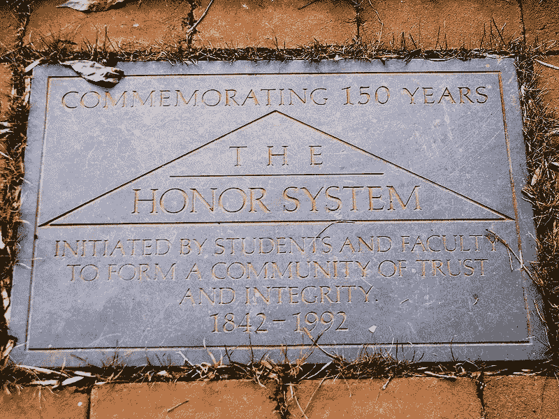
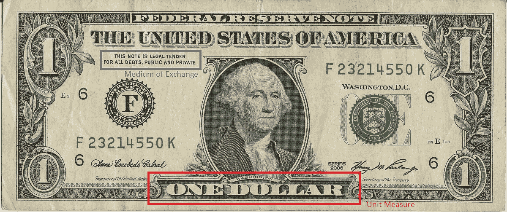

# 区块链:信任的重新发现

> 原文：<https://medium.com/coinmonks/blockchain-re-discovery-of-trust-5aa68ae770dd?source=collection_archive---------9----------------------->

> 作者注:在我关于区块链的系列文章的一开始，我就向您承诺，我想与您分享为什么我认为这是一个革命性的想法。在这篇非技术性的文章中，我直接进入了主题。这与加密货币无关，也与元宇宙无关，尽管如果没有区块链，两者都不会存在。这是一种更深刻、更接近人性的东西。这是关于我们过去的一些事情，也可能是关于我们未来的一切。这是我们非常在乎拥有的东西，也非常害怕失去。

在[的最后 5 篇帖子](/@lbhy.mshr/list/blockchain-basics-b51c0eb96c92)中，我们经历了**区块链**采用的几种机制，以实现—

*   *在内容和顺序上的不变性*
*   *透明*通过复制
*   *分散链验证协议的可验证性*

但是为什么区块链被设计成具有这些特征呢？为了回答这个问题，我们要回顾一下我们自己的历史、我们的进步以及**信任**的价值。

# 人性、贸易和信任

我们没有人怀疑贸易在我们生活中的重要性。人们已经很好地研究过，人类的进步与贸易的发展完全一致。根据尤瓦尔·诺亚·哈拉里的*智人——*

> …事实是，除了智人之外，没有任何动物从事贸易…
> 
> …没有信任，贸易就无法存在，而且很难信任陌生人…
> 
> …当部落社会中的两个陌生人想要进行交易时，他们通常会通过求助于共同的神、神话祖先或图腾动物来建立信任…

上面的摘录强调了三个极其重要的观点，我们称之为 ***3 条交易原则*** —

*   *只有人类交易*
*   *贸易需要信任*
*   *使用共同的更高权限建立信任*

## 贸易和信任

最早的贸易形式之一是礼物经济。社会规范和荣誉体系决定了未来的回报，这在较小的群体中非常有效。这依赖于**信任**，我们*信任*我们的朋友&家人在需要时支持我们，有时甚至是我们最亲密的邻居。

Honoring the Honor System. credit: Wikimedia Foundation

另一种贸易形式是易货经济，即货物和服务的即时交换。商品的价值决定了贸易条件，[袋谷物](https://agriplasticscommunity.com/barley-as-the-first-official-currency-in-the-world/)可以用来换盖房子。这也适用于**信任**，*可核实的信任*，你可以亲眼检查谷物的质量，或者袋子的大小。

## 信任和更高的权威

随着社会变得越来越大，贸易网络越来越大，维持信任变得越来越困难。因此，在对贸易的永恒追求中，人类创造了超人的权威来保管信任。哈拉里笔记

> …宗教是人类的第三大统一者…所有的社会秩序和等级都是想象出来的，它们都是脆弱的，社会越大，它就越脆弱…宗教的一个至关重要的历史作用是赋予这些脆弱的结构超人的合法性…

超人的合法性允许人类信任陌生人，只要他们相信共同的超人法则——相同的宗教。这种共同信仰的兴起使得贸易繁荣，因为信任繁荣了！

## 金钱和公共权力

现代世界中的陌生人与任何人都有贸易往来，不管我们说他们的语言还是信仰上帝。因为我们仍然相信一种新的共同的超人实体——金钱！

Tokens of Trust. But Trust who?

以金钱为核心，[是**信任**T21 的载体。具体来说，你相信金钱具有以下特征](https://www.oecd.org/forum/oecdyearbook/trust-not-money-makes-the-world-go-round.htm)

*   成为一个交换媒介，相信每个人都会用金钱来交换商品和/或服务
*   *成为一个衡量单位，相信钱的数量可以用来衡量商品和/或服务的数量*
*   做一个价值储存库，*相信价值不会在一夜之间流失*

金钱是人类的产物，完全是人造的，上帝没有创造金钱，自然也没有。但是我们如此信任金钱，以至于我们愿意用一生去追逐它。我们为什么信任金钱？

## 谁给钱赋能？

今天存在的所有货币都是法定货币，这意味着它们是由政府支持的。政府保证货币的三个特征，我们相信我们的政府会信守承诺。

The bill imprints the first 2 features, third feature is implicit in the issuance of the bill

回到我们的交易原则，金钱允许人们交易，因为我们创造了一个共同的更高的权威，叫做政府，我们通过政府建立了信任。从这个意义上说，金钱只不过是对政府信任的一种 T2 象征。

# 信条中的变数

在*的 3 条交易原则*中，我们发现了惊人的洞察力。前两个原则是不变的真理，如果你愿意，也可以说是不变的。

*   只有人类会交易。即使是我们最近的近亲物种，尼安德特人也没有交易；他们很可能灭绝了，因为他们没有交易。
*   有信任就有贸易。[缺乏信任，交易萎缩](https://www.eastasiaforum.org/2019/05/06/traps-of-a-trade-system-without-trust/)。

但是 3ʳᵈ原则有些古怪，它引入了我们如何建立信任的可变性。人类已经使用不同形式的**共同的更高权威** (CHA)来建立信任，反映了随着时间的推移社会的进步:荣誉制度、宗教&地方法律、政府&人权

CHA 随着时间的推移而演变，但在整个演变过程中有一个共性。荣誉制度、宗教和政府都使法律能够带来社会秩序，制定协议确保法律得到维护，违法者受到惩罚。法律是稳定的，因为它们不能被随意修改。法律通常是公共知识，因此是透明的。法律由中央权威、家族族长、上帝或他们的先知、政府来验证。就其社会规模而言， **CHA** 是一个保证*稳定性、透明性&可验证性*——因此**信任**的协议！

## 数字世界的共同最高权威

我们处在一个由万维网连接起来的技术世界，一个数字世界，在这个世界里，国界的概念正在变得模糊。现在，贸易不仅仅是商品和服务的交换，还包括数据和信息的交换。在这个领域中，目前的形式是不够的。互联网上的信任正在迅速衰减。如果信任消失，贸易就会消失，人类也会随之消失。

因此，我们需要一个新的机构来重新发现信任，繁荣并让他的人类进步在一个如此相互联系的世界中继续前进。区块链能成为新的 **CHA** 的潜在候选吗？

也许吧！区块链是—

*   *稳定*或*不可变*，在计算上不可能修改链条
*   *透明*，因为**复制**允许任何人下载副本
*   *可验证*，哈希**的数学很容易被验证**

Blockchain to Digital World be like…

# 最后

区块链可以作为数字世界中建立信任的**共同的更高权威**的想法并不牵强。我们已经看到了这一点。区块链帮助了—

*   创造像比特币这样的数字货币，信任的象征
*   在互联网上陌生人之间执行智能合同，信任编码
*   使用 NFTs 繁荣数字文件贸易，信任的结果
*   使用 dApps 扩展数据和信息的交换，信任的结果

所有这一切最终形成了 ***元宇宙*** 的最终想法，一个超越物质现实的世界。对于乐观主义者来说，这是人类进化的下一步。但是如果没有我们对数字世界的信任，这一切都不可能实现。谢天谢地，通过区块链，我们找到了建立这种信任的方法。

> 这就是为什么区块链是革命性的！

## 怀疑论者的脚注…

*区块链革命并不意味着社会现有结构的终结。认为我们可以用技术取代现有的差距是天真的。当社会转向政府时，宗教没有消亡，荣誉制度也没有消亡，它们今天仍然存在，也许以比过去更强大的形式存在。每个 CHA***都有自己的价值主张，所以它们即使在区块链的世界里也会存在。数字世界需要区块链，物理世界的 CHAs 将会容纳新的玩家。**

> *加入 Coinmonks [电报频道](https://t.me/coincodecap)和 [Youtube 频道](https://www.youtube.com/c/coinmonks/videos)了解加密交易和投资*

## *另外，阅读*

*   *[顶级付费加密货币和区块链课程](https://blog.coincodecap.com/blockchain-courses)*
*   *[在美国如何使用 BitMEX？](https://blog.coincodecap.com/use-bitmex-in-usa) | [BitMEX 评论](https://blog.coincodecap.com/bitmex-review)*
*   *[最佳期货交易信号](https://blog.coincodecap.com/futures-trading-signals) | [期交所评论](https://blog.coincodecap.com/liquid-exchange-review)*
*   *[南非的加密交易所](https://blog.coincodecap.com/crypto-exchanges-in-south-africa) | [BitMEX 加密信号](https://blog.coincodecap.com/bitmex-crypto-signals)*
*   *[MoonXBT 副本交易](https://blog.coincodecap.com/moonxbt-copy-trading) | [阿联酋的加密钱包](https://blog.coincodecap.com/crypto-wallets-in-uae)*