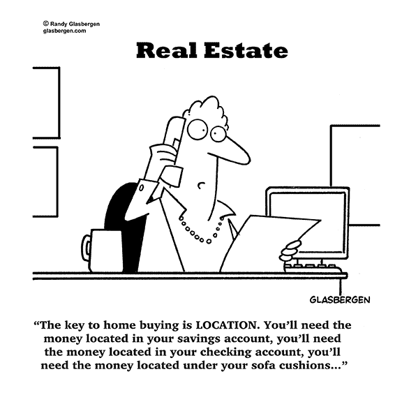
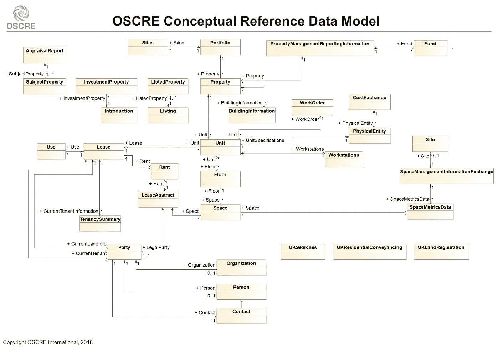

# 区块链:在房地产领域开创数据先例

> 原文：<https://medium.com/coinmonks/blockchain-setting-a-data-precedent-in-real-estate-17f89592b0c1?source=collection_archive---------0----------------------->

[Real Estate Digitalization](https://www.richardvanhooijdonk.com/wp-content/uploads/2015/07/real-estate.jpg)

有人认为，获得语言是使人类能够在当前领域发挥主导作用的最独特的特征。人与人之间的交流将思想从时间的枷锁中解放出来，并启动了思想的繁衍。群体之间的交流为同理心扫清了道路，逐渐确保了当遇到新群体时的默认选项不是屠杀他们，因为合作可以带来好处。诚然，如今，似乎一种共同的语言能让群体更好地定义他们如何与其他人“不同”，但至少这是通过脸书上的煽动性帖子而不是对人的煽动性装置来实现的。

共享语言创造了城市，但互联网下的数据标准导致了知识共享的寒武纪大爆发。早期的标准最终形成了公认的协议，这些协议构成了我们今天通信的主干(HTTP、IP 等。).事实上，这就是社会如何进化的，因为我们不断地更新基于有效的共享思想的社会规则。书籍要求我们学习如何阅读和写作；贸易迫使我们理解金融和会计；网络要求我们理解计算机和智能设备。在所有这些情况下，都有一个陡峭的学习曲线，但这种做法最终成为第二天性，使社会能够专注于收获好处:知识存储和从书中检索；通过交易实现的技能专业化；通过网络实时分享知识。所有这些都是说，数据标准是任何行业都必须采取的第一步，以便首先实现收集此类数据的真正好处。

这将我们带回房地产行业(RE ),该行业目前缺乏建立强大数据基础的适当激励措施。其中的一个主要原因是，由于可再生能源是一个非常实物化的行业，因此与其他资产相比，可再生能源具有更强的环境针对性。re 里亘古不变的座右铭是“位置，位置，位置”是有原因的。即使只考虑一个因素，如总建筑面积，不同的市场也会有不同的定义。除此之外，还有无数的可用单位:平方英尺、平方米、坪(日本)、坪(台湾)、坪(韩国)。一些市场和平台甚至回避这一点，支持房间数。

[Location, location, location…](https://www.glasbergen.com/real-estate-cartoons/)

鉴于客户对信息化可再生能源业务的期望差距越来越大，区块链技术可能正是推动该行业前进所需的催化剂。这是一个大胆的主张，目前缺乏任何支持，但正如我在这里争辩的那样，区块链技术将通过重新调整核心激励机制来扰乱行业的权力动态。此外，它还为一个常常依赖数据和专用网络资本控制来生存的行业提供了急需的替代商业模式。那么，我们如何开始围绕利用区块链技术更好地为整个社会服务进行明智的讨论呢？

**垃圾进，垃圾出:打基础**

建立一个定义良好的数据结构将在将来处理任何类型的数据时最大限度地减少麻烦。当然，这样的结构还必须足够灵活，以便将来任何被广泛接受的标准都能够以最小的干扰进行集成。这需要很好地理解数据以及当前正在捕获的任何数据的要求。

[Model proposed by OSCRE](https://www.oscre.org/OSCRE-Data-Model/Lease-Abstract-Review)

必须注意的是，由于 RE 的异质性，不可能通过屏幕上显示的信息获得特定属性的完整图像。此外，尽管收集的数据可能相似，但根据所分析的财产类型(住宅、办公、替代等)，要求会有显著差异。).特别是，商业房地产数据往往具有相对较高的保密要求，这有助于对数据进行更高级别的资本控制。

鉴于上述原因，以下是一些观察可再生能源数据的非常规方法，以便提供一种更实用的方法来实现区块链技术的优势。此外，区块链理工大学的微妙之处(特别是密码经济学)已经被简化，以免事情过于复杂。这些方法并不相互排斥，而是在尝试确定未来的协议时要考虑的一个通用框架。

*   **继续照常运营所需的最少数据(BAU):** 这是最直接的方法，因为它基本上采用了当前的数据标准并将其迁移到分布式分类账。尽管这样做可以实现很多好处，但是系统很可能是不可持续的，因为系统很可能会被复杂性不断增长的不必要的数据所拖累。此外，在需要保密的情况下，这些信息仍然需要保持在链外，导致我们今天看到的孤立数据库带来的同样的低效率。
*   **基于数据类型需求的数据抽象:**给定 RE 的物理方面，将有一组固定的客观数据，这些数据将始终形成行业引用的主数据。展望未来，需要对该主数据列表的内容达成全行业共识。这将只允许将关键数据写入链，从而显著提高性能。影响存储在共享分类账上的数据类型的一个主要因素是此类信息的保密性以及即将推出的哈希解决方案的能力。
*   **消费者做出明智决策所需的数据:**许多可再生能源公司能够通过出售不透明数据获取经济租金来维持运营。这在 CRE 中尤其如此，但随着颠覆者在目标与消费者需求一致的驱动下进入该领域，在位者将不得不权衡这种租金消散的风险。因此，市场会要求某些数据类型更加透明。例如维护记录、交易历史和估价历史。
*   **真正有价值的数据:**与上述相关，当市场上有足够的结构化公共数据时，市场愿意承担的任何额外数据成本都将用于真正的数据发现。这可以是通过主链购买的房地产研究，也可以是特定公司要求的投资组合策略。这是真正需要 re 专业意见的数据类型，而不是为了获得销售线索而提供“诱惑数据”。

记住这一点，我们就可以开始研究 RE 中不同的数据类型了。像 RICS 和 OSCRE 这样的机构将成为研究数据类型的有力起点，因为它们都在推动行业采用共享标准。请注意，下面的列表不是详尽的，而是组织 RE 数据量的一般准则。此外，它没有涵盖数据库的微妙之处，如嵌套和映射。维护这样一个更新的区块链的经济性也不在本文的范围之内，但是可以说，这将是一个重要的考虑因素。

*   **位置:**这些信息大部分已经以广泛采用的格式公开发布。因此，将此类信息转移到公共分布式分类账的阻力应该最小。事实上，许多政府目前正在承担维护这一名录的费用。

*【单位，级别，街道，区，城市，国家，邮政编码，行政区，坐标】*

*   **建筑:**这些信息构成了做市所需的核心数据，因此大部分都是公开的，尽管有很大的差距。公开搜索这些信息可能会遇到一些阻力，因为某些市场喜欢提供产生销售线索所需的最少量的数据。这也是造成行业不透明网络效应的原因。

*【面积、套内面积、使用类型、竣工日期、车位余量、层数、层高、设施】*

*   **工厂和设备:**这更适用于 CRE，尤其是替代市场。这种信息通常只有在与特定建筑物中有经验的租户或服务提供商交谈时才可获得。增加透明度将大大有助于减少多余的中间人成本和延误。也就是说，当涉及到现任者的设备时，可能需要访问限制，因为可以从这些信息中推断出业务策略。

*【类型、特征、规格、年限、维护计划】*

*   **基础设施:**按照当前的市场惯例，除了特定的业务线，通常不需要这些数据。尽管如此，由于将这些信息保留在付费墙后的收益相对较少，因此选择访问这些数据将有助于市场匹配。

*【通信、水、电、交通、容量、管线】*

*   **租赁:**这可能是数据透明将面临巨大阻力的地方，特别是在成本和租赁条件方面。房东和房客之间的保密协议很常见，因为这种不透明保护了行业的利益。re 中的许多冗余(以及收入)都是挖掘出这种有意模糊数据的结果。这也是造成可再生能源有限的负面影响的原因，而这种影响是否真的有益还有待讨论。这种不透明的可再生能源做法将极难解决，但该行业对这种技术机遇的反应将暴露出他们真正关心的是谁的利益。

*【房东、租客、租期、租金、押金、开发商、代理商、入住历史、合同】*

*   **服务:**这是另一种寻求维持现状的数据类型，特别是在 CRE 中，这种服务的需求很高。目前，在大多数情况下，服务提供商通过利用与供应商建立的关系获得的优惠价格来回应征求建议书。这并不一定是一件坏事，因为服务提供商会因为他们提供的便利而获得回报。然而，这样做的后果是，当涉及到数据发现时，存在大量冗余，因为每个响应都需要多轮澄清(在客户端和供应商端)，而不参考以前的协议。

*【提供商、供应商、服务协议】*

*   **估价:**重新估价并不完全是一门科学，但它高度依赖于大楼的租金。事实上，房东实际上更喜欢更高的表面租金(更高的租户激励)，以便为他们的资产获得更好的估值。因此，尽管它很少被提及，但在公布这些数字时，它面临着同样的挑战。这种信息可以在链上获得的另一种方式是通过在付费墙后面提供所有以前的估价报告。这增加了行业的责任，因为没有一方能够挑选他们的信息或掩盖不利的信息。

*【货币、方法、假设、交易】*

*   **法律合规性:**许多政府已经有了一个可供公众搜索的(免费或付费)官方目录。围绕这些信息几乎没有保密问题，因此围绕这些数据的挑战将是数据库的集成/迁移。拥有这样一个在属性和坐标之间具有正确映射的目录将极大地减少尽职调查的成本和工作量。

*【登记号、代码、所有权、地役权】*

*   **证书:**这是房东会宣传的信息，因为它减少了租户的不确定性。事实上，如果这些信息被掩盖，潜在的买家或租户会感到不舒服。区块链技术还有一个额外的好处，就是这种证书很容易被验证。因此，这种数据类型应该相对容易实现。

*【消防、安全、环境、能源、设计、遗产】*

*   **其他文件:**不符合模式但仍然相关的其他文件。照片将是至关重要的市场匹配，因此应该有最低限度的保密问题。平面图的可用性将是一个重要的附加值，因此可能会受到市场的需求。其他文件将是一个增值，因此，如果需要访问应该是可用的。梦想将是共享分类账作为所有相关财产数据的中央储存库。

*【平面图、CAD、照片】*

**婴儿步伐**

随着行业过渡到这样一个系统，将会出现明显的数据缺口，但适当的数据标准将构成可再生能源发展的核心基石。在一个共享的、安全的和高性能的分类账上拥有这些数据(有限的或不有限的)将最小化行业中的冗余，允许行业为他们的用户驱动真正的价值。这也将形成从物联网设备插入数据的主干。在此之后，可以通过机器学习和人工智能进行行业范围的趋势和深度挖掘。对社会的增值将是巨大的，但这一切都是从小步开始的。

鉴于大多数可再生能源业务尚未数字化，这实际上为该行业提供了一个跨越技术的机会，因为它不需要重新发明轮子。理想情况下，专业机构或财团将不得不带头冲锋陷阵，因为如果没有足够的数量，单个公司就没有动力采用这种技术。目标是从一开始就有一个足够健壮和灵活的数据基础设施，而不是一个完美的模式。

以上肯定是对可再生能源行业的过度简化，但该行业需要开始迈出建立强大数据基础的第一步。如果没有这样的基础，数据挖掘、物联网和人工智能等概念将仍然只是概念。当然，如果公司维护他们自己的数据库，数据分析是可能的，但是持续调整和清理他们自己的孤立数据库将变得越来越昂贵和耗时。随着我们进入数据时代，孤岛式数据库的低效率将呈指数级增长，这些成本将继续增加。再加上消费者和企业平台之间的期望差距越来越大，你就有了一个越来越成熟的颠覆空间。

*谢谢你坚持到最后。希望听到你的想法/评论，所以请留言。我在 twitter 上很活跃*[*@*AwKaiShin](https://twitter.com/awkaishin)*如果你想收到更多易于理解的加密相关信息，或者访问我的* [*个人网站*](https://www.awkaishin.com/) *如果你想要我的服务:)*

[**Click to read today’s top story**](http://bit.ly/2G71Sp7)