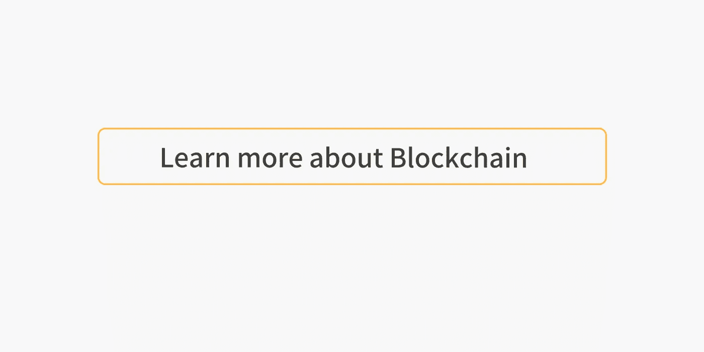

# 区块链标准正在吞噬世界

> 原文：<https://medium.com/coinmonks/blockchain-standards-are-eating-the-world-6bc4b59e297f?source=collection_archive---------7----------------------->


除非你一直住在山洞里，否则你一定听说过这个术语[初始硬币发行](https://www.investopedia.com/terms/i/initial-coin-offering-ico.asp) (ICO)。我不会争论发行大量的加密资产是合法的、道德的还是愚蠢的😲。我想讨论一下是什么促成了 2017 年初开始并持续至今的令牌爆炸。

> 标准

# 沿着 ERC 20 号记忆巷漫步

大部分发生在以太坊区块链，几乎每个推出的代币都是一个 [ERC-20](https://github.com/ethereum/EIPs/blob/master/EIPS/eip-20-token-standard.md) 代币。这代表[以太坊征求意见](https://github.com/ethereum/EIPs/issues)。它来自以太坊区块链的一个松散的标准过程。该过程旨在为常用的智能合约设计和数据结构定义抽象接口。等等……什么？

假设您想在以太坊上创建一个令牌。你希望这种代币具有某些特性:可替代性、可分割性和有限的供应量。标准 ERC-20 令牌接口和数据可以提供其设计中的所有功能。您只需填写您想要的参数并部署您的令牌。下面是接口和一些数据(没有实际代码):

```
// somewhat borrowed from
// [https://github.com/OpenZeppelin/openzeppelin-solidity/tree/master/contracts/token/ERC20](https://github.com/OpenZeppelin/openzeppelin-solidity/tree/master/contracts/token/ERC20)contract ERC20Basic {
  string public name; // ex: "Matt Token"
  string public symbol; // ex "MT"
  uint8 public decimals; // ex 18 (decimal places) // the total supply of this token
  function totalSupply() public view returns (uint256); // find the balance of tokens at a specific address
  function balanceOf(address who) public view returns (uint256); // transfer tokens to another address
  function transfer(
    address to, uint256 value
  ) public returns (bool); // record an event on the blockchain
  event Transfer(
    address indexed from, address indexed to, uint256 value
  );
}
```

“成为”符合 ERC-20 的令牌只需要一些基本的函数和数据属性。重要的是每个人都同意这些条款。

# 标准要求

对于标准，机构群体必须在以下方面达成一致:

1.  变量命名
2.  功能签名
3.  预期行为
4.  有点标准的实现

变量命名不仅仅是惯例。这一点必须严格遵守。例如，一个钱包可以允许社区提交 ERC-20 令牌，但是当有人提交一个具有变量`tokenName`而不是`name`的令牌时会发生什么。钱包软件无法读取令牌的名称属性，我们很可能会以“未定义”的用户身份结束。这是没有办法做用户体验(UX)。

函数签名是一个大问题。想象一下，一个交易所为他们希望添加的每个令牌实现一组不同的功能？一个使用`transfer(address,uint256)`另一个`transferFrom(address,address,unit256)`另一个`safeTransferFrom(address,address,uint256,bytes)`等等……`uint256`只是被转移的值的数量，最后一个例子中的`bytes`将是可选回调行为的一段数据。然而，非标准或令牌不支持的不同接口很容易导致安全问题，减缓新令牌的采用，最糟糕的是为新用户创建了一个可怕的 UX。

预期行为意味着我们期望一个函数做它被设计要做的事情。没有人能阻止你在你的 ERC-20 `transfer(address,uint256)`函数中加入一些古怪的逻辑。然而，在所有这些奇怪的逻辑结束时，您可能应该传递调用该函数并向参数`address to`和`uint256 value`提供参数的用户所指定的令牌数量。如果你没有转移那个值，也许你收取了费用，那么你的协议就不会很好😂。当需要回调函数时，行为变得尤其重要。一个例子是令牌成功传输后调用的函数。如果你期望这一切发生，但它没有。其他开发者、dapps、钱包、交易所将很难与你的令牌互动。

# 区块链标准正在蚕食世界吗？🤔

那又怎样？少数很酷的项目去年推出了代币，其余的都是垃圾。散户投资者或表面加密用户的这种态度没有抓住关键点。有成千上万的 ERC-20 代币，它们都在每个支持 ERC-20 标准的钱包中得到支持。即使在现代软件中，这种水平的互操作性和支持也是前所未有的。想想让两个数据库交换信息，或者学习一个新的应用程序编程接口(API)有多难。

一个有用标准的真正美妙之处在于，它使开发者能够启动他们的智能合约，遵守公共接口，并立即让他们成为整个生态系统的一部分。

> 钱包、交易所和应用

如今，以太坊上推出的任何可替代令牌如果不实现标准的 ERC-20 接口，都是愚蠢的。他们将不得不跑向每一个钱包编码器、交易所和任何他们想要采用的分散应用程序，请求他们在已经是标准的基础上实现一些改变。没有用😣。

# 标准的未来🤗

自从 ERC 20 会议以来，我们已经看到了许多很酷的标准提案。最有趣的是不可替换的令牌标准， [ERC-721](/crypto-currently/the-anatomy-of-erc721-e9db77abfc24) 。你可能已经在 2017 年底推出的 [CryptoKitties](https://www.cryptokitties.co/) 中看到了这一点。不可替代的令牌(NFT)像它们的对等物 FTs 一样，正享受着同样的后标准化爆炸。现在有数百架 [ERC-721](https://github.com/ethereum/EIPs/blob/master/EIPS/eip-721.md) 合同。更有趣的是，因为 NFT 代表不同的资产，所以您可以在其上放置所有其他层。像 [Userfeeds.io](https://userfeeds.io/) 这样的项目正在 CryptoKitties 和其他 NFT 之上构建社交网络层。如果没有适用于所有 NFT 的标准接口，Userfeeds 的优秀开发人员将会把大部分时间花在编写抽象层和数据整理代码上，而不是扩展他们正在创建的工具、API 和 universe。

我看到以太坊标准的光明前景。我已经提出了我自己的一个，我觉得它将成为钱包、交易所和应用程序的可替代和不可替代生态系统的重要组成部分。 [ERC-998 可组合不可替换令牌](https://github.com/ethereum/EIPs/issues/998) (CNFT)标准是 NFT 标准 ERC-721 的扩展，它将允许一个 [CNFT 拥有另一个 CNFT、NFT 或 FT。](/coinmonks/crypto-composables-erc-998-update-1cc437c13664)等等……什么？

想象一个你拥有的角色👸(真正拥有，密码)从一个区块链的游戏。你找到一把剑🗡️和盾牌🛡️，装备在你的角色身上，玩几天然后升级。可替换令牌呢？你的玩家可能有现金💵，马纳🥃，资源🌲等等…现在是时候尝试不同的游戏了。角色和所有物品通过一个简单的函数调用就可以无缝地转移到新游戏中。现在你很无聊，想在像 rarebits.io 这样的分散式交易平台上出售你的角色，rarebits 可以枚举你的 CNFT 的所有财产，并向其他用户显示，你的角色装备了什么物品，如果他们购买，他们会收到什么。

一个真实世界的例子怎么样？你喜欢没用的代币，对吗？如果您可以将所有无用的代币放入一个 CNFT 中，然后一次性转移到您的 Trezor 或分类帐中，会怎么样？如果您可以进入 CNFT 并转出特定数量的特定 ERC-20 代币，情况会怎样…🤯。有人会说“指数基金”吗？

# 包扎

区块链标准不仅在吞噬世界，还在吞噬生态系统中的其他协议和早期项目。不是因为项目不好，而是因为它们没有创建一个可防御的智能合同生态系统。标准是对数字稀缺的基本用例的抽象。在这里，我介绍了为什么标准对于采用可替换、不可替换和可组合的令牌很重要。使用这些构件和一些额外的功能，我们可以创建大量复杂的资产。

**个人笔记**

标准对我很重要，因为我不想再生活在一个封闭的世界里。我希望拥有我的数据、资产和记录，并且希望能够将它们从一个系统传送到另一个系统。没有标准，我们看不到钱包、交易所和应用程序的采用。这意味着我们看不到用户的采纳。如果创建、使用和交换真正去中心化的加密资产变得过于复杂或令人困惑，我们就会面临去中心化社区成为利基运动的风险。我们的努力不能是徒劳的。我们必须共同努力，使加密资产的基本构件标准化，并专注于在有价值的地方增加价值。解决现实世界的问题和设计一流的用户体验。

【medium.com/@mattdlockyer
T5[twitter.com/mattdlockyer](/@mattdlockyer)
linkedin.com/in/mattlockyer

[](https://medium.com/coinmonks/blockchain/home)

**Click here to read more stories on blockchain**