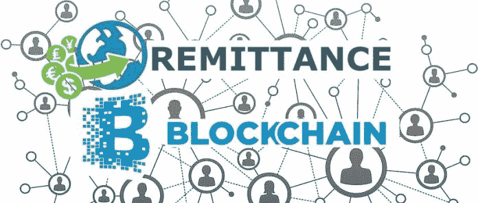
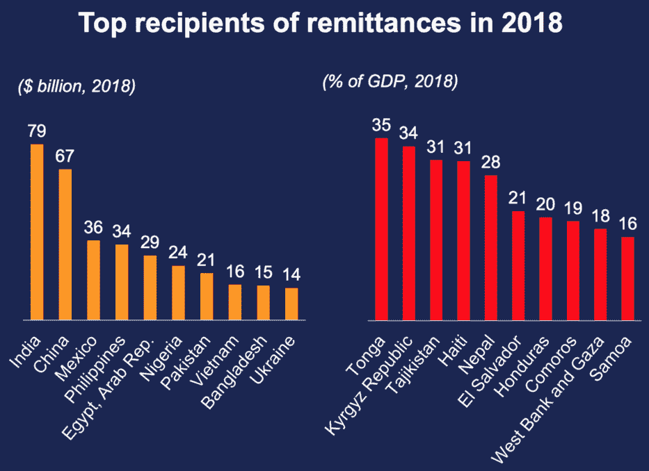
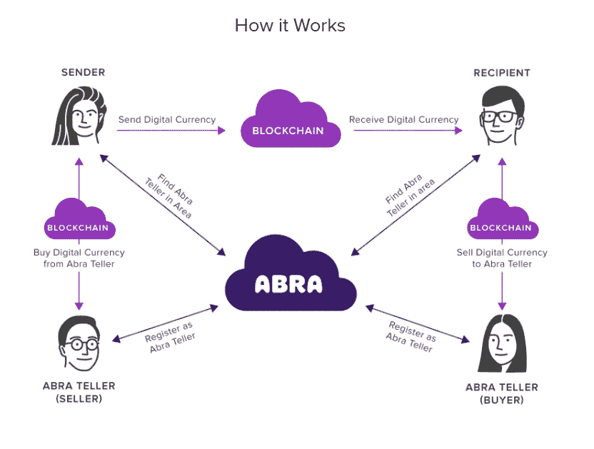
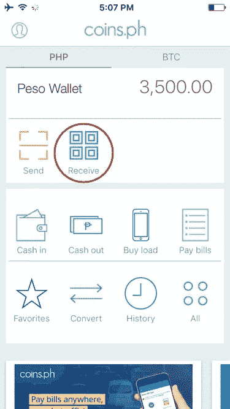
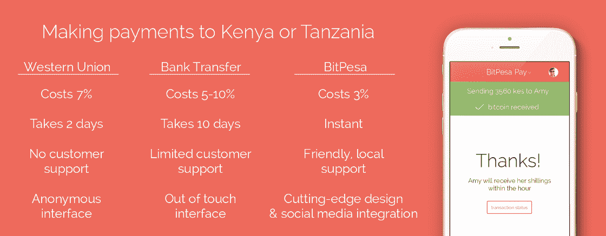
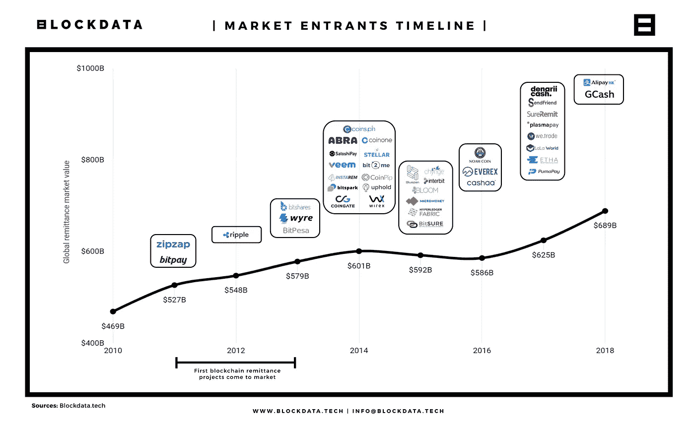

# 区块链技术和 7000 亿美元汇款行业的颠覆

> 原文：<https://medium.com/coinmonks/blockchain-tech-and-the-remittance-market-overhaul-a7fbb5121cd3?source=collection_archive---------1----------------------->

# **本期**

今天流入发展中世界的最大资金不是外国援助或外国直接投资；相反，它是生活在国外的家庭成员汇回贫穷国家的汇款。汇款是两个不同国家的个人之间的资金流动，通常是由外国工人向其本国的个人汇款。

在一些国家，汇款是经济的重要组成部分。例如，在海地，汇款占国内生产总值的 29%。[1]菲律宾每年收到 330 亿美元的汇款，超过其国内生产总值的 10%。流向发展中国家的汇款估计是外国援助的三至四倍。

目前全球汇款 200 美元的平均比例约为 7%。根据世界银行的数据，整个市场的总流量为 6890 亿美元。[2]这意味着**大约有 480 亿美元通过手续费、中间人和金融机构从汇款转账中直接取出(每年 480 亿美元)。**此外，汇款市场总流量的 80%来自新兴经济体。

不仅用户的成本高，还需要银行账户，还需要中间人(每笔汇款交易至少涉及三个第三方)，而且交易时间也高得离谱。

> **这篇文章介绍并探讨了试图颠覆当前汇款市场格局的区块链公司。**

# **试图改变汇款格局的区块链公司**

区块链汇款公司正在通过促进发送方和接收方的无摩擦体验，将行业带入下一个阶段。传统上，国际汇款可能需要几天才能完成，因为一笔典型的交易需要多达七八个中间人。区块链汇款公司能够提供即时汇款服务。

## **凯西**

凯西正在比特币区块链上建立一个全球数字资产管理系统。他们的任务是将每一部智能手机都变成一台提款机，可以向网络中的任何其他成员分发实物现金。该平台允许用户通过智能手机在全球范围内免费转账。这种直接的点对点资金转移技术不需要使用任何银行；重要的一点是，发展中国家往往缺乏实施建立这些组织所需的基础设施的手段。[3]

凯西交易需要三个中介:两家同行和凯西平台。凯西不仅仅是一个汇款应用，而是一个新的全球平台。通过向用户提供以传统货币存储价值、通过网络传输价值以及在不断增长的商户网络支付的能力，凯西不仅在与西联汇款竞争，还在与 Visa 等信用卡网络竞争。

## **硬币。PH 值**

硬币。Ph 是一个支持区块链平台的移动应用程序。该平台位于菲律宾和泰国。Coin's 为客户提供移动钱包和服务，如汇款、账单支付、促进游戏购买、手机信用充值、使用其他商业服务的能力、提出支付请求、买卖比特币和其他加密货币，以及从 ATM 机提取现金，所有这些都只需一部智能手机即可完成。

Coins 的使命是增加东南部地区 3 亿多人口的金融包容性，这些人目前无法获得传统银行服务。他们与连锁便利店 7-Eleven 合作，7-Eleven 是一家由多家银行和特许本地支付商店组成的连锁商店，用户可以访问最近的分行或网点进行支付、转账或从账户中提取资金。[4]总的来说这个项目只是更广泛的比特币意识形态的延伸；这种意识形态认为，任何人无论身在何处，在何种情况下，都应该有能力与他人进行交易，而不需要中央银行或监管机构来监管这一切。[5]

## **比特佩萨**

向非洲、从非洲和在非洲内部的支付极其困难和昂贵。大多数非洲国家的支付基础设施(银行和支付轨道)有限，高度依赖美元作为中间货币，外汇流动性有限。BitPesa 利用区块链结算来显著提高效率，提高速度，并降低非洲中小企业(SMEs)、国际汇款公司和跨国公司的批发外汇和支付成本[6](货币转账服务建立在比特币网络上)。

BitPesa 还允许在亚洲的小型地区银行存款的人将钱汇给肯尼亚的当地银行，而不必通过代理银行，代理银行可以收取一定的费用和/或在款项到达肯尼亚之前将款项从亚洲汇至北美。BitPesa 旨在弥合非洲和全球企业之间的差距。[7]

## **BIT2ME**

Bit2Me 是一家总部位于西班牙的公司，为寻求买卖比特币的消费者提供渠道。Bit2Me 支持多种支付方式，可以在他们的网站上进行交易，通过他们易于使用的移动应用程序或通过外部支付方式，如 ATM。此外，用户不需要成为任何受支持银行的客户就能以无摩擦的方式接收现金。

## **其他类似公司**

其他试图改变汇款市场格局的公司包括 Align Commerce、Bitspark、Coinpip、Hellobit、MoneyFi、Rebit.ph、Revolut、Transferwise 和其他一系列倡议。旨在“为无银行账户者提供银行服务”的区块链项目列表可以在[这里](/hackernoon/crypto-banking-an-intro-to-blockchain-projects-aiming-to-bank-the-unbanked-e9a20a83c465)找到。

## **可能的障碍**

为全球贫困人口创建一个总部位于区块链的支付网络存在一些障碍。首先，许多汇款人获得现金支付，而收款人生活在一个以现金为基础的经济中。其次，发达国家和发展中国家的大多数人都不具备有效利用区块链的知识和工具。

**移动渗透**是另一个壁垒。*移动渗透对在线汇款至关重要。*目前，预计 2019 年全球手机互联网普及率将增长至 60%以上。很快整个世界都可以联网，给家人寄钱就像打电话一样简单。[8]技术的进步为我们提供了比目前的汇款系统更好的选择。

# **为什么汇款市场增长如此之快**

根据世界银行汇款报告，未来十年，汇款市场只会继续增长。 ***这一预期增长的一些原因包括:寻找工作的移民率增加，发展中国家向发达国家提供教育机会，移动银行应用显著增加，移动设备渗透率和互联网使用率越来越高。***【9】

## **更多相关数字**

*   根据《2018 年世界移民报告》，目前估计有 2.44 亿国际移民生活在其他国家。
*   由于全球化，汇款在全球范围内急剧增加，从 2000 年到 2018 年增加了 5 倍。全球汇款行业正在不断增长，预计该行业在 2019 年将增长 3%以上，并在未来 5-6 年内增长约 23%。[10]
*   在许多发展中国家，不到 20-30%的公民拥有银行账户；70%被认为是“没有银行账户”
*   80%的汇款支付仍然通过实物现金处理，这可能会导致一系列问题。
*   区块链的汇款结算时间比传统渠道快 388 倍。(根据[块数据](https://medium.com/u/279c07ad0b4d?source=post_page-----a7fbb5121cd3--------------------------------)
*   [Chris McCann](https://medium.com/u/29c0a008692a?source=post_page-----a7fbb5121cd3--------------------------------) 写了一篇很棒的文章，概述了汇款市场的基础知识和现状，可以在[这里](/proofofcapital/remittance-market-primer-and-landscape-3213c2c81771)找到。

# **临别赠言**

汇款市场正处于彻底转型的中游。它还将成为区块链技术和加密货币最可靠的用例场景之一。用不了多久，农民工就会转移到优势如此明显的区块链体系。

[1][http://documents . world bank . org/curated/en/805161524552566695/pdf/125632-WP-PUBLIC-migrationanddevelopment brief . pdf](http://documents.worldbank.org/curated/en/805161524552566695/pdf/125632-WP-PUBLIC-MigrationandDevelopmentBrief.pdf)

[2][https://www . world bank . org/en/news/press-release/2019/04/08/record-high-transferences-sent-globally-in-2018](https://www.worldbank.org/en/news/press-release/2019/04/08/record-high-remittances-sent-globally-in-2018)

[https://coincentral.com/blockchain-remittance/](https://coincentral.com/blockchain-remittance/)

[4][https://Asia . Nikkei . com/Business/Banking-Finance/No-banks-No-problem](https://asia.nikkei.com/Business/Banking-Finance/No-banks-No-problem)

[5][https://qoinbook . com/blogs/coins-ph-review-is-it-really-everything-its-cracked-up-to-be/](https://qoinbook.com/blogs/coins-ph-review-is-it-really-everything-its-cracked-up-to-be/)

[6][https://medium . com/the-future-collective/women-in charlene-Chen-bit pesa-f 8 c 75 da E4 a 27](/the-future-collective/women-in-blockchain-charlene-chen-bitpesa-f8c75dae4a27)

[7][https://medium . com/wolverine block chain/a-look-at-bitpesa-powering-Africa-business-with-bit coin-8b84f 2140106](/wolverineblockchain/a-look-at-bitpesa-powering-african-business-with-bitcoin-8b84f2140106)

[8][https://hacker noon . com/汇款-区块链-天作之合-5f5ad8500a2](https://hackernoon.com/remittance-blockchain-match-made-in-heaven-5f5ad8500a2)

[9][https://hedge trade . com/汇款-市场-被区块链颠覆/# Problems _ in _ 汇款 _ 市场 _ 比特币 _ 答案](https://hedgetrade.com/remittance-market-upended-by-blockchain/#Problems_in_the_remittance_market_and_bitcoins_answers)

[10][https://www . globe news wire . com/news-release/2019/04/15/1803733/0/en/Global-Digital-mission-Market-Expected-To-Reach-USD-8610 亿-By-2025-Zion-Market-research . html](https://www.globenewswire.com/news-release/2019/04/15/1803733/0/en/Global-Digital-Remittance-Market-Expected-To-Reach-USD-8-61-Billion-By-2025-Zion-Market-Research.html)

> [在您的收件箱中直接获得最佳软件交易](https://coincodecap.com/?utm_source=coinmonks)

