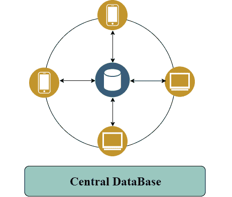
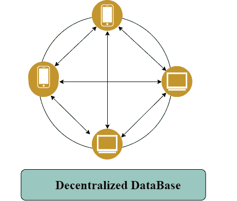
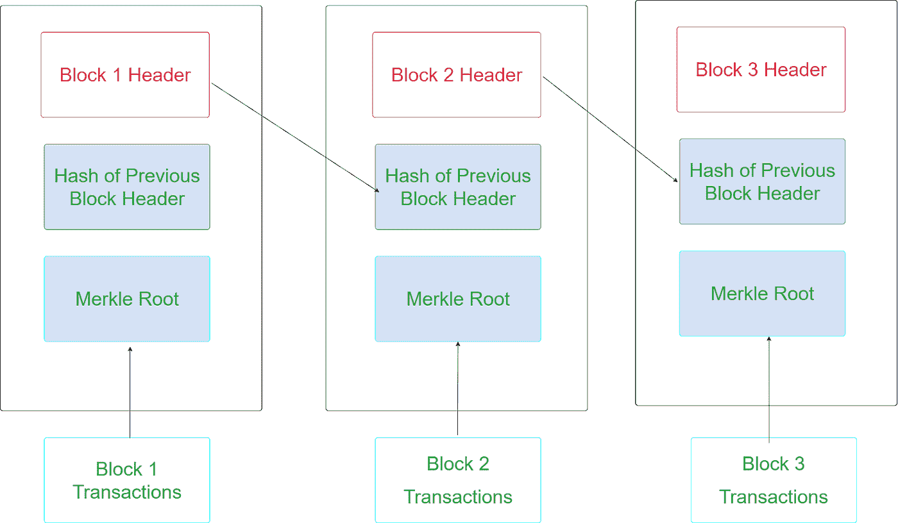
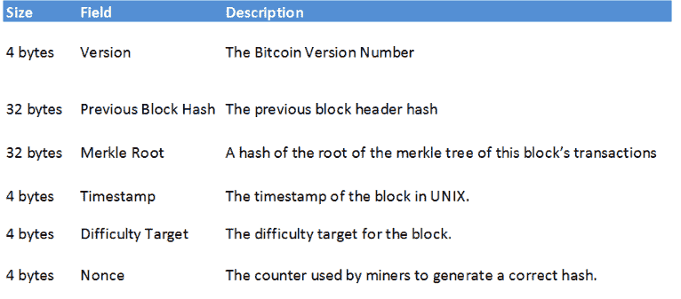
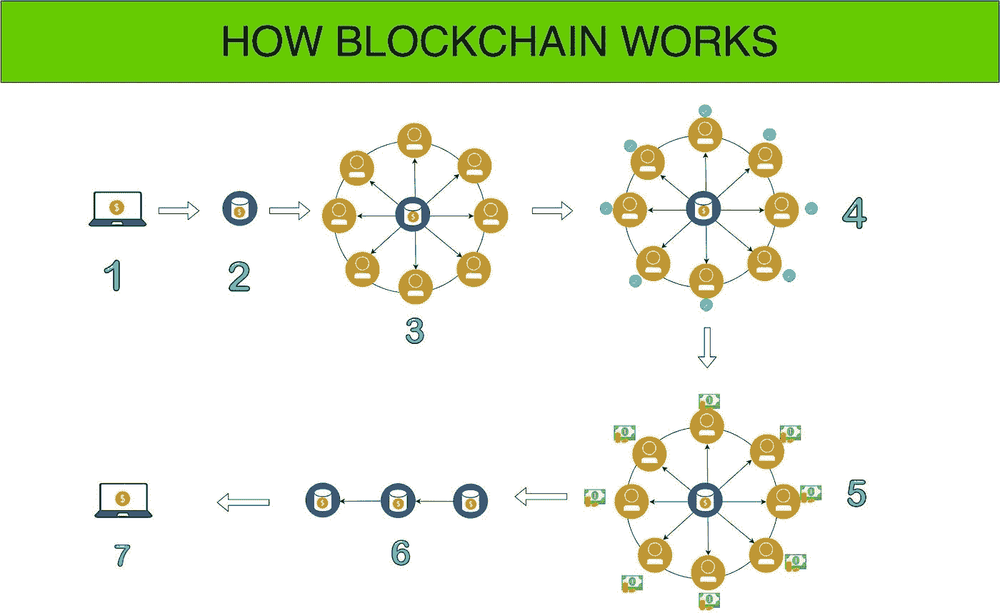
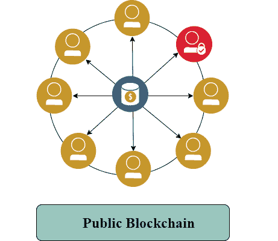
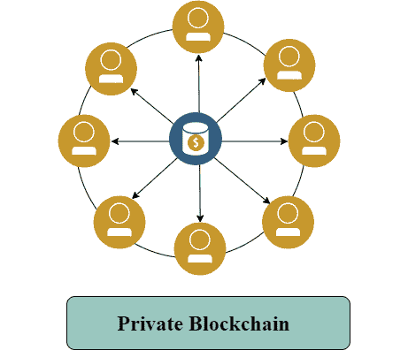
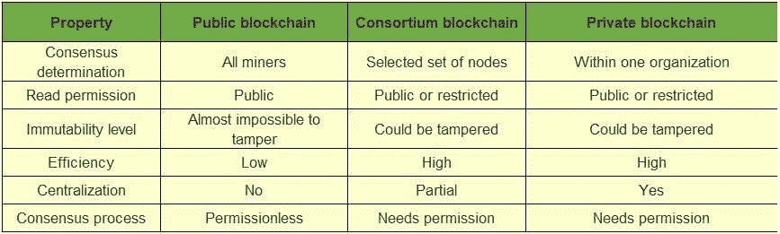

# 区块链技术的架构

> 原文：<https://medium.com/coinmonks/blockchain-technology-how-architecture-of-blockchain-technology-makes-it-robust-e0b9ed6e6c0?source=collection_archive---------0----------------------->

大多数人都知道区块链技术是一种不可变的、安全的、不可攻击的去中心化网络。但这项技术为何如此强大，并能从所有现有技术中脱颖而出。在本文中，我将向您清晰地展示区块链架构，这使得区块链技术从其他技术中脱颖而出。

在本文中，我们将看到

*   集中式数据库 v/s 分散式数据库
*   什么是区块链架构？
*   它是如何工作的？
*   什么是共识机制？
*   不同类型的区块链架构？

> [***也读:什么是区块链？假人简易指南***](https://blog.coincodecap.com/what-is-blockchain-a-simple-guide-for-dummies/)

# 集中式数据库 v/s 分散式数据库

存储在单一位置的数据称为集中式数据库。分散式数据库与集中式数据库完全不同。系统中的每个节点或用户拥有系统中存在的全部数据。

*   如果中央系统出现故障，那么整个系统就会停止运行。但是，在分散的数据库中，不会有任何问题，因为系统中的每个节点都保存着数据。
*   分散式数据库比集中式数据库更可靠，反应更快。
*   分散式数据库比集中式数据库更复杂。

为了更好的理解，我创建了这个过程的可视化。

# 什么是区块链架构？

我们知道区块链技术是一个去中心化的分布式账本，有一个区块链。

我们将看到这些块到底包含什么，以及这些块如何帮助我们使数据不可变和安全。

每个块由块头、前一个块头的散列、事务的 Merkle 根组成。所有这些块都在指针的帮助下连接到下一个块(像一个 LinkedList)。

为了更好的理解，我创建了这个过程的可视化。

# 块标题

块头是块的核心部分，是区块链中识别块的主要方式。让我们看看块头在块中包含什么数据。

块标题数据如下表所示

**前一个块散列**:这个块构建于其上的块的块散列。这就是“链”在一起的块。

**时间戳:**当挖掘器挖掘该块时，块头被散列的 Unix 时间戳被记录在块头本身中。

**Merkle Tree:** 这个块中的所有事务，散列在一起。基本上提供了该块中所有事务的单行摘要。

**难度目标:**该区块的难度目标。

**Nonce:** 矿工为了尝试获得块头的[目标](https://en.bitcoin.it/wiki/Target)散列(一个块散列)而改变的字段。

# 它是如何工作的？

这些是区块链体系结构的核心组件:

**节点** —任何计算机或机器，其保存区块链总账的完整副本。

**事务** —我们存储在块变更中的每一个数据或信息都是以事务的形式存在的。

**块** —块由块头、前一块头的散列、事务的 Merkle 根组成。

**链** —以特定顺序排列的块序列。

**挖掘者** —在向区块链结构添加任何东西之前产生块并执行块验证过程的节点。矿工们会互相比赛解决谜题以获得奖励。

**共识(共识协议)** —共识是一种在群体中达成一致的方式。那里有一套执行区块链行动的规则和安排。区块链内部的任何交易都应遵循协商一致的规则和安排。

我已经创建了一个区块链架构图的可视化，显示了这实际上是如何工作的

1.  **交易发起。**
2.  **交易被放置在块中。**
3.  事务块被发送到网络中的每个节点。
4.  **矿工使用共识机制工作证明验证交易**
5.  成功破解“工作证明”中谜题的矿工将获得奖励。
6.  **区块现已成功放置在现有区块链上。**
7.  **交易成功完成。**

# 什么是共识？

简单地说，共识是一种在群体中达成一致的方式。而投票只是满足于多数规则。另一方面，一致意见确保达成一项对整个群体都有利的协议。

从更理想主义的角度来看，分散在世界各地的一群人可以利用共识来创建一个更加平等和公平的社会

达成共识决策的一种方法称为“共识机制”。

了解更多关于 [**共识机制的信息。**](https://www.linkedin.com/pulse/consensus-mechanism-blockchain-shiva-sai-kumar-burugula/)

# 不同类型的区块链架构？

1.  公共区块链/无许可区块链
2.  私有区块链/许可区块链
3.  财团区块链/许可区块链

## 公共区块链

公共区块链意味着任何人都可以不经任何人允许进入区块链。这就是为什么这些区块链也被称为无许可区块链。以太坊和比特币就是公共区块链的例子。

## 私有区块链架构

私人区块链与公共区块链相对。它由一个组织或实体控制。因此，处于控制中的实体决定了网络的参与者。这就是为什么二等兵区块链也称被许可的区块链。

> [***也读作:无权限区块链 vs 有权限区块链***](https://blog.coincodecap.com/permissionless-and-permissioned-blockchain/)

## 财团区块链架构

由多个组/实体组成，并由专门指定的节点控制。我们已经创建了一个可视化的公共区块链和私人区块链。

## 公有 v/s 财团 v/s 私有区块链对比

# 结论

我们现在知道了为什么区块链技术被称为稳健技术，以及它是如何从其他技术中脱颖而出的。区块链技术有许多使用案例，企业家们正在利用这项技术建设一个更加透明的新未来。

> [直接在您的收件箱中获得最佳软件交易](https://coincodecap.com/?utm_source=coinmonks)

