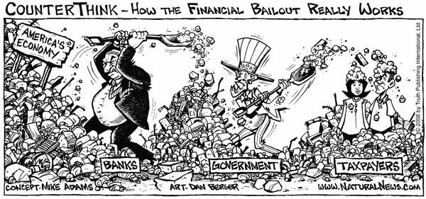
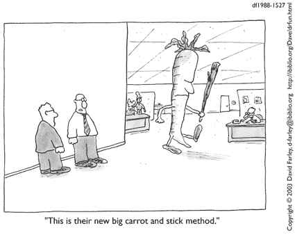

# 区块链:房地产需要的反派

> 原文：<https://medium.com/coinmonks/blockchain-the-anti-villain-that-real-estate-needs-82fc2dd27849?source=collection_archive---------4----------------------->

[An unstoppable force](https://cointelegraph.com/news/chamber-of-digital-commerce-report-reviewed)

反派，一个具有英雄特质的恶棍，他的邪恶手段永远无法证明他们令人钦佩的目的是正当的。从许多传统行业的角度来看，这将是对区块链科技的恰当描述:一个进来破坏现状并将战利品重新分配给社会其他人的恶棍，如果你愿意，可以说是一个罗宾汉。然而，不同于民间传说中孤军奋战的恶棍，这种变化更多的是由被剥夺公民权的人推动的权力重组，想想法国大革命或 V 代表仇杀，如果你想延伸它的话。当然，这样一场革命会带来所有的复杂性，但就像所有善良的坏人一样，它迫使系统面对令人不安的事实。

房地产(再)行业，尤其是商业房地产，令人不安的事实是，由于整个行业的效率低下，行业变得过于自满。这有助于并同时受益于一个共同的信念，即房地产作为一种投资类别的负面影响最小。因此，这种自我延续的循环使 RE 行业能够证明由孤立和不透明的数据库导致的大量工作流冗余是合理的。区块链，仅仅是一个花哨的分布式数据库，将成为迫使行业发展的陪衬，因为它重新平衡了传统业务固有的权力动态。

**利润私有化，成本社会化**

[Late stage capitalism](https://www.naturalnews.com/024432_fractional-reserve_banking_financial_bailout.html)

分布式账本技术(DLT)最重要的变化也是它最无聊的方面:共享账本上 RE 记录的数字化。尽管从革命性的区块链解决方案来看，这似乎很平常，但必须指出的是，在大多数情况下，公开的财产数字身份仅限于国家机构的数据库。这还没有考虑到私有财产数据的数量，而许多该行业的现任者正是在这些数据的基础上建立了他们的竞争优势。

虽然数据发现是通过这种模型来激励的，但是这种模型的长期含义是，没有一个单独的数据库携带关于特定建筑物的完整信息。此外，由于每个数据库都有自己的遗产数字身份版本，这就产生了大量的数据冗余。最糟糕的是，这种冗余会像任何涉及该资产的事务(租赁、服务合同等)一样沿着链条向下级联。)本质上进一步拉开了数字身份与共享身份的距离(可以把它想象成一个分支互不影响的树形图)。

[The joys of business processes](https://beyondlean.files.wordpress.com/2011/05/dilbert_redundancies.gif)

所有这一切的结果是，RE 循环中的所有参与者实际上都是在不完全信息的情况下工作的。寻找一个地方的租户将不得不通过联系多个代理来进行他们自己的尽职调查。代理必须检查其组织内的多个数据库，并与公开可用的数据进行交叉检查。银行将不得不为尽职调查重复这一过程。由于只有基本的物业数据可用，投标接管物业管理的供应商将无法对其服务进行基准评估，也无法对风险进行定价。因此，该行业依靠不必要的摩擦成本蓬勃发展，以覆盖:

*   一致的手动更新，跨数据库重新调整属性信息
*   由于零散的列表和过时的数据，市场匹配效率低下
*   纸面文档驱动的手动和离线记录保存和计费流程
*   复杂的财务、法律和产权许可流程
*   对容易发生数据丢失和错误的管理任务进行尽职调查

与大多数行业一样，利润私有化，而成本社会化。在这种情况下，租户最终要通过代理、尽职调查和法律费用来买单。由于需要计入风险、保险和融资费用，这些成本也有所增加。这还不包括间接资助公共建筑储存库维护的印花税。应该注意的是，这些成本并不完全由可再生能源公司承担，而是由该行业的工人承担，由于需要大量不必要的体力劳动，他们有着舒适的利润。

在 DLT 之前，没有变革的动力，因为第一个采取行动的人会因为暴露自己的实力而失去竞争优势。对于再保险的许多销售职能来说，经纪人的工作通过每笔交易的报酬来获得回报。在物业和设施管理方面，供应商将与各种服务提供商签订特殊服务协议。这两者的结果是定价相对不透明，因为信息控制是管理关系网络的关键。

DLT:一根大胡萝卜，一根更大的棍子

[Source](https://classroomchoreography.files.wordpress.com/2011/01/carrotstick.gif)

DLT 打破了这一现状，不是因为要实现显著的成本节约，而是因为不适应新标准的公司将被甩在后面。一旦 DLT 的采用达到临界质量，房东将不再需要 re 公司提供的大多数做市服务，因为将有一个标准化的公共搜索共享分类账。从本质上讲，数据收集不再局限于代理商的网络，而是类似于 airbnb 的可搜索数据库。

这一过程的第一步也是最困难的一步是区块链财产数字化协议的标准化。在区块链上记录属性时，这不仅仅是确保数据结构的一致性和真实性。至关重要的是，交易中最重要的两方，房东和买家/租户，必须被激励选择这种解决方案而不是当前的流程。不管行业中的其他利益相关者如何试图维持现状，市场将自然地转向提供最佳成本便利比的解决方案，这是 RE 历来不擅长的两个方面。

在这种情况下，买家/租户的好处更加明显，因为他们将有一个单一的来源，可以搜索到最新和最公正的房地产信息。对于房东来说，这样一个平台将极大地扩大潜在租户群，但有被搜索算法掩盖的风险。在这两种情况下，除了拥有易于比较的数据带来的巨大效率之外，市场匹配不再依赖于孤立的经纪人网络。此外，通过强大的搜索算法和过滤选项，经纪人的意见只限于那些真正需要的人。

一旦建立了数字身份，其他记录(如所有权和合同)就可以引用该财产数据。这不仅将建立一个属性的历史，而且还开辟了数字发票和记录保存的可能性，直接链接到一个属性，而不是一个再保险公司的数据库。这是一个微妙但重要的变化，因为数据由使用该链的社区所有，这通过消除对数据的资本控制显著提高了效率。随着透明度的提高，投入数据发现的资源将会减少，从而使行业能够专注于创造实际价值。尽管这些数据可能被散列以隐藏信息、金额或合同中的参与者，但社区很可能会选择更透明的 fork。

这样做的另一个后果是，连锁酒店最终还会记录与酒店有过接触的参与者网络，从而增加责任感。因此，任何公共区块链解决方案都可能涉及某种形式的声誉管理。这不仅有助于提高性能透明度，还能通过用户监管减少网络上的垃圾邮件和欺诈。虽然这将有利于整个行业，但必须注意的是，RE 行业运作的时间表(租赁的 2-3 年周转，所有权的更多)可能会极大地限制任何评级系统的有效性。然而，这样一个系统可能会带来好处，因为它大大降低了较小的参与者在买卖双方的进入壁垒。

无论是哪种情况，最有可能推动 DLT 采用的优势将是通过智能合同功能节省成本，特别是为房东、租户和买家节省更多成本。在这种情况下，可再生能源的颠覆时机已经成熟，因为大多数可再生能源功能都要求分类账中的合同具有相对简单的条件条款。此外，随着物联网在可再生能源领域的发展，智能合同的潜在用途将呈指数级增长。这也将是消除对 P2P 市场形成障碍的行政负担的关键。这种情况的前兆是必须首先实现上面讨论的健壮的数据结构。

必须指出的是，可再生能源公司实际上可以通过智能合同优化成本，而不需要公共区块链，但这需要合同双方具有类似的技术标准，这严重限制了其适用性。因此，对于可再生能源公司来说，组建一个包括监管委员会在内的财团，以提出行业标准，允许所有参与者将智能合同提交给公共链，可能更有财务意义。成本敏感性将确保交易记录、沟通和执行效率最终通过智能合同得到最大化。因此，DLT 通过减少对数据的资本控制来推动行业更具竞争力。这实质上降低了稀土行业收取的经济租金，并通过降低市场参与者的自付费用来转移这一价值。

**一个非常需要的选项**

DLT 将通过改变行业的权力动态来颠覆可再生能源。它在一个已经变得陈旧的行业引入了一种替代模式。话虽如此，DLT 并不是一个全有或全无的命题，也不是说没有适当的治理和链外执行就一定会被采纳。

考虑到可再生能源的异质性，将会有财产的物理方面永远无法记录在数据库中。这一点由于周转时间限制了评级系统的有效性而更加突出。可再生能源市场也不是一个纯粹的价格市场，参与者通常寻求最高回报或最低成本的稳定性。随着这里讨论的引入令牌化，这种情况可能会改变，但整个行业可能会保持其作为稳定资产的地位，并自我实现其负面影响最小的信念。

所有这一切意味着，在再保险领域，中间商永远有市场，但 DLT 确保此类服务是可有可无的，而且有实际的附加值。此外，尽管将围绕利基需求形成次级市场，但透明度的提高将极大地有助于这个众所周知的洗钱渠道行业。数据和网络分辨率的提高所带来的新价值流将通过消除租金榨取的机会来确保可再生能源行业保持竞争力。区块链可能只是一个花哨的数据库，但它使数据民主化，正如老生常谈的那样，知识就是力量。

*谢谢你坚持到最后。希望听到你的想法/评论，所以请留言。我在 twitter 上很活跃*[*@*AwKaiShin](https://twitter.com/awkaishin)*如果你想收到更多易消化的密码相关信息，或者访问我的* [*个人网站*](https://www.awkaishin.com/) *如果你想要我的服务:*

*对于有兴趣深入探究的人，我推荐看一下*[*rent berry*](https://rentberry.com/)*(P2P 租房)*[*Atlant*](https://atlant.io/)*(令牌化)，以及*[*im brex*](https://imbrex.io/)*(共享账本)作为切入点。这些链服务于特定的目的，并提供了行业走向的指示。*